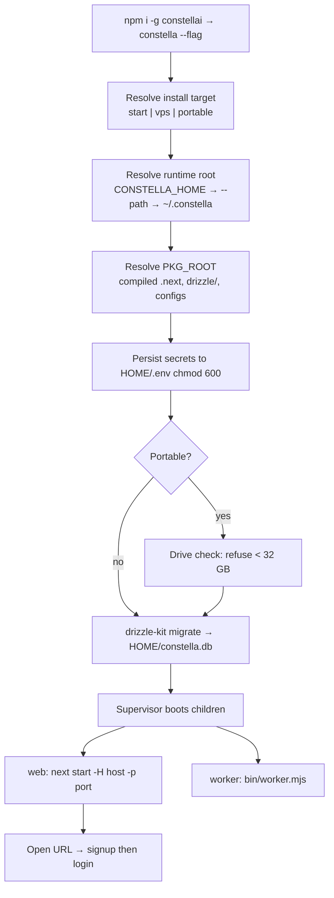

[← Índice](./README.md) · [🇬🇧 English](../en/INSTALLATION.md) · [✦ Constella](../../README.pt-BR.md)

# 🚀 Instalação — embarcando na nave central


A Constella é um plano de controle local-first que executa empresas-de-agentes de IA autônomas. Instalá-la significa acender a nave central: o launcher `constella` instala o runtime compilado, aplica o schema do banco de dados e inicializa um servidor web supervisionado mais um worker 24/7 — tudo sob uma única raiz de runtime no seu diretório home. ✦

Esta página é o **guia de instalação completo, sistema operacional por sistema operacional** — do primeiro comando até um sistema em execução: pré-requisitos, instalação em todos os principais SOs, configuração de cada destino de instalação, Tailscale, rede, permissões, segurança, validação e solução de problemas.

> **TL;DR** — `npm install -g constellai`, depois `constella --start`. Os dados ficam em `~/.constella`. Node ≥ 20 obrigatório. Uma flag de execução é obrigatória (um `constella` sem flag imprime o uso). A autenticação (e-mail + senha) está sempre ativa. Nada é fake.

---

## Início rápido (qualquer SO)

```bash
npm install -g constellai          # 1. install the CLI globally
constella --start                 # 2. pick an install target (--start | --vps | --portable)
# 3. open the printed URL (default http://127.0.0.1:3000) → first run: sign up, then log in
```

Esse é todo o ciclo: **instale uma vez com npm, passe uma flag de execução.** A flag é um *destino de instalação* — a instalação é a mesma para todos, e a **autenticação (e-mail + senha) é idêntica em cada um**. Uma flag de execução é obrigatória: um `constella` sem flag imprime o uso. Prefere não instalar globalmente? `npx constellai --start` roda exatamente a mesma coisa uma vez, de forma efêmera.

---

## Onde instalar/executar?

A flag de execução escolhe **onde** o plano de controle vive e em qual interface ele escuta — nunca como você faz login. A autenticação é sempre e-mail + senha.

| Seu ambiente | Destino de instalação | Por quê |
| --- | --- | --- |
| Seu próprio laptop/desktop | **`--start`** | A instalação local padrão; faz bind em `127.0.0.1`, autonomia total dos agentes. |
| Um servidor remoto, sempre ligado, acessado de forma privada | **`--vps`** | npm nativo + Tailscale + systemd; faz bind em `0.0.0.0`, acessível somente na sua tailnet. |
| Levar tudo num pen drive USB | **`--portable`** | Roda a partir do drive; faz bind em `0.0.0.0`; precisa de ≥ 32 GB livres. |

Aprofundamentos: [START_MODE](./START_MODE.md) · [VPS_MODE](./VPS_MODE.md) · [PORTABLE_MODE](./PORTABLE_MODE.md). Assistente de primeira execução: [ONBOARDING](./ONBOARDING.md).

---

## Pré-requisitos 🛰️

| Requisito | Detalhe | Notas |
| --- | --- | --- |
| **Node.js ≥ 20** | O `package.json` declara `"engines": { "node": ">=20" }`. | Passos de instalação por SO abaixo. Verifique com `node -v`. |
| **Uma toolchain de build nativa** | `better-sqlite3` e `sharp` instalam binários pré-compilados nas plataformas comuns; numa arch/versão incomum o npm os compila, o que exige Python 3 + um compilador C/C++. | Linux: `build-essential` + `python3`. macOS: Xcode CLT. Windows: normalmente pré-compilado — sem toolchain necessária. |
| **`git`** | Necessário para agentes que mexem com git, e para o clone do VPS. | Pré-instalado no macOS/maioria do Linux; `winget install Git.Git` no Windows. |
| **CLI `claude` e/ou `codex`** *(ou um provedor de nuvem)* | Os agentes são iniciados como processos de CLI **reais**. Sem pelo menos um instalado + autenticado — **ou** um provedor de API de nuvem configurado no módulo [Models](./MODELS.md) — os agentes conseguem planejar, mas não executar. | Não vem incluso. A Constella chama o que estiver no seu `PATH` e herda o `~/.claude`. |
| **Espaço em disco** | Guarda o BD, os workspaces, o índice RAG, caches e (opcionalmente) os pesos de modelos locais. O portátil **recusa < 32 GB livres**. | Uma instalação simples é pequena; são os modelos locais que a fazem crescer. |

> A Constella **não** inclui as CLIs dos agentes. Veja [AGENTS](./AGENTS.md) e [MODELS](./MODELS.md).

---

## Instalação por sistema operacional

Todo caminho são os mesmos dois passos — **obtenha Node ≥ 20, depois `npm install -g constellai`** — só a instalação do Node difere. Após instalar, pule para [Escolher e configurar um destino de instalação](#choose--configure-an-install-target).

### 🐧 Ubuntu Server (headless — o VPS de praxe)

```bash
# Node 20 LTS from NodeSource + the build toolchain for native modules
sudo apt-get update
sudo apt-get install -y curl ca-certificates git build-essential python3
curl -fsSL https://deb.nodesource.com/setup_22.x | sudo -E bash -
sudo apt-get install -y nodejs
node -v                               # expect v20+ (v22 here)

sudo npm install -g constellai
```

Um servidor headless quase sempre roda a **instalação VPS** (npm nativo + Tailscale + systemd) — continue em [Tailscale](#tailscale-) e depois [VPS_MODE](./VPS_MODE.md). Para rodar diretamente no host, veja `--start` abaixo (atenção ao firewall — `--vps`/`--portable` fazem bind em `0.0.0.0`).

### 🖥️ Ubuntu / Debian Desktop

Igual ao Ubuntu Server. Após `constella --start`, abra `http://127.0.0.1:3000` no navegador da máquina. O `sudo` só é necessário para a instalação **global** do npm; rodar `constella` não precisa de root.

### 🐧 Outras distribuições Linux

Instale Node ≥ 20 com seu gerenciador de pacotes (ou [nvm](https://github.com/nvm-sh/nvm)), depois `npm install -g constellai`:

| Distro | Node + toolchain |
| --- | --- |
| **Debian/Ubuntu** | `curl -fsSL https://deb.nodesource.com/setup_22.x \| sudo -E bash - && sudo apt-get install -y nodejs build-essential python3` |
| **Fedora/RHEL** | `sudo dnf install -y nodejs npm gcc-c++ make python3` (Node 20+; ou NodeSource) |
| **Arch/Manjaro** | `sudo pacman -S --needed nodejs npm base-devel python` |
| **Qualquer distro (recomendado)** | `nvm install 22 && nvm use 22` — sem root, Node por usuário |

> Com **nvm**, remova o `sudo` da instalação do npm: `npm install -g constellai` grava no seu prefixo nvm de propriedade do usuário.

### 🍎 macOS

```bash
# Homebrew (https://brew.sh) — installs Node + npm
brew install node            # Node 22+
xcode-select --install       # C/C++ toolchain for native modules (if not already present)
node -v                      # expect v20+

npm install -g constellai
constella --start            # http://127.0.0.1:3000
```

Sem Homebrew? Use o instalador oficial do Node em nodejs.org, ou o `nvm`. Tanto Apple Silicon quanto Intel trazem binários nativos pré-compilados.

### 🪟 Windows

```powershell
# Install Node 22 LTS (winget) — or download the installer from nodejs.org
winget install OpenJS.NodeJS.LTS
# (open a NEW terminal so PATH updates), then:
node -v                      # expect v20+
npm install -g constellai
constella --start            # http://127.0.0.1:3000
```

- Os módulos nativos vêm **pré-compilados** para Windows x64 — nenhuma toolchain do Visual Studio é necessária para uma instalação normal.
- A CLI funciona no **PowerShell** e no **Prompt de Comando**. Alguns trechos de shell nestes docs são POSIX (`bash`) — rode esses no **Git Bash** ou WSL.
- **Modo portátil** no Windows: `constella --portable` detecta drives USB automaticamente, ou `constella --portable --path E:\`.
- O launcher usa `npm.cmd` (não um shell) para atualizações, então um `npx`/`npm` sequestrado não consegue mascará-lo.

> **WSL2** conta como Linux — siga os passos do Ubuntu dentro da sua distro WSL.

---

## Escolher e configurar um destino de instalação

A instalação é idêntica; a **flag de execução** decide onde ele vive e o que faz bind — nunca como você se autentica. Cada destino se autoconfigura na inicialização: persiste segredos em `<HOME>/.env`, aplica o schema do BD, roda o onboarding na primeira inicialização e faz bind no host correto. **A autenticação é a mesma em todos: e-mail + senha** (primeira execução sem conta → cadastro, depois → login).

| Destino de instalação | Flag | Bind | O que configura |
| --- | --- | --- | --- |
| **Local** | `constella --start` | `127.0.0.1` | A instalação local padrão; operador único, autonomia total dos agentes. |
| **VPS** | um comando automatizado (veja o aviso) | `0.0.0.0` | Instalação nativa no host sobre Tailscale + systemd — um script faz tudo. |
| **USB** | `constella --portable [--path <drive>]` | `0.0.0.0` | Roda a partir de um drive USB (≥ 32 GB). Veja [PORTABLE_MODE](./PORTABLE_MODE.md). |

> Uma flag de execução é obrigatória — um `constella` sem flag imprime o uso. Não há caminho sem senha / com login automático.

> 🛰️ **A VPS é uma instalação nativa — sem Docker.** Em um host Linux, **um comando gerenciado** instala Node ≥ 20 + a CLI `constellai`, entra na Tailscale (`tailscale up`) e registra um serviço systemd `constella.service` que roda `constella --vps --host 0.0.0.0 --port 3000` (inicia no boot, `Restart=always`):
>
> ```bash
> curl -fsSL https://raw.githubusercontent.com/gabriel7silva/constella/main/scripts/install.sh | bash -s -- --vps
> ```
>
> Script direto equivalente: `bash scripts/vps-install.sh`. Para um teste rápido e não gerenciado (em foreground, sem systemd) rode `npx constellai --vps` em um host Linux — ele auto-instala e entra na Tailscale e serve. Acesse na sua tailnet em `http://<tailnet-ip>:3000`, onde o IP é `tailscale ip -4`; o login é obrigatório no modo VPS. Passo a passo completo: [VPS_MODE](./VPS_MODE.md).

Modificadores comuns (`--start` / `--portable`): `--onboarding` (re-executar o assistente), `--path <dir>` (raiz de runtime customizada), `--host <h>`, `--port <p>`.

**Estado esperado na primeira inicialização** (qualquer destino): o console imprime `• Secrets ready …`, `Constella runtime root : …`, `Mode : <mode> · host:port`, e então inicia `next start` + o worker. Abra a URL impressa → a primeira execução sem conta cai na tela de cadastro, depois no [ONBOARDING](./ONBOARDING.md); toda execução seguinte passa pelo `/login` primeiro.

---

## Tailscale 🔐

O Tailscale te dá uma rede privada (uma *tailnet*) de modo que um servidor com bind em `0.0.0.0` fique acessível **somente** dos seus próprios dispositivos autorizados — nunca da internet pública. É a fronteira de segurança do modo VPS.

### Instalar o Tailscale

| SO | Instalar | Entrar |
| --- | --- | --- |
| **Linux** | `curl -fsSL https://tailscale.com/install.sh \| sh` | `sudo tailscale up` |
| **macOS** | App Store / `brew install tailscale` | `sudo tailscale up` (ou o app na barra de menu) |
| **Windows** | `winget install Tailscale.Tailscale` | faça login pelo app da bandeja |

O `sudo tailscale up` imprime uma URL de navegador na primeira vez — faça login para entrar na sua tailnet. Gerencie dispositivos, MagicDNS e ACLs em <https://login.tailscale.com>. Encontre o IP de um node com `tailscale ip -4`.

### Tailscale no modo VPS

No modo VPS o **próprio host é o node da tailnet** — não há sidecar nem auth key separada. O instalador do VPS entra na Tailscale no host com `tailscale up`, e o serviço da Constella faz bind em `0.0.0.0` enquanto o Tailscale o mantém privado:

1. O bootstrap do VPS (`scripts/vps-install.sh`) instala o Tailscale e roda `tailscale up` (faça login pela URL impressa).
2. O serviço systemd `constella.service` serve em `0.0.0.0:3000`.
3. Acesse o dashboard no IP de tailnet do **host**: `tailscale ip -4` → `http://<that-ip>:3000`.

Passo a passo completo: [VPS_MODE](./VPS_MODE.md).

---

## Rede e portas 🌐

| Destino de instalação | Faz bind | Acessível de |
| --- | --- | --- |
| `--start` (local) | `127.0.0.1:3000` | apenas a máquina local |
| `--vps` / `--portable` | `0.0.0.0:3000` | toda interface — proteja (Tailscale / firewall) |

- Mudar a porta: `--port 3100` ou defina `PORT`. Mudar o host: `--host <addr>`.
- **`0.0.0.0` não é uma fronteira de segurança.** No modo VPS é o Tailscale (rodando no host) que mantém a porta 3000 privada; se você rodar `--vps`/`--portable` diretamente num host com IP público e sem tailnet, bloqueie a porta 3000 no firewall (ex.: `ufw deny 3000`) ou permaneça atrás da tailnet.
- O worker sempre fala com o servidor web por **loopback** (`127.0.0.1`) com um header `x-worker-secret`, mesmo quando o web faz bind em `0.0.0.0`.

---

## Permissões e dados 🔑

| Caminho | O que é | Permissões |
| --- | --- | --- |
| `~/.constella/` | Raiz de runtime (override: `CONSTELLA_HOME` / `--path`). | seu usuário |
| `~/.constella/constella.db` | Banco de dados SQLite. | seu usuário |
| `~/.constella/.env` | Segredos persistidos. | `chmod 600` (somente dono), nunca impressos |
| `~/.constella/organizations/<orgId>/workspace/` | Workspace isolado de cada empresa (a jail de FS). | seu usuário |
| `~/.constella/cache/` · `~/.constella/backups/` | Cache do catálogo de modelos · backups pré-atualização. | seu usuário |

- **O `sudo` é só para a instalação global do npm.** Rodar `constella` deve ser feito como seu usuário normal — nunca `sudo constella` (isso colocaria os dados sob o home do root e gravaria arquivos de propriedade do root).
- Com **nvm** (Node por usuário) você não precisa de `sudo` nem para a instalação.
- No modo VPS os dados ficam no `~/.constella` do usuário do host (override com `CONSTELLA_HOME`) — sem volume. Os segredos ficam em `~/.constella/.env` (`chmod 600`), gerados automaticamente na primeira inicialização. As CLIs dos agentes instalam com `npm i -g` no host e persistem a autenticação no home do usuário do host.

---

## Segurança 🕳️

- **Os segredos são gerados uma vez** sob `<HOME>/.env` (`0o600`) e nunca impressos. Todo destino de instalação exige um `BETTER_AUTH_SECRET` real (a autenticação é universal); o `next start` roda sob `NODE_ENV=production`, onde o better-auth **lança erro** na sua chave padrão — então até o `--start` local recebe uma chave real.
- **Sem execução por nome puro** — o launcher resolve `next`/`drizzle-kit` para caminhos absolutos e os roda com `node` (sem `shell`, sem busca no PATH).
- **O modo público é fail-closed** — um lançamento via CLI é sempre produção (`CONSTELLA_PUBLIC=1`); ele se recusa a recorrer ao `next dev` não endurecido a menos que um desenvolvedor defina `CONSTELLA_DEV=1`.
- **Guarda SSRF do worker** — o worker se recusa a enviar seu segredo a qualquer host que não seja loopback.

Modelo aprofundado: [SECURITY](./SECURITY.md).

---

## Dependências (nativas + modelos locais opcionais) 📦

- **Módulos nativos** `better-sqlite3` + `sharp` trazem binários pré-compilados para Linux/macOS/Windows × x64/arm64 comuns. Se faltar um pré-compilado, o npm os compila — instale a toolchain (Linux `build-essential python3`, macOS Xcode CLT).
- **Modelos locais opcionais** — rodar modelos GGUF localmente baixa um servidor llama.cpp e (em NVIDIA) DLLs do runtime CUDA, instalados automaticamente no primeiro uso. É isso que faz o uso de disco crescer. Provedores de nuvem + as CLIs dos agentes não precisam de nada disso. Veja [MODELS](./MODELS.md).

---

## Validar que funciona ✅

Após a inicialização, confirme um sistema saudável:

1. **O web está no ar** — o console mostra `Mode : <mode> · host:port` e `Starting: next start …`. Abra a URL; a tela de cadastro (primeira execução) ou de login renderiza.
2. **O worker está pulsando** — o log mostra `Constella worker → tick … every 60000ms; telegram poll; watching …`.
3. **Cadastre-se / faça login** — a primeira execução sem conta mostra uma tela de cadastro (nome + e-mail + senha) que cria o único operador, depois roda o [ONBOARDING](./ONBOARDING.md); as execuções seguintes pedem login.
4. **Verificação de versão** — `constella update --check` imprime a versão atual vs. a mais recente (prova a instalação + o alcance do registry).
5. **Os agentes conseguem executar** (opcional) — com `claude`/`codex` autenticado ou um provedor de nuvem definido, um plano passa de "planned" para edições.

Sondagens rápidas:

```bash
constella update --check                 # installed vs latest on npm
curl -I http://127.0.0.1:3000            # local modes: expect HTTP 200/302
# VPS: systemctl status constella   &&   curl -I http://$(tailscale ip -4):3000
```

Comandos operacionais completos (start/stop/restart/logs/status): **[OPERATIONS](./OPERATIONS.md)**.

---

## Como funciona 🌌 (por dentro)

`constella` é um launcher leve em dependências que, em ordem:

1. **Analisa a flag de execução** (`--start`/`--vps`/`--portable`; um `constella` sem flag imprime o uso e sai).
2. **Resolve a raiz de runtime** (`CONSTELLA_HOME` → `--path` → `~/.constella`; portátil sem path pede um drive USB) e cria `<HOME>/organizations`.
3. **Resolve a raiz do pacote** (`PKG_ROOT`) onde vêm o `.next` compilado, as migrations `drizzle/` e as configs.
4. **Persiste segredos** em `<HOME>/.env` (`chmod 600`).
5. **Valida o drive** no modo portátil (recusa < 32 GB).
6. **Aplica o schema** via `drizzle-kit migrate` contra `<HOME>/constella.db` (idempotente; fatal só num BD novo).
7. **Faz build na primeira execução apenas como fallback** — o pacote publicado já traz um `.next` pré-compilado, então isso é pulado para usuários finais.
8. **Inicializa dois filhos supervisionados** — `next start` (web) e `bin/worker.mjs` (worker) — reiniciando qualquer um automaticamente num crash inesperado.

### O que de fato é instalado

Um **runtime compilado e minificado — nunca o código-fonte**. A allowlist `files` do npm traz `.next` (pré-compilado), `bin`, `scripts`, `skills`, `docs`, `drizzle` (migrations SQL geradas), as configs `.mjs`, README, LICENSE, CHANGELOG. `src/` está intencionalmente ausente; o schema chega até você como SQL sob `drizzle/`.

### Fluxo principal



### Flags e subcomandos do launcher

| Flag / subcomando | Efeito |
| --- | --- |
| `--start` | A instalação local padrão — faz bind em `127.0.0.1`. (Um `constella` sem flag imprime o uso.) |
| `--vps` / `--portable` | Servidor nativo sobre Tailscale / drive USB — ambos fazem bind em `0.0.0.0`. |
| `--onboarding` | Re-executa o assistente de configuração (`CONSTELLA_FORCE_ONBOARDING=1`). |
| `--path <dir>` | Raiz de runtime explícita (também aponta o portátil para um drive). |
| `--host <h>` / `--port <p>` | Sobrescreve host / porta do bind. |
| `update` / `update --check` | Aplica / apenas verifica uma versão publicada mais nova. |

Referência completa de env + flags: [CONFIGURATION](./CONFIGURATION.md).

---

## Atualizar · Desinstalar

```bash
# Update (global install)
npm install -g constellai@latest        # or: npm update -g constellai  ·  or: constella update
```

**Atualizar a Constella num VPS (com ela rodando):**

```bash
# Instalação nativa (sem precisar de checkout do repo) — baixa o atualizador direto do GitHub:
curl -fsSL https://raw.githubusercontent.com/gabriel7silva/constella/main/scripts/vps-update.sh | bash
# fixar uma versão específica:
curl -fsSL https://raw.githubusercontent.com/gabriel7silva/constella/main/scripts/vps-update.sh | bash -s -- 0.2.30

# A partir de um checkout do repo:
bash scripts/vps-update.sh                 # → última versão no npm
bash scripts/vps-update.sh 0.2.30          # → uma versão específica

# Totalmente manual (sem script algum):
sudo npm install -g constellai@latest && sudo systemctl restart constella
```

> **Atualizar com ele rodando é tranquilo — sem parada manual.** O `npm install -g` troca o pacote em disco sem mexer no processo ativo; o `systemctl restart constella` então sobe a nova versão num piscar de ~2–3s. Seu `~/.constella` (DB, segredos, login, workspaces) é preservado, e as migrações idempotentes do drizzle rodam automaticamente no próximo boot. Faça rollback a qualquer momento fixando a versão antiga (ex.: `bash scripts/vps-update.sh 0.2.27`).

```bash
# Uninstall
npm uninstall -g constellai             # removes the CLI
rm -rf ~/.constella                    # ALSO delete data (DB, secrets, workspaces) — irreversible
# VPS clean/wipe (removes service + CLI + ~/.constella, KEEPS Tailscale):
curl -fsSL https://raw.githubusercontent.com/gabriel7silva/constella/main/scripts/vps-clean.sh | bash
```

Detalhes sensíveis ao contexto + rollback: [UPDATE](./UPDATE.md). Operações do dia a dia: [OPERATIONS](./OPERATIONS.md).

---

## A partir do código-fonte (desenvolvedores) 🕳️

```bash
git clone https://github.com/gabriel7silva/constella
cd constella
pnpm install
pnpm dev:all                  # next dev + worker (Telegram poll works in dev)
# or production-shaped:
pnpm build && pnpm start      # next start + worker
```

Rodar a partir do código-fonte expõe o seletor de modo de execução + os chips de Config (`CONSTELLA_DEV=1` quando `CONSTELLA_PUBLIC` não está definido). Veja [TEST_DEV](./TEST_DEV.md).

---

## Solução de problemas (instalação)

| Sintoma | Causa | Correção |
| --- | --- | --- |
| `Unsupported engine` / erros de sintaxe na inicialização | Node < 20 | Instale Node ≥ 20; `node -v`. |
| Build nativo `node-gyp` falha no `npm i -g` | Sem binário pré-compilado para sua arch + sem toolchain | Linux: `sudo apt-get install -y build-essential python3` (ou equivalentes dnf/pacman). macOS: `xcode-select --install`. |
| `EACCES` / permissão negada na instalação global | Diretório global do npm pertence ao root | Use **nvm** (Node por usuário), ou `sudo npm i -g constellai`, ou defina um prefixo npm de usuário. |
| `constella: command not found` após a instalação | bin global do npm não está no `PATH` | Abra um novo terminal; verifique se `npm bin -g` está no `PATH` (winget/nvm atualizam o PATH num novo shell). |
| O navegador mostra 500 em toda página | Schema do BD não aplicado | Leia o erro de migrate no console; reinstale se faltar o `drizzle-kit`. |
| Agentes planejam mas nunca editam arquivos | `claude`/`codex` não instalado/autenticado e sem provedor de nuvem | Instale + faça login numa CLI de agente, ou defina um provedor em [Models](./MODELS.md). |
| Porta já em uso | `3000` ocupada | `--port 3100` ou defina `PORT`. |
| Dados na pasta errada | `CONSTELLA_HOME` relativo | Use um `CONSTELLA_HOME` absoluto ou inicie pela CLI. |
| O web fica reiniciando e depois "desistindo" | OOM no nível do SO / crash nativo | Limite os agentes concorrentes; aumente `CONSTELLA_WEB_HEAP_MB`. |

Mais: [TROUBLESHOOTING](./TROUBLESHOOTING.md) · [FAQ](./FAQ.md).

---

## Links relacionados

- [OPERATIONS](./OPERATIONS.md) — start/stop/restart/status/logs/update/uninstall, local + VPS
- [ONBOARDING](./ONBOARDING.md) — o assistente de configuração da primeira execução
- [CONFIGURATION](./CONFIGURATION.md) — toda variável de ambiente e flag
- [START_MODE](./START_MODE.md) · [VPS_MODE](./VPS_MODE.md) · [PORTABLE_MODE](./PORTABLE_MODE.md)
- [ARCHITECTURE](./ARCHITECTURE.md) — raiz de runtime, processo duplo, motor de sincronização
- [UPDATE](./UPDATE.md) — atualizações sensíveis ao contexto e rollback · [SECURITY](./SECURITY.md)
- [TROUBLESHOOTING](./TROUBLESHOOTING.md) · [FAQ](./FAQ.md)
