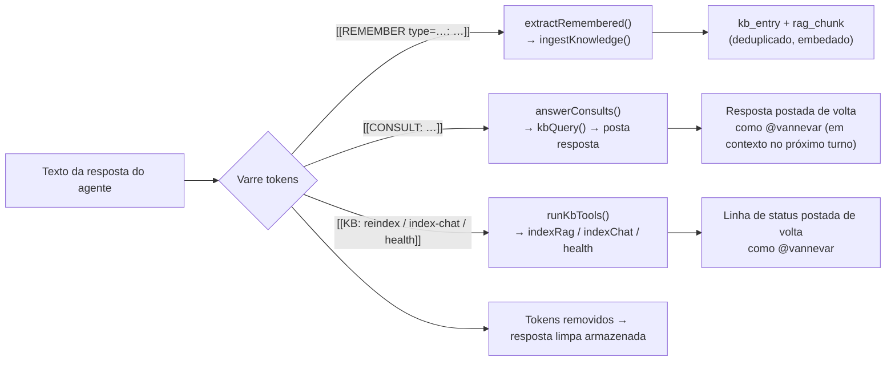
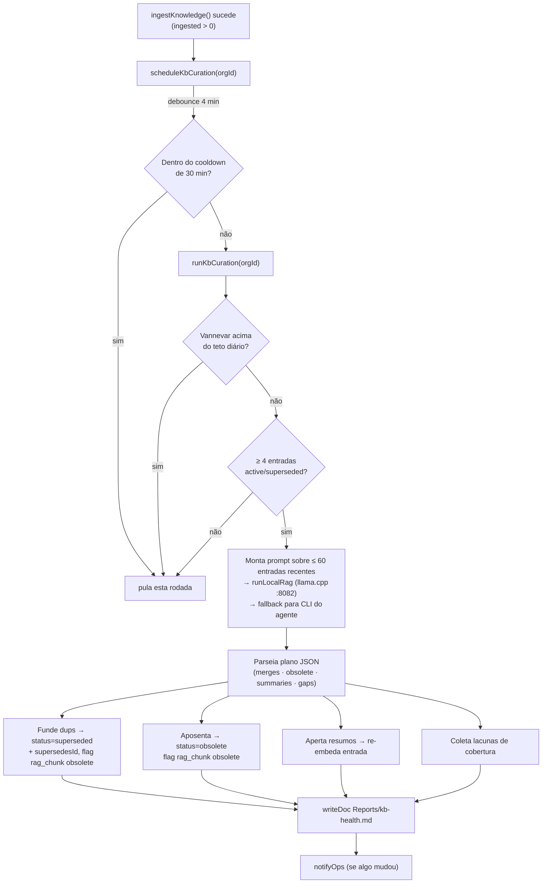
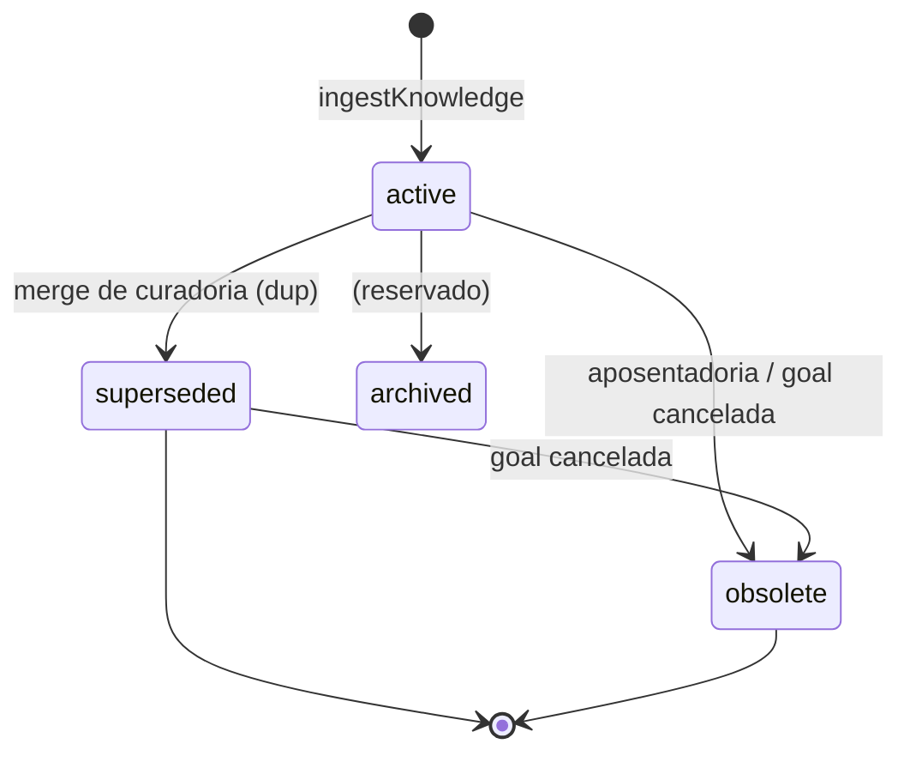

[← Índice](./README.md) · [🇬🇧 English](../en/KB_AGENT.md) · [✦ Constella](../../README.pt-BR.md)

# Agente de KB — Vannevar 🌌🛰️


Vannevar é o agente de Conhecimento: o guardião da fonte única de verdade da Constella. Tudo de reutilizável que a constelação aprende passa por esta estrela — classificado, deduplicado, mantido atualizado e devolvido com referências. Vannevar é dono da **camada curada, classificada e ciente de estado** que fica sobre a nebulosa de memória bruta do RAG.

> Fonte da verdade: `src/server/kb.ts` (motor) e `src/data/kb-prompt.ts` (prompt da persona de Vannevar + taxonomia). A camada bruta de embedding/índice está documentada em [KB_RAG.md](./KB_RAG.md).

## Quando usar 🪐

- Você quer entender **como o conhecimento é capturado** enquanto os agentes trabalham (os tokens `[[REMEMBER]]` / `[[CONSULT]]` / `[[KB:]]`).
- Você precisa saber **o que `/curate` faz** e onde ele grava o relatório de saúde (`Reports/kb-health.md`).
- Você quer saber **como o conhecimento é aposentado** (superseded / obsolete) e por que uma goal cancelada para de aparecer.
- Você está integrando **`proposeSkillsFromLearnings`** (P3 aprendizado → skills) ou depurando por que a curadoria não roda.
- Você quer a **taxonomia da KB** (`kb_entry.type`) e a máquina de estados do ciclo de vida.

## Como funciona 🌠

A KB da Constella é um **híbrido** de duas metades:

| Metade | Caminho | Custo | O que faz |
|---|---|---|---|
| **Captura determinística** | `ingestKnowledge()` | Sem LLM (caminho quente) | Classifica pelo type fornecido, deduplica por hash de conteúdo, atualiza no lugar no mesmo slot de origem, faz upsert de um `kb_entry`, (re)embeda seus `rag_chunk`(s). |
| **Curadoria por LLM** | `runKbCuration()` (Vannevar) | LLM pago/local (fora do caminho quente) | Funde quase-duplicatas, aposenta entradas contraditas, aperta resumos, expõe lacunas de cobertura → `Reports/kb-health.md`. |

O caminho determinístico **sempre funciona**; a curadoria é um refinamento best-effort que roda atrás de um gate de debounce + cooldown + teto diário. Tudo é fire-and-forget — a captura de KB **nunca** pode quebrar a execução de uma tarefa.

A persona de Vannevar (`src/data/kb-prompt.ts`):

- **Identidade** (`KB_IDENTITY`): *"Keeper of the company's single source of truth. Every reusable thing the team learns flows through me…"*
- **Ritual** (`KB_RITUAL`): *"Ingest new knowledge, retire what's superseded or obsolete, keep summaries tight, surface gaps, and answer any teammate's question with the most recent, active, referenced truth — or say plainly when we don't know yet."*
- **System prompt** (`KB_AGENT_PROMPT`): o manual de operação completo, semeado em `agent.persona.systemPrompt` no boot por `seedKbAgent()` e espelhado em disco como `.claude/kb/TAXONOMY.md` (de modo que ele próprio é indexado pelo RAG).

Fatos de roster de Vannevar (de `src/data/scaffold.ts`): handle `vannevar`, papel **Knowledge**, reporta a `ada`, modelo `haiku`, teto diário **$10 USD**, tier **light**. Veja [AGENTS.md](./AGENTS.md).

## Fluxo principal — os três tokens do agente 🛰️

Os agentes acionam a KB **inline** emitindo tokens entre colchetes duplos em suas respostas. O sistema os interpreta, executa a ação e remove o token antes de a mensagem ser armazenada/exibida. Isso acontece tanto em **execuções de tarefa** (`src/server/runner.ts`) quanto em **respostas de chat** (`src/server/collab.ts`).



### `[[REMEMBER type=<t>: <fact>]]` — o produtor

`extractRemembered()` extrai cada token `[[REMEMBER …]]` de uma resposta e transforma cada um em um `KbItem` tipado a ser ingerido.

- Regex: `/\[\[REMEMBER(?:\s+type=([a-z-]+))?\s*:?\s*([\s\S]*?)\]\]/gi`.
- O `type=` é validado contra `KB_LEARN_TYPES` (`decision`, `architecture`, `business-rule`, `integration`, `dependency`, `bug`, `fix`, `test`, `review`, `vuln`, `ui-pattern`, `stack`, `env-config`, `command`, `note`). Um type desconhecido vira `note`.
- O fato precisa ter **≥ 8 caracteres** ou é descartado. O título é a primeira linha (≤ 80 caracteres); o resumo são os primeiros 1200 caracteres.
- Numa execução de tarefa o contexto carrega `goalId` / `issueId` / `taskId` (`sourceKind: "task"`, `sourceRef: "<taskId>:learn"`); no chat carrega o id da mensagem (`sourceKind: "chat"`).
- Os itens capturados são enviados **fire-and-forget** a `ingestKnowledge()`; os tokens são removidos da resposta exibida.

### `[[CONSULT: <question>]]` — o consumidor

`answerConsults()` resolve uma pergunta pré-ação contra a KB **ciente de estado** para que a resposta esteja no contexto no próximo turno do agente. É o complemento de `[[REMEMBER]]`.

- Regex: `/\[\[CONSULT:\s*([\s\S]*?)\]\]/gi`. Consultas com menos de 4 caracteres são ignoradas.
- Cada pergunta passa por `kbQuery(orgId, q, { agentHandle, k: 6 })`; a resposta é o contexto curado (ou `"(no relevant knowledge in the KB yet)"`).
- No chat, cada resposta é **postada de volta na thread como `@vannevar`** (`🔎 KB consult — "…"`), de modo que o agente que perguntou a lê no próximo turno.

### `[[KB: reindex|index-chat|health]]` — ferramentas de manutenção

`runKbTools()` permite que qualquer agente acione manutenção explícita de KB no meio da execução.

| Verbo | Ação | Linha de resultado |
|---|---|---|
| `reindex` | `indexRag(orgId)` | `reindex → N chunk(s) (semantic)` |
| `index-chat` (ou `indexchat`) | `indexChat(orgId)` | `index-chat → N chunk(s)` |
| `health` | `llamaServerStatus()` | `embed health → up (model) \| down` |

Verbos desconhecidos/falhos são silenciosamente ignorados. No chat os resultados são postados de volta como `@vannevar` (`🛠️ KB tools — …`).

## Laço de curadoria 🕳️

`runKbCuration()` é a metade por LLM da ingestão híbrida. Roda **atrás de um gate de debounce + cooldown + teto** e é best-effort.



O que cada passo faz:

1. **Gate.** Resolve Vannevar (`handle === "vannevar"`, senão o primeiro papel que casa `/knowledge/i`). Aborta se ausente ou acima do `dailyCapUsd` (`overCap()`).
2. **Amostra.** Seleciona as 60 entradas atualizadas mais recentemente com `status in (active, superseded)`. Menos de **4** → não vale uma execução paga, aborta. Compacta cada uma para `{ id, type, title, summary (≤300), ref, goalId, status }`.
3. **Raciocina.** Monta um prompt a partir de `KB_AGENT_PROMPT` + as entradas JSON, pedindo um objeto JSON estrito. Roda no **modelo local primeiro** (`runLocalRag` → servidor de chat llama.cpp em `LLAMACPP_URL`, padrão `http://127.0.0.1:8082`), com fallback para o CLI de Vannevar (`runAgent`) apenas se o servidor local estiver fora. O custo é lançado em `cost_entry` quando não-zero.
4. **Aplica** (limitado aos ids realmente presentes no lote):
   - **merges** → cada id descartado vira `status="superseded"`, `supersedesId=<keep>`, seus `rag_chunk`s marcados `obsolete=1`.
   - **obsolete** → `status="obsolete"`, `rag_chunk`s marcados `obsolete=1`.
   - **summaries** → aperta `kb_entry.summary` (≤ 1200) e **re-embeda** a entrada; aplicado apenas a entradas `active`.
   - **gaps** → coletadas (máx 30) como strings simples.
5. **Relata.** Grava `Reports/kb-health.md` via `writeDoc` (write-through em disco + indexado pelo RAG, então aparece em `/reports`), depois `notifyOps` se algo mudou.

`runKbCuration()` retorna `{ ok, merged, retired, summarized, gaps }`.

### O relatório de saúde da KB

`Reports/kb-health.md` (gravado por `writeDoc`) fica assim:

```markdown
# KB health

_Curated by @vannevar · 42 active · 7 retired entr(y/ies)_

This pass: merged 3, retired 1, re-summarised 5.

## Coverage gaps
- Module "billing/" has produced files but no captured knowledge yet
- …
```

### Gatilhos

| Gatilho | Caminho | Notas |
|---|---|---|
| Automático | `scheduleKbCuration(orgId)` após um `ingestKnowledge` bem-sucedido | Debounce de 4 min coalesce uma rajada de ingestões; cooldown de 30 min por workspace; opt-out com `CONSTELLA_KB_CURATION=0`. |
| Comando do operador | `/curate` (`src/server/commands.ts`) | Roda `runKbCuration` sincronamente; Vannevar reporta o resultado no canal. |
| Ação de UI | `curateKb()` (`src/server/actions/kb-actions.ts`) | Mesma chamada de motor a partir do módulo Knowledge. |

## P3 — aprendizado → skills 🚀

`proposeSkillsFromLearnings()` é Vannevar lendo o conhecimento **validado e recorrente** do time e destilando-o em **0–3 novas skills reutilizáveis**.

- Lê entradas `active` cujo `type` está em `REUSABLE` (`doc`, `research`, `ui-pattern`, `stack`, `integration`, `fix`, `decision`, `architecture`, `business-rule`), mantendo apenas entradas com `confidence >= 60` (`strong`). Precisa de **≥ 4** entradas fortes ou aborta.
- Deduplica contra `skill.name`s existentes; monta um prompt pedindo um array JSON de `{ name, role, trigger, summary, instructions }`.
- Cada proposta aceita aterrissa como uma skill **provisória**: `native=false`, `provisional=true`, `indexed="pending"`, `proposedRole=<role>` — **não vinculada a nenhum agente** até o operador aprová-la em `/skills` (`approveProvisional` a vincula por papel). Um arquivo `.claude/skills/<name>.md` é gravado em disco.
- Notifica o operador (`notifyOps`, kind `review`) quando algo foi proposto.
- Acionada pelo operador via página de Skills (`suggestSkillsFromLearnings` em `src/server/skills.ts`). Retorna `{ ok, proposed }`.

Veja [SKILLS.md](./SKILLS.md) para o ciclo de vida de skills e `approveProvisional`.

## Conceitos-chave ✦

- **Recuperação ciente de estado.** `kbQuery()` só retorna `rag_chunk`s com `obsolete=0`, o que exclui entradas superseded/obsolete e o conhecimento de goals canceladas/arquivadas. Retorna uma flag `sufficient` (um sinal explícito de *"conhecimento insuficiente"*) e registra cada consulta em `kb_query_log`.
- **Gate de política de conteúdo.** `ingestKnowledge` roda `scrubSecrets()` sobre cada item; se a limpeza altera o texto, havia um segredo, e o item é **recusado** (nunca indexado). Veja [SECURITY.md](./SECURITY.md).
- **Cascata de estado.** `markKbObsoleteForGoal(wsId, goalId)` aposenta o conhecimento de uma goal quando ela é cancelada/arquivada (marca `kb_entry` obsolete + flag `rag_chunk` `obsolete=1`).
- **Grafo multi-hop.** `relatedKnowledge()` percorre as colunas de link `goalId/specId/issueId` + a cadeia `supersedes` (padrão 2 hops) a partir de um item de trabalho semente, retornando o conhecimento conectado agrupado por type. Decisions são elas próprias linhas `kb_entry`, então isso liga decisions ↔ specs ↔ issues ↔ fixes/reviews/patterns anteriores.
- **Respostas curadas.** `kbAnswer()` é o caminho limpo de *"Pergunte à KB"* (chat da home + `/kb`). Perguntas meta/status (`KB_META_RE`) recebem um cartão de visão geral determinístico a partir de números reais; perguntas de conteúdo recebem uma resposta curta escrita pelo modelo via `summarizeWithKbAgent()` (modelo local primeiro, nunca um despejo bruto de contexto) mais uma linha de Sources organizada.

## Tabelas 🪐

| Tabela | Colunas-chave | Papel |
|---|---|---|
| `kb_entry` | `type`, `title`, `summary`, `body`, `status`, `goal_id`, `spec_id`, `issue_id`, `task_id`, `module`, `paths`, `agent_handle`, `source_kind`, `source_ref`, `supersedes_id`, `hash`, `confidence` | A unidade de conhecimento curada, classificada e com ciclo de vida rastreado. |
| `rag_chunk` | `path`, `chunk`, `vector`, `kb_entry_id`, `obsolete` | Os chunks de recuperação embedados. Entradas de KB emitem chunks em `path = kb/<type>/<id>`. |
| `kb_query_log` | `agent_handle`, `query`, `hits`, `mode`, `refs`, `answered_at` | Cada consulta (quem perguntou, como foi respondida). |
| `synced_block` | `slug`, `kind`, `title`, `body`, `version` | Blocos canônicos centrais (ex.: `mission`, `official-stack`, `business-rules`). Veja [SYNCED_BLOCKS.md](./SYNCED_BLOCKS.md). |
| `block_proposal` | `slug`, `kind`, `body`, `by_agent_handle`, `status` | Fila de propostas para synced blocks. |

Todas as tabelas de KB são criadas idempotentemente no boot por `ensureKbTables()` (DDL sem migração, seguro a cada boot).

### Taxonomia `kb_entry.type` (~24 tipos)

| Type | Significado |
|---|---|
| `decision` | Decisões técnicas/arquiteturais + justificativa |
| `spec` / `issue` / `goal` / `plan` | Artefatos de trabalho e sua intenção |
| `architecture` | Estrutura do sistema, fronteiras, fluxo de dados |
| `business-rule` | Regras de produto/domínio que restringem a implementação |
| `code-change` | O que uma tarefa produziu (arquivos + resumo) |
| `dependency` / `integration` | Bibliotecas, serviços, sistemas externos |
| `bug` / `fix` | Defeitos encontrados + correções aplicadas |
| `test` / `review` | Veredictos de teste + resultados de code-review |
| `vuln` | Achados e riscos de segurança |
| `doc` | Documentação escrita/atualizada |
| `user-context` | O que o operador quer; restrições, preferências |
| `history` | Marcos e história do projeto |
| `command` | Comandos executados úteis / passos de runbook |
| `file-structure` | Onde as coisas ficam no workspace |
| `ui-pattern` | Convenções de UI/UX a manter consistentes |
| `stack` | A stack tecnológica oficial |
| `env-config` | Fatos de ambiente e configuração |
| `note` | Coringa |

## Estados possíveis 🌠

`kb_entry.status` é um ciclo de vida de quatro estados:

| Estado | Definido por | Aparece na recuperação? |
|---|---|---|
| `active` | `ingestKnowledge` (captura) | ✅ sim |
| `superseded` | merge de curadoria (`supersedesId` → a entrada canônica mantida) | ❌ não (`obsolete=1`) |
| `obsolete` | aposentadoria de curadoria, ou `markKbObsoleteForGoal` numa goal cancelada/arquivada, ou contradito por verdade mais nova | ❌ não (`obsolete=1`) |
| `archived` | reservado (contado em `kbOverview.lifecycle`) | ❌ não |



## Passo a passo — da captura à recordação

1. Um agente termina uma tarefa e emite `[[REMEMBER type=fix: bumped chokidar to v4, watcher debounce moved to 400ms]]` em sua resposta.
2. O runner chama `extractRemembered()` → um `KbItem{ type: "fix", title: "bumped chokidar to v4…" }` com `goalId/issueId/taskId` preenchidos.
3. `ingestKnowledge()` faz hash do conteúdo, não encontra duplicata, insere um `kb_entry` e embeda seu `rag_chunk` em `kb/fix/<id>`. O token `[[REMEMBER]]` é removido da resposta armazenada.
4. Como algo foi ingerido, `scheduleKbCuration(orgId)` arma um debounce de 4 minutos. Quando dispara (e o cooldown passou e Vannevar está abaixo do teto), `runKbCuration` funde, aposenta, aperta e grava `Reports/kb-health.md`.
5. Mais tarde, outro agente emite `[[CONSULT: how is the file watcher configured?]]`. `answerConsults()` roda `kbQuery()`, que retorna a entrada de fix (ainda ativa); Vannevar posta a resposta de volta na thread, de modo que o agente que perguntou a lê no próximo turno.

## Exemplos

Pergunte à KB pelo chat ou via slash command:

```text
/kb how is the file watcher configured?
/curate
/reindex
```

Proposta de skills acionada pelo operador (página de Skills → `suggestSkillsFromLearnings`):

```text
# retorna { ok: true, proposed: 2 } → duas skills provisórias na fila para aprovação em /skills
```

Opt-out da curadoria automática (ex.: orçamento minúsculo):

```bash
CONSTELLA_KB_CURATION=0
```

Aponte o modelo local de RAG/curadoria para um servidor de chat llama.cpp não-padrão:

```bash
LLAMACPP_URL=http://127.0.0.1:8082
```

## Integrações relacionadas 🛰️

- **Camada RAG** — embeddings, `chunksOf`, o servidor de embed. Veja [KB_RAG.md](./KB_RAG.md).
- **Memória & contexto** — como a recordação alimenta o prompt de um agente. Veja [MEMORY_RAG.md](./MEMORY_RAG.md).
- **Synced blocks** — os blocos canônicos centrais que o cartão da KB verifica. Veja [SYNCED_BLOCKS.md](./SYNCED_BLOCKS.md).
- **Skills** — skills provisórias propostas a partir de aprendizados. Veja [SKILLS.md](./SKILLS.md).
- **Team Room / DM** — onde as respostas de `[[CONSULT]]` são postadas. Veja [TEAM_ROOM.md](./TEAM_ROOM.md), [DM.md](./DM.md).
- **Slash commands** — `/kb`, `/curate`, `/reindex`. Veja [CHAT_COMMANDS.md](./CHAT_COMMANDS.md).
- **Models** — modelo local para geração de RAG gratuita. Veja [MODELS.md](./MODELS.md).

## Segurança 🕳️

- **Recusa de segredo na ingestão.** `ingestKnowledge` recusa qualquer item cujo conteúdo muda sob `scrubSecrets()` (chaves de API, tokens, PEM, bearer, URLs de DB com credenciais). O aprendizado é logado-e-descartado, nunca indexado.
- **Scrub na saída.** As respostas de chat (e as respostas de `[[CONSULT]]` postadas como Vannevar) são limpas novamente antes de serem armazenadas/exibidas (`collab.ts`).
- **Ciente de estado por padrão.** Conhecimento cancelado/arquivado/superseded/obsolete não pode aparecer via `kbQuery` — os agentes nunca agem sobre verdade aposentada.
- **Gate de orçamento.** Tanto `runKbCuration` quanto `proposeSkillsFromLearnings` abortam quando Vannevar está acima do seu `dailyCapUsd`, de modo que a curadoria nunca estoura o orçamento.

Veja [SECURITY.md](./SECURITY.md).

## Solução de problemas

| Sintoma | Causa provável | Correção |
|---|---|---|
| `/curate` diz *"Nothing to curate right now"* | Menos de 4 entradas active/superseded, ou Vannevar acima do teto | Deixe os agentes completarem mais trabalho; verifique o teto diário de Vannevar. |
| A curadoria nunca roda automaticamente | `CONSTELLA_KB_CURATION=0`, dentro do cooldown de 30 min, ou nenhuma ingestão | Remova o opt-out; espere o cooldown passar. |
| `[[REMEMBER]]` não capturado | Fato com menos de 8 caracteres, ou o texto carregava forma de segredo (recusado) | Escreva um fato mais longo e sem segredos. |
| Resposta de `[[CONSULT]]` é *"(no relevant knowledge…)"* | KB vazia ou consulta com menos de 4 caracteres | Rode `/reindex`; faça uma pergunta mais longa. |
| As respostas da KB parecem desatualizadas | Chunks superseded/obsolete ainda marcados ativos, ou índice nunca reconstruído | Rode `/reindex`; rode `/curate`; verifique `Reports/kb-health.md`. |
| Nenhum relatório de saúde da KB | A curadoria nunca produziu mudanças, ou erro de disco no `writeDoc` | Verifique permissões de disco; rode `/curate` após algumas ingestões. |
| Skills propostas = 0 | Menos de 4 entradas reutilizáveis fortes (`confidence ≥ 60`) | Acumule mais aprendizados validados primeiro. |

Veja [TROUBLESHOOTING.md](./TROUBLESHOOTING.md).

## Links relacionados

- [KB_RAG.md](./KB_RAG.md) — a camada bruta de RAG/índice sob a KB.
- [MEMORY_RAG.md](./MEMORY_RAG.md) — memória & montagem de contexto.
- [SYNCED_BLOCKS.md](./SYNCED_BLOCKS.md) — blocos canônicos centrais.
- [SKILLS.md](./SKILLS.md) — skills + aprovação de provisórias.
- [AGENTS.md](./AGENTS.md) — o roster (papel/modelo/teto de Vannevar).
- [CHAT_COMMANDS.md](./CHAT_COMMANDS.md) — `/kb`, `/curate`, `/reindex`.
- [TEAM_ROOM.md](./TEAM_ROOM.md) · [DM.md](./DM.md) — onde as respostas de consult aterrissam.
- [MODELS.md](./MODELS.md) — modelo local para geração de RAG gratuita.
- [SECURITY.md](./SECURITY.md) · [TROUBLESHOOTING.md](./TROUBLESHOOTING.md)
