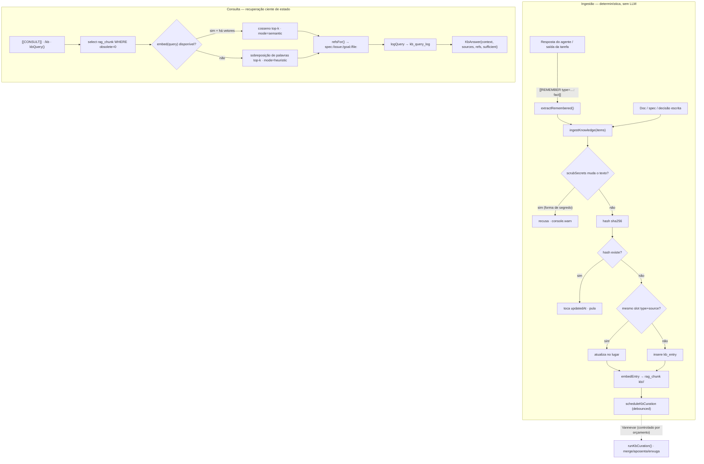
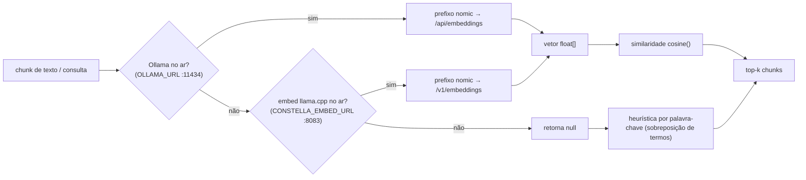

[← Índice](./README.md) · [🇬🇧 English](../en/KB_RAG.md) · [✦ Constella](../../README.pt-BR.md)

# Base de Conhecimento & RAG ✦ A Nebulosa de Memória 🌌


> A memória de longo prazo do plano de controle. Cada decisão, correção, padrão e descoberta que os agentes acumulam se condensa em uma nebulosa curada, classificada e ciente de estado — e a gravidade (recuperação semântica) traz o conhecimento certo de volta ao contexto quando ele é necessário.

A Constella roda **duas camadas cooperantes** sobre o mesmo armazenamento:

- **RAG** (`src/server/rag.ts`) — recuperação bruta sobre o Markdown do workspace + transcrições de chat. Embeddings quando há um modelo local no ar; heurística por palavra-chave caso contrário.
- **KB** (`src/server/kb.ts`) — a camada curada que o agente de Conhecimento (**Vannevar**) possui: entradas tipadas, deduplicação por hash de conteúdo, ciclo de vida (active → superseded → obsolete → archived), recuperação ciente de estado, um grafo de conhecimento multi-salto e curadoria por LLM controlada por orçamento.

Ambas escrevem em uma única tabela física — `rag_chunk` — e as entradas da KB simplesmente emitem seus próprios chunks (caminho `kb/<type>/<id>`), de modo que uma única passada de recuperação cobre docs, chat **e** conhecimento curado.

---

## 1. Quando usar 🪐

| Você quer… | Camada / ponto de entrada |
|---|---|
| Deixar os agentes lembrarem o que foi decidido/construído sem reler cada arquivo | RAG `retrieve()` + KB `kbQuery()` |
| Capturar um aprendizado reutilizável de forma determinística (sem LLM) | `ingestKnowledge()` |
| Fazer um agente registrar um fato durante a execução | token `[[REMEMBER type=<t>: <fact>]]` |
| Fazer um agente consultar a KB antes de agir | token `[[CONSULT: <question>]]` |
| Disparar reindex / re-index do chat / saúde do embed durante uma execução | token `[[KB: reindex|index-chat|health]]` |
| Perguntar à KB de forma limpa e curada (chat / `/kb`) | `kbAnswer()` |
| Percorrer conhecimento relacionado a um goal/spec/issue | `relatedKnowledge()` |
| Deduplicar, aposentar e enxugar a KB | `runKbCuration()` (Vannevar) |
| Destilar aprendizados recorrentes em novas skills (P3) | `proposeSkillsFromLearnings()` |

Veja também [KB_AGENT.md](./KB_AGENT.md) (persona e ritual do Vannevar), [MEMORY_RAG.md](./MEMORY_RAG.md), [SYNCED_BLOCKS.md](./SYNCED_BLOCKS.md) (blocos canônicos) e [MODELS.md](./MODELS.md) (os servidores locais de embed/chat).

---

## 2. Como funciona 🛰️

### Armazenamento RAG (`rag.ts`)

- **Diretórios indexados** (`RAG_DIRS`): `.claude`, `DOCS`, `PO`, `Reports`, `specs`, `issues`. Mais o protótipo `mock/` anexado (arquivos de texto: `.md .html .css .js/jsx .ts/tsx .txt .json`).
- **Encanamento excluído**: `.claude/kb/` (o próprio prompt/taxonomia do agente de KB) e `.claude/skills/` nunca são indexados — caso contrário uma pergunta recuperaria as entranhas da Constella.
- **Chunking** (`chunksOf`): divide em cabeçalhos H1–H3 (`/\n(?=#{1,3}\s)/`); cada parte ≤ **1200 caracteres** (partes maiores são quebradas à força); **máximo de 40 chunks** por documento.
- **Embeddings** (`embed`): dois backends, tentados em ordem —
  1. **Ollama** (`OLLAMA_URL`, padrão `http://127.0.0.1:11434`) com o modelo `CONSTELLA_EMBED_MODEL` (padrão `nomic-embed-text`).
  2. **Servidor de embedding llama.cpp dedicado** (`CONSTELLA_EMBED_URL`, padrão `http://127.0.0.1:8083`), `/v1/embeddings` compatível com OpenAI.
  - Retorna `null` se ambos estiverem fora do ar → o chamador cai na busca por palavra-chave.
- **Prefixos nomic assimétricos**: o nomic-embed-text foi treinado com prefixos de tarefa e *os exige*. Documentos são embeddados como `search_document: …`, consultas como `search_query: …`. Os lados de índice e de consulta precisam usar o mesmo modelo + prefixo correspondente, senão a similaridade de cosseno não tem sentido.
- **Transcrições de chat** (`indexChat`): a sala do time, DMs e Telegram são agrupados por canal, as **últimas 400 linhas** de cada um são embeddadas sob o caminho `chat/<channel>`, para que os agentes lembrem o que foi *dito*, não só o que está nos docs.

### O servidor local de embed (`local-models.ts`)

`ensureEmbedServer()` sobe uma instância **separada** do llama.cpp servindo o GGUF nomic local com `--embeddings` na porta **:8083** (distinta do servidor de chat na **:8082**). Roda no boot e após o download de um modelo de embedding, então a recuperação fica semântica sem configuração manual:

```bash
llama-server -m <nomic.gguf> --embeddings --host 127.0.0.1 --port 8083 -c 2048 --pooling mean [<args de offload GPU>]
```

`embedServerUp()` checa `GET <EMBED_URL>/health`; `llamaServerStatus()` checa o `/v1/models` do servidor de chat.

### Camada KB (`kb.ts`)

Uma `kb_entry` é **uma unidade de conhecimento reutilizável** — uma decisão, mudança de código, descoberta, spec, correção, padrão… Ela é:
- **classificada** por `type` + refs de trabalho/arquivo,
- **deduplicada** por um hash de conteúdo SHA-256,
- **rastreada por ciclo de vida** (`active → superseded → obsolete → archived`),
- e **emite seus próprios `rag_chunk(s)`** sob o caminho `kb/<type>/<id>` para recuperação semântica.

Toda a captura da KB é **best-effort e fire-and-forget**: um item ruim nunca aborta um lote, e o trabalho da KB nunca pode quebrar a execução de uma tarefa.

---

## 3. Fluxo principal 🌠



---

## 4. Conceitos-chave 🕳️

- **Captura determinística, curadoria por LLM** — o *caminho quente* (`ingestKnowledge`) nunca chama um modelo; o *caminho frio* (`runKbCuration`) chama, fora do caminho crítico, controlado por orçamento. A KB continua funcionando mesmo que a curadoria nunca rode.
- **Atualizar no lugar vs inserir** — um item com o mesmo slot `(type, sourceKind, sourceRef)` é tratado como uma *atualização* daquele conhecimento (reescreve a linha); um slot diferente insere uma nova entrada. Conteúdo idêntico (mesmo hash) apenas toca `updatedAt`.
- **Recuperação ciente de estado** — `kbQuery` só seleciona `rag_chunk WHERE obsolete = 0`. Entradas superseded/obsolete e os chunks de goals cancelados/arquivados são marcados `obsolete = 1`, então o conhecimento velho deixa de aparecer automaticamente.
- **Sinal de insuficiência** — `KbAnswer.sufficient` é honesto: quando nada relevante é encontrado, a resposta diz isso em vez de inventar.
- **Grafo de conhecimento** — `relatedKnowledge` percorre as colunas de link `goalId/specId/issueId` + a cadeia `supersedesId` até `hops` (padrão 2), agrupando por tipo o conhecimento *ativo* conectado. Decisões são elas próprias linhas `kb_entry` (`type="decision"`), então isso naturalmente liga decisões ↔ specs ↔ issues ↔ correções anteriores.
- **Segredos nunca entram na KB** — antes da ingestão, `scrubSecrets(blob)` roda; se o texto muda (havia uma forma de segredo), o item é **recusado**. Veja [SECURITY.md](./SECURITY.md).
- **Geração local-first** — *respostas* e *curadoria* da KB preferem o servidor de chat local llama.cpp (`LLAMACPP_URL`, padrão `:8082`); só se ele estiver fora é que caem na CLI (possivelmente paga) do agente. Blocos `<think>…</think>` de GGUFs de raciocínio são removidos.

---

## 5. A taxonomia de conhecimento 🌌

`KbType` — o conjunto completo (de `kb.ts`). `note` é o pega-tudo.

| type | O que captura |
|---|---|
| `decision` | Uma decisão arquitetural/de produto e sua justificativa |
| `spec` | Uma unidade de especificação |
| `issue` | Uma descoberta de issue/item de trabalho |
| `goal` | Conhecimento de nível de goal |
| `plan` | Conhecimento de planejamento |
| `architecture` | Conhecimento de sistema/estrutura |
| `business-rule` | Uma regra de domínio/negócio |
| `code-change` | Uma mudança de código relevante |
| `dependency` | Um fato de dependência / biblioteca |
| `integration` | Um detalhe de integração externa |
| `bug` | Um bug observado |
| `fix` | Uma correção aplicada |
| `test` | Conhecimento de teste / cobertura |
| `review` | Uma descoberta de revisão |
| `vuln` | Uma vulnerabilidade de segurança |
| `doc` | Conhecimento de documentação |
| `user-context` | Contexto do operador/usuário |
| `history` | Contexto histórico |
| `command` | Um comando útil |
| `file-structure` | Conhecimento de arquivo/layout |
| `ui-pattern` | Um padrão de UI reutilizável |
| `stack` | Fato da stack do projeto |
| `env-config` | Fato de ambiente/config |
| `note` | Pega-tudo (padrão) |

**Autocaptura do agente** (`[[REMEMBER type=…]]`) aceita um conjunto mais estreito — `KB_LEARN_TYPES` — e qualquer coisa fora dele cai para `note`:
`decision, architecture, business-rule, integration, dependency, bug, fix, test, review, vuln, ui-pattern, stack, env-config, command, note`.

---

## 6. Tokens de agente 🚀

Os agentes leem/escrevem na KB inline emitindo tokens entre colchetes duplos. O runner os interpreta e os remove da resposta visível.

| Token | Direção | Handler | Efeito |
|---|---|---|---|
| `[[REMEMBER type=<t>: <fact>]]` | produtor | `extractRemembered()` | Vira um `KbItem` tipado (fato ≥ 8 chars), ingerido via `ingestKnowledge` |
| `[[CONSULT: <question>]]` | consumidor | `answerConsults()` | Roda `kbQuery` (k=6), devolve a resposta ao thread para ficar no contexto no próximo turno (pergunta ≥ 4 chars) |
| `[[KB: reindex]]` | manutenção | `runKbTools()` | `indexRag(orgId)` → reporta contagem de chunks |
| `[[KB: index-chat]]` | manutenção | `runKbTools()` | `indexChat(orgId)` → re-embedda conversas |
| `[[KB: health]]` | manutenção | `runKbTools()` | `llamaServerStatus()` → servidor de embed no ar/fora |

Os três são **best-effort**: um verbo desconhecido, uma consulta falha ou um fato curto demais é silenciosamente ignorado.

---

## 7. Tabelas 🪐

### `rag_chunk` — o armazenamento físico (RAG + KB compartilham)

| coluna | tipo | notas |
|---|---|---|
| `id` | text PK | |
| `workspace_id` | text → `workspace` | cascade delete |
| `path` | text | caminho de origem (`DOCS/…`, `chat/<channel>`, `kb/<type>/<id>`) |
| `chunk` | text | o texto do chunk |
| `vector` | text (JSON float[]) | `null` quando não embeddado (fallback por palavra-chave) |
| `kb_entry_id` | text | preenchido quando o chunk veio de uma `kb_entry` |
| `obsolete` | int(bool) | `1` → descartado pela recuperação ciente de estado |
| `updated_at` | timestamp | |

### `kb_entry` — a unidade de conhecimento curado

| coluna | tipo | notas |
|---|---|---|
| `id` | text PK | |
| `workspace_id` | text → `workspace` | cascade delete |
| `type` | text | um de `KbType` (padrão `note`) |
| `title` | text | ≤ 200 chars |
| `summary` | text | resumo técnico (Vannevar cura), ≤ 1200 chars |
| `body` | text | ≤ 8000 chars |
| `status` | text | `active \| superseded \| obsolete \| archived` |
| `goal_id` / `spec_id` / `issue_id` / `task_id` | text | refs de trabalho anuláveis |
| `module` | text | ≤ 120 chars |
| `paths` | JSON string[] | arquivos que este conhecimento abrange (≤ 40) |
| `agent_handle` | text | quem o produziu |
| `source_kind` | text | `task \| goal \| review \| test \| decision \| spec \| issue \| note \| chat` |
| `source_ref` | text | id/chave de origem (jump-back); chave do slot de dedup junto a `type`+`source_kind` |
| `supersedes_id` | text | a entrada que esta substitui |
| `hash` | text | hash de conteúdo SHA-256 → dedup / atualização no lugar |
| `confidence` | int | 0..100 (padrão 70) |
| `created_at` / `updated_at` | timestamp | |

### `kb_query_log` — toda consulta

| coluna | tipo | notas |
|---|---|---|
| `id` | text PK | |
| `workspace_id` | text → `workspace` | |
| `agent_handle` | text | quem perguntou (`operator` para `/kb`) |
| `query` | text | ≤ 500 chars |
| `hits` | int | número de caminhos de origem retornados |
| `mode` | text | `semantic \| heuristic \| none` |
| `refs` | JSON string[] | jump-backs `kind:ref` |
| `answered_at` | timestamp | indexado para a visão de recall recente |

---

## 8. Diagrama de embedding & recuperação 🛰️



---

## 9. Passo a passo 🌠

### Capturar um aprendizado (determinístico)
1. Um doc é escrito **ou** um agente emite `[[REMEMBER type=decision: Escolhemos SQLite WAL para o índice]]`.
2. `extractRemembered` transforma o token em um `KbItem`.
3. `ingestKnowledge` roda `scrubSecrets` (recusa conteúdo com forma de segredo), faz hash do conteúdo, e ou toca um duplicado, ou atualiza o mesmo slot, ou insere uma nova `kb_entry`.
4. `embedEntry` descarta os chunks antigos daquele caminho e re-embedda `# <title>\n<summary|body>` (≤ 6000 chars) em `rag_chunk` (caminho `kb/<type>/<id>`).
5. `scheduleKbCuration` arma uma passada de curadoria debounced.

### Consultar antes de agir
1. Um agente emite `[[CONSULT: como armazenamos segredos?]]`.
2. `answerConsults` chama `kbQuery(orgId, q, { k: 6 })`.
3. `kbQuery` seleciona chunks ativos (`obsolete=0`), ranqueia por cosseno (semantic) ou sobreposição de termos (heuristic), monta refs internas, registra em `kb_query_log`.
4. A resposta (contexto + fontes + um flag explícito de insuficiência) é devolvida ao thread para ficar no contexto do próximo turno do agente.

### Curar (Vannevar)
1. Após ingestões suficientes (≥ 4 entradas), o gatilho debounced (4 min) + com cooldown (30 min) dispara `runKbCuration`.
2. Vannevar revisa ~60 entradas recentes ativas/superseded e retorna JSON: `merges`, `obsolete`, `summaries`, `gaps`.
3. Merges → as descartadas viram `superseded` (+ `supersedesId`); obsolete → `obsolete`; resumos reescritos + re-embeddados; seus chunks marcados `obsolete=1`.
4. Um relatório `Reports/kb-health.md` é escrito (RAG-indexado) e o operador é notificado.

---

## 10. Exemplos 🪐

**Pergunte à KB pelo chat ou `/kb`:**

```text
/kb como autenticamos o processo worker?
```

`kbAnswer` roteia perguntas meta/status ("como está a KB?", "cobertura", "lacunas") para um **card de overview** determinístico; perguntas de conteúdo recuperam e então ganham uma resposta curta escrita pelo Vannevar com uma linha de Fontes enxuta — nunca despeja chunks crus.

**Autocaptura + consulta em uma execução de agente:**

```text
[[CONSULT: qual banco este projeto usa?]]
… trabalho …
[[REMEMBER type=stack: O projeto usa Drizzle ORM sobre better-sqlite3]]
[[KB: reindex]]
```

**Cancelar um goal → seu conhecimento se aposenta automaticamente** (`markKbObsoleteForGoal`): as linhas `kb_entry` do goal viram `obsolete` e seus `rag_chunk`s viram `obsolete=1`, então a recuperação para de exibi-los.

---

## 11. Estados possíveis 🕳️

**`kb_entry.status`**

| estado | significado |
|---|---|
| `active` | atual, recuperável |
| `superseded` | fundido em uma entrada canônica (`supersedesId` setado); não recuperado |
| `obsolete` | contradito / aposentado (também: goal cancelado/arquivado); não recuperado |
| `archived` | estacionado (contado à parte na visão de ciclo de vida) |

**Modo de `kbQuery` / `retrieve`**

| modo | significado |
|---|---|
| `semantic` | cosseno sobre vetores reais (backend de embed no ar) |
| `heuristic` | fallback por sobreposição de palavras-chave (sem embeddings) |
| `none` | índice vazio / nada casou |

**`KbReply.mode`** (de `kbAnswer`): `overview` (o card estruturado da KB), `answer` (escrito por modelo), `none` (conhecimento insuficiente).

---

## 12. Integrações relacionadas 🛰️

- **Motor de sincronização** — o watcher chama `scheduleRagReindex` / `indexRagFile` / `deindexRagFile` (debounced 2.5 s) para o RAG acompanhar mudanças de arquivo; o disco é a verdade. Veja [ARCHITECTURE.md](./ARCHITECTURE.md).
- **Chat** — toda mensagem postada arma `scheduleChatReindex` (debounced 6 s) → `indexChat`. Veja [TEAM_ROOM.md](./TEAM_ROOM.md), [DM.md](./DM.md), [TELEGRAM.md](./TELEGRAM.md).
- **Modelos locais** — `ensureEmbedServer` (:8083) + `ensureLlamaServer` (:8082); offload de GPU quando cabe. Veja [MODELS.md](./MODELS.md).
- **Skills (P3)** — `proposeSkillsFromLearnings` destila conhecimento recorrente forte em skills **provisórias** para aprovação do operador. Veja [SKILLS.md](./SKILLS.md).
- **Synced blocks** — conhecimento canônico nomeado (`mission`, `official-stack`, `business-rules`) que o card de overview incentiva você a criar. Veja [SYNCED_BLOCKS.md](./SYNCED_BLOCKS.md).
- **Comandos** — `/kb` (`/ask-kb`), `/reindex`, `/curate`, `/search`, `/graph`. Veja [CHAT_COMMANDS.md](./CHAT_COMMANDS.md).

---

## 13. Segurança 🕳️

- **Portão de segredo na ingestão** — `scrubSecrets(blob) !== blob` ⇒ o item é recusado e um `console.warn` é registrado. Nenhuma API key, token, PEM, bearer ou URL de banco com credenciais entra na KB.
- **Isolamento por org** — toda consulta/indexação é escopada por `workspace_id` (resolvido do `orgId`); só os chunks da org ativa são lidos ou retornados.
- **Encanamento interno escondido** — `.claude/kb/` e `.claude/skills/` ficam fora da indexação para que uma pergunta não exponha os próprios prompts/skills da Constella.
- **LLM controlada por orçamento** — execuções de curadoria e de proposta de skill checam o `dailyCapUsd` do agente (`overCap`) antes de gastar, e o custo é registrado em `cost_entry`.
- **Opt-outs** — `CONSTELLA_KB_CURATION=0` desativa totalmente a passada de curadoria automática.

---

## 14. Solução de problemas 🚀

| Sintoma | Causa provável | Correção |
|---|---|---|
| Recuperação é `heuristic`, nunca `semantic` | Nenhum backend de embed no ar | Suba o Ollama com `nomic-embed-text`, ou baixe um GGUF nomic para o `ensureEmbedServer` subir a :8083. Cheque com `[[KB: health]]`. |
| `/kb` diz "não há o suficiente na Base de Conhecimento" | Índice vazio/frio | Rode `/reindex` (ou `[[KB: reindex]]`); o conhecimento também preenche conforme os agentes concluem trabalho. |
| Docs novos não são recuperados | Arquivo fora de `RAG_DIRS`, ou watcher não rodando | Coloque docs sob `.claude/DOCS/PO/Reports/specs/issues`; garanta que o processo worker esteja no ar. |
| Conhecimento velho/cancelado ainda aparece | Chunks não marcados | Cancelar/arquivar um goal chama `markKbObsoleteForGoal`; um `/curate` manual também aposenta entradas contraditas. |
| Curadoria nunca roda | Cooldown / cap / opt-out | Precisa de ≥ 4 entradas, respeita o cooldown de 30 min + o cap diário do agente; cheque `CONSTELLA_KB_CURATION`. |
| Embeddings parecem errados (casamentos ruins) | Prefixos nomic incompatíveis ou modelo não-nomic | Mantenha `CONSTELLA_EMBED_MODEL` nomic, ou garanta que índice+consulta usem o mesmo modelo/esquema de prefixo. |

---

## 15. Links relacionados 🌌

- [KB_AGENT.md](./KB_AGENT.md) — Vannevar, o agente de Conhecimento
- [MEMORY_RAG.md](./MEMORY_RAG.md) — como a memória realimenta o contexto
- [SYNCED_BLOCKS.md](./SYNCED_BLOCKS.md) — blocos de conhecimento canônicos
- [SKILLS.md](./SKILLS.md) — aprendizado → skills (P3)
- [MODELS.md](./MODELS.md) — servidores locais de embed (:8083) & chat (:8082)
- [CHAT_COMMANDS.md](./CHAT_COMMANDS.md) — `/kb`, `/reindex`, `/curate`, `/graph`
- [ARCHITECTURE.md](./ARCHITECTURE.md) · [AI_ARCHITECTURE.md](./AI_ARCHITECTURE.md) — onde a KB/RAG fica na nave
- [SECURITY.md](./SECURITY.md) — scrub, isolamento, vault
