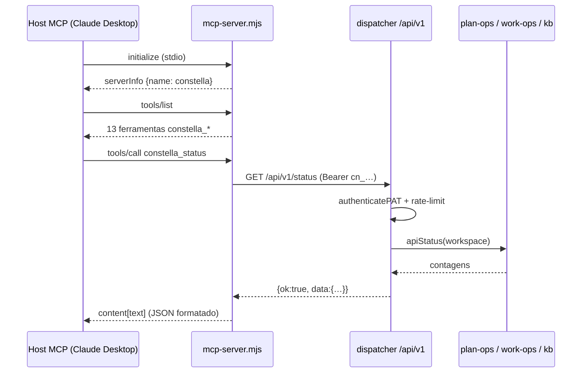
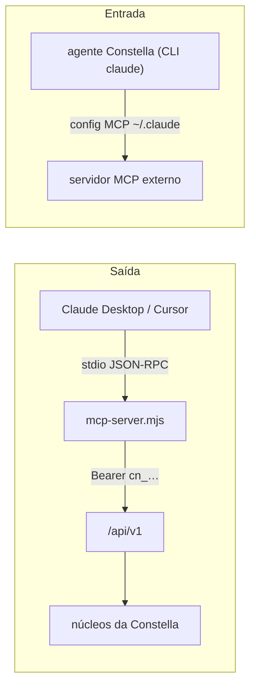

[← Índice](./README.md) · [🇬🇧 English](../en/MCP.md) · [✦ Constella](../../README.pt-BR.md)

# 🛰️ Servidor MCP — Pilotando a Nave Central a partir da Órbita


Um servidor **Model Context Protocol** autossuficiente (`scripts/mcp-server.mjs`) que expõe a API REST pública da Constella como ferramentas MCP, permitindo que um host de IA externo — Claude Desktop, Cursor ou qualquer cliente MCP — pilote o seu plano de controle Constella por linguagem natural.

---

## Quando usar

Recorra ao servidor MCP quando quiser que uma **IA externa** observe e dirija a Constella sem abrir a interface web:

- Perguntar ao Claude Desktop "qual é o status da minha empresa de agentes?" e fazê-lo chamar `constella_status`.
- Aprovar um plano pendente, ligar/desligar a execução 24/7 ou iniciar um novo trabalho de dentro do chat do Cursor.
- Integrar a Constella a qualquer host agêntico que fale MCP, usando um Personal Access Token com escopo como única credencial.

Esta é a direção **de saída para a Constella** (outbound): um host de IA *dirige* a Constella. É o espelho da própria constelação de agentes da Constella *consumindo* servidores MCP externos — veja [Duas direções de MCP](#-duas-direções-de-mcp--não-confunda) abaixo.

---

## Como funciona 🌌

O servidor MCP é uma ponte fina e sem dependências. Ele fala **JSON-RPC sobre stdio** com o host MCP, e cada chamada de ferramenta é traduzida em uma única requisição à API REST pública v1 (`/api/v1/...`), autenticada com um Personal Access Token (PAT).

```
Host MCP (Claude Desktop / Cursor)
        │  JSON-RPC sobre stdio
        ▼
scripts/mcp-server.mjs  ──Bearer cn_…──►  /api/v1/[[...path]]  ──►  núcleos da Constella
```

Propriedades-chave direto do código-fonte:

- **Zero dependências.** O `scripts/mcp-server.mjs` importa apenas `node:readline` e usa o `fetch` global (Node 18+). Ele acompanha a distribuição compilada sem alterações.
- **MCP feito à mão.** Implementa diretamente os métodos JSON-RPC `initialize`, `notifications/initialized`, `ping`, `tools/list` e `tools/call` — sem SDK.
- **Mapeamento fino.** O `build(args)` de cada ferramenta retorna `{ method, path, body? }`, que `callApi` envia para `${BASE}/api/v1${path}` com `Authorization: Bearer ${PAT}` (e `x-constella-org` quando `CONSTELLA_ORG` está definido).
- **Uma só credencial.** A camada REST (`authenticatePAT` em `src/server/api/pat-auth.ts`) é exclusivamente por PAT; não há sessão. O escopo (`read` / `write`) é validado no servidor.
- **Timeout de requisição.** Cada chamada REST usa `AbortSignal.timeout(30_000)` — um teto de 30 segundos por chamada de ferramenta.

---

## Fluxo principal 🚀



O ciclo de vida, passo a passo:

1. **Handshake.** O host envia `initialize`; o servidor responde com `protocolVersion` (ecoando a do host, padrão `2024-11-05`), `capabilities: { tools: {} }` e `serverInfo: { name: "constella", version: "1.0.0" }`.
2. **Descoberta.** Em `tools/list`, o servidor retorna todas as ferramentas (`name`, `description`, `inputSchema`).
3. **Invocação.** Em `tools/call`, ele localiza a ferramenta pelo nome, chama `build(arguments)`, dispara a requisição REST via `callApi` e embrulha a resposta JSON como `{ content: [{ type: "text", text }], isError: data?.ok === false }`.
4. **Auth e escopo.** O dispatcher REST autentica o PAT, aplica um rate limit de janela deslizante (120 req/min/token) e rejeita rotas de escrita quando o token tem escopo `read`.

---

## Conceitos-chave ✦

| Conceito | Onde | Significado |
|---|---|---|
| **MCP de saída** | `scripts/mcp-server.mjs` | Um host de IA externo dirige a Constella via REST autenticada por PAT. |
| **PAT** | tabela `personalAccessToken` | Token `cn_…`, com hash SHA-256, escopo `read` ou `write`, texto puro exibido uma vez. |
| **Trava de escopo** | `route.ts` `needWrite()` | Tokens `write` podem mutar; tokens `read` recebem `403` em mutações POST. |
| **Seleção de org** | `CONSTELLA_ORG` → `x-constella-org` | Escolhe em qual org um usuário multi-org atua (validado por participação). |
| **Rate limit** | `route.ts` `rateLimited()` | Janela deslizante de 60s em memória, máximo de 120 requisições por token. |
| **Envelope** | `route.ts` `ok()` / `fail()` | Toda resposta é `{ ok: true, data }` ou `{ ok: false, error }`. |

---

## Variáveis de ambiente 🪐

O servidor MCP é configurado exclusivamente por variáveis de ambiente passadas pelo host:

| Variável | Padrão | Obrigatória | Finalidade |
|---|---|---|---|
| `CONSTELLA_PAT` | — | **Sim** | O Personal Access Token `cn_…`. Use um token **write** para permitir aprovar/execução/novo-trabalho; um token **read** para somente leitura. Se ausente, toda ferramenta retorna `{ ok: false, error: "CONSTELLA_PAT is not set" }`. |
| `CONSTELLA_BASE_URL` | `http://localhost:3000` | Não | URL base do servidor Constella em execução. Barras finais são removidas. |
| `CONSTELLA_ORG` | — | Não | Um `orgId` para usuários multi-org; enviado no cabeçalho `X-Constella-Org`. |

> 🕳️ O token **nunca é registrado em log** por nenhum dos lados. O `pat-auth.ts` valida o bearer contra o `tokenHash` armazenado e resolve a org/workspace por um join de participação, de modo que um token não pode ser apontado para outro inquilino.

---

## Catálogo de ferramentas — cada `constella_*` mapeada à sua rota REST 🌠

Todas as 13 ferramentas estão definidas no array `TOOLS` de `scripts/mcp-server.mjs`. Cada uma mapeia 1:1 para uma rota v1.

| Ferramenta MCP | Escopo | REST | Entradas | O que faz |
|---|---|---|---|---|
| `constella_status` | read | `GET /status` | — | Contagens de goals, issues, tasks e o estado do plano. |
| `constella_review` | read | `GET /review` | — | Resumo textual legível de plano, issues, tasks e próximos passos. |
| `constella_goals` | read | `GET /goals` | — | Lista goals. |
| `constella_issues` | read | `GET /issues` | — | Lista issues. |
| `constella_tasks` | read | `GET /tasks` | — | Lista tasks. |
| `constella_specs` | read | `GET /specs` | — | Lista specs. |
| `constella_kb` | read | `POST /kb` | `q` (obrigatório) | Faz uma pergunta à Base de Conhecimento. |
| `constella_approve_plan` | **write** | `POST /plan/approve` | — | Aprova o plano pendente e enfileira as tasks. |
| `constella_reject_plan` | **write** | `POST /plan/reject` | `reason` (opcional) | Devolve o plano ao CEO para revisão. |
| `constella_set_execution` | **write** | `POST /execution` | `on` (obrigatório, bool) | Liga ou desliga a execução autônoma 24/7. |
| `constella_new_work` | **write** | `POST /work` | `brief` (obrigatório), `title` (opcional) | Inicia uma nova unidade de trabalho — o CEO redige specs/issues para aprovação. |
| `constella_cancel_goal` | **write** | `POST /goals/{id}/cancel` | `id` (obrigatório) | Cancela um goal pelo id. |
| `constella_archive_goal` | **write** | `POST /goals/{id}/archive` | `id` (obrigatório) | Arquiva um goal pelo id. |

### Handlers no servidor

Cada rota cai no switch `dispatch()` de `src/app/api/v1/[[...path]]/route.ts`, que reutiliza os mesmos núcleos sem sessão usados pelo controle remoto do Telegram:

| Rota REST | Handler |
|---|---|
| `GET /status` | `apiStatus(ws)` |
| `GET /review` | `reviewSummaryFor(ws)` |
| `GET /goals` `/issues` `/tasks` `/specs` | `apiGoals` / `apiIssues` / `apiTasks` / `apiSpecs` |
| `POST /kb`, `GET /kb?q=` | `kbAnswer(org.id, q)` |
| `POST /plan/approve` | `approvePlanFor(org.id, ws)` |
| `POST /plan/reject` | `requestPlanChangesFor(ws.id, reason)` |
| `POST /execution` | `setAuto247For(ws.id, on)` |
| `POST /work` | `startNewWorkFor(org.id, ws, { brief, title })` |
| `POST /goals/{id}/cancel` | `cancelGoalFor(ws.id, id)` |
| `POST /goals/{id}/archive` | `archiveGoalFor(org.id, ws.id, id)` |

> Observação: a lista de ferramentas do lado do host **não** inclui uma ferramenta `me`, mas a API REST expõe `GET /api/v1` (ou `/me`), retornando usuário, org, workspace e escopo do token. Hosts podem acessá-la pela [API Pública](./PUBLIC_API.md) diretamente.

---

## Passo a passo: configurando um host MCP

### 1. Gerar um Personal Access Token

Na interface web da Constella: **Perfil → Personal access tokens → Novo token**. Escolha um escopo:

- **read** — apenas para as ferramentas de status/review/listagem/KB.
- **write** — para também permitir aprovar, rejeitar, execução, novo-trabalho, cancelar e arquivar.

O valor `cn_…` em texto puro é exibido **uma única vez** (`createPAT` o retorna; apenas o hash SHA-256 é persistido). Copie imediatamente.

### 2. Garanta que a Constella esteja rodando

O servidor MCP conversa com um servidor ativo em `CONSTELLA_BASE_URL` (padrão `http://localhost:3000`). Inicie a Constella normalmente (`constella` / `npm start`).

### 3. Registre o servidor no seu host

**Claude Desktop** — edite `claude_desktop_config.json`:

```json
{
  "mcpServers": {
    "constella": {
      "command": "node",
      "args": ["/path/to/constella/scripts/mcp-server.mjs"],
      "env": {
        "CONSTELLA_PAT": "cn_seu_token_write_aqui",
        "CONSTELLA_BASE_URL": "http://localhost:3000"
      }
    }
  }
}
```

**Cursor** — adicione o mesmo bloco sob `mcpServers` nas configurações de MCP do Cursor (`.cursor/mcp.json` ou a configuração MCP global). Para um usuário multi-org, adicione `"CONSTELLA_ORG": "<orgId>"` em `env`.

### 4. Use

Reinicie o host, abra um chat e peça em linguagem natural — o host descobrirá as 13 ferramentas `constella_*` via `tools/list` e as chamará conforme necessário:

> "Use a Constella para me mostrar o status atual e, em seguida, aprove o plano pendente."

---

## Exemplos 🌌

### Testar o servidor manualmente

Você pode dirigir o protocolo stdio diretamente para confirmar a ligação:

```bash
CONSTELLA_PAT=cn_xxx CONSTELLA_BASE_URL=http://localhost:3000 \
  node scripts/mcp-server.mjs <<'EOF'
{"jsonrpc":"2.0","id":1,"method":"initialize","params":{"protocolVersion":"2024-11-05"}}
{"jsonrpc":"2.0","id":2,"method":"tools/list"}
{"jsonrpc":"2.0","id":3,"method":"tools/call","params":{"name":"constella_status","arguments":{}}}
EOF
```

Cada linha é JSON-RPC delimitado por nova linha; o servidor responde um objeto JSON por linha.

### Uma requisição `tools/call` e a resposta

Requisição do host:

```json
{"jsonrpc":"2.0","id":7,"method":"tools/call",
 "params":{"name":"constella_new_work",
           "arguments":{"brief":"Adicionar um botão de modo escuro nas configurações","title":"Modo escuro"}}}
```

Resposta do servidor (o envelope REST é formatado dentro de um bloco de conteúdo de texto):

```json
{"jsonrpc":"2.0","id":7,"result":{
  "content":[{"type":"text","text":"{\n  \"ok\": true,\n  \"data\": { ... }\n}"}],
  "isError":false}}
```

Se o PAT tivesse escopo `read`, a camada REST retornaria `403` e o `ok` do conteúdo seria `false`, fazendo `isError` virar `true`.

---

## Estados possíveis 🕳️

| Situação | Onde aparece | Resultado |
|---|---|---|
| `CONSTELLA_PAT` não definido | `callApi` | `{ ok: false, error: "CONSTELLA_PAT is not set" }` (sem chamada de rede). |
| Bearer malformado / ausente | `authenticatePAT` | HTTP `401` `"missing or malformed bearer token"`. |
| Hash de token desconhecido | `authenticatePAT` | HTTP `401` `"invalid token"`. |
| Sem org / org arquivada | `authenticatePAT` | HTTP `404` / `409`. |
| Token read em rota de escrita | `needWrite()` | HTTP `403` `"this token has read scope; a write-scope token is required"`. |
| Acima de 120 req/min | `rateLimited()` | HTTP `429` `"rate limit exceeded (120 req/min)"`. |
| Nome de ferramenta desconhecido | `tools/call` | Erro JSON-RPC `-32602` `unknown tool: …`. |
| Método JSON-RPC desconhecido | `handle()` | Erro JSON-RPC `-32601` `method not found: …`. |
| Handler lança exceção | `rl.on("line")` | Erro JSON-RPC `-32603` (interno). |
| Linha de stdin não-JSON | `rl.on("line")` | Ignorada silenciosamente. |
| REST retorna não-JSON | `callApi` | `{ ok: false, error: "non-JSON response (http <status>)" }`. |

---

## 🪐 Duas direções de MCP — não confunda

A Constella toca o MCP em **duas direções opostas**:

| Direção | Quem dirige quem | Mecanismo |
|---|---|---|
| **Saída (este doc)** | Um host de IA externo dirige a **Constella** | `scripts/mcp-server.mjs` → API REST pública v1, autenticada por PAT. |
| **Entrada (agentes consomem MCPs externos)** | Os **agentes da Constella** dirigem servidores MCP externos | Configurado pela config `~/.claude` da CLI `claude`; **não** pela tabela `plugin` da Constella. |



A direção de entrada é configuração da CLI `claude` no nível do operador e não tem relação com o registro de [Plugins](./PLUGINS.md) da Constella. Veja [Agentes](./AGENTS.md) e [Arquitetura de IA](./AI_ARCHITECTURE.md) para entender como os agentes rodam.

---

## Integrações relacionadas

- **[API Pública](./PUBLIC_API.md)** — a superfície REST v1 que o servidor MCP envolve; mesmos PATs e escopos.
- **[Telegram](./TELEGRAM.md)** — outra superfície de controle remoto que reutiliza os mesmos núcleos sem sessão (`plan-ops.ts` / `work-ops.ts`).
- **[Plugins](./PLUGINS.md)** — o registro de plugins nativos da Constella (GitHub, Telegram, Vault, Web Search); distinto do consumo de MCP externo.
- **[KB & RAG](./KB_RAG.md)** — o que `constella_kb` consulta por baixo dos panos.

---

## Segurança 🔒

- **Apenas PAT, com hash em repouso.** Só o `tokenHash` SHA-256 é armazenado (tabela `personalAccessToken`). O `cn_…` em texto puro aparece uma vez na criação e nunca é registrado em log por nenhum lado.
- **Resolução de org segura por participação.** `getActiveOrg(userId, orgHeader)` valida a org solicitada por um join de participação — um token não pode ser apontado para outro inquilino.
- **Imposição de escopo.** Mutações exigem `write`; o escopo `read` fica restrito às ferramentas estilo GET mais as consultas à KB.
- **Limitação de taxa.** 120 requisições/min/token (janela deslizante de 60s), reiniciada no restart do servidor.
- **Loopback por padrão.** Com `CONSTELLA_BASE_URL` padrão `http://localhost:3000`, o servidor MCP alcança a Constella pela interface de loopback, a menos que você aponte deliberadamente para outro lugar.
- **Chamadas limitadas.** Cada requisição REST é limitada a 30 segundos (`AbortSignal.timeout(30_000)`).
- **Menor privilégio.** Prefira um token **read** para hosts de monitoramento; reserve tokens **write** para hosts em que você realmente confie para aprovar planos e iniciar trabalhos.

---

## Solução de problemas 🛠️

| Sintoma | Causa provável | Correção |
|---|---|---|
| Toda ferramenta retorna `"CONSTELLA_PAT is not set"` | Variável ausente no bloco `env` do host | Adicione `CONSTELLA_PAT` à entrada do servidor MCP e reinicie o host. |
| `401 invalid token` | Token revogado, digitado errado ou de outra instância | Gere um PAT novo; confirme que `CONSTELLA_BASE_URL` aponta para a mesma instância. |
| `403 … write-scope token is required` | Usando token read para aprovar/execução/novo-trabalho | Crie um token de escopo **write**. |
| `429 rate limit exceeded` | Mais de 120 chamadas/min em um token | Reduza o ritmo ou use um segundo token. |
| Conexão recusada / resposta não-JSON | Constella não está rodando ou URL base errada | Inicie a Constella; verifique `CONSTELLA_BASE_URL`. |
| Host não mostra ferramentas da Constella | Servidor falhou ao iniciar | Veja os logs MCP do host; confirme o comando `node` e o caminho absoluto até `scripts/mcp-server.mjs`. |
| `409 organization is archived` | A org do token foi arquivada | Use um token cuja org esteja ativa, ou defina um `CONSTELLA_ORG` válido. |

---

## Links relacionados

- [API Pública](./PUBLIC_API.md)
- [Telegram](./TELEGRAM.md)
- [Plugins](./PLUGINS.md)
- [Agentes](./AGENTS.md)
- [Arquitetura de IA](./AI_ARCHITECTURE.md)
- [KB & RAG](./KB_RAG.md)
- [Segurança](./SECURITY.md)
- [Arquitetura](./ARCHITECTURE.md)
