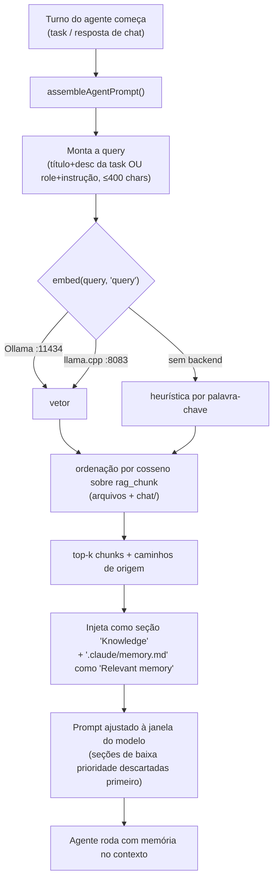
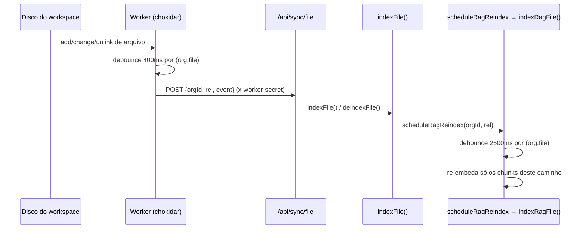

[← Índice](./README.md) · [🇬🇧 English](../en/MEMORY_RAG.md) · [✦ Constella](../../README.pt-BR.md)

# Memory RAG — a nebulosa de memória do workspace 🌌


Recuperação pura, restrita à organização, sobre o Markdown do workspace **e** as transcrições de conversa. É a gravidade que puxa o contexto relevante para a memória de trabalho de uma constelação pouco antes de ela agir — semântica quando uma estrela de embedding local está acesa, heurística por palavra-chave quando não está.

---

## Quando usar

- Você quer entender como um agente "lembra" de conversas e documentos anteriores antes de um turno.
- Você está depurando por que a recuperação retornou nada, ou retornou texto desatualizado.
- Você está integrando os tokens de agente `[[REMEMBER …]]` / `[[CONSULT: …]]` / `[[KB: …]]`.
- Você precisa saber quais diretórios são indexados, os tempos de debounce e como o file-watcher mantém a memória atualizada.

Para a camada **curada e ciente de estado** (entradas tipadas, obsolescência, o grafo de conhecimento) veja [KB_RAG](./KB_RAG.md) e [KB_AGENT](./KB_AGENT.md). Para onde a recuperação é injetada num prompt, veja [AI_ARCHITECTURE](./AI_ARCHITECTURE.md).

---

## Como funciona 🪐

O Memory RAG vive em `src/server/rag.ts`. É **recuperação pura**: ele embeda e armazena chunks, depois os ordena por similaridade de cosseno para uma consulta. Não há modelo de estado, nem flag de obsolescência, nem escrita de resposta — isso é trabalho da KB curada (`src/server/kb.ts`).

Dois corpora são indexados numa única tabela, `rag_chunk`:

1. **Markdown do workspace** — arquivos sob os diretórios indexados (`.claude`, `DOCS`, `PO`, `Reports`, `specs`, `issues`, além de `mock/`), chaveados pelo seu `path` relativo real.
2. **Transcrições de conversa** — conversas da team-room, DM e Telegram, armazenadas sob caminhos sintéticos `chat/<channel>`.

Cada linha guarda o texto do `chunk` e, quando um backend de embedding está acessível, seu `vector` (um array de floats codificado em JSON). Se nenhum backend estiver no ar, o chunk é armazenado **sem** vetor e a recuperação cai numa heurística por palavra-chave — nada é perdido, e um reindex preguiçoso melhora os chunks assim que os embeddings ficam disponíveis.

### Backends de embedding

`embed(text, kind)` tenta dois backends em ordem, depois desiste:

| Ordem | Backend | URL (env) | Notas |
|-------|---------|-----------|-------|
| 1 | Ollama | `OLLAMA_URL` (padrão `http://127.0.0.1:11434`) `/api/embeddings`, modelo `CONSTELLA_EMBED_MODEL` (padrão `nomic-embed-text`) | Usado só se estiver rodando com o modelo de embedding baixado |
| 2 | Servidor llama.cpp de embedding dedicado | `CONSTELLA_EMBED_URL` (padrão `http://127.0.0.1:8083`) `/v1/embeddings`, modelo `nomic-embed` | Iniciado automaticamente no boot via `ensureEmbedServer()` em `src/server/local-models.ts` |
| — | nenhum | — | Retorna `null` → o chamador usa o fallback por palavra-chave |

Ambas as chamadas têm timeout de 8 s (`AbortSignal.timeout(8000)`).

> **Prefixos assimétricos.** O `nomic-embed-text` foi treinado com prefixos de instrução de tarefa e os **exige**: documentos são embedados como `search_document: …`, consultas como `search_query: …`. O `embed()` aplica o prefixo correto via o argumento `kind` (`"document"` | `"query"`). Misturá-los degrada a recuperação silenciosamente, então tanto o lado de indexação quanto o de consulta devem usar o mesmo modelo com o prefixo correspondente. O prefixo é aplicado incondicionalmente no caminho llama.cpp (sempre nomic) e só quando `CONSTELLA_EMBED_MODEL` casa com `/nomic/i` no caminho Ollama.

### Chunking

`chunksOf(md)` divide um documento em cabeçalhos Markdown H1–H3 (`\n(?=#{1,3}\s)`), apara, descarta vazios, depois:

- mantém cada parte como um chunk se tiver `≤ 1200` chars,
- caso contrário, fatia em janelas de 1200 chars,
- e limita o documento em **40 chunks** (`.slice(0, 40)`).

### Ordenação

`cosine(a, b)` é um cosseno por produto escalar simples sobre o menor dos dois vetores. `retrieve()` ordena todos os chunks vetorizados por cosseno em relação ao vetor da consulta, pega os top `k` (padrão 5), e se não existirem vetores cai na pontuação por palavra-chave (contagem de termos da consulta com mais de 3 chars que aparecem no chunk). Se nem a pontuação por palavra-chave achar nada, retorna os primeiros até 3 chunks para que o agente sempre receba *algo*.

---

## Fluxo principal — recuperação de memória antes de um turno 🛰️

Antes de um agente agir, `assembleAgentPrompt()` (em `src/server/context-manager.ts`) puxa memória em paralelo com o contexto do canal. Ele chama o `kbQuery()` **ciente de estado** (que compartilha a mesma tabela `rag_chunk` e os mesmos helpers `embed`/`cosine` do `retrieve()` puro), e lê o arquivo estático `.claude/memory.md`. O conhecimento recuperado é injetado como uma seção de prompt rotulada e aparável.



O `retrieve()` puro retorna `{ context, sources, mode }` onde `mode` é `"semantic" | "heuristic" | "none"`; a variante `kbQuery()` adiciona ciência de estado e `refs`. Ambos cortam `context` em 4000 chars.

---

## Memory RAG vs KB curada 🕳️

Memory RAG e a KB curada compartilham armazenamento e embeddings mas respondem perguntas diferentes. Memória é *o que foi escrito e dito*; a KB é *o que é verdade agora*.

| Aspecto | Memory RAG (`rag.ts`) | KB curada (`kb.ts`) |
|---------|-----------------------|---------------------|
| Função | `retrieve()` | `kbQuery()` / `kbAnswer()` |
| Corpus | `.md` do workspace + transcrições `chat/<channel>` | Mesma tabela `rag_chunk`, mas ligada a linhas tipadas de `kb_entry` |
| Ciência de estado | Nenhuma — retorna o que ordenar mais alto | Descarta chunks `obsolete=1` (entradas superseded / obsolete, goals cancelled / archived) |
| Referências | Apenas `sources` (caminhos de arquivo) | `sources` + `refs` internas (jump-backs de spec / issue / goal / file) |
| Sinal de "insuficiente" | Não | Booleano `sufficient` |
| Logging | Não | Loga cada consulta em `kb_query_log` |
| Dono | O watcher + o agente de Conhecimento (Vannevar) | O agente de Conhecimento (curadoria, dedupe, obsolescência) |

Ambos caem na mesma heurística por palavra-chave e compartilham `embed`, `chunksOf`, `cosine`, `indexRag`, `indexChat`. Veja [KB_RAG](./KB_RAG.md) para a camada curada.

---

## Tokens de memória do agente — REMEMBER / CONSULT / KB

Agentes dirigem a memória diretamente das suas respostas via tokens em colchetes. O runner e o caminho de resposta de chat fazem o parse desses tokens, agem sobre eles e os removem do texto visível (`src/server/kb.ts`).

| Token | Direção | O que faz |
|-------|---------|-----------|
| `[[REMEMBER type=<t>: <fato>]]` | produtor | `extractRemembered()` transforma cada um num item de KB tipado para ingerir. O tipo deve estar em `KB_LEARN_TYPES` (decision, architecture, business-rule, integration, dependency, bug, fix, test, review, vuln, ui-pattern, stack, env-config, command, note), senão cai para `note`. Fatos com menos de 8 chars são ignorados. |
| `[[CONSULT: <pergunta>]]` | consumidor | `answerConsults()` roda cada pergunta por `kbQuery()` (k=6) e posta a resposta de volta na thread para que ela esteja no contexto no próximo turno do agente. Perguntas com menos de 4 chars são puladas. |
| `[[KB: reindex \| index-chat \| health]]` | manutenção | `runKbTools()`: `reindex` → `indexRag()` (reconstrói chunks de arquivo + chat), `index-chat` → `indexChat()` (re-embeda só as conversas), `health` → status do servidor de embedding (`up`/`down` + modelo). |

`[[REMEMBER]]` (produtor) e `[[CONSULT]]` (consumidor) são o complemento escrita/leitura: um agente armazena um aprendizado, e um agente posterior o recupera. O runner também auto-extrai `[[REMEMBER]]` dos resultados de task com `sourceKind: "task"`, e as respostas de chat extraem com `sourceKind: "chat"` (`src/server/runner.ts`, `src/server/collab.ts`).

---

## Diretórios e caminhos indexados 🌠

`inRagDirs(p)` decide o que é elegível à memória:

| Padrão de caminho | Indexado? | Notas |
|-------------------|-----------|-------|
| `.claude/kb/…` | Não | Prompt/taxonomia do próprio agente de KB — nunca exposto |
| `.claude/skills/…` | Não | A biblioteca de skills — nunca exposta |
| `.claude/*.md` e `.claude/<sub>/…` | Sim | Outro Markdown de `.claude` (ex.: `BRIEF.md`, `memory.md`) |
| `DOCS/`, `PO/`, `Reports/`, `specs/`, `issues/` (`*.md`) | Sim | O conjunto `RAG_DIRS` |
| `mock/…` | Sim | Só arquivos de texto: `.md .html .css .js(x) .ts(x) .txt .json` |
| `chat/<channel>` | Sim (sintético) | Escrito por `indexChat()`, não é um arquivo real |
| qualquer outra coisa | Não | — |

As transcrições de conversa são agrupadas por `channel` (`room`, `dm:<handle>`, `telegram`), cada linha renderizada como `Operator:` ou `@<handle>:`, e só a **cauda de 400 linhas** por canal é embedada para manter o índice limitado.

---

## Reindex e debounce — mantendo a memória atual

A memória se mantém fresca automaticamente; o operador raramente precisa da ação manual **Reindex**. Três caminhos com debounce alimentam `rag_chunk`:

| Gatilho | Função | Debounce | Escopo |
|---------|--------|----------|--------|
| Um arquivo do workspace muda (edição de agente ou externa) | `scheduleRagReindex(orgId, rel)` → `indexRagFile()` | **2500 ms** por `(org, file)` | Re-embeda só os chunks daquele caminho |
| Uma mensagem é postada em qualquer canal | `scheduleChatReindex(orgId)` → `indexChat()` | **6000 ms** por org | Re-embeda só os chunks `chat/%` |
| O file-watcher no worker | POST `/api/sync/file` | **400 ms** por `(org, file)` | Chama `indexFile()`, que por sua vez chama `scheduleRagReindex` |
| Manual / agente | `indexRag()` (completo), `[[KB: reindex]]`, `[[KB: index-chat]]` | nenhum | Reconstrução completa ou só de chat |

Note o debounce em dois estágios nas edições de arquivo: o watcher chokidar do worker coalesce eventos de filesystem ao longo de **400 ms** e faz POST para `/api/sync/file`; o `indexFile()` do lado do servidor então agenda um re-embed de RAG adicional de **2500 ms**. Assim, uma rajada de edições num arquivo resulta num único re-embed, não numa tempestade.



Quando um arquivo é deletado, `deindexFile()` chama `deindexRagFile()` para remover os chunks daquele caminho — **o disco é a fonte da verdade**, então arquivos removidos não deixam resíduo de memória. Veja [SYNCED_BLOCKS](./SYNCED_BLOCKS.md) e [ARCHITECTURE](./ARCHITECTURE.md) para o motor de sincronização mais amplo.

---

## Tabelas

### `rag_chunk` (o armazém de memória)

| Coluna | Significado |
|--------|-------------|
| `id` | UUID |
| `workspace_id` | escopo de org/workspace — **toda query é filtrada pelo workspace ativo** |
| `path` | caminho relativo real do arquivo **ou** `chat/<channel>` |
| `chunk` | o texto do chunk (≤ ~1200 chars) |
| `vector` | array de floats em JSON, ou `NULL` se nenhum backend de embedding estava no ar |
| `kb_entry_id` | (camada KB) link para o `kb_entry` tipado que produziu o chunk, se houver |
| `obsolete` | (camada KB) `1` esconde o chunk do `kbQuery()` ciente de estado |

`kb_entry_id` e `obsolete` são adicionados por `ensureKbTables()` para a camada curada; o `retrieve()` puro os ignora. Outras tabelas (`kb_entry`, `kb_query_log`, …) pertencem ao [KB_RAG](./KB_RAG.md).

---

## Passo a passo — rastreando uma recuperação

1. Um turno de agente começa (uma task em `runner.ts`, ou uma resposta de chat em `collab.ts`).
2. `assembleAgentPrompt()` monta uma query (título + descrição da task, ou role + instrução) cortada em 400 chars.
3. Em paralelo: o contexto do canal é resumido, e `kbQuery(orgId, query, { k: 6 })` recupera memória.
4. `kbQuery` seleciona chunks ativos do workspace; num índice vazio, constrói um uma vez via `indexRag()`, depois re-consulta.
5. `embed(query, "query")` produz um vetor de consulta (Ollama → llama.cpp → null).
6. Com um vetor e chunks vetorizados presentes, as linhas são ordenadas por cosseno; senão roda a pontuação por palavra-chave.
7. Os top-`k` chunks viram a seção `Knowledge`; `.claude/memory.md` vira `Relevant memory`.
8. O prompt é ajustado à janela de contexto do modelo; seções de baixa prioridade caem primeiro se exceder o orçamento.
9. O agente roda. Se emitir `[[REMEMBER …]]`, esse aprendizado é ingerido e fica recuperável na próxima vez.

---

## Exemplos

Agente capturando um aprendizado (produtor):

```
[[REMEMBER type=decision: Auth uses better-auth sessions (30d); do not roll a custom JWT.]]
```

Agente consultando a memória antes de agir (consumidor):

```
[[CONSULT: how is the file-upload size limit configured?]]
```

Agente atualizando o índice durante a execução (manutenção):

```
[[KB: index-chat]]
[[KB: health]]
```

Uma chamada nua de `retrieve()` (semântica quando o servidor de embedding está no ar):

```ts
const { context, sources, mode } = await retrieve(orgId, "how do agents commit to git?", 5);
// mode === "semantic" | "heuristic" | "none"
```

---

## Estados possíveis

`retrieve()` e `kbQuery()` reportam um `mode` de recuperação:

| `mode` | Significado |
|--------|-------------|
| `semantic` | Um backend de embedding estava acessível e existiam chunks vetorizados → ordenação por cosseno |
| `heuristic` | Sem vetores (backend fora no momento da indexação) → ordenação por sobreposição de termos |
| `none` | Sem workspace, ou sem chunk algum mesmo após uma tentativa de construção |

Saúde do servidor de embedding (via `[[KB: health]]` → `llamaServerStatus()`): `up` (com nome do modelo) ou `down`.

Um detalhe auto-curativo: quando o servidor de embedding sobe **depois** de um índice ter sido construído sem vetores, a primeira query semântica reconstrói o índice **uma vez por processo** (guard `autoReindexed`) para que os chunks ganhem vetores — sem reindex manual.

---

## Integrações relacionadas

- **[KB_RAG](./KB_RAG.md)** — a camada curada e ciente de estado sobre o mesmo armazém `rag_chunk`.
- **[KB_AGENT](./KB_AGENT.md)** — Vannevar, dono da curadoria, dedupe e obsolescência.
- **[AI_ARCHITECTURE](./AI_ARCHITECTURE.md)** — como a memória recuperada é ajustada à janela do prompt.
- **[MODELS](./MODELS.md)** — servidores locais de embedding & chat (llama.cpp `:8083` / `:8082`, Ollama).
- **[SYNCED_BLOCKS](./SYNCED_BLOCKS.md)** / **[ARCHITECTURE](./ARCHITECTURE.md)** — o file-watcher e o motor de sincronização.
- **[TEAM_ROOM](./TEAM_ROOM.md)** / **[DM](./DM.md)** / **[TELEGRAM](./TELEGRAM.md)** — as conversas que alimentam os chunks `chat/<channel>`.

---

## Segurança 🔐

- **Isolamento estrito por org.** Toda leitura e toda query filtram por `workspace_id`; só os chunks da org ativa são embedados ou retornados. Não há caminho de recuperação cross-tenant.
- **Internos nunca expostos.** `inRagDirs()` exclui `.claude/kb/` (prompt/taxonomia do agente de KB) e `.claude/skills/` para que uma query não vaze os internos do próprio sistema.
- **Endpoint de sync falha fechado.** `/api/sync/file` exige `x-worker-secret` (`CONSTELLA_WORKER_SECRET`) e rejeita com 401 se o segredo não estiver definido — ele aceita um `orgId` arbitrário, então deixá-lo aberto permitiria adulteração de índice cross-tenant.
- **Segredos são removidos à montante.** O texto de conversa é higienizado antes de ser persistido/ingerido (veja [SECURITY](./SECURITY.md)); transcrições embedadas em `chat/<channel>` herdam essa higienização.

---

## Solução de problemas

| Sintoma | Causa provável | Correção |
|---------|----------------|----------|
| `mode` é sempre `heuristic` | Nenhum backend de embedding acessível na indexação/consulta | Cheque `[[KB: health]]`; garanta que o servidor llama.cpp de embedding está no ar em `:8083` (ou Ollama em `:11434` com `nomic-embed-text` baixado) — veja [MODELS](./MODELS.md) |
| Recuperação retorna nada | Índice vazio ou sem workspace | A primeira query auto-constrói via `indexRag()`; se ainda vazio, rode um reindex completo (`[[KB: reindex]]` ou a ação Reindex) |
| Texto desatualizado continua voltando | Obsolescência da KB curada, não memória | O `retrieve()` puro não tem modelo de estado; use `kbQuery()`/curadoria — veja [KB_RAG](./KB_RAG.md) |
| Edições não refletidas | Watcher não rodando, ou janela de debounce | O worker deve estar rodando (ele é dono do chokidar); mudanças re-embedam após o debounce de RAG de **2500 ms** |
| Arquivo deletado ainda recuperado | O deindex não disparou | A deleção passa por `deindexFile → deindexRagFile`; confirme que o worker viu o evento `unlink` |
| Conversa não lembrada | Reindex de chat pendente ou canal vazio | `scheduleChatReindex` faz debounce de **6000 ms**; force com `[[KB: index-chat]]` |

---

## Links relacionados

- [KB_RAG](./KB_RAG.md)
- [KB_AGENT](./KB_AGENT.md)
- [AI_ARCHITECTURE](./AI_ARCHITECTURE.md)
- [ARCHITECTURE](./ARCHITECTURE.md)
- [SYNCED_BLOCKS](./SYNCED_BLOCKS.md)
- [MODELS](./MODELS.md)
- [AGENTS](./AGENTS.md)
- [TEAM_ROOM](./TEAM_ROOM.md)
- [TROUBLESHOOTING](./TROUBLESHOOTING.md)
