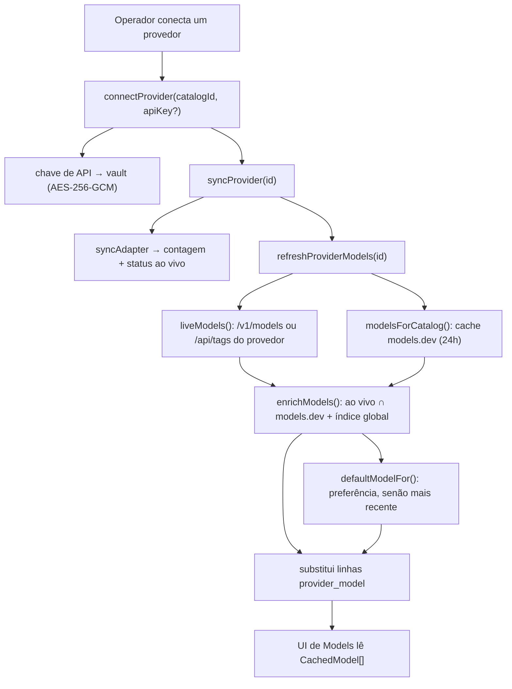
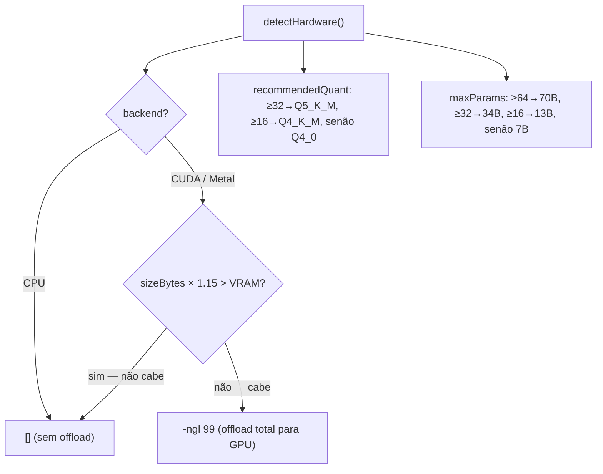

[← Índice](./README.md) · [🇬🇧 English](../en/MODELS.md) · [✦ Constella](../../README.pt-BR.md)

# Modelos ✦ A Constelação dos Motores 🌌


> Toda estrela em atividade numa empresa Constella é movida por um modelo. Esta página documenta as três famílias de motores — provedores **cloud**, **cérebros CLI** e runtimes **locais** GGUF — como seus catálogos são descobertos ao vivo (nunca chumbados no código), como a Constella ajusta um modelo local ao seu hardware, e os dois servidores llama.cpp dedicados (chat na `:8082`, embeddings na `:8083`) que mantêm a gravidade do workspace (RAG) e a inferência on-prem em funcionamento.

A regra de ouro de todo o módulo: **listas de modelos nunca são a fonte da verdade no código.** Elas vêm ao vivo de [models.dev](https://models.dev/api.json) ∩ o próprio endpoint `/v1/models` de cada provedor. As listas chumbadas são rebaixadas a *fallback offline apenas*.

---

## 1. Quando usar 🪐

| Você quer… | Ponto de entrada |
|---|---|
| Ver/conectar provedores cloud (Anthropic, OpenAI, Google…) | `connectProvider()`, `syncProvider()` — `src/server/providers.ts` |
| Atualizar a lista ao vivo e enriquecida de um provedor | `refreshProviderModels()` → `liveModels()` + `enrichModels()` |
| Escolher um modelo padrão recomendado para um provedor | `defaultModelFor()` — `src/server/model-catalog.ts` |
| Sondar CPU/RAM/GPU/VRAM da máquina | `detectHardware()` — `src/server/local-models.ts` |
| Baixar um GGUF local para o llama.cpp | `downloadGguf()` a partir do `GGUF_CATALOG` |
| Puxar / servir um modelo via Ollama | `pullModel()`, `ollamaServe()`, `loadModel()` |
| Iniciar o servidor de chat local (`:8082`) | `startLlamaServer()` / `ensureLlamaServer()` |
| Iniciar o servidor de embeddings do RAG (`:8083`) | `startEmbeddings()` / `ensureEmbedServer()` |
| Saber em qual binário CLI um agente roda | `pickBinary()` — `src/server/adapters/cli.ts` |

A superfície visível é a página **Models** (`/models`); a maioria das ações são server actions que revalidam esse caminho.

---

## 2. Como funciona 🛰️

A Constella trata "um modelo" como algo que você seleciona para um **agente** (uma estrela em atividade). A *origem* do modelo é de um de três tipos, registrado na coluna `provider.kind`:

| `kind` | Significado | Auth | Exemplos de catalog ids |
|---|---|---|---|
| `cloud` | Uma API HTTP hospedada | `api_key` / `oauth` | `anthropic`, `openai`, `google_gemini`, `xai_grok`, `openrouter` |
| `cli` | Uma CLI de agente instalada localmente que a Constella conduz como subprocesso | `cli` / `oauth` | `claude_code`, `codex_cli`, `openclaw`, `hermes_cli`, `aider`, `opencode`, `copilot_cli`, `cursor_cli`, `cline_cli`, `kilo_code` |
| `local` | Um modelo servido no loopback (GGUF/Ollama) | `local` | `llamacpp`, `ollama` |

O menu completo de provedores conectáveis é o **`PROVIDER_CATALOG`** tipado (`src/data/providers-catalog.ts`) — mais de 60 entradas abrangendo APIs cloud, roteadores, endpoints compatíveis com OpenAI, plataformas cloud, runtimes locais e CLIs. Cada entrada carrega um `defaultAdapter`, `baseUrl`, flags de capacidade e um `status` (`available` / `experimental` / `requires_setup` / `planned`).

### As três fontes de metadados de modelos cloud

1. **models.dev** — a espinha dorsal. `src/server/model-catalog.ts` busca `https://models.dev/api.json`, normaliza o mapa `models` de cada provedor em `CatalogModel[]` (id, nome, contexto, limite de saída, custo de entrada/saída por 1M de tokens, capacidades, data de lançamento), e faz cache em memória + em disco em `<constellaHome>/cache/models-dev.json` com **TTL de ~24h**.
2. **O próprio `/v1/models` do provedor** — `liveModels()` consulta o endpoint ao vivo (ou `/api/tags` para o Ollama) para os ids *realmente disponíveis*. Roteadores como o OpenRouter retornam linhas ricas (preço + contexto) mantidas literalmente; provedores de primeira parte geralmente retornam apenas o id.
3. **`FALLBACK_MODELS`** (`src/data/models-dev.ts`) — um pequeno snapshot atual usado **apenas** quando tanto a rede quanto o cache em disco estão frios.

`enrichModels()` faz a interseção de (2) com (1): os ids ao vivo são preenchidos a partir do conjunto models.dev do provedor, depois de um índice global entre provedores (para que ids de roteador como `anthropic/claude-…` também resolvam). O resultado é gravado inteiramente na tabela `provider_model`.

---

## 3. Fluxo principal 🌠



No boot (`src/server/boot.ts`), a Constella aquece o catálogo e sobe os motores locais:

- `warmModelsDev()` — pré-carrega o cache do models.dev.
- `ensureEmbedServer()` — inicia o servidor de embeddings do RAG na `:8083` se houver um modelo de embedding local instalado.
- `ensureLlamaServer()` — inicia o servidor de chat local na `:8082` se houver um GGUF de chat instalado.

---

## 4. Conceitos-chave 🕳️

### `CatalogModel` — a unidade normalizada

Tanto models.dev quanto `/v1/models` são achatados numa única forma (`src/data/models-dev.ts`):

```ts
type CatalogModel = {
  id: string;          // "claude-opus-4-8", "gpt-5.2", "grok-4"
  name: string;        // "Claude Opus 4.8"
  context: number;     // tokens máx. de contexto (0 = desconhecido)
  outputLimit: number; // tokens máx. de saída
  inputCost: number;   // USD / 1M tokens de entrada (0 = desconhecido / grátis)
  outputCost: number;  // USD / 1M tokens de saída
  caps: { reasoning: boolean; tools: boolean; vision: boolean };
  released: string;    // data ISO — dirige a escolha do padrão "mais recente"
};
```

### Mapeamento catalog → chave models.dev

`CATALOG_TO_MODELSDEV` mapeia o `catalogId` da Constella para a chave canônica de provedor do models.dev (ex.: `google_gemini → google`, `xai_grok → xai`, `dashscope → alibaba`). Qualquer coisa não mapeada cai num palpite normalizado via `modelsDevKeyForCatalog()`. Notavelmente, os cérebros CLI `claude_code → anthropic` e `gemini_cli → google` mapeiam para uma família de primeira parte para que versão/contexto ainda possam ser enriquecidos.

### Padrão recomendado

`defaultModelFor()` consulta `DEFAULT_PREFERENCE` (uma ordem de preferência por substring por chave, ex.: `anthropic: ["sonnet-4", "sonnet", "opus-4", "opus"]`). A primeira correspondência disponível vence, empates resolvidos pelo lançamento mais recente; sem correspondência de preferência, escolhe o modelo datado mais recente.

### Custo e uso são reais

O custo **nunca é fabricado**. Os metadados de custo cloud vêm do models.dev/`/v1/models` (`inputCost`/`outputCost` em USD por **1M** de tokens). Para as CLIs Claude/Codex, o custo real por execução é lido diretamente da saída JSON da CLI (`total_cost_usd`, `usage`) em `src/server/adapters/cli.ts`. CLIs que não emitem token/custo no modo headless registram `usd: 0` honestamente.

---

## 5. Provedores cloud ✦

O `PROVIDER_CATALOG` é a única fonte tipada da verdade. Uma fatia representativa:

| Catalog id | Nome de exibição | Categoria | Adapter | URL base |
|---|---|---|---|---|
| `anthropic` | Anthropic | `cloud_api` | `http_anthropic` | `https://api.anthropic.com` |
| `openai` | OpenAI | `cloud_api` | `http_openai` | `https://api.openai.com/v1` |
| `google_gemini` | Google AI / Gemini | `cloud_api` | `http_google` | `https://generativelanguage.googleapis.com` |
| `xai_grok` | xAI / Grok | `cloud_api` | `http_xai` | `https://api.x.ai/v1` |
| `deepseek` | DeepSeek | `cloud_api` | `http_deepseek` | `https://api.deepseek.com` |
| `groq` | Groq | `cloud_api` | `http_groq` | `https://api.groq.com/openai/v1` |
| `mistral`¹ | Mistral | `cloud_api` | — | — |
| `openrouter` | OpenRouter (roteador) | `router` | `http_openrouter` | `https://openrouter.ai/api/v1` |
| `openai_compatible` | Endpoint compatível com OpenAI | `openai_compatible` | `http_openai_compat` | (sua URL) |
| `azure_openai` | Azure OpenAI | `cloud_platform` | `http_azure_openai` | (configuração) |
| `aws_bedrock` | AWS Bedrock | `cloud_platform` | `sdk_bedrock` | (SigV4) |
| `vertex_ai` | Google Vertex AI | `cloud_platform` | `sdk_vertex` | (GCP) |

> ¹ `mistral` aparece nos mapas `CATALOG_TO_MODELSDEV` / `DEFAULT_PREFERENCE` mas não é uma linha autônoma no `PROVIDER_CATALOG` atual; chegue ao Mistral via OpenRouter ou um endpoint compatível com OpenAI.

**Autenticação.** As chaves de API vão para o **vault** (AES-256-GCM, tabela `vault`, ref como `openai_api_key`) — *nunca* para a linha `provider`. O `/v1/models` da Anthropic é consultado com `x-api-key` + `anthropic-version`; tudo o mais usa auth `Bearer` compatível com OpenAI.

**Roteadores e endpoints compatíveis com OpenAI** (OpenRouter, LiteLLM, servidor LM Studio, vLLM, superfície OpenAI do Ollama) expõem uma lista `/v1/models` ao vivo e são enriquecidos da mesma forma; o OpenRouter ainda retorna preço por token que a Constella converte para por-1M.

---

## 6. Cérebros CLI 🚀

Provedores CLI são **CLIs de agente instaladas localmente** que a Constella conduz como subprocessos dentro do workspace da org (`src/server/adapters/cli.ts`). Elas autenticam por meio do *próprio* login/chaves — a Constella nunca guarda suas credenciais.

| Adapter | Binário | Modelos (`CLI_MODELS`) | Reporta custo? |
|---|---|---|---|
| `cli_claude_code` | `claude` | `opus`, `sonnet`, `haiku` | ✅ `total_cost_usd` + uso |
| `cli_codex` | `codex` | `gpt-5-codex`, `o4-mini` | best-effort do JSONL |
| `cli_openclaw` | `openclaw` | `(default)`, `openai/gpt-5.4`, `anthropic/claude-sonnet-4` | ❌ (0) |
| `cli_hermes` | `hermes` | `(default)`, `anthropic/claude-sonnet-4.6`, `openai/gpt-5.5` | ❌ (0) |
| `cli_aider` | `aider` | `(default)` + prefixado por provedor (ao vivo via `aider --list-models`) | ❌ (0) |
| `cli_opencode` | `opencode` | `(default)` + prefixado por provedor (ao vivo via `opencode models`) | ❌ (0) |
| `cli_copilot` | `copilot` | `(default)`, `claude-sonnet-4.5`, `gpt-5` | ❌ (0) |
| `cli_cursor` | `cursor-agent` | `(default)`, `claude-4.5-sonnet`, `gpt-5` | ❌ (0) |
| `cli_cline` | `cline` | `(default)` | ❌ (0) |
| `cli_kilo` | `kilocode` | `(default)` | ❌ (0) |

- `pickBinary(adapter, model)` resolve qual executável roda; `strongestModelFor(adapter)` retorna o melhor tier (ex.: `opus` para o Claude) para etapas de revisão/segurança/validação.
- Apenas `cli_opencode` e `cli_aider` expõem um comando de listagem ao vivo real via `cliModels()`; os demais caem nas opções estáticas de `CLI_MODELS`.
- As execuções `claude` são **vanilla** (uma sobreposição `--settings` com `disableAllHooks:true`) para que os hooks/plugins pessoais do `~/.claude` do operador não vazem para a voz dos agentes. Pesquisa web adiciona `--allowedTools WebSearch WebFetch` (padrão LIGADO; `CONSTELLA_WEB_RESEARCH=0` desliga).
- Permissões por run-mode: `start` → `bypassPermissions` (total); `vps`/`auth`/`portable` → `acceptEdits` (enjaulado). Sobrescreva com `CONSTELLA_AGENT_FULL_ACCESS=1|0`. Timeout padrão por execução: **180s**.
- `detectCliAuth()` retorna `ready` / `needs_login` / `needs_key` / `unknown` por binário; `LOGIN_HINTS` mostra como autenticar cada um.

---

## 7. Modelos locais — catálogo GGUF + Ollama 🌌

A inferência local tem dois backends:

### llama.cpp + GGUF (`GGUF_CATALOG`)

`src/data/model-catalog.ts` **gera** o catálogo GGUF a partir de uma spec compacta de famílias (`GGUF_FAMILIES`) usando a convenção de nomes confiável da lmstudio-community:

```
https://huggingface.co/lmstudio-community/<Repo>-GGUF/resolve/main/<Repo>-<QUANT>.gguf
```

- As famílias abrangem **Qwen 2.5/3/3.5/3.6, Llama 3.x, Gemma 2/3/4, Mistral/Ministral/Devstral, Phi, distilados DeepSeek-R1, Yi, Granite, SmolLM2, Falcon3, EXAONE** e mais, marcados como `chat` / `code` / `reasoning` / `embed`.
- Os quants são limitados por tamanho para que cada arquivo permaneça em parte única: ≤9B → `Q3_K_L, Q4_K_M, Q6_K, Q8_0`; ≤34B → remove `Q8_0`; ≥35B → apenas `Q3_K_L, Q4_K_M`.
- `sizeBytes` é estimado por `params × QUANT_MULT[quant]` (bytes-por-peso: `Q3_K_L 0.55`, `Q4_K_M 0.67`, `Q6_K 0.90`, `Q8_0 1.13`) — suficiente para a checagem de encaixe na GPU.
- O modelo de embedding `nomic-embed-text-v1.5 (Q8_0)` é mantido em primeiro lugar e tratado de forma especial em todo lugar — ele alimenta o RAG semântico.

`downloadGguf(id)` checa o disco livre (recusa se o drive não couber ~1,1× o modelo), transmite o arquivo para `<constellaHome>/models/` com progresso ao vivo de bytes, verifica o tamanho (e o SHA-256 quando conhecido), e o registra uma vez **por máquina** na tabela `local_model` (dedup pelo caminho do arquivo, compartilhado entre workspaces). `removeGguf(id)` apaga o arquivo + as linhas.

### Ollama (`OLLAMA_CATALOG`)

Uma lista curta curada puxada via o daemon do Ollama: `nomic-embed-text`, `mxbai-embed-large` (embed), `llama3.2:3b`, `qwen2.5:7b`, `qwen2.5-coder:7b`, `gemma2:2b`, `phi3.5`. O servidor fica em `OLLAMA_URL` (padrão `http://127.0.0.1:11434`).

| Função | Ação |
|---|---|
| `ollamaInstalled()` / `ollamaServe("start"\|"stop")` | detectar / iniciar / parar o daemon |
| `ollamaInfo()` (`/api/tags`) | no ar? + modelos instalados |
| `pullModel(name)` (`/api/pull`) | baixar um modelo |
| `loadModel(name)` / `ollamaPs()` (`/api/ps`) | carregar na / listar na memória |
| `removeModel(name)` (`/api/delete`) | desinstalar |

---

## 8. Checagem de encaixe na GPU + recomendação de quant 🛰️

`detectHardware()` roda uma sondagem **real** (cacheada por processo; só a RAM livre é reatualizada na leitura):

| Campo | Fonte |
|---|---|
| `cpu`, `cores` | `os.cpus()` |
| `ram` | `os.totalmem()` / `os.freemem()` |
| `gpu`, `vram`, `backend`, `accel` | `nvidia-smi` → CUDA; macOS arm64 → Metal (memória unificada ≈ 70% como VRAM); senão CPU + AVX2/NEON |
| `diskFree` | `Get-PSDrive` (Windows) / `df -h` (POSIX) no drive home da Constella |
| `recommendedQuant` | `≥32 GB → Q5_K_M`, `≥16 GB → Q4_K_M`, senão `Q4_0` |
| `maxParams` | `≥64 GB → 70B`, `≥32 GB → 34B`, `≥16 GB → 13B`, senão `7B` |

A checagem de encaixe decide o offload para GPU na hora de servir. `gpuOffloadArgs(sizeBytes)`:

- Retorna `[]` (CPU) quando o backend não é CUDA/Metal — a flag `-ngl` não faria nada.
- Retorna `[]` quando um modelo dimensionado não couber: `sizeBytes × 1.15 > VRAM` → permanece na CPU para que um modelo grande demais ainda **carregue** em vez de falhar.
- Caso contrário retorna `["-ngl", "99"]` para fazer offload de todas as camadas para a GPU.



No Windows, builds CUDA do llama.cpp precisam das DLLs do runtime CUDA (`cudart64_*`, `cublas64_*`); `ensureCudaRuntime()` se autocura buscando o asset `cudart-…` correspondente para que `-ngl` realmente faça offload em vez de cair silenciosamente para a CPU. `downloadLlamaServer()` instala automaticamente o prebuilt certo (`CUDA` quando uma GPU NVIDIA é detectada, senão `CPU`) dos releases de `ggml-org/llama.cpp` em `<constellaHome>/bin/llama`.

---

## 9. Os dois servidores locais — chat `:8082` + embeddings `:8083` 🌠

A Constella roda **duas instâncias separadas do llama.cpp** para que os embeddings do RAG nunca disputem com a inferência de chat:

| Servidor | Porta | Env | Iniciado por | Propósito |
|---|---|---|---|---|
| Chat / reasoning | `8082` | `LLAMACPP_URL` (`http://127.0.0.1:8082`) | `startLlamaServer()` / `ensureLlamaServer()` | serviço compatível com OpenAI do primeiro GGUF de **chat** instalado para agentes `local_llamacpp` |
| Embeddings do RAG | `8083` | `CONSTELLA_EMBED_URL` (`http://127.0.0.1:8083`) | `startEmbeddings()` / `ensureEmbedServer()` | serve o GGUF de **embedding** (nomic) com `--embeddings --pooling mean` para RAG semântico |

Ambos vinculam **apenas ao loopback** (`127.0.0.1`). Os argumentos de inicialização:

- Chat: `llama-server -m <chat.gguf> --host 127.0.0.1 --port 8082 -c 4096 [-ngl 99]`
- Embed: `llama-server -m <embed.gguf> --embeddings --host 127.0.0.1 --port 8083 -c 2048 --pooling mean [-ngl 99]`

Modelos de embedding não servem chat — se seu único modelo local for um embedder, `startLlamaServer()` o roteia para a `:8083` e avisa para baixar um GGUF de chat. A saúde é reportada honestamente via `llamaServerStatus()` (`/v1/models`) e `embedServerUp()` (`/health`).

### Cadeia de fallback de embeddings do RAG

`src/server/rag.ts` faz embedding primeiro pelo servidor dedicado, depois pelo **Ollama** (`OLLAMA_URL`, modelo `CONSTELLA_EMBED_MODEL` padrão `nomic-embed-text`), depois por uma **heurística de palavras-chave** se nenhum estiver no ar — a recuperação degrada, nunca quebra. O `nomic-embed-text` exige prefixos assimétricos: documentos `search_document:`, consultas `search_query:`.

---

## 10. Tabelas 🪐

| Tabela | Colunas-chave | Papel |
|---|---|---|
| `provider` | `catalogId`, `adapter`, `kind` (`cloud`/`cli`/`local`), `auth`, `status` (`connected`/`needs_sync`/`error`), `modelCount`, `cliVersion`, `defaultModel`, `authState` | um provedor conectado por workspace |
| `vault` | `providerId`, `ref` (`<catalogId>_api_key`), `ciphertext`, `iv` | segredos criptografados (AES-256-GCM) |
| `provider_model` | `providerId`, `modelId`, `name`, `context`, `outputLimit`, `inputCost`, `outputCost`, `caps`, `released`, `isDefault` | catálogo enriquecido em cache que a UI lê; substituído por inteiro a cada refresh |
| `local_model` | `name`, `file`, `quant`, `params`, `sizeBytes`, `sha256`, `bind` (`127.0.0.1:8082`), `loaded` | registro de GGUFs instalados (por máquina, dedup por `file`) |

---

## 11. Passo a passo 🛰️

### Conectar um provedor cloud
1. Abra **Models**, escolha um provedor do catálogo (ex.: Anthropic).
2. Cole a chave de API → `connectProvider("anthropic", key)` a guarda no vault.
3. `syncProvider()` consulta o endpoint ao vivo, define `status`/`modelCount`, depois `refreshProviderModels()` popula `provider_model`.
4. Atribua um modelo a um agente (campo de modelo no `Agent.md` do agente).

### Rodar um modelo localmente com llama.cpp
1. **Models → llama.cpp → Install** (`downloadLlamaServer()` pega o prebuilt certo).
2. Baixe um GGUF de chat do catálogo (`downloadGguf(id)`), e o GGUF de embedding `nomic-embed-q8` para o RAG.
3. **Start server** (`startLlamaServer()`) — sobe na `:8082`, fazendo offload para a GPU quando o modelo couber.
4. `connectLlamaCpp()` registra `llamacpp` como provedor local; aponte os agentes para `local_llamacpp`.

### Usar o Ollama
1. Instale o Ollama, **Start** (`ollamaServe("start")`).
2. `pullModel("qwen2.5:7b")`, depois `loadModel(...)` para aquecê-lo.
3. Conecte via o provedor `ollama` (lista ao vivo `/api/tags`).

---

## 12. Estados possíveis ✦

| Superfície | Estados |
|---|---|
| `provider.status` | `connected`, `needs_sync`, `error` |
| `provider.authState` | `ready`, `needs_login`, `needs_key`, `unknown` |
| `provider.syncStatus` | `implemented`, `manual`, `not_implemented` |
| `status` do catálogo | `available`, `experimental`, `requires_setup`, `planned`, `unsupported` |
| Servidor llama.cpp | no ar / fora (`/v1/models`); CPU vs `-ngl 99` (GPU) |
| Servidor de embed | no ar / fora (`/health`); modelo instalado? |
| Download de GGUF | progresso ao vivo `{ received, total, done, error }` |

---

## 13. Integrações relacionadas 🌌

- **[AGENTS](./AGENTS.md)** — cada agente seleciona um provedor + modelo; o tier padrão vem de `defaultModelFor()`.
- **[KB_RAG](./KB_RAG.md)** / **[MEMORY_RAG](./MEMORY_RAG.md)** — consomem o servidor de embeddings na `:8083`.
- **[AI_ARCHITECTURE](./AI_ARCHITECTURE.md)** — onde os adapters CLI e a resolução de runtime se encaixam.
- **[CONFIGURATION](./CONFIGURATION.md)** — flags de agente por workspace (pesquisa web, locks de arquivo, guarda de comandos).

---

## 14. Segurança 🕳️

- **Segredos apenas no vault.** Chaves de API são criptografadas com AES-256-GCM (`CONSTELLA_VAULT_KEY`) na tabela `vault` — nunca nas linhas `provider`, nunca em logs.
- **Servidores locais vinculados ao loopback** (`127.0.0.1`) — sem exposição de `:8082`/`:8083` na LAN.
- **Ids de modelo são validados** antes de chegarem ao argv (`safeModel` / `safeModelSlash`) porque o frontmatter do `Agent.md` é gravável pelo agente — um valor sem restrição (`sonnet"; rm -rf ~`) poderia ser reinterpretado pelo shell. Ids inválidos são descartados para que a CLI use seu padrão.
- **Integridade do GGUF** — checagem de tamanho + SHA-256 (quando conhecido); um download truncado é apagado, nunca instalado.
- **Execuções vanilla do agente** — `disableAllHooks` mantém hooks/plugins do operador fora dos subprocessos de agente.
- **Credenciais da CLI ficam com a CLI** — a Constella conduz `aider`/`opencode`/`cursor`/etc. mas nunca guarda suas chaves.

---

## 15. Solução de problemas 🚀

| Sintoma | Causa provável / correção |
|---|---|
| Lista de modelos vazia após conectar | models.dev inacessível **e** cache em disco frio → apenas `FALLBACK_MODELS`; tente online, ou verifique o `/v1/models` do provedor. |
| GPU não usada (CPU saturada) | DLLs do runtime CUDA faltando → rode **Install** de novo (`ensureCudaRuntime(force)` se autocura), ou o modelo não cabe na VRAM (`sizeBytes × 1.15 > VRAM`). |
| `llama-server not installed` | rode **Install** ou `brew install llama.cpp`; define o marcador `INSTALLED`. |
| Servidor de chat não inicia | apenas um modelo de embedding instalado → baixe um GGUF de chat/instruct; verifique que não está carregando o nomic na `:8082`. |
| RAG não semântico | servidor de embed fora → `ensureEmbedServer()`; precisa de um GGUF de embedding (baixe `nomic-embed-q8`) ou Ollama com `nomic-embed-text`. |
| `Ollama not running` | inicie-o (`ollamaServe("start")` / `ollama serve`); a porta `11434` pode estar ocupada. |
| `not enough free space` | o GGUF precisa de ~1,1× seu tamanho livre; libere disco ou escolha um quant menor. |
| Provedor CLI `needs_login` | rode a auth do binário (veja `LOGIN_HINTS`, ex.: `codex login`, `opencode auth login`). |
| `SHA-256 mismatch` | download corrompido — apague e tente de novo. |

---

## Links relacionados

- [AGENTS](./AGENTS.md) · [AI_ARCHITECTURE](./AI_ARCHITECTURE.md) · [ARCHITECTURE](./ARCHITECTURE.md)
- [KB_RAG](./KB_RAG.md) · [MEMORY_RAG](./MEMORY_RAG.md) · [CONFIGURATION](./CONFIGURATION.md)
- [INSTALLATION](./INSTALLATION.md) · [ONBOARDING](./ONBOARDING.md) · [WORKFLOW](./WORKFLOW.md)
- [✦ Voltar ao índice da documentação](./README.md)
