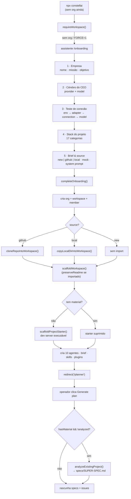

[← Índice](./README.md) · [🇬🇧 English](../en/ONBOARDING.md) · [✦ Constella](../../README.pt-BR.md)

# Onboarding 🌌 — Acendendo uma Nova Constelação

O assistente de primeira execução que transforma um runtime vazio em uma empresa de agentes viva: cria a organização + workspace, monta a camada de controle `.claude/`, acende a constelação de dez agentes, semeia skills e plugins, opcionalmente importa um projeto existente e entrega o operador ao Planner do CEO.

---

## Quando usar

- **Na primeiríssima execução.** Sem organização ainda, [`requireWorkspace()`](../pt/ARCHITECTURE.md) redireciona para `/onboarding` automaticamente (`src/lib/workspace.ts`).
- **Forçando o assistente de novo.** Lance com `npx constellai --onboarding` (ou o subcomando `onboard` / `onboarding`). O `bin/constella.mjs` define `CONSTELLA_FORCE_ONBOARDING=1`, que o `requireWorkspace()` respeita redirecionando para `/onboarding` mesmo quando já existe uma org.
- **Criando uma organização adicional** para um operador que já possui uma (o assistente mostra o botão Fechar apenas nesse caso).

> 🪐 O onboarding é uma *armadilha de disparo único*. No instante em que `completeOnboarding()` roda, ele chama `delete process.env.CONSTELLA_FORCE_ONBOARDING`, então o próximo `requireWorkspace()` não redireciona mais para cá.

---

## Como funciona

O onboarding é um assistente cliente de cinco passos (`src/app/(auth)/onboarding/page.tsx`) apoiado por uma única server action, `completeOnboarding()` em `src/server/onboarding.ts`. O assistente coleta a identidade da empresa, o cérebro do CEO (provider + model), um teste de conexão real, o stack do projeto e um brief / source — então a server action faz o trabalho pesado:

1. Cria as linhas `organization` + `member` (owner) + `workspace`. O run mode ativo (`getRunMode()`) é gravado em `organization.runMode`.
2. Opcionalmente registra um provider de fallback e guarda sua chave no vault.
3. **Importa** material existente (repo do GitHub ou diretório local) *antes* do scaffold, para que o `README.md` importado sobreviva.
4. **Monta** a camada de controle `.claude/` mais `DOCS/`, `PO/`, `Reports/`, `specs/`, `issues/` (`scaffoldWorkspace`).
5. Apenas para um projeto realmente novo, escreve um **starter executável** (`scaffoldProjectStarter`).
6. Persiste o descritor da fonte do projeto em `workspace.settings.source` (com `analyzed: false`).
7. Cria os **dez agentes**, aplica as escolhas de CEO do operador na Ada e guarda o brief em `.claude/BRIEF.md`.
8. Escreve quaisquer arquivos de mock anexados em `mock/`.
9. Semeia as **skills** nativas + da biblioteca, reconcilia os vínculos por stack/role e cria os quatro **plugins** nativos.
10. Marca a org como ativa na sessão e faz `redirect("/planner")`.

O **primeiro plano** (disparado depois, quando o operador clica em *Generate plan* no `/planner`) roda a análise arquivo-por-arquivo que produz `specs/SUPER-SPEC.md` — veja [Análise do primeiro plano](#análise-do-primeiro-plano--specssuper-specmd-) abaixo.

---

## Fluxo principal 🛰️



---

## Os cinco passos do assistente 🌠

As chaves dos passos são fixas em `STEP_KEYS = ["company", "ceoModel", "connection", "stack", "brief"]`.

| # | Passo | O que o operador fornece | Obrigatório |
|---|---|---|---|
| 0 | **Empresa** | nome `company`, `mission`, `objective` | Os três |
| 1 | **Cérebro do CEO** | Escolhe um `provider` + `model` detectado (ou registra um com uma API key) | Um provider + model |
| 2 | **Teste de conexão** | Uma verificação real de quatro estágios: `checkSetupEnv` → `checkAdapter` → `testConnection` → `probeModel` | Tem que passar |
| 3 | **Stack do projeto** | Escolhe entre 17 categorias de stack (cards ou busca) | Opcional (qualquer/todas podem ficar `None`) |
| 4 | **Brief & source** | `source` do projeto (new/github/local), brief opcional, pasta de mock opcional, `systemPrompt` da Ada | `systemPrompt` + uma source pronta |

Alguns comportamentos notáveis do código:

- **A detecção de provider** roda na montagem (`detectProviders()`); o primeiro provider detectado + seu primeiro model são pré-selecionados.
- **O teste de conexão é real** — sem timers falsos. Cada estágio é uma sonda de verdade; um estágio que falha mostra seu erro e bloqueia o *Continuar*. O `adapter:model` verificado é cacheado (`testedKey`), então Voltar → Continuar não re-executa as checagens a menos que o provider ou model mude.
- **O stack** não tem auto-seleção; o operador escolhe cada categoria manualmente. Opções incompatíveis ficam desabilitadas (`incompat()`), e `stackNote()` traz uma dica.
- **Finalizar** empacota tudo (`source`, `provider`, `model`, `systemPrompt`, `briefText`/`briefName`, `mockFiles`, `providerCatalogId`/`providerKey` opcionais) em `completeOnboarding()`.

---

## Source do projeto: `new | github | local` 🕳️

O passo 5 escolhe de onde vem o produto. O campo `source` de `OnboardingInput` é um destes:

```ts
source?:
  | { type: "new" }
  | { type: "github"; pat: string; repoFull: string; branch?: string; login?: string }
  | { type: "local"; path: string };
```

| Source | Função de import | Efeito | README |
|---|---|---|---|
| `new` | nenhuma | Projeto novo; um **starter executável** é montado | `README.md` gerado é escrito |
| `github` | `cloneRepoIntoWorkspace()` | Clona raso `owner/repo` no workspace, guarda o PAT no vault como `github_pat`, aponta o `origin` para a URL **limpa** (sem token) | README próprio do repo preservado |
| `local` | `copyLocalDirIntoWorkspace()` | Copia um snapshot de um diretório local absoluto para o workspace | README próprio do repo preservado |

Mais uma quarta source implícita: **mock** — quando `source.type === "new"` *e* `mockFiles` estão anexados, `sourceMeta.type` vira `"mock"`.

### Regras de import (de `onboarding-import.ts`)

- Diretórios pesados/de dependências são pulados (`HEAVY_DIRS`); `.git`, `.env*` (mas **não** `.env.example`/`.sample`), `.DS_Store`, binários e arquivos grandes demais (> 512 KB cada) são pulados.
- O import local é limitado a `DEFAULT_MAX_FILES = 4000` arquivos; `DEFAULT_MAX_BYTES = 512 * 1024`.
- Toda escrita passa por `writeWorkspaceFile()` → `safe()` (jaulada por caminho; travessia rejeitada).
- O clone do GitHub usa `git clone --depth 1 --single-branch` (`--branch` opcional) em um diretório temporário com uma URL transitória `x-access-token:<pat>@github.com`, depois copia para dentro e aponta o `origin` para `https://github.com/<owner>/<repo>.git`. O token é **redigido** de toda string retornada/logada.
- `validateLocalDir(path)` (server action via `scanLocalDir`) verifica que o caminho é absoluto e um diretório real com arquivos importáveis; retorna um `fileCount` + uma `sample` de 8 arquivos (sem vazar conteúdo).

### `preserveReadme` — por que o README importado vence

Após o import, `completeOnboarding()` computa `importedReadme = readWorkspaceFile(orgId, "README.md") != null` e passa `preserveReadme` para `scaffoldWorkspace()`. Em `workspaceFiles()` o `README.md` gerado só é adicionado quando `!c.preserveReadme`, então um repo importado mantém seu **próprio** README enquanto a camada de controle `.claude/` se assenta por cima.

---

## O starter executável (apenas projetos realmente novos) 🚀

Quando não há **material** (`hasMaterial = sourceMeta.type !== "new" || hasMock` é `false`), `scaffoldProjectStarter()` escreve um app real e configurado que sobe um dev server de imediato — para que o [Test Dev](../pt/TEST_DEV.md) possa pré-visualizá-lo já e os agentes construam o produto *por cima* dele. O starter é escrito **somente-se-ausente**, então edições dos agentes nunca são sobrescritas, e ele **não** faz parte de `workspaceFiles()` (então `bootstrapWorkspace`/`rerenderMissionDocs` nunca podem sobrescrever código de produto).

O template é escolhido por `pickStarter(stack)` em `src/data/project-starter.ts`. A precedência da seleção: meta-framework → estático/sem-framework explícito → baseline Vite pelo frontend → framework de backend → fallback de linguagem → o servidor Node `static` sempre-inicializável.

### Ids de starter (`StarterId`)

| `StarterId` | Escolhido quando (exemplos) | Sobe com |
|---|---|---|
| `next` | `meta = "Next.js"` | `next dev` |
| `vite-react` | `frontend = "React"` (ou fallback de linguagem TS/JS) | `vite` |
| `vite-vue` | `frontend = "Vue"` | `vite` |
| `vite-svelte` | `frontend = "Svelte"` ou `meta = "SvelteKit"` | `vite` |
| `node-express` | `backend = "Express"` | `node server.js` |
| `node-fastify` | `backend = "Fastify"` | `node server.js` |
| `node-koa` | `backend = "Koa"` | `node server.js` |
| `node-hono` | `backend = "Hono"` | `node server.js` |
| `node-nest` | `backend = "NestJS"` | `tsx watch src/main.ts` |
| `fastapi` | `backend = "FastAPI"` | `uvicorn` |
| `flask` | `backend = "Flask"` ou `language = "Python"` | `python main.py` |
| `django` | `backend = "Django"` | `manage.py` |
| `go-http` | `language = "Go"` | `net/http` |
| `go-gin` | `backend = "Gin"` | `gin` |
| `rust-axum` | `language = "Rust"` | `axum` |
| `rust-actix` | `backend = "Actix"` | `actix-web` |
| `static` | `HTML/CSS`, `Vanilla JS`, `Static (no framework)`, ou qualquer coisa desconhecida | `http` puro do Node |

> 🌠 O template `static` é o **fallback universal**: o Node está sempre presente, então todo projeto sobe *alguma coisa* independentemente do stack.

Cada starter traz uma landing page temática e autocontida (paleta determinística por empresa via `paletteFor()`), um `.gitignore`, um `.env.example` e um servidor ciente de `PORT` ligado a `127.0.0.1`. A página diz "Your AI team is building **\<objective\>** on top of this starter."

---

## Análise do primeiro plano → `specs/SUPER-SPEC.md` 🌌

Quando o projeto tem material (repo importado, dir local copiado, mock anexado **ou** um projeto detectado em disco), o **primeiro** plano não salta direto para as specs. Em `src/server/planner-core.ts`:

```ts
const hasMaterial = srcType !== "new" || mockFiles.length > 0 || !!detectProject(org.id);
if (!isNewWork && hasMaterial && !wsSettings.source?.analyzed) {
  await analyzeExistingProject({ orgId, wsId, ada, binary, model });
  // → marca settings.source.analyzed = true
}
```

`analyzeExistingProject()` (`src/server/analyze.ts`) roda uma **passagem de agente real** como Ada (`cwd = workspace`, lê os arquivos literalmente), transmitida ao canal `planner`, que escreve/sobrescreve `specs/SUPER-SPEC.md`. Roda **uma vez por projeto** — protegida por `settings.source.analyzed`. O agente é instruído a ler em ordem: docs → manifests/config → código arquivo-por-arquivo (pulando `node_modules`, `dist`, `build`, `.next`, `.git`, `vendor`), depois escrever estas seções:

`## Overview & purpose` · `## Architecture & layers` · `## Tech stack & dependencies` · `## Directory / module map` · `## Frontend` · `## Backend` · `## Data model & database` · `## Auth & security` · `## Integrations / external services` · `## Business rules & key flows` · `## What is mock/stubbed vs real` · `## Gaps to make it production-real`.

O enquadramento crucial: a Constella **estende** exatamente o sistema existente — deve apontar qual UI/UX, comportamento e identidade visual **preservar** e onde **adicionar** backend/dados/integrações reais; nunca constrói um segundo protótipo separado. O planner do CEO então lê `specs/SUPER-SPEC.md` por completo antes de rascunhar specs e issues, e o `runner` injeta o mesmo enquadramento de "estender o código existente" em cada tarefa (`src/server/runner.ts`). Se o agente esquecer de escrever o arquivo, `analyzeExistingProject()` escreve o texto do resumo final como o super spec, então o entregável sempre existe.

---

## O que `completeOnboarding()` cria 🪐

| Artefato | Onde | Notas |
|---|---|---|
| `organization` | DB | `runMode` de `getRunMode()` |
| `member` | DB | role `owner` |
| `workspace` | DB | `mission`, `objective`, `stack`; `settings.source` + `settings.github` opcional |
| Camada de controle `.claude/` | disco | org/workspace/permissions/memory/routing/index/CLAUDE.md/settings.json |
| Starter do projeto | disco | apenas quando sem material (`scaffoldProjectStarter`) |
| 10 agentes | DB | Ada `working`, demais `idle`; health `alive` |
| Overrides de CEO da Ada | DB + `.claude/agents/ada/Agent.md` | `adapter`, `model`, system prompt |
| `.claude/BRIEF.md` | disco | quando `briefText` é fornecido |
| arquivos de `mock/` | disco | até 200 arquivos + um `mock/README.md` gerado |
| `budget` | DB | `monthlyCapUsd: 400` |
| `plan` | DB | `stage: 4` |
| Skills nativas + da biblioteca | DB + disco | 6 skills procedurais + toda a biblioteca de skills; `reconcileStackRoleSkills()` vincula por stack/role |
| 4 plugins nativos | DB | GitHub, Telegram, Vault (habilitados), Web Search (desligado por padrão) |
| Org ativa na sessão | DB | depois `redirect("/planner")` |

### Os dez agentes

| Handle | Nome | Função | Reporta a | Model | Teto diário (USD) | Tier |
|---|---|---|---|---|---|---|
| `ada` | Ada | CEO | — | opus¹ | 15 | critical |
| `linus` | Linus | CTO | `ada` | sonnet | 40 | critical |
| `donald` | Donald | Product Owner | `ada` | haiku | 20 | heavy |
| `margaret` | Margaret | Backend | `linus` | sonnet | 50 | heavy |
| `grace` | Grace | Frontend | `linus` | sonnet | 45 | heavy |
| `edsger` | Edsger | QA | `linus` | haiku | 25 | heavy |
| `werner` | Werner | DevOps | `linus` | haiku | 20 | heavy |
| `barbara` | Barbara | Docs | `ada` | haiku | 15 | light |
| `whitfield` | Whitfield | CyberSec | `linus` | opus | 30 | critical |
| `vannevar` | Vannevar | Knowledge | `ada` | haiku | 10 | light |

¹ O arquivo de persona da Ada usa `sonnet` por padrão, mas a escolha de cérebro-do-CEO do operador (`provider`/`model`) o sobrescreve durante o onboarding. Os tetos diários são limites em USD; o workspace também recebe um orçamento `monthlyCapUsd: 400`.

---

## Passo a passo (operador) ✦

1. **Lançar.** `npx constellai` (ou `--onboarding` para forçar o assistente).
2. **Empresa.** Informe o nome da empresa, missão e objetivo. Os três são obrigatórios.
3. **Cérebro do CEO.** Escolha um provider + model detectado, ou expanda *Registrar* para adicionar um com um id de model e API key.
4. **Teste de conexão.** Acompanhe os quatro testes reais passarem. Corrija qualquer estágio falho antes de continuar.
5. **Stack.** Navegue pelos cards das 17 categorias (ou busque) e escolha o que se aplica; deixe o resto como `None`.
6. **Brief & source.** Escolha `new`, `github` (cole um PAT → liste repos → escolha um) ou `local` (digite um caminho absoluto → Validar). Opcionalmente cole um brief e/ou anexe uma pasta de mock. Edite o system prompt da Ada.
7. **Entregar.** Clique no botão de finalizar. O assistente chama `completeOnboarding()` e redireciona para `/planner`.
8. **Gerar plano.** No Planner, clique em *Generate plan* para disparar o ritual do CEO (e, para projetos importados/mock, a análise de super-spec de uma vez).

---

## Exemplos

**Forçar o assistente pela CLI:**

```bash
npx constellai --onboarding
# ou o subcomando explícito
npx constellai onboard
```

**Importar um repo do GitHub no onboarding** — o assistente envia:

```ts
source = { type: "github", pat: "ghp_…", repoFull: "acme/web-app", branch: "main", login: "acme" }
```

→ `cloneRepoIntoWorkspace()` clona raso `acme/web-app`, guarda o PAT no vault, define `origin` para a URL limpa, e `preserveReadme` mantém o README do repo.

**Importar um diretório local:**

```ts
source = { type: "local", path: "C:\\Users\\voce\\projeto" }
```

→ `validateLocalDir()` confirma, depois `copyLocalDirIntoWorkspace()` faz snapshot de até 4000 arquivos (pulando deps/segredos/binários).

---

## Estados possíveis 🕳️

| Estado | Significado | Onde |
|---|---|---|
| `CONSTELLA_FORCE_ONBOARDING=1` | Assistente forçado; limpo no primeiro `completeOnboarding()` | `bin/constella.mjs`, `workspace.ts`, `onboarding.ts` |
| `source.type = new` | Projeto novo; starter executável montado | `workspace.settings.source` |
| `source.type = github\|local\|mock` | Material importado; starter suprimido | `workspace.settings.source` |
| `source.analyzed = false` | O primeiro plano rodará a análise de super-spec | `workspace.settings.source` |
| `source.analyzed = true` | Análise feita; o planner lê `specs/SUPER-SPEC.md` | definido por `planner-core.ts` |
| import falhou | Logado no console; org criada mesmo assim; `sourceMeta` recomputado pelo que chegou | `onboarding.ts` |
| status do agente | Ada `working`, o resto `idle`; health `alive` | tabela `agent` |

---

## Integrações relacionadas 🛰️

- **[Project stacks](../pt/PROJECT_STACKS.md)** — o `stack` escolhido dirige o template do starter e o vínculo de skills.
- **[Skills](../pt/SKILLS.md)** — `seedLibrarySkills` + `reconcileStackRoleSkills` vinculam cada agente às skills que seu stack e função precisam.
- **[Plugins](../pt/PLUGINS.md)** — GitHub, Telegram, Vault e Web Search são criados como plugins nativos.
- **[GitHub](../pt/GITHUB.md)** — import de repo, guarda do PAT no vault e limpeza do `origin`.
- **[Models](../pt/MODELS.md)** — detecção de provider/model e o teste de conexão.
- **[Workflow](../pt/WORKFLOW.md)** / **[Goals, specs & issues](../pt/GOALS_SPECS_ISSUES.md)** — o que o primeiro plano produz após o onboarding.
- **[Test Dev](../pt/TEST_DEV.md)** — sobe o starter executável para uma pré-visualização imediata.

---

## Segurança 🔒

- **Jaula de caminho.** Todo arquivo importado é escrito através de `writeWorkspaceFile()` → `safe()` (checagens léxicas + de symlink; travessia rejeitada; caminhos começando com `..` pulados).
- **Higiene de token.** O PAT do GitHub é usado apenas transitoriamente na URL de clone, depois o `origin` é resetado para a `https://github.com/<owner>/<repo>.git` limpa; o token é redigido de todas as strings retornadas/logadas e guardado no vault como `github_pat` (AES-256-GCM via o [Vault](../pt/SECURITY.md)).
- **Pulando segredos no import.** `.env`, `.env.local`, `.env.development`, `.env.production` e `.DS_Store` nunca são copiados (`.env.example`/`.sample` são mantidos); binários e arquivos grandes demais são pulados.
- **Estado vazio honesto.** Nenhum goal/task/spec/issue falso é semeado — os boards começam realmente vazios; artefatos reais vêm do ritual do CEO e das execuções de agentes.
- **Permissões ligadas ao modo.** O `runMode` da org/workspace (de `getRunMode()`) determina o modo de permissão de agente que o runner aplica depois (`bypassPermissions` no `start`, `acceptEdits` caso contrário) — veja [Segurança](../pt/SECURITY.md).

---

## Solução de problemas

| Sintoma | Causa provável | Correção |
|---|---|---|
| O assistente reabre após finalizar | `CONSTELLA_FORCE_ONBOARDING` ainda definido no ambiente | É limpo no processo no primeiro `completeOnboarding()`; remova a flag `--onboarding` / desfaça a env var ao relançar |
| *Continuar* desabilitado no passo de teste | Uma checagem real falhou (`env`/`adapter`/`connection`/`model`) | Leia o erro inline; corrija o provider/CLI/API key, depois re-selecione o provider para re-verificar |
| GitHub *List repos* falha | PAT inválido/expirado ou sem escopo `repo` | Use um token válido; `githubReposForToken()` retorna a string de erro |
| Local *Validate* falha | Caminho não absoluto, não é um diretório, ou vazio | `scanLocalDir()` exige um caminho absoluto para um diretório com arquivos importáveis |
| Repo importado mostra o README gerado | `preserveReadme` não disparou (sem `README.md` de topo no import) | Adicione um `README.md` à source; caso contrário o gerado é esperado |
| Sem `specs/SUPER-SPEC.md` após Generate plan | Projeto sem material, ou `source.analyzed` já era `true` | A análise só roda uma vez, e só com material; cheque `workspace.settings.source` |
| Starter não criado | O projeto tinha material (`hasMaterial`) | Por design — os agentes estendem o material importado/mock em vez disso |

---

## Links relacionados

- [Instalação](./INSTALLATION.md)
- [Configuração](./CONFIGURATION.md)
- [Arquitetura](./ARCHITECTURE.md)
- [Arquitetura de IA](./AI_ARCHITECTURE.md)
- [Agentes](./AGENTS.md)
- [Workflow](./WORKFLOW.md)
- [Goals, specs & issues](./GOALS_SPECS_ISSUES.md)
- [Project stacks](./PROJECT_STACKS.md)
- [Skills](./SKILLS.md)
- [Plugins](./PLUGINS.md)
- [Models](./MODELS.md)
- [GitHub](./GITHUB.md)
- [Test Dev](./TEST_DEV.md)
- [Segurança](./SECURITY.md)
- [Solução de problemas](./TROUBLESHOOTING.md)
- [FAQ](./FAQ.md)
