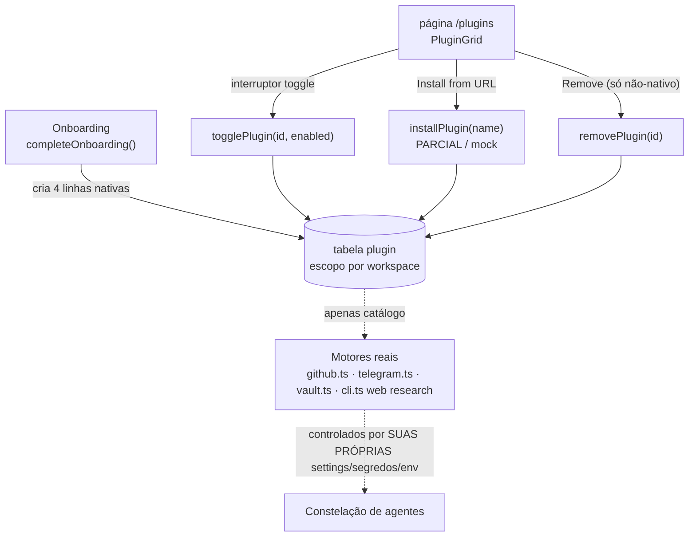
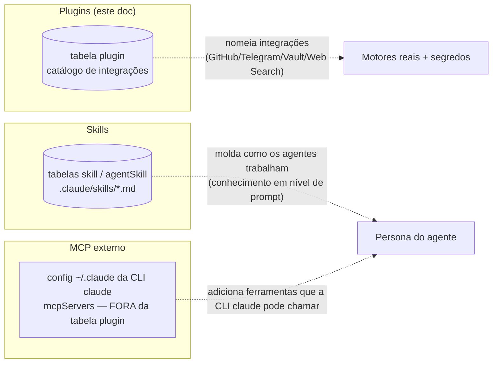

[← Índice](./README.md) · [🇬🇧 English](../en/PLUGINS.md) · [✦ Constella](../../README.pt-BR.md)

# 🛰️ Plugins — Baias de Acoplagem para Capacidades


Um **plugin** no Constella é uma entrada de catálogo com escopo por workspace que nomeia uma capacidade com a qual a constelação de agentes pode se acoplar: GitHub, Telegram, o Vault, Web Search. A linha do plugin é um registro e um interruptor — o comportamento *real* vive em módulos dedicados, controlados por suas próprias configurações, segredos e variáveis de ambiente.

> Modelo mental: plugins são as **baias de acoplagem** da nave central. A baia diz que uma capacidade *existe* e se a porta dela está aberta (`enabled`). O motor ao qual a baia leva (o motor do GitHub, o relé do Telegram, o Vault) é cabeado em outro lugar.

---

## Quando usar 🌌

- Você quer ver, de relance, quais **integrações nativas** este workspace traz.
- Você quer ligar ou desligar o interruptor de catálogo de uma capacidade (`togglePlugin`).
- Você está registrando um placeholder para uma extensão de terceiros que pretende cabear depois (`installPlugin` — **PARCIAL / mock**, veja abaixo).
- Você precisa distinguir **plugins** de **Skills** (conhecimento do agente) e de **servidores MCP externos** (ferramentas que a CLI `claude` consome). As três camadas são distintas — veja a seção [Plugins vs Skills vs MCP externo](#plugins-vs-skills-vs-mcp-externo-).

Se você procura *habilidades de agente* (conhecimento em nível de prompt que molda como um agente trabalha), isso é **Skills**, não plugins — veja [SKILLS.md](./SKILLS.md).

---

## Como funciona 🪐

Existe exatamente uma tabela e três server actions. Nada além disso — a superfície é deliberadamente minúscula.

### A tabela `plugin`

Fonte: `src/db/schema.ts`.

```ts
export const plugin = sqliteTable("plugin", {
  id: text("id").primaryKey(),
  workspaceId: text("workspace_id").notNull().references(() => workspace.id, { onDelete: "cascade" }),
  name: text("name").notNull(),
  description: text("description").notNull().default(""),
  enabled: integer("enabled", { mode: "boolean" }).notNull().default(false),
  native: integer("native", { mode: "boolean" }).notNull().default(false),
});
```

| Coluna        | Tipo      | Padrão | Significado |
|---------------|-----------|--------|-------------|
| `id`          | text PK   | —      | UUID (`randomUUID()`). |
| `workspaceId` | text FK   | —      | Workspace dono; `ON DELETE CASCADE` — plugins morrem com o workspace. |
| `name`        | text      | —      | Nome de exibição (`"GitHub"`, `"Telegram"`, …). |
| `description` | text      | `""`   | Descrição de uma linha exibida no grid. |
| `enabled`     | boolean   | `false`| Interruptor da porta da baia. `installPlugin` cria linhas novas como `true`; algumas linhas nativas nascem `false`. |
| `native`      | boolean   | `false`| `true` = criado pelo onboarding; não pode ser removido pela UI. |

Cada linha tem escopo em um único `workspaceId`. Não existe registro global de plugins — cada workspace tem sua própria constelação de baias de acoplagem.

### Server actions

Fonte: `src/server/actions/plugin-actions.ts` (um `togglePlugin` irmão também existe em `src/server/modules.ts`).

| Action | Assinatura | O que faz |
|--------|-----------|-----------|
| `togglePlugin` | `(id: string, enabled: boolean)` | Define `plugin.enabled` para uma linha com escopo no workspace atual, e então `revalidatePath("/plugins")`. |
| `installPlugin` | `(name: string, description = "")` | **PARCIAL / mock.** Insere uma nova linha não-nativa (`enabled: true`, `native: false`) nomeada a partir da URL/nome. **Não** baixa, verifica, isola em sandbox nem cabeia nada. Retorna `{ ok }`. |
| `removePlugin` | `(id: string)` | Apaga uma linha — mas a cláusula `WHERE` inclui `eq(plugin.native, false)`, então **plugins nativos nunca podem ser removidos**. |

Toda action chama `requireWorkspace()` primeiro, então todas as escritas são isoladas por workspace e autenticadas.

---

## Fluxo principal 🌠



A aresta tracejada é a nuance importante: a tabela `plugin` é uma **camada de catálogo e exibição**. Os motores de capacidade reais são cabeados por seus próprios módulos e são controlados por sua própria configuração — não por `plugin.enabled`. Virar o interruptor do plugin GitHub não, por si só, define um repositório nem armazena um token; isso acontece na integração do GitHub (`src/server/github.ts`). Veja [Plugins nativos](#plugins-nativos-).

---

## Conceitos-chave 🕳️

- **Escopo por workspace.** Todo plugin pertence a um workspace; não há armazenamento de plugins compartilhado/global.
- **Nativo vs instalado.** Linhas `native: true` são criadas pelo onboarding e são permanentes (a UI esconde o botão de remover; `removePlugin` as ignora). Linhas `native: false` vêm de `installPlugin` e podem ser removidas.
- **Catálogo, não portão.** `enabled` é um interruptor de registro e um sinal de UI. As integrações nativas impõem a própria ativação por meio de segredos e settings — ex.: GitHub precisa de um `github_pat` no vault ou de token OAuth, Telegram precisa de um `telegram_bot_token` no vault, Web Search é controlado por `CONSTELLA_WEB_RESEARCH` / `settings.agents.webResearch` por workspace.
- **`installPlugin` é um placeholder.** Ele é honesto sobre ser um mock: o comentário no código diz *"mock — just registers it disabled"* e a descrição cai no padrão `"Installed from URL"`. Nenhum código busca, valida ou executa a URL.

---

## Plugins nativos 🚀

Criados uma vez durante o onboarding. Fonte: `src/server/modules.ts`:

```ts
const plugins: [string, string, boolean][] = [
  ["GitHub",     "Commit, push & open PRs from the workspace.", true],
  ["Telegram",   "Route reports and alerts to a channel.",      true],
  ["Vault",      "Encrypted secret storage for provider keys.", true],
  ["Web Search", "Let agents look things up while planning.",   false],
];
```

| Plugin | `enabled` inicial | Motor real | Controlado por | Docs |
|--------|-------------------|------------|----------------|------|
| **GitHub** | `true` | `src/server/github.ts` (`setRepo`, `refreshGitStatus`, commit/push, `scanForSecrets`) | `github_pat` no vault (preferido) ou `account.accessToken` OAuth; `settings.github.repo` | [GITHUB.md](./GITHUB.md) |
| **Telegram** | `true` | `src/server/telegram.ts` (`pollTelegram` no cron tick, allowlist, menu de comandos) | `telegram_bot_token` no vault; allowlist de chat/usuário | [TELEGRAM.md](./TELEGRAM.md) |
| **Vault** | `true` | `src/lib/vault.ts` (AES-256-GCM, tabela `vault`) | `CONSTELLA_VAULT_KEY` | [SECURITY.md](./SECURITY.md) |
| **Web Search** | `false` | `src/server/adapters/cli.ts` (`--allowedTools WebSearch WebFetch`) | `CONSTELLA_WEB_RESEARCH` (padrão ON) e `settings.agents.webResearch` por workspace | [AGENTS.md](./AGENTS.md) |

> Nota sobre Web Search: a linha do plugin nasce `enabled: false`, mas a capacidade subjacente de web research está **ON por padrão** na camada do agente (`webResearchOn()` retorna true a menos que `CONSTELLA_WEB_RESEARCH=0` ou a setting do workspace desative). Esta é a prova mais clara de que a linha do plugin é uma **entrada de catálogo, não o portão real** — o interruptor de verdade é a variável de ambiente / setting do workspace que o runner empurra via `setWebResearch` antes de cada spawn.

---

## Tabelas 🌌

### `plugin` (já coberta acima)

A única tabela desta funcionalidade. Veja [A tabela `plugin`](#a-tabela-plugin).

### Onde vive o estado real da capacidade (para contraste)

| Capacidade | Tabela / armazenamento de estado | Não fica em `plugin` |
|------------|----------------------------------|----------------------|
| Token / repo do GitHub | `vault` (`github_pat`), `workspace.settings.github` | ✓ |
| Token / offset / allowlist do Telegram | `vault` (`telegram_bot_token`), `workspace.settings.telegram` | ✓ |
| Chave do Vault | env `CONSTELLA_VAULT_KEY`, tabela `vault` | ✓ |
| Flag de web research | env `CONSTELLA_WEB_RESEARCH`, `settings.agents.webResearch` | ✓ |

---

## Plugins vs Skills vs MCP externo 🪐

Três camadas que as pessoas costumam confundir. Elas são genuinamente diferentes:



| Camada | O que é | Onde fica armazenada | Cabeada por |
|--------|---------|----------------------|-------------|
| **Plugins** | Um catálogo de integrações nativas (este doc) | tabela `plugin` (por workspace) | `plugin-actions.ts`; trabalho real em `github.ts` / `telegram.ts` / `vault.ts` / `cli.ts` |
| **Skills** | Arquivos de conhecimento que moldam *como* um agente trabalha | tabelas `skill` / `agentSkill`, `.claude/skills/<name>.md` no disco | `src/server/skills-library.ts` — veja [SKILLS.md](./SKILLS.md) |
| **MCP externo** | Servidores MCP de terceiros que a **CLI `claude` consome como ferramentas** | config `~/.claude` do operador (`mcpServers`) — **não** a tabela `plugin` | A própria CLI `claude` vanilla; veja [MCP.md](./MCP.md) |

Dois esclarecimentos cruciais:

1. **O servidor MCP do próprio Constella é a direção OUTBOUND.** `scripts/mcp-server.mjs` permite que um host *externo* (Claude Desktop, Cursor) dirija o Constella via MCP. Isso está documentado em [MCP.md](./MCP.md) e [PUBLIC_API.md](./PUBLIC_API.md). Não tem nada a ver com a tabela `plugin`.
2. **Agentes do Constella consumindo servidores MCP externos** acontece pela configuração `~/.claude` da própria CLI `claude` vanilla — novamente **não** pela tabela `plugin`. (E note: agentes da empresa rodam *vanilla* com os hooks do operador desativados, conforme `src/server/adapters/cli.ts`, para que plugins/hooks pessoais do operador, propensos a vazamento, não contaminem as execuções dos agentes.)

---

## Passo a passo 🛰️

### Ligar/desligar um plugin nativo

1. Abra a página **Plugins** (`/plugins`).
2. Clique no interruptor de uma linha. A UI chama `togglePlugin(p.id, !p.enabled)`.
3. `plugin.enabled` vira para aquele workspace; a página revalida.
4. Lembre: para integrações nativas, o portão *operante* é a própria configuração da integração (token / env / setting), não este interruptor.

### "Instalar" um plugin placeholder (PARCIAL)

1. Clique em **Install from URL** na topbar.
2. O `window.prompt` do navegador pede uma URL ou nome (texto placeholder: `github.com/acme/chat-bridge`).
3. `installPlugin(url.trim())` insere uma linha não-nativa, `enabled: true`, `description: "Installed from URL"`.
4. Nada é baixado nem cabeado. A linha é apenas um marcador — **isto é um mock** (veja [Estados possíveis](#estados-possíveis-)).

### Remover um plugin instalado

1. Linhas não-nativas mostram um botão **Remove** (linhas nativas não).
2. Clique nele → `removePlugin(p.id)`.
3. O delete é protegido por `eq(plugin.native, false)`, então nem uma chamada forjada consegue apagar uma linha nativa.

---

## Exemplos 🌠

### Toggle programático (server action)

```ts
import { togglePlugin } from "@/server/actions/plugin-actions";

// Desliga o interruptor de catálogo do GitHub no workspace atual.
await togglePlugin(githubPluginId, false);
// NOTA: isto NÃO remove o repo nem o token — veja github.ts.
```

### Registrar um placeholder (install mock)

```ts
import { installPlugin } from "@/server/actions/plugin-actions";

const res = await installPlugin("github.com/acme/chat-bridge");
// res => { ok: true }
// Uma linha não-nativa aparece em /plugins, enabled, descrição "Installed from URL".
// Nenhum código de bridge roda — é um marcador de catálogo.
```

### O que um workspace recém-onboardado contém

| name | description | enabled | native |
|------|-------------|---------|--------|
| GitHub | Commit, push & open PRs from the workspace. | true | true |
| Telegram | Route reports and alerts to a channel. | true | true |
| Vault | Encrypted secret storage for provider keys. | true | true |
| Web Search | Let agents look things up while planning. | false | true |

---

## Estados possíveis 🕳️

| Estado | `native` | `enabled` | Removível? | Origem |
|--------|----------|-----------|------------|--------|
| Nativo, ligado | `true` | `true` | Não | seed do onboarding |
| Nativo, desligado | `true` | `false` | Não | seed do onboarding (ex.: Web Search) ou `togglePlugin` |
| Instalado (mock), ligado | `false` | `true` | Sim | `installPlugin` |
| Instalado, desligado | `false` | `false` | Sim | `installPlugin` + `togglePlugin` |

**Maturidade da funcionalidade:**

- `togglePlugin` — **real.** Persiste, tem escopo, revalida.
- `removePlugin` — **real.** Protegido para que nativos sobrevivam.
- `installPlugin` — **PARCIAL (mock).** Apenas registra uma linha. Não há fetch, verificação, sandbox nem cabeamento em runtime da extensão nomeada. Trate linhas instaladas como marcadores até que isso seja totalmente implementado.

---

## Integrações relacionadas 🪐

Os plugins nativos são rótulos finos sobre subsistemas reais documentados em outro lugar:

- **GitHub** → [GITHUB.md](./GITHUB.md) (commit/push, cabeamento de repo, escaneamento de segredos).
- **Telegram** → [TELEGRAM.md](./TELEGRAM.md) (bot token, allowlist, menu de comandos, polling).
- **Vault** → [SECURITY.md](./SECURITY.md) (armazenamento de segredos AES-256-GCM).
- **Web Search** → [AGENTS.md](./AGENTS.md) (web research do agente via `--allowedTools WebSearch WebFetch`).
- **MCP (outbound + externo)** → [MCP.md](./MCP.md) e [PUBLIC_API.md](./PUBLIC_API.md).

---

## Segurança 🛰️

- **Isolamento por workspace.** Toda action chama `requireWorkspace()` e restringe seu `WHERE` por `workspaceId`, então um workspace não pode ler nem mutar plugins de outro.
- **Imutabilidade de nativos.** A cláusula `eq(plugin.native, false)` em `removePlugin` impede a remoção de integrações nativas mesmo via requisição forjada.
- **Sem execução de código a partir de `installPlugin`.** Como o caminho de install é um mock, *atualmente não há* superfície de ataque de download/execução de código por ele. Quando for construído, a URL nomeada precisará ser buscada, escaneada e isolada em sandbox — não presuma que uma linha instalada é segura para executar hoje.
- **Segredos nunca vivem aqui.** Tokens e chaves ficam no `vault` criptografado (`CONSTELLA_VAULT_KEY`) e em `workspace.settings`, nunca na tabela `plugin`. A linha de catálogo não carrega material secreto.
- **Agentes rodam vanilla.** Plugins/hooks do `~/.claude` do operador são desativados nas execuções dos agentes da empresa (`src/server/adapters/cli.ts`), então os plugins pessoais do Claude do operador não podem alterar silenciosamente o comportamento do agente. Este é um conceito de "plugin" totalmente diferente — plugins da CLI do operador, não linhas de plugin do Constella.

---

## Solução de problemas 🕳️

| Sintoma | Causa provável | Correção |
|---------|----------------|----------|
| Ligar o GitHub não fez nada | `enabled` é uma flag de catálogo, não o portão | Configure o repo e o token em [GITHUB.md](./GITHUB.md). |
| Web Search mostra `enabled: false` mas os agentes ainda pesquisam | Web research está ON por padrão na camada do agente | Desative via `CONSTELLA_WEB_RESEARCH=0` ou `settings.agents.webResearch=false` — veja [AGENTS.md](./AGENTS.md). |
| Plugin instalado "não faz nada" | `installPlugin` é um mock (apenas registra uma linha) | Esperado — funcionalidade PARCIAL; a extensão nomeada não é cabeada. |
| Botão Remove sumiu em uma linha | A linha é `native: true` | Plugins nativos são permanentes por design; use o toggle. |
| Página Plugins vazia | Sem linhas para este workspace (raro; onboarding cria 4) | Reconfira o workspace; linhas nativas são criadas por `completeOnboarding`. |
| Quero que agentes usem uma ferramenta MCP externa | Isso é configurado na CLI `claude` em `~/.claude`, não aqui | Veja [MCP.md](./MCP.md). |

---

## Links relacionados 🌌

- [SKILLS.md](./SKILLS.md) — camada de conhecimento do agente (não é o mesmo que plugins)
- [MCP.md](./MCP.md) — servidor MCP do Constella + consumo de MCP externo
- [GITHUB.md](./GITHUB.md) — o motor da integração com o GitHub
- [TELEGRAM.md](./TELEGRAM.md) — o motor do relé do Telegram
- [SECURITY.md](./SECURITY.md) — o Vault e o tratamento de segredos
- [AGENTS.md](./AGENTS.md) — agentes e web research
- [PUBLIC_API.md](./PUBLIC_API.md) — superfície REST v1 sobre a qual o MCP mapeia
- [ARCHITECTURE.md](./ARCHITECTURE.md) — onde os plugins ficam no control plane
- [CONFIGURATION.md](./CONFIGURATION.md) — variáveis de ambiente e settings do workspace
