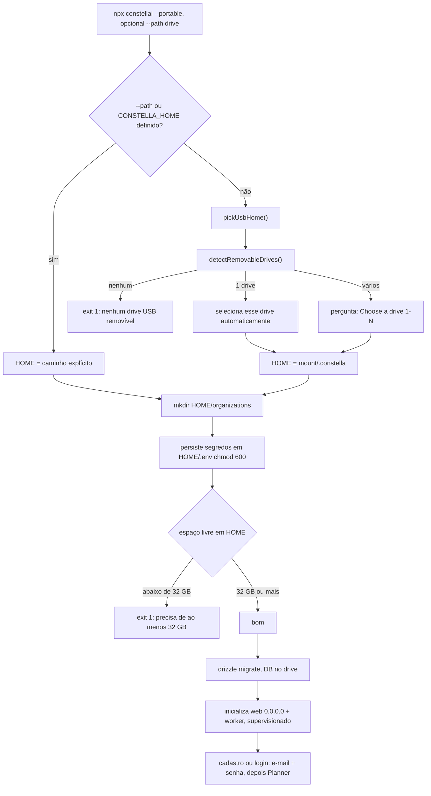
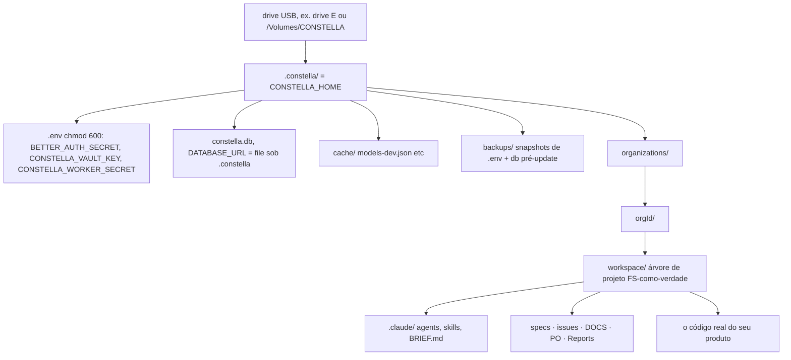

[← Índice](./README.md) · [🇬🇧 English](../en/PORTABLE_MODE.md) · [✦ Constella](../../README.pt-BR.md)

# Instalação portátil (USB) 🛰️


Leve a nave de controle inteira em um pen drive. A **instalação portátil** (`constella --portable`) inicializa o Constella — app, banco de dados, vault, modelos locais, projetos — direto de um drive removível, para que a mesma constelação te acompanhe de máquina em máquina sem deixar rastro no host. A autenticação é a mesma de toda instalação: e-mail + senha.

> 🧪 **Status: experimental (em fase de testes).** A instalação portátil (USB / pendrive) ainda está em **teste ativo** — espere arestas entre máquinas (letras de drive, caminhos de montagem, performance de USB). Use a instalação [Start (local)](START_MODE.md) no dia a dia; experimente a portátil para demos e setups de campo, e reporte qualquer coisa que quebrar.

> Flag de lançamento `portable` (`src/lib/run-mode.ts`): `requiresLogin: true`, nota *"USB drive mounted as root across machines."*

---

## Quando usar 🌌

Use a instalação portátil quando quiser que todo o runtime — segredos, agentes, nebulosa de memória e projetos — viva em um drive que você carrega fisicamente, e não no computador host:

- Uma estação compartilhada / emprestada / restrita onde você **não** quer um runtime root em `~`.
- Mover-se entre um desktop, um notebook e uma máquina de bancada mantendo uma identidade e um banco de dados.
- Um setup air-gapped ou de campo onde você carrega modelos GGUF locais no mesmo drive.
- Demos e resposta a incidentes onde "plugar, iniciar, desplugar" é a história inteira.

Prefira outro método de instalação quando:

| Você quer | Use no lugar |
| --- | --- |
| Local apenas, bind de loopback, início mais rápido | [instalação local](./START_MODE.md) |
| Servidor sempre-ligado acessível por uma tailnet | [instalação em VPS](./VPS_MODE.md) |

---

## Como funciona 🪐

Portable é um **alvo de implantação** selecionado pela flag de lançamento `--portable` — uma forma de instalar e rodar o Constella a partir de um drive, não um modo de autenticação (a auth é sempre e-mail + senha). O launcher `bin/constella.mjs` o seleciona, valida um drive removível, aponta o **runtime root** para `<USB>/.constella`, e então inicializa o mesmo runtime de processo duplo (web + worker) de toda outra instalação.

As diferenças que definem `portable`:

- **Login obrigatório** — `RUN_MODES.portable.requiresLogin === true`. A autenticação é a mesma barreira de todo lugar: na primeira execução sem usuário você se cadastra (nome + e-mail + senha) para criar o operador único, depois faz login (better-auth).
- **Runtime root no drive** — `CONSTELLA_HOME = <USB>/.constella`, então o banco de dados, segredos, vault, workspaces e caches vivem todos no drive.
- **Faz bind em `0.0.0.0`** — assim como `vps`, o host por padrão escuta em todas as interfaces para que a instância portátil seja acessível na máquina onde está plugada (`host = ... runMode === "vps" || runMode === "portable" ? "0.0.0.0" : "127.0.0.1"`).
- **O tamanho do drive é validado** — `< 32 GB` livres é **fatal**; `≥ 32 GB` é **bom** (constantes `PORTABLE_MIN_GB = 32`, `PORTABLE_RECOMMENDED_GB = 32` em `src/server/portable.ts`). Mais folga só ajuda se você carregar modelos locais — nunca é um aviso nem uma barreira.

### Selecionando a instalação

`bin/constella.mjs` resolve a flag de lançamento, com um fallback legado:

```js
const modeFlags = ["start", "vps", "portable"].filter((m) => has(`--${m}`));
const bind = flag("--bind");
const runMode = modeFlags[0]
  ?? (bind === "tailnet" ? "vps" : bind === "portable" ? "portable" : bind === "local" ? "start" : undefined)
  ?? "start";
```

Assim, `--portable` (ou o legado `--bind portable`) seleciona a instalação portátil. A flag escolhida é exportada como `CONSTELLA_RUN_MODE=portable`, lida em runtime por `getRunMode()`, e persistida em `organization.runMode` durante o onboarding (a coluna `runMode` é `text(... { enum: ["start", "vps", "portable"] })` em `src/db/schema.ts`).

---

## Fluxo principal 🌠



1. **Iniciar** — `npx constellai --portable`, opcionalmente `--path <drive>` para pular a detecção.
2. **Escolher o drive** — sem caminho explícito, `pickUsbHome()` chama `detectRemovableDrives()` e usa automaticamente o único drive ou pede que você escolha.
3. **Definir o runtime root** — `HOME = join(chosen.mount, ".constella")`, exportado como `CONSTELLA_HOME`.
4. **Persistir segredos** — `BETTER_AUTH_SECRET`, `CONSTELLA_VAULT_KEY`, `CONSTELLA_WORKER_SECRET` gravados uma vez em `<USB>/.constella/.env` (`mode: 0o600`).
5. **Validar espaço livre** — recusa `< 32 GB`; `≥ 32 GB` é bom.
6. **Aplicar schema** — `drizzle-kit migrate` constrói o banco em `<USB>/.constella/constella.db`.
7. **Inicializar** — web supervisionado (`next start -H 0.0.0.0`) + worker (`bin/worker.mjs`), com reinício automático em caso de crash.
8. **Autenticar** — e-mail + senha (cadastro na primeira execução, login depois), depois onboarding (primeira execução) ou direto para o Planner.

---

## Conceitos-chave ⭐

### Detecção de drive USB (`detectRemovableDrives`)

`bin/constella.mjs` enumera os drives **removíveis** montados por SO, sem dependências, retornando `[{ mount, label, freeBytes }]`:

| SO | Sonda | Filtro de removível |
| --- | --- | --- |
| Windows (`win32`) | `Get-CimInstance Win32_Volume -Filter "DriveType=2"` via `powershell -NoProfile` | `DriveType=2` (removível) + tem `DriveLetter`; mount = `<letra>:\` |
| macOS (`darwin`) | lista `/Volumes`, depois `diskutil info <vol>` | bate `Removable Media: (Removable|Yes)` **ou** `Protocol: USB`, e **não** `Internal: Yes` |
| Linux | `lsblk -rpno NAME,RM,MOUNTPOINT,LABEL` | `RM == "1"` (removível) **e** tem um mountpoint |

O espaço livre de cada entrada vem da mesma sonda sem dependências usada no gate de tamanho (`Get-PSDrive` no Windows, `df -k` em POSIX).

### Seleção em `pickUsbHome()`

```text
nenhum drive     → ✖ "Portable mode: no removable USB drive detected. Insert a pen-drive (or pass --path <drive>)." → exit 1
exatamente um    → "• Using the only USB drive: <label> (<mount>, <N> GB free)"
dois ou mais     → lista "[1] <label> <mount> · <N> GB free", pergunta "Choose a drive [1-N]:"
```

O resultado é sempre `<mount>/.constella` — o runtime root no drive.

### `--path` e `CONSTELLA_HOME` — pular a detecção

Você não precisa depender da detecção. Um runtime root explícito vence:

```js
const explicitHome = process.env.CONSTELLA_HOME ?? flag("--path");
let HOME = explicitHome ?? join(homedir(), ".constella");
if (runMode === "portable" && !explicitHome) HOME = await pickUsbHome();
```

Assim, `--path E:\` (ou `CONSTELLA_HOME=E:\.constella`) fixa o root diretamente e `pickUsbHome()` é totalmente pulado. Esse é o jeito de usar um drive que a detecção não consegue classificar como removível (alguns gabinetes SSD, imagens montadas, drives de rede) — ao custo de pular a verificação de removível, embora o gate de espaço livre ainda rode contra o caminho escolhido.

### Gate de espaço livre (`32 GB` mínimo fatal)

O launcher verifica o drive **antes** de instalar ou inicializar:

```js
// Portable: validate the drive BEFORE installing/booting (minimum 32 GB free; no upper recommendation).
if (runMode === "portable") {
  const free = freeBytes(HOME);
  const gb = Math.round((free / 1e9) * 10) / 10;
  if (free && free < 32e9) { console.error(`✖ Portable needs at least 32 GB free — only ${gb} GB on ${HOME}. Use a bigger drive.`); process.exit(1); }
  else if (free) console.log(`• ${gb} GB free on the drive — good (32 GB minimum; more headroom only helps if you carry local models).`);
}
```

O mesmo limiar é exportado de `src/server/portable.ts` para a UI reutilizar:

```ts
export const PORTABLE_MIN_GB = 32;
export const PORTABLE_RECOMMENDED_GB = 32; // recommended == minimum; there is no separate warn tier
export function checkUsbFreeSpace(path: string): UsbSpace { /* ok / freeGb / message */ }
```

`checkUsbFreeSpace` retorna `{ ok, warn, freeGb, minGb, recommendedGb, message }` (com `warn` sempre `false`) para que o app possa renderizar o mesmo veredicto que o launcher imprime.

> Note que o guard é `if (free && free < …)` — quando a sonda **falha** e retorna `0`, o gate é pulado (não bloqueia o boot diante de uma sonda ilegível). A detecção imprime um tamanho diferente de zero para um drive real; um `0` significa que a sonda `Get-PSDrive`/`df` não conseguiu ler o volume.

### Carregar app + modelos + projetos

Como `CONSTELLA_HOME` está no drive, tudo que pende do runtime root vai junto:

- **Banco de dados** — `DATABASE_URL = file:<USB>/.constella/constella.db` (definido em `bin/constella.mjs`).
- **Segredos + vault** — `<USB>/.constella/.env` (`chmod 600`); as chaves de provider são criptografadas com AES-256-GCM na tabela `vault` usando `CONSTELLA_VAULT_KEY`.
- **Organizações & workspaces** — `<USB>/.constella/organizations/<orgId>/workspace/` (a árvore de projeto FS-como-verdade; veja [ARCHITECTURE](./ARCHITECTURE.md)).
- **Caches** — ex. `<USB>/.constella/cache/models-dev.json` (catálogo de modelos), backups de update em `<USB>/.constella/backups/`.
- **Modelos locais** — os arquivos GGUF que você baixa para os servidores de embed/chat vivem sob o runtime root, então o RAG ([MEMORY_RAG](./MEMORY_RAG.md)) e a inferência local ([MODELS](./MODELS.md)) viajam com o drive. Só **32 GB** livres são necessários para dar boot; **modelos, engine, CUDA, npm, projetos** somam rápido, então leve mais folga se pretende rodar modelos locais — mas é informativo, não uma barreira.

Acima do mínimo de 32 GB, mais espaço é puramente informativo — só importa se você carregar modelos locais (**modelos, engine, CUDA, npm, projetos** somam rápido).

---

## Tabelas 🪐

### Constantes & funções do portátil

| Símbolo | Arquivo | Significado |
| --- | --- | --- |
| `PORTABLE_MIN_GB = 32` | `src/server/portable.ts` | Piso rígido — abaixo disso, o portátil se recusa a iniciar. |
| `PORTABLE_RECOMMENDED_GB = 32` | `src/server/portable.ts` | Igual ao mínimo — não há tier de aviso separado; mais espaço só ajuda se você carregar modelos locais. |
| `freeBytes(path)` | `src/server/portable.ts` & `bin/constella.mjs` | Bytes livres no volume que contém `path`; `0` se a sonda falhar. |
| `checkUsbFreeSpace(path)` | `src/server/portable.ts` | `{ ok, warn, freeGb, minGb, recommendedGb, message }` para a UI. |
| `verifyDownloadedFileSize(path, expected)` | `src/server/portable.ts` | Detecta downloads truncados/corrompidos (tolerância de 2%) — protege fetches de modelo/arquivo no drive. |
| `detectRemovableDrives()` | `bin/constella.mjs` | Lista por SO dos drives USB montados `[{ mount, label, freeBytes }]`. |
| `pickUsbHome()` | `bin/constella.mjs` | Escolha de drive interativa/automática → `<mount>/.constella`. |

### Ambiente exportado pelo launcher (portátil)

| Variável | Valor no portátil | Origem |
| --- | --- | --- |
| `CONSTELLA_RUN_MODE` | `portable` | a partir da flag `--portable` |
| `CONSTELLA_HOME` | `<USB>/.constella` | `pickUsbHome()` ou `--path` / env explícito |
| `DATABASE_URL` | `file:<USB>/.constella/constella.db` | derivado de `CONSTELLA_HOME` |
| `CONSTELLA_PUBLIC` | `1` | um launch via CLI é o runtime público |
| `CONSTELLA_VERSION` | versão instalada | `package.json` |
| `CONSTELLA_PKG_ROOT` | o root do pacote instalado | `bin/constella.mjs` |
| host | `0.0.0.0` (override `--host`) | `runMode === "portable"` |
| port | `3000` (override `--port` / `PORT`) | padrão |

### Segredos persistidos (`<USB>/.constella/.env`, `mode 0o600`)

| Segredo | Propósito |
| --- | --- |
| `BETTER_AUTH_SECRET` | assinatura de sessão — uma chave real, nunca o default público (login obrigatório) |
| `CONSTELLA_VAULT_KEY` | chave AES-256-GCM para a tabela `vault` criptografada |
| `CONSTELLA_WORKER_SECRET` | cabeçalho `x-worker-secret` que o worker usa para alcançar o processo web |

---

## Layout de caminhos do portátil 🌌



Tudo dentro de `.constella/` está no drive; nada é gravado no `~` do host. Desplugue o drive e o host fica limpo.

---

## Passo a passo 🚀

### 1. Escolha um drive

**≥ 32 GB** livres é o mínimo e já basta para dar boot. Se pretende carregar modelos locais, deixe mais folga — mas isso é uma preferência de dimensionamento, não um requisito. Um drive USB 3.x / USB-C rápido importa — agentes, builds e o banco SQLite fazem I/O real.

### 2. Inicialize a partir do drive

Detectar o drive USB automaticamente:

```bash
npm install -g constellai
constella --portable
# ou, pontualmente: npx constellai --portable
```

- Um drive → é usado automaticamente.
- Vários drives → você é questionado: `Choose a drive [1-N]:`.

Ou fixe o runtime root explicitamente (pula a detecção):

```bash
constella --portable --path E:\
# ou, no macOS / Linux:
constella --portable --path /Volumes/CONSTELLA
```

Você também pode definir via env:

```bash
CONSTELLA_HOME=/Volumes/CONSTELLA/.constella constella --portable
```

### 3. Observe a saída do boot

```text
• Secrets ready (stored in E:\.constella\.env, never printed).
• 240.0 GB free on the drive — good (32 GB minimum; more headroom only helps if you carry local models).
Constella runtime root : E:\.constella
Mode                   : portable  ·  0.0.0.0:3000
• Starting: next start -H 0.0.0.0 -p 3000  …  +  worker
```

### 4. Cadastre-se ou faça login

Abra `http://localhost:3000` (ou `http://<host-ip>:3000` de outro dispositivo na rede, já que faz bind em `0.0.0.0`). O portátil exige e-mail + senha — o primeiro boot mostra uma tela de **cadastro** (nome + e-mail + senha) que cria o operador único e roda o [ONBOARDING](./ONBOARDING.md); depois você **faz login** e cai no Planner.

### 5. Mude para outra máquina

Ejete o drive de forma limpa, plugue na próxima máquina e rode `constella --portable` novamente. O mesmo `CONSTELLA_HOME` no drive carrega seu banco de dados, vault, segredos, workspaces e quaisquer modelos locais — mesma identidade, mesmo histórico. A conta de operador vive nesse banco de dados, então você faz login com o mesmo e-mail + senha em todas as máquinas.

---

## Exemplos 🛰️

Auto-detecção, único drive:

```bash
$ npx constellai --portable
• Using the only USB drive: CONSTELLA (E:\, 240.0 GB free)
• Secrets ready (stored in E:\.constella\.env, never printed).
• 240.0 GB free on the drive — good (32 GB minimum; more headroom only helps if you carry local models).
Constella runtime root : E:\.constella
Mode                   : portable  ·  0.0.0.0:3000
```

Múltiplos drives:

```bash
$ npx constellai --portable
Detected USB drives:
  [1] CONSTELLA   E:\   ·  240.0 GB free
  [2] BACKUP      F:\   ·  64.0 GB free
Choose a drive [1-2]: 1
```

Drive pequeno demais (fatal):

```bash
$ npx constellai --portable --path G:\
✖ Portable needs at least 32 GB free — only 14.6 GB on G:\.constella. Use a bigger drive.
```

Drive modesto-mas-suficiente (dá boot, sem aviso):

```bash
$ npx constellai --portable --path F:\
• 64.0 GB free on the drive — good (32 GB minimum; more headroom only helps if you carry local models).
```

Nenhum drive presente:

```bash
$ npx constellai --portable
✖ Portable mode: no removable USB drive detected. Insert a pen-drive (or pass --path <drive>).
```

---

## Estados possíveis ⭐

| Condição | Comportamento |
| --- | --- |
| Nenhum drive removível, sem `--path` | `pickUsbHome()` dá erro → **exit 1** |
| Exatamente um drive removível | auto-selecionado, registrado no log |
| Múltiplos drives removíveis | prompt interativo `Choose a drive [1-N]` |
| `--path` / `CONSTELLA_HOME` definido | detecção pulada, esse caminho é o root |
| Livre `< 32 GB` (sonda teve sucesso) | **fatal**, exit 1 |
| Livre `≥ 32 GB` | `• good`, continua (sem tier de aviso) |
| Sonda retornou `0` (ilegível) | gate pulado — inicializa sem verificação de espaço |
| DB novo no drive | `drizzle-kit migrate` constrói as tabelas; falha em um DB novo é fatal |
| DB existente no drive | migrate é idempotente; uma re-execução falha em um DB existente é um aviso não-fatal |
| Primeira execução, sem usuário ainda | a tela de cadastro cria o operador único |
| `BETTER_AUTH_SECRET` ausente em runtime | `reconcileOnBoot()` → `assertAuthSecret()` falha fechado → **o processo encerra** |

---

## Integrações relacionadas 🪐

- **Update** ([UPDATE](./UPDATE.md)) — `detectRunContext()` retorna `"portable"`; `startUpdate()` **não** roda automaticamente no portátil. Faz backup de `.env` + db em `<USB>/.constella/backups/<timestamp>/`, depois retorna o comando e *"Portable: ensure free space, back up the drive, then run: `npm install -g constellai@latest`"* com `needsRestart: true`.
- **Modelos locais / RAG** ([MODELS](./MODELS.md), [MEMORY_RAG](./MEMORY_RAG.md)) — modelos GGUF e servidores de embed/chat rodam a partir do runtime root no drive; o mínimo de 32 GB dá boot, mas os modelos locais são o motivo para levar um drive maior.
- **VPS** ([VPS_MODE](./VPS_MODE.md)) — compartilha o bind em `0.0.0.0`; difere por o VPS rodar nativamente no host sobre uma tailnet, enquanto o portátil roda a partir de um drive.
- **Configuração** ([CONFIGURATION](./CONFIGURATION.md)) — `CONSTELLA_HOME`, `CONSTELLA_RUN_MODE`, `DATABASE_URL` e as variáveis de env de segredo estão documentadas lá.

---

## Segurança 🕳️

- **A autenticação é sempre exigida.** `requiresLogin: true`; o operador único se cadastra na primeira execução e faz login depois. O boot falha fechado se `BETTER_AUTH_SECRET` estiver ausente (`reconcileOnBoot → assertAuthSecret`), então uma instância portátil nunca pode assinar sessões com a chave pública default forjável do better-auth.
- **Faz bind em `0.0.0.0`.** A instância portátil é acessível na rede do host. Trate a rede do host como parte da sua fronteira de confiança — prefira uma LAN confiável, ou faça override com `--host 127.0.0.1` se só precisar de acesso local na máquina plugada.
- **Segredos ficam no drive.** `<USB>/.constella/.env` é gravado `mode 0o600`; tokens de provider são criptografados com AES-256-GCM na tabela `vault` usando `CONSTELLA_VAULT_KEY` (que está, ela própria, no drive). **O drive é o chaveiro** — a perda física do drive é a perda dos segredos, então criptografe o drive em repouso (BitLocker / FileVault / LUKS) e faça backup.
- **A jaula do workspace continua valendo.** O acesso a arquivos pelos agentes passa por `safe()` em `src/lib/fs-workspace.ts` (verificações léxica + de symlink) — agentes não conseguem escapar de `<USB>/.constella/organizations/<orgId>/workspace/` para o filesystem do host.
- **Sem resíduo no host.** Nada é gravado no `~/.constella` do host; retirar o drive deixa o host limpo.

Veja [SECURITY](./SECURITY.md) para o modelo completo.

---

## Solução de problemas 🌠

| Sintoma | Causa / correção |
| --- | --- |
| `✖ no removable USB drive detected` | O drive não é classificado como removível (gabinete/SSD/montagem de rede). Passe `--path <drive>` para pular a detecção. |
| `✖ Portable needs at least 32 GB free` | O volume escolhido tem `< 32 GB` livres — use um drive maior ou libere espaço. |
| `• … GB free on the drive — good` | No mínimo de 32 GB ou acima; o boot continua. Leve um drive maior se pretende manter modelos locais. |
| Nenhuma mensagem de espaço | A sonda `freeBytes` retornou `0` (não conseguiu ler o volume) → o gate é pulado. Verifique se o drive monta e se `Get-PSDrive`/`df` o enxerga. |
| Drive errado auto-selecionado | Mais de um drive removível — rode de novo e escolha o índice, ou fixe com `--path`. |
| Não consigo acessar de outra máquina | Faz bind em `0.0.0.0`; verifique o firewall do host e use `http://<host-ip>:3000`. Para local apenas, adicione `--host 127.0.0.1`. |
| `✖ Database schema migration failed on a fresh database` | O filesystem do drive pode não suportar as gravações do DB (algumas peculiaridades de FAT/exFAT) ou está cheio/somente-leitura — tente outro drive ou filesystem. |
| Schema migrate *skipped/failed on an existing DB* | Aviso não-fatal em um DB já construído; o boot continua. |
| `update` diz que não pode rodar automaticamente | Esperado no portátil — faça backup, garanta espaço livre, rode o `npm install -g constellai@latest` impresso e reinicie. |

Mais: [TROUBLESHOOTING](./TROUBLESHOOTING.md) · [FAQ](./FAQ.md).

---

## Links relacionados ⭐

- [START_MODE](./START_MODE.md) · [VPS_MODE](./VPS_MODE.md)
- [INSTALLATION](./INSTALLATION.md) · [ONBOARDING](./ONBOARDING.md) · [CONFIGURATION](./CONFIGURATION.md)
- [ARCHITECTURE](./ARCHITECTURE.md) · [MODELS](./MODELS.md) · [MEMORY_RAG](./MEMORY_RAG.md)
- [UPDATE](./UPDATE.md) · [SECURITY](./SECURITY.md) · [TROUBLESHOOTING](./TROUBLESHOOTING.md) · [FAQ](./FAQ.md)
</content>
