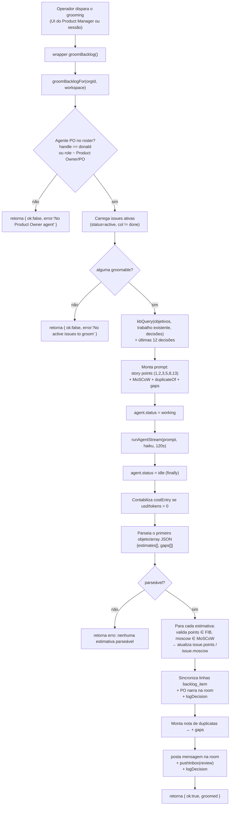
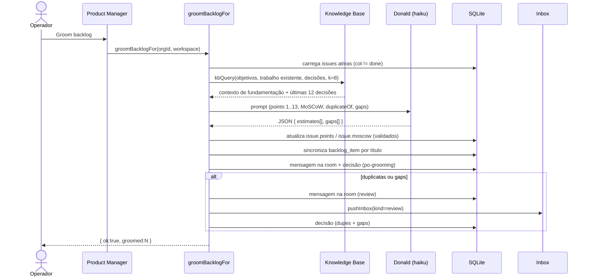

[← Índice](./README.md) · [🇬🇧 English](../en/PO_AGENT.md) · [✦ Constella](../../README.pt-BR.md)

# 🪐 Agente PO (Donald) — a estrela Product Owner


Donald é o agente **Product Owner** da Constella: a voz do cliente dentro da constelação. Ele faz o grooming do backlog, dimensiona cada issue em **story points** (Fibonacci), define a prioridade **MoSCoW**, sinaliza prováveis **duplicatas** e **lacunas (gaps)**, e fecha sprints com um retro escrito. É um dos dez agentes semeados e se reporta à Ada (CEO).

> Fundamentação: este documento descreve apenas o que o código faz, em `src/server/planner.ts` (`groomBacklogFor`), `src/server/pm.ts` (`closeSprintFor`), `src/server/commands.ts` (comandos de barra) e `src/data/scaffold.ts` (a definição do agente). Quando um comportamento é disparado pelo operador, isso é indicado.

---

## 2. O que é o Donald

| Campo | Valor | Fonte |
|---|---|---|
| Handle | `donald` | `src/data/scaffold.ts` `AGENT_DEFS` |
| Nome | Donald | `AGENT_DEFS` |
| Papel | `Product Owner` | `AGENT_DEFS` |
| Reporta a | `ada` (CEO) | `AGENT_DEFS` |
| Modelo | `haiku` | `AGENT_DEFS` |
| Provider / adapter | `cli_claude_code` | `AGENT_DEFS` |
| Temperatura | `0.4` | `AGENT_DEFS` |
| Teto de custo diário | `20` USD | `AGENT_DEFS` (`dailyCapUsd`) |
| Tier | `heavy` | `AGENT_DEFS` |
| Identidade | "Customer voice. Ruthless about priority and clarity." | `AGENT_DEFS` |
| Ritual | "Groom the backlog with MoSCoW, plan the sprint, track delivery, close with a retro." | `AGENT_DEFS` |

Donald também é um dos três **planejadores** (junto com `ada` e `linus`) no pipeline de trabalho — veja [WORKFLOW](./WORKFLOW.md) e [GOALS_SPECS_ISSUES](./GOALS_SPECS_ISSUES.md). Seu arquivo de persona vive em disco em `.claude/agents/donald/Agent.md`.

---

## 3. Quando usar 🛰️

- Depois que a Ada redige specs → issues, quando você quer **estimativas humanizadas** (esforço real, não apenas defaults de prioridade) no board.
- Antes de iniciar um sprint, para revelar **issues duplicadas / sobrepostas** e **trabalho faltante (gaps)** que os objetivos exigem.
- No fim de um sprint, para **arquivar o que foi entregue** e escrever o **retro** do sprint.
- Sempre que o board tiver desviado e você quiser repriorizar de forma honesta.

Você **não** precisa do Donald para os defaults determinísticos derivados de prioridade que o `generatePlan` já semeia. O grooming é uma passagem **opcional, disparada pelo operador**, por cima desses defaults.

---

## 4. Como funciona 🌌

Há duas operações de PO distintas no código:

1. **Grooming do backlog** — `groomBacklogFor(orgId, workspace)` em `src/server/planner.ts`. Uma execução real do agente PO (ela contabiliza custo). Donald lê cada issue ativa + o conhecimento do projeto, retorna estimativas em JSON, e a Constella grava `points` + `moscow` de volta na tabela `issue`. Duplicatas e gaps vão para a **Inbox** como item de revisão — nunca são excluídos automaticamente.
2. **Fechamento de sprint** — `closeSprintFor(orgId, wsId)` em `src/server/pm.ts`. Determinístico (sem execução de agente): escreve um documento de retro e arquiva as issues entregues fora do board ativo.

Ambos têm um wrapper de sessão para a UI (`groomBacklog`, `closeSprint`) e um core sem sessão (`*For`) reusado pela [API Pública](./PUBLIC_API.md) e pelos comandos de chat.

### O grooming é ciente do KB

Antes de dimensionar, `groomBacklogFor` chama `kbQuery(orgId, …, { agentHandle: po.handle, k: 8 })` para fundamentar o Donald em **objetivos, trabalho existente e decisões anteriores** reais (a *nebulosa de memória* — veja [KB_RAG](./KB_RAG.md)). Linhas recentes da tabela `decision` (as últimas 12) também são injetadas. É isso que permite que ele detecte duplicatas e gaps a partir de sinal, não no vácuo.

### O modelo é resolvido a partir da linha do agente

```ts
const binary = pickBinary(po.adapter, po.model);
const model = binary === "claude"
  ? (po.model.includes("opus") ? "opus" : po.model.includes("haiku") ? "haiku" : "sonnet")
  : undefined;
```

Assim, o modelo `haiku` semeado do Donald é usado na execução de grooming, via `runAgentStream(prompt, { orgId, binary, model, timeoutMs: 120_000 }, …)`.

---

## 5. Fluxo principal 🌠



---

## 6. Conceitos-chave 🕳️

### Story points (Fibonacci — esforço, não prioridade)

O prompt é explícito: *"Story points = relative EFFORT / complexity / uncertainty on the Fibonacci scale (1, 2, 3, 5, 8, 13) — NOT the same as priority. A small tweak is 1-2; a whole subsystem is 8-13."* A Constella valida o número retornado contra um conjunto exato:

```ts
const FIB = new Set([1, 2, 3, 5, 8, 13]);
// ...
const pts = typeof e.points === "number" ? Math.round(e.points) : NaN;
const points = FIB.has(pts) ? pts : undefined;   // qualquer valor fora da escala é descartado
```

| Points | Significado |
|---|---|
| `1` | Ajuste trivial |
| `2` | Mudança pequena |
| `3` | Mudança moderada |
| `5` | Mudança substancial |
| `8` | Feature grande |
| `13` | Subsistema inteiro / alta incerteza |

Um valor fora desse conjunto (ex.: `4`, `6`, `21`) é **ignorado** para aquela issue.

### Priorização MoSCoW

O prompt: *"MoSCoW = Must | Should | Could | Won't. Be honest: only the truly essential are Must; nice-to-haves are Could; use Won't sparingly (defer)."* Validação:

```ts
const MOSCOW = new Set(["Must", "Should", "Could", "Won't"]);
```

| MoSCoW | Intenção |
|---|---|
| `Must` | Verdadeiramente essencial — o trabalho falha sem isso |
| `Should` | Importante; fallback padrão para `backlog_item` |
| `Could` | Desejável (nice-to-have) |
| `Won't` | Adiado (use com parcimônia) |

Se tanto `points` quanto `moscow` forem inválidos/ausentes em uma estimativa, ela é **ignorada** (sem gravação no banco).

### Detecção de duplicatas → Inbox, nunca exclusão automática

Cada estimativa pode carregar `duplicateOf` (a key da issue que ela sobrepõe). A Constella valida que ambas as keys existem e são diferentes, e então formata `"<key> ↔ <duplicateOf>"`. Duplicatas são **reveladas**, nunca removidas:

```ts
const dupes = parsed
  .filter((e) => e.duplicateOf != null && byKey[String(e.duplicateOf)]
    && byKey[String(e.key)] && String(e.duplicateOf) !== String(e.key))
  .map((e) => `${e.key} ↔ ${e.duplicateOf}`);
```

### Detecção de gaps

O JSON pode incluir `gaps`: *"work the objectives need but no issue covers"* (trabalho que os objetivos precisam mas nenhuma issue cobre). Até **8** gaps são mantidos (`j.gaps.map(String).slice(0, 8)`). Assim como as duplicatas, os gaps são arquivados para o operador — a Constella não cria issues automaticamente para eles.

### Contrato de saída

Donald deve retornar **apenas** um objeto JSON (sem prosa, sem fences):

```json
{"estimates":[{"key":"1","points":5,"moscow":"Must","duplicateOf":"3"}],"gaps":["a missing issue the objectives need"]}
```

A Constella extrai o primeiro objeto/array JSON com `res.text.match(/\{[\s\S]*\}|\[[\s\S]*\]/)` e tolera tanto um array puro (`estimates`) quanto o formato completo `{estimates, gaps}`. Se nada parsear, retorna `{ ok: false, error: "The PO returned no parseable estimates — try again." }` — nada é fabricado.

---

## 7. Tabelas 🛰️

### `issue` (os campos que o Donald grava)

| Coluna | Tipo / enum | Gravada no grooming? | Notas |
|---|---|---|---|
| `key` | text | não | key da issue, casada com `estimate.key` |
| `title` | text | não | lida no prompt |
| `prio` | `low \| med \| high` | não | passada apenas como *dica* |
| `col` | `todo \| doing \| blocked \| review \| done` | não | issues em `done` são excluídas do grooming |
| `moscow` | `Must \| Should \| Could \| Won't` | **sim** | validada contra `MOSCOW` |
| `points` | integer (default `0`) | **sim** | validado contra `FIB` |
| `status` | `active \| cancelled \| archived` | indiretamente | só issues `active` são groomadas; `closeSprint` marca entregues → `archived` |
| `assigneeId` | text | não (definido por `/assign`) | — |

### `backlog_item`

| Coluna | Tipo / enum | Notas |
|---|---|---|
| `title` | text | casado por título para sincronizar `points`/`moscow` das issues após o grooming |
| `moscow` | `Must \| Should \| Could \| Won't` (default `Should`) | — |
| `points` | integer (default `0`) | — |

### Outras tabelas tocadas pelo Donald

| Tabela | Quando | O quê |
|---|---|---|
| `costEntry` | execução de grooming | uma linha se `usd > 0` ou tokens > 0 |
| `message` (canal `room`) | grooming + fechamento de sprint + dupes/gaps | narração do PO |
| `decision` | grooming + dupes/gaps + fechamento de sprint | `source: "po-grooming"` |
| `inboxItem` | dupes/gaps encontrados | `kind: "review"` (dedupado por ref) |
| `agent` | execução de grooming | `status` → `working` depois `idle` |

---

## 8. Passo a passo ⭐

### Grooming do backlog

1. Abra o módulo **Product Manager** (ou chame `groomBacklog()`), que delega para `groomBacklogFor(org.id, workspace)`.
2. A Constella encontra o PO: `handle === "donald"`, senão qualquer agente cujo `role` case com `/product owner|\bpo\b|product manager/i`. Sem PO → erro.
3. Carrega as issues ativas, descarta as `done`, monta o prompt fundamentado no KB, e executa o Donald (`haiku`, timeout de 120 s).
4. As estimativas são validadas e gravadas de volta em `issue.points` / `issue.moscow`; as linhas de `backlog_item` são sincronizadas por título.
5. Donald narra na **room** ("Backlog groomed — estimated story points + MoSCoW for N issues…").
6. Se foram encontradas duplicatas ou gaps, uma segunda mensagem na room + um item de revisão na **Inbox** + uma decisão são registrados.

### Fechar o sprint (`closeSprintFor`)

1. Dispare `/close-sprint` no chat, a ação do Product Manager, ou a API Pública.
2. A Constella seleciona as issues ativas; se **nenhuma** estiver em `done`, retorna `{ ok: false }` ("Nothing to close — no issues are in Done yet.").
3. Escreve um retro em `PO/sprint-retro-<YYYY-MM-DD>.md` listando **Shipped** (com points) e **Carried over** (com a coluna).
4. Cada issue entregue recebe `status: "archived"` (fora do board ativo, preservada em disco + retro).
5. Uma `decision` é registrada: `by: "donald"`, `source: "po-grooming"`.

---

## 9. Exemplos 🚀

### Disparar o grooming pelo chat

Não há um comando de barra dedicado ao grooming; o grooming roda pela UI do **Product Manager** (a server action `groomBacklog`). Os comandos de chat voltados ao PO relacionados são:

```text
/close-sprint
```

→ Donald responde no chat (literal de `src/server/commands.ts`):

```text
🏁 Sprint closed — 4 shipped, 2 carried over. Retro written to `PO/sprint-retro-2026-06-22.md`.
```

Se nada estiver em Done:

```text
Nothing to close — no issues are in Done yet.
```

### Uma mensagem de grooming na room (sucesso)

```text
@donald: Backlog groomed — estimated story points + MoSCoW for 7 issues. Open the Product Manager to review.
```

### Uma revisão de grooming (duplicatas + gaps)

```text
@donald: Backlog review — Possible duplicate / overlapping issues: 4 ↔ 2.

Gaps the objectives need:
- A rate-limit on the public login endpoint
- An audit log for admin actions
```

A mesma nota é arquivada na **Inbox** como `PO backlog review — 1 duplicate, 2 gap`.

### Saída de modelo de exemplo (o JSON que o Donald retorna)

```json
{
  "estimates": [
    { "key": "1", "points": 3,  "moscow": "Must" },
    { "key": "2", "points": 8,  "moscow": "Should", "duplicateOf": "4" },
    { "key": "3", "points": 13, "moscow": "Could" }
  ],
  "gaps": ["Password reset flow has no spec or issue"]
}
```

---

## 10. Estados possíveis 🕳️

### Valores de retorno do grooming (`groomBacklogFor`)

| Retorno | Significado |
|---|---|
| `{ ok: false, error: "No Product Owner agent in this workspace." }` | Sem `donald` e sem agente de papel PO |
| `{ ok: false, error: "No active issues to groom." }` | Board sem issues groomáveis |
| `{ ok: false, error: "The PO returned no parseable estimates — try again." }` | Saída do modelo sem JSON parseável |
| `{ ok: true, groomed: N }` | N issues receberam points e/ou MoSCoW |

### Valores de retorno do fechamento de sprint (`closeSprintFor`)

| Retorno | Significado |
|---|---|
| `{ ok: false, shipped: 0, carried: N }` | Nada em `done` para fechar |
| `{ ok: true, shipped, carried, path }` | Retro escrito; issues entregues arquivadas |

### `status` do agente Donald durante o grooming

| Status | Quando |
|---|---|
| `working` | definido imediatamente antes da execução |
| `idle` | restaurado no bloco `finally` (best-effort) |

---

## 11. Diagrama — pontos de decisão do grooming 🌌



---

## 12. Integrações relacionadas 🛰️

- **Pipeline de trabalho** — o grooming fica entre a criação da issue e a execução. Veja [WORKFLOW](./WORKFLOW.md) e [GOALS_SPECS_ISSUES](./GOALS_SPECS_ISSUES.md).
- **Planejamento do CEO** — a Ada (`generatePlan`) semeia os defaults determinísticos de prioridade que o Donald refina. Veja [AGENTS](./AGENTS.md).
- **Knowledge Base / RAG** — o grooming é ciente do KB via `kbQuery`. Veja [KB_RAG](./KB_RAG.md) e [KB_AGENT](./KB_AGENT.md).
- **Inbox** — duplicatas/gaps surgem como itens de revisão. Veja [INBOX](./INBOX.md).
- **Comandos de chat** — `/close-sprint` (e o conjunto mais amplo). Veja [CHAT_COMMANDS](./CHAT_COMMANDS.md).
- **API Pública** — `closeSprintFor` e os cores de grooming são sem sessão para controle remoto. Veja [PUBLIC_API](./PUBLIC_API.md) e [TELEGRAM](./TELEGRAM.md).

---

## 13. Segurança 🔒

- **Sem exclusão automática.** Donald nunca exclui ou mescla issues. Duplicatas e gaps são *revelados* (room + Inbox + decisão) para o operador agir.
- **Valores fora da escala rejeitados.** Story points fora de `{1,2,3,5,8,13}` e MoSCoW fora de `{Must,Should,Could,Won't}` são descartados, então um valor alucinado não pode corromper o board.
- **Custo limitado.** A execução de grooming é uma única invocação de agente (timeout de 120 s) e é contabilizada em `costEntry`; o `dailyCapUsd` do Donald é `20`.
- **Jail de FS.** O retro é escrito via `writeDoc(orgId, "PO/sprint-retro-<date>.md", …)` dentro do workspace da org — o mesmo jail de segurança de caminho que todo agente obedece. Veja [SECURITY](./SECURITY.md).
- **Dedupe da Inbox.** `pushInbox` atualiza um item não resolvido existente para a mesma ref em vez de empilhar duplicatas.

---

## 14. Solução de problemas 🛠️

| Sintoma | Causa provável | Correção |
|---|---|---|
| "No Product Owner agent in this workspace." | Roster sem `donald` e sem agente de papel PO | Re-semeie o roster / restaure o Donald no Agent Studio |
| "No active issues to groom." | Todas as issues estão `done` ou não existem | Adicione issues, ou rode após a Ada redigir o plano |
| "The PO returned no parseable estimates — try again." | Modelo retornou prosa / JSON malformado | Rode o grooming de novo; prompts mais limpos ajudam (redispare) |
| Points não mudaram em algumas issues | Valor retornado fora da escala Fibonacci, ou estimativa sem points válidos nem MoSCoW | Re-groome; só `{1,2,3,5,8,13}` são aceitos |
| Grooming roda mas sem mensagem na room | `groomed === 0` (nada validado) — a narração só dispara quando `groomed > 0` | Verifique a saída do modelo; rode de novo |
| `/close-sprint` diz "Nothing to close" | Nenhuma issue na coluna `done` | Mova as issues entregues para `done` primeiro |

---

## 15. Links relacionados 🌠

- [AGENTS](./AGENTS.md) — a constelação completa de dez agentes
- [WORKFLOW](./WORKFLOW.md) — Goal → Spec → Issue → Plan → Execution
- [GOALS_SPECS_ISSUES](./GOALS_SPECS_ISSUES.md) — os objetos de trabalho que o Donald dimensiona
- [INBOX](./INBOX.md) — onde duplicatas/gaps caem
- [KB_RAG](./KB_RAG.md) · [KB_AGENT](./KB_AGENT.md) — a nebulosa de memória que o grooming lê
- [CHAT_COMMANDS](./CHAT_COMMANDS.md) — `/close-sprint` e o conjunto de comandos
- [PO_AGENT](./PO_AGENT.md) · [PUBLIC_API](./PUBLIC_API.md) · [TELEGRAM](./TELEGRAM.md)
