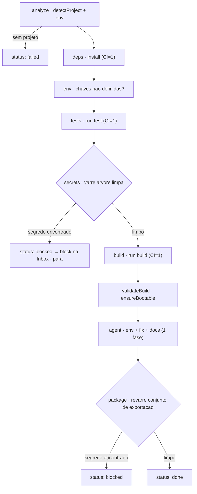
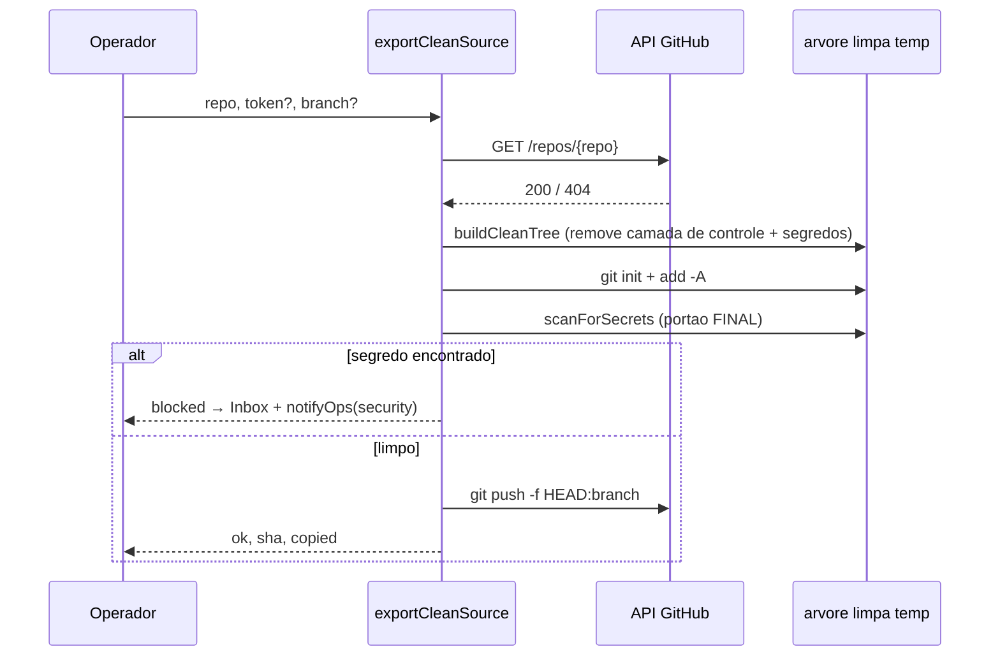

[← Índice](./README.md) · [🇬🇧 English](../en/PREPARE_DEPLOY.md) · [✦ Constella](../../README.pt-BR.md)

# Preparar Deploy 🚀


A sequência de pré-lançamento. Antes de qualquer produto deixar a nave central, o **Preparar Deploy** executa um pipeline híbrido — verificações de engenharia determinísticas (comandos reais) mais uma única fase de agente — e então remove toda a camada de controle interna da Constella, enviando apenas o código-fonte limpo do produto para um repositório separado. Todo lançamento passa por uma comporta de varredura de segredos.

> Fonte da verdade: [`src/server/prepare-deploy.ts`](../../src/server/prepare-deploy.ts), [`src/server/deploy-store.ts`](../../src/server/deploy-store.ts), [`src/server/git-scan.ts`](../../src/server/git-scan.ts), [`src/server/devserver.ts`](../../src/server/devserver.ts).

---

## 1. Quando usar 🌠

- Uma constelação terminou de construir e você quer levar o projeto para produção.
- Você precisa de uma **verificação de prontidão determinística**: dependências instalam, testes passam, um build de produção limpo roda e a aplicação realmente sobe.
- Você quer **documentar o ambiente** (`.env.example`, `README.md`, `DEPLOY.md`) antes de entregar o projeto a um host.
- Você quer publicar **apenas o produto** — sem `.claude/`, docs de planejamento, relatórios internos ou qualquer arquivo de controle — em um repositório GitHub separado.
- Você precisa da certeza de que **nenhum segredo** está prestes a deixar a nave.

---

## 2. Como funciona 🌌

O Preparar Deploy é um **pipeline híbrido de preparação para produção**. O sistema executa por conta própria os passos determinísticos de engenharia (comandos reais de `install`, `test`, `build`; um portão de boot; uma varredura de segredos) e então entrega a uma **única fase de agente** o trabalho criativo restante (escrever `.env.example`, corrigir um build quebrado, escrever `README.md` / `DEPLOY.md`). O filtro de exportação limpa é a fonte única da verdade compartilhada tanto pelo **preview** quanto pela **exportação** — o que você vê no preview é exatamente o que seria enviado.

Três painéis determinísticos e sem agente alimentam a UI:

| Painel | Server action | O que retorna |
|--------|---------------|---------------|
| **Snapshot do ambiente** | `getDeployEnv()` → `detectDeployEnv(org.id)` | runtime, framework, gerenciador de pacotes, env vars exigidas/não documentadas, tipo de DB, portas, Dockerfile/compose, scripts de build e start, modo |
| **Preview da exportação limpa** | `previewCleanExport()` → `buildPreview(org.id)` | a árvore de arquivos que sobrevive ao filtro, total de bytes, contagens incluídas/ignoradas, docs encontrados e uma **varredura de segredos pré-exportação** |
| **Checklist automático** | `deployChecklist()` → `computeChecklist(...)` | um checklist de prontidão determinístico derivado do snapshot de ambiente + dos status dos passos da última execução |

O estado da execução atual em si é lido com `getDeployRun()` → `loadDeployRow(workspace.id)`.

### Persistência

Uma linha `deploy_run` **por workspace** guarda a última execução. A tabela é criada de forma idempotente no boot por `ensureDeployTables()` (`CREATE TABLE IF NOT EXISTS deploy_run … CREATE UNIQUE INDEX … ON deploy_run (workspace_id)`) — sem necessidade de `drizzle-kit push`. A linha armazena `status`, `runId`, os `steps[]`, o `checklist[]`, o último `buildLog`, o `summary`, o snapshot `lastExport` e `startedAt` / `updatedAt`.

---

## 3. Snapshot do ambiente — `getDeployEnv` 🪐

`detectDeployEnv(orgId)` é totalmente determinístico (sem agente, sem chamada de modelo). Ele monta um objeto `DeployEnv`:

| Campo | Como é detectado |
|-------|------------------|
| `detected` | `true` se `detectProject(orgId)` encontrou um projeto executável |
| `runtime` | `proj.kind` — um de `node` / `python` / `go` / `rust` / `static`, senão `unknown` |
| `packageManager` | para Node, o `runCmd` resolvido (`npm` / `pnpm` / `yarn`) |
| `framework` | `detectFramework(deps, runtime)` — mapeia deps para um rótulo (Next.js / Nuxt / Remix / Angular / Svelte / Vue / React / Nest / servidor Node / serviço Python·Go·Rust·Static) |
| `projectName` / `runLabel` | `proj.name` / `proj.label` (ex.: `npm run dev`, `uvicorn`, `go run`) |
| `requiredEnv` | extraído de `.env.example` / `.env.sample` / `.env.template` via `parseEnvKeys` — cada chave recebe um flag `hasValue` (placeholders como `your_`, `<…>`, `changeme`, `xxx`, `example` contam como **sem** valor) |
| `referencedEnvCount` | total de chaves de env referenciadas no código (`scanEnvRefs`) |
| `unsetEnvKeys` | chaves de env **usadas no código mas não documentadas** em `.env.example` (menos `ENV_NOISE`: `NODE_ENV`, `PORT`, `HOST`, `PWD`, `HOME`, `PATH`, `CI`, `TZ`, `VERCEL`, `VERCEL_ENV`), ordenadas, limitadas a 40 |
| `database` | `detectDatabase(deps)` → `relational` / `document` / `key-value` / `none` |
| `ports` | extraído das linhas `EXPOSE` do `Dockerfile` e dos mapeamentos de porta em `docker-compose*` / `compose*` (limitado a 12) |
| `hasDockerfile` / `hasCompose` | presença de um `Dockerfile` / um arquivo compose |
| `buildScript` / `startScript` | `scripts.build` / `scripts.start` do `package.json` |
| `mode` | `prod` se houver saída de build (`hasBuildOutput`), `dev` caso contrário, `unknown` se não houver projeto |

`scanEnvRefs` percorre arquivos de código (`.ts .tsx .js .jsx .mjs .cjs .py .go .rs .vue .svelte`, ≤1500 arquivos, ≤512 KB cada) e casa `process.env.X`, `process.env["X"]`, `import.meta.env.X`, `os.environ[...]`, `os.getenv(...)` e o `os.Getenv(...)` do Go.

---

## 4. Filtro de exportação limpa — `buildCleanTree` 🕳️

`buildCleanTree(tmp, orgId)` copia **apenas o produto limpo** para um diretório temporário. É o motor compartilhado por trás do preview e da exportação, então o preview é um ensaio fiel. Um caminho relativo ao workspace sobrevive somente se `isCleanProductPath(rel)` retornar `true`.

Um caminho é **removido** quando:

1. Seu segmento de primeiro nível está em `DENY_TOP` — a camada de controle/planejamento da Constella **ou** ruído de build/dependências.
2. Começa com `.constella`.
3. Casa o padrão `SENSITIVE` (segredos / dumps / logs / stores locais) **e** não é um template de env permitido.

### O que é removido

| Categoria | Entradas |
|-----------|----------|
| **Camada de controle / planejamento** (`DENY_TOP`) | `.claude`, `DOCS`, `PO`, `Reports`, `specs`, `issues`, `mock`, `uploads`, `archives`, `.testdev` |
| **Ruído de build / dependências** (`DENY_TOP`) | `node_modules`, `.git`, `.next`, `dist`, `build`, `out`, `coverage`, `.cache`, `.turbo`, `vendor` |
| **Arquivos sensíveis** (regex `SENSITIVE`) | `.env`, `.env.*`, `id_rsa*` / `id_dsa*`, `*.pem` `*.key` `*.p12` `*.pfx` `*.keystore` `*.jks` `*.ppk` `*.asc`, `credentials.json`, `service-account*.json`, `*.sql` `*.dump` `*.bak` `*.sqlite*` `*.db`, `*.log`, `*.local` |
| **Qualquer coisa sob** `.constella` | o marcador da raiz de runtime |

### O que é mantido

Todo o resto — o código-fonte real do produto — **mais** os templates de env permitidos que casam `ALLOW_ENV` (`.env.example`, `.env.sample`, `.env.template`, `.env.dist`). Após copiar, `buildCleanTree` escreve um `.gitignore` novo (`EXPORT_GITIGNORE`) na árvore temporária para que o repositório exportado ignore `node_modules/`, diretórios de build, logs e `.env*` (mas mantenha `!.env.example`). Retorna `{ copied, docs, files }`, onde `docs` reúne arquivos de README / LICENSE / CHANGELOG / DEPLOY / CONTRIBUTING na raiz.

> A camada de controle (`.claude/`, diretórios de planejamento) é o que faz da Constella um control plane. A exportação deliberadamente a deixa na nave — só o produto é lançado.

---

## 5. O pipeline — `runDeployPipeline` ✦

`runDeployPipeline()` executa nove passos em ordem. Cada passo persiste na linha `deploy_run` **e** emite um evento `deploy` para que tanto o pipeline visual (por polling) quanto a caixa de narração ao vivo (`AgentRunLive`) mostrem o estado real. Uma **trava de reentrância** retorna a linha atual cedo se uma execução já estiver `running` e tiver começado há menos de 15 minutos.

| # | `key` do passo | Rótulo | O que faz |
|---|----------------|--------|-----------|
| 1 | `analyze` | Analyze the project | `detectProject` + `detectDeployEnv`. **Sem projeto → `failed`** |
| 2 | `deps` | Validate dependencies | roda `proj.install` (`CI=1`, timeout 300 s); `done` / `error` / "already installed" |
| 3 | `env` | Validate environment variables | `needs-action` se houver `unsetEnvKeys`, senão `done` |
| 4 | `tests` | Run tests | Node + `scripts.test` → `runCmd test` (`CI=1`, 300 s); senão `needs-action` "no automated test script" |
| 5 | `secrets` | Security scan | `buildPreview` sobre a árvore limpa → **`blocked` interrompe o pipeline** se algum segredo for encontrado |
| 6 | `build` | Production build | Node + `buildScript` → `run build` (`CI=1`, 600 s); falha → `error` (o agente tentará corrigir) |
| 7 | `validateBuild` | Validate build | portão de boot `ensureBootable` — a aplicação realmente sobe? |
| 8 | `agent` | Configure env, fix & document | **uma** fase de agente empacotada (ver abaixo) |
| 9 | `package` | Prepare clean package | `buildPreview` **de novo** (após as edições do agente); reverifica segredos, reporta contagem de arquivos + tamanho |

### O portão antecipado de segredos

O passo 5 é um **portão antecipado**: ele roda a varredura completa de segredos sobre a árvore limpa *antes* do build e do agente. Se `buildPreview().blocked` for verdadeiro, o passo vira `blocked`, um item `block` é enviado à **Inbox**, e a execução finaliza com status `blocked` — o build e o agente nunca rodam. Corrija os segredos e execute de novo.

### A fase de agente

`pickDeployAgent` escolhe o agente de **DevOps** (papel casando `/devops/i`), com fallback para `ada` e então o primeiro agente. `runFocusedAgent` faz uma chamada em streaming no canal `deploy` (timeout de 600 s) e **registra custo real** na tabela `costEntry`. A instrução (`deployAgentInstruction`) avisa que os passos determinísticos já rodaram e foca nas lacunas, em ordem:

1. Criar/atualizar `.env.example` documentando **toda** env var exigida (apenas placeholders, **nunca** segredos reais) — as chaves não documentadas são injetadas no prompt.
2. Se o build de produção falhou, **corrigir** os erros até compilar limpo.
3. Escrever/atualizar um `README.md` na raiz e um `DEPLOY.md` na raiz com passos concretos de build/run/deploy para este host.
4. Finalizar com um resumo curto para o operador + os próximos passos exatos.

É instruído a manter o produto/UX existente e a **nunca** adicionar arquivos internos/de controle nem um segundo app.

### Finalização

`finalize(status, summary)` recalcula o checklist, persiste `status` + `summary` + `buildLog`, emite um evento terminal `done` / `error`, chama `notifyOps` (uma notificação `deploy`) e revalida `/prepare-deploy`. O status final é `done`, `blocked` (segredos encontrados no conjunto de exportação após o agente) ou `failed`.

---

## 6. Diagrama do pipeline 🛰️



---

## 7. Checklist automático — `computeChecklist` 🌠

Determinístico, derivado do snapshot de ambiente e dos status dos passos da última execução. Cada item tem um `status` de `ok` / `warn` / `fail` / `todo`.

| `key` | Rótulo | `ok` quando |
|-------|--------|-------------|
| `pkg` | package.json valid / manifest present | Node: `package.json` faz parse; senão: projeto detectado |
| `deps` | Dependencies installed | `node_modules` existe ou o passo `deps` terminou |
| `envExample` | `.env.example` present | existe um template ou `requiredEnv` não vazio |
| `envComplete` | All used env vars documented | `unsetEnvKeys.length === 0` (senão `warn`) |
| `secrets` | No secrets in the product | o passo `secrets` está `done` (`blocked` → `fail`) |
| `build` | Production build runs | `buildScript` existe e o passo `build` terminou (sem script → `warn`) |
| `tests` | Tests pass | `scripts.test` existe e o passo `tests` terminou (sem script → `warn`) |
| `readme` | README present | `README.md` / `readme.md` existe |
| `deployDoc` | Deploy docs present | `DEPLOY.md` existe |
| `internalExcluded` | Internal files excluded from export | sempre `ok` (o filtro garante isso) |
| `exportRepo` | Export repository configured | há um `github_pat` no Vault |

---

## 8. Ações rápidas ⭐

Além do pipeline completo, ações individuais estão disponíveis (cada uma emite eventos `deploy` via `withDeployEvents`):

| Ação | Função | Efeito |
|------|--------|--------|
| Build only | `runBuildOnly()` | Node `run build` (`CI=1`, 600 s); persiste o `buildLog` |
| Tests only | `runTestsOnly()` | Node `run test` (`CI=1`, 300 s) |
| Generate README | `generateReadme()` → `genDocs("readme")` | uma chamada ao agente DevOps para escrever/atualizar `README.md` |
| Generate deploy docs | `generateDeployDocs()` → `genDocs("deploy")` | uma chamada ao agente DevOps para escrever/atualizar `DEPLOY.md` |

---

## 9. Exportação de fonte limpa — `exportCleanSource` 🚀

Envia **apenas** o produto limpo para um repositório GitHub **separado** — nunca o `origin` vinculado do workspace da organização. Entrada: `{ repo, token?, branch?, message? }`.

**Passo a passo:**

1. Normaliza `repo` para `owner/repo` (remove o prefixo `https://github.com/` e o sufixo `.git`); rejeita qualquer coisa que não seja `owner/repo`.
2. Resolve o token: o `token` fornecido, senão o `github_pat` do Vault. Sem token → erro. O token é **ocultado** de toda string retornada.
3. Verifica o repo via `GET https://api.github.com/repos/{repo}` (timeout 12 s). `404` → "Repo not found, or this token can't access it."
4. `buildCleanTree(tmp, org.id)` para um diretório temporário. **Nada copiado → erro** ("no clean product source files were found").
5. `git init -b <branch>` (padrão `main`) → `git add -A`.
6. **PORTÃO FINAL de segredos** — `scanForSecrets(tmp)`. **Qualquer** achado bloqueia o push independentemente da allowlist: um `block` cai na **Inbox**, `notifyOps` dispara um alerta `security`, e o resultado é `{ ok:false, blocked:true, secrets }`.
7. Commit como `Constella Agents <agents@constella.dev>` (mensagem padrão `chore: export clean source`), pega o SHA curto.
8. `git push -f https://x-access-token:<token>@github.com/<repo>.git HEAD:<branch>` (timeout 120 s). Falha de push → cauda de erro ocultada.
9. Em caso de sucesso, persiste `lastExport` (`{ ok, sha, copied, repo, branch, at }`) na linha `deploy_run`.



---

## 10. Exemplos 🪐

**Rodar o pipeline completo** (a partir da página Preparar Deploy) — o sistema chama `runDeployPipeline()`; você acompanha nove passos e a narração ao vivo do agente.

**Apenas build:**
```ts
const { ok, log } = await runBuildOnly();
```

**Exportar o produto limpo para um repositório separado:**
```ts
const res = await exportCleanSource({
  repo: "my-org/my-product",   // ou https://github.com/my-org/my-product(.git)
  branch: "main",
  message: "chore: export clean source",
});
// res = { ok, pushed, sha, copied }  |  { ok:false, blocked:true, secrets:[…] }  |  { ok:false, error }
```

---

## 11. Estados possíveis 🕳️

**Status da execução** (`RunStatus`, a coluna `deploy_run.status`):

| Estado | Significado |
|--------|-------------|
| `idle` | nenhuma execução ainda (linha padrão) |
| `running` | pipeline em andamento (trava de reentrância por 15 min) |
| `done` | concluído, limpo |
| `blocked` | segredos encontrados — portão antecipado (passo 5) ou re-varredura do pacote (passo 9) |
| `failed` | nenhum projeto executável, ou um erro inesperado |

**Status do passo** (`StepStatus`): `waiting`, `running`, `done`, `error`, `blocked`, `needs-action`.

**Status do checklist** (`ChecklistStatus`): `ok`, `warn`, `fail`, `todo`.

**Reconciliação no boot:** na inicialização, `reconcileDeployRuns()` trata qualquer linha `running` como órfã (seu processo morreu) — vira a linha para `failed` e qualquer passo ainda `running` para `error` ("interrupted by restart").

---

## 12. Integrações relacionadas 🌌

- **GitHub** — `exportCleanSource` reutiliza o `github_pat` do Vault; o outro caminho (commitar o workspace inteiro no seu `origin` vinculado) está em [`GITHUB.md`](./GITHUB.md).
- **Test Dev** — o passo `validateBuild` chama `ensureBootable` do mesmo motor de dev-server documentado em [`TEST_DEV.md`](./TEST_DEV.md).
- **Inbox** — os portões de segredos enviam itens `block` via `pushInbox` ([`INBOX.md`](./INBOX.md)).
- **Agentes** — a fase de agente roda o agente de **DevOps** (Werner) ([`AGENTS.md`](./AGENTS.md)).
- **Deploy** — o lançamento real da fonte limpa para um host ([`DEPLOY.md`](./DEPLOY.md)).
- **Vault / Segurança** — segredos são guardados no Vault e limpos; ver [`SECURITY.md`](./SECURITY.md).

---

## 13. Segurança 🛡️

- **Dois portões de segredos.** O portão antecipado do pipeline (passo 5) e a re-varredura do pacote (passo 9) rodam ambos `scanForSecrets` sobre a árvore limpa; `exportCleanSource` roda uma **terceira, final** varredura no momento do push. Qualquer achado bloqueia.
- **`scanForSecrets`** varre os arquivos que o git *iria* commitar (mudanças da working-tree, incluindo não rastreados) — padrões de alta confiança (AWS / GitHub / OpenAI·Anthropic / Google / Slack / chaves privadas / JWT / URLs de DB com credenciais / tokens do Telegram / segredos hardcoded) mais tipos de arquivo que nunca devem ser commitados. Placeholders são ignorados; binários, arquivos >2 MB e diretórios de build são pulados. Os previews são ocultados (`abcd•••yz`).
- **Ocultação do token.** A exportação oculta o token do GitHub de toda string retornada, então ele nunca vaza para a UI, a Inbox ou uma notificação.
- **Alvo separado.** A exportação envia para um repositório **separado**, nunca o `origin` vinculado do workspace — a camada de controle não pode escapar por acidente.
- **Allowlist vs rede final.** O filtro limpo mantém templates de env (`.env.example`, etc.), mas o `scanForSecrets` final bloqueia **qualquer** segredo inline independentemente da allowlist.

---

## 14. Solução de problemas 🛰️

| Sintoma | Causa provável / correção |
|---------|---------------------------|
| Execução finaliza `failed` imediatamente | "No runnable project detected" — `detectProject` não achou manifesto. Verifique a raiz do workspace. |
| Travado em `running` após reinício | `reconcileDeployRuns()` vira execuções órfãs para `failed` no boot; recarregue a página. |
| Passo `secrets` `blocked` | Há um segredo real no produto. Abra o block na Inbox, remova-o (use `.env` + um segredo no Vault), execute de novo. |
| Passo `build` `error` | A fase de agente tentará corrigir; a cauda do build está em `buildLog`. Use **Build only** para iterar. |
| `tests` mostra `needs-action` | Sem `scripts.test` (ou runtime não-Node) — a Constella não tem nada para rodar. |
| Exportação "Nothing to export yet" | `buildCleanTree` copiou 0 arquivos — tudo casou `DENY_TOP` / `SENSITIVE`, ou o workspace não tem fonte de produto. |
| Exportação "Repo not found" | O repo não existe ou o token não tem acesso — verifique o escopo do PAT. |
| Exportação `blocked` | A varredura final de segredos achou algo; veja a Inbox + a notificação de segurança. |
| `validateBuild` diz "toolchain unavailable" | O portão de boot é **pulado** (não falhado) quando o runtime (python/go/rust) não está instalado — não consegue validar, então não bloqueia. |

---

## 15. Links relacionados 🌠

- [`DEPLOY.md`](./DEPLOY.md) — lançar a fonte limpa para um host
- [`GITHUB.md`](./GITHUB.md) — conectar um remoto, commitar o workspace, exportar fonte limpa
- [`TEST_DEV.md`](./TEST_DEV.md) — o dev-server + harness de testes headless (portão de boot)
- [`INBOX.md`](./INBOX.md) — onde os blocks aparecem
- [`AGENTS.md`](./AGENTS.md) — o agente de DevOps que roda a fase de agente
- [`SECURITY.md`](./SECURITY.md) — Vault, scrubbing, a jaula de FS
- [`WORKFLOW.md`](./WORKFLOW.md) — o ciclo completo Goal → … → Done
