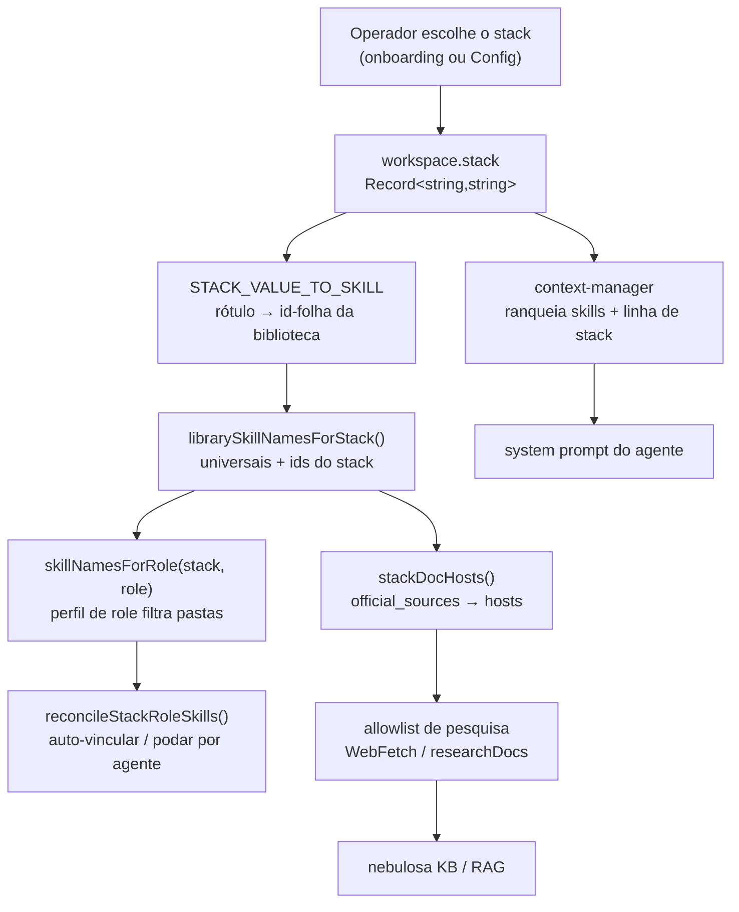
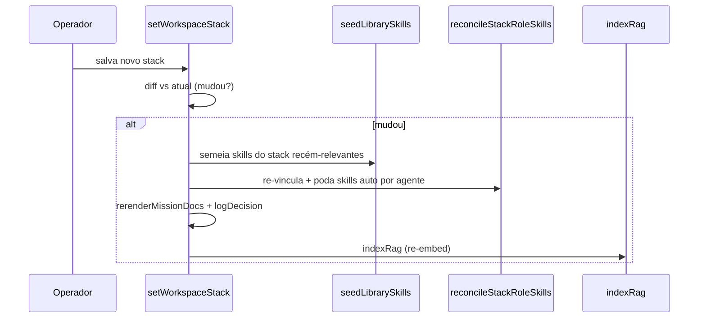

[← Índice](./README.md) · [🇬🇧 English](../en/PROJECT_STACKS.md) · [✦ Constella](../../README.pt-BR.md)

# Project Stacks 🪐


O **project stack** é a carta estelar tecnológica de um workspace: um pequeno mapa de qual linguagem, runtime, framework, banco de dados, ORM, estilização, testes e infra sustentam o produto. A partir dessa carta a Constella decide quais **skills** nativas orbitam cada agente, quais hosts de documentação oficial sua **pesquisa web** pode alcançar, e que cores de fundo pintam a nebulosa de memória **RAG** e cada system prompt. Escolha o stack uma vez; toda a constelação se realinha.

## Quando usar

- Durante o **onboarding** — você escolhe o stack (ou ele é inferido de um projeto importado) antes do primeiro plano.
- Sempre que as fundações do produto mudarem — adotar um novo framework, trocar de banco, adicionar uma fila — abra **Config → Project Stacks** e salve de novo. Cada agente é re-vinculado, os docs que carregam o stack são re-renderizados e o RAG re-indexa.
- Quando um agente insiste nos idiomas do framework *errado*: o stack é o que diz ao Frontend de um projeto Vue para carregar `vue`, não `react`.

## Como funciona

Um stack é um mapa JSON simples armazenado na linha do workspace:

```ts
// src/db/schema.ts → workspace
stack: text("stack", { mode: "json" }).$type<Record<string, string>>().notNull().default({}),
```

As chaves são **chaves de categoria** (`language`, `runtime`, `frontend`, …); os valores são os **rótulos das opções do catálogo** que o operador escolheu (`"TypeScript"`, `"Next.js"`, `"PostgreSQL"`, `"None"`). O catálogo de categorias e suas opções vive em `src/data/stack-catalog.ts` (`STACK_CATS` — 16 categorias, cada opção com uma descrição de uma linha via `descFor`).

Esse mapa alimenta três sistemas a jusante:

1. **Skills** — `STACK_VALUE_TO_SKILL` (em `src/data/stack-skill-map.ts`) mapeia cada rótulo do catálogo para um id-folha da biblioteca `skills/` (`"Next.js" → "nextjs"`). `librarySkillNamesForStack(stack)` e `skillNamesForRole(stack, role)` (em `src/server/skills-library.ts`) transformam o stack no conjunto exato de skills que cada agente deve carregar.
2. **Pesquisa web** — `stackDocHosts(stack)` lê os `official_sources` das skills do stack e produz os hostnames de documentação que a allowlist central (`src/server/research.ts`) permitirá.
3. **Contexto + RAG** — `src/server/context-manager.ts` ranqueia as skills habilitadas de um agente por relevância ao stack e escreve uma linha-resumo `stack: …` no system prompt; `setWorkspaceStack` re-indexa o RAG numa mudança real.

## Fluxo principal 🌌



## Conceitos-chave

| Conceito | O que é | Fonte |
| --- | --- | --- |
| **Stack** | `Record<string,string>` de categoria → rótulo escolhido, em `workspace.stack` | `src/db/schema.ts` |
| **Catálogo** | `STACK_CATS` — as 16 categorias + opções exibidas na UI | `src/data/stack-catalog.ts` |
| **`STACK_VALUE_TO_SKILL`** | rótulo → id-folha de `skills/`; `"None"`/ausente = sem skill | `src/data/stack-skill-map.ts` |
| **Skill da biblioteca** | um `SKILL.md` sob `skills/` na raiz, chaveado pelo **nome da pasta-folha** | `src/server/skills-library.ts` |
| **Perfil de role** | quais pastas da biblioteca um role auto-vincula (`stackPrefixes` vs `allPrefixes` + `core`) | `src/data/role-skill-profile.ts` |
| **Vínculo `auto`** | `agent_skill.auto = true` → gerenciado pelo sistema (reconcile pode tocar); `false` → toggle manual do operador (nunca tocado) | `src/db/schema.ts` |
| **Reconciliação** | `reconcileStackRoleSkills(wsId)` — re-vincula/poda skills auto para casar com stack+role | `src/server/seed-library-skills.ts` |
| **Compatibilidade** | `incompat()` / `stackNote()` — desabilita escolhas incoerentes, avisa sobre redundância | `src/lib/stack-compat.ts` |

### Do valor do stack a uma skill da biblioteca

`STACK_VALUE_TO_SKILL` é um dicionário plano. Uma **entrada ausente** ou o literal `"None"` resolve para nenhuma skill (ignorada). O loader da biblioteca de skills filtra ainda cada id mapeado para os que **realmente existem em disco** — então um mapeamento aspiracional sem `SKILL.md` degrada silenciosamente para um no-op.

```ts
// src/data/stack-skill-map.ts (trecho)
"Next.js": "nextjs", React: "react", Vue: "vue", Django: "django",
PostgreSQL: "postgresql", Drizzle: "drizzle", "Tailwind CSS": "tailwind",
Playwright: "playwright", Docker: "docker", "Auth.js": "authjs",
```

### Universal vs stack vs role

- **Skills universais** (`UNIVERSAL_SKILL_NAMES`, ~23) vão para *todo* workspace, independente do stack — clean-code, git-workflow, OWASP, pirâmide de testes, princípios de UI/UX, os rituais de processo, `research-official-docs`, etc.
- **Skills do stack** são os ids que `STACK_VALUE_TO_SKILL` produz a partir das opções escolhidas.
- **Filtragem por role** decide *qual* agente recebe *qual* skill do stack. `skillNamesForRole(stack, role)` consulta `roleProfile(role)`: as pastas `allPrefixes` de um role são vinculadas por inteiro (boas práticas de design/engenharia/processo), enquanto as pastas `stackPrefixes` são vinculadas **só para as escolhas que o stack de fato selecionou** — então o Frontend de um projeto Vue recebe `vue`, nunca `react` + `svelte`.

```ts
// src/server/skills-library.ts → skillNamesForRole
for (const [name, sk] of index) {
  if (prof.allPrefixes.some((p) => sk.relPath.startsWith(p))) out.add(name);
  else if (prof.stackPrefixes.some((p) => sk.relPath.startsWith(p)) && stackSet.has(name)) out.add(name);
}
```

## Tabelas

### Categorias do stack (`STACK_CATS`)

| Chave | Rótulo | Opções de exemplo |
| --- | --- | --- |
| `language` | Language | TypeScript, Python, Go, Rust, Java, … |
| `runtime` | Runtime | Node.js, Bun, Deno, Python 3, JVM, .NET |
| `frontend` | Frontend | React, Vue, Svelte, Angular, SolidJS, … |
| `meta` | Meta-framework / SSG | Next.js, Nuxt, Remix, SvelteKit, Astro, … |
| `backend` | Backend framework | NestJS, Express, Django, FastAPI, Rails, … |
| `mobile` | Mobile | React Native, Flutter, Android, Ionic |
| `database` | Database | PostgreSQL, MySQL, SQLite, MongoDB, Redis |
| `orm` | ORM / Data layer | Prisma, Drizzle, TypeORM, SQLAlchemy, GORM |
| `styling` | Styling / UI | Tailwind CSS, CSS Modules, styled-components |
| `testing` | Testing | Jest, Vitest, Cypress, Playwright, Selenium |
| `aiml` | AI / ML | TensorFlow, PyTorch, scikit-learn, Pandas |
| `dataviz` | Data viz | D3, Chart.js, Grafana, Plotly |
| `container` | Container | Docker, Podman, containerd |
| `infra` | Infra / DevOps | Tailscale, Vercel, AWS, Kubernetes, Terraform |
| `baas` | Backend-as-a-service | Firebase, Appwrite, Amplify, Heroku, Supabase |
| `queue` | Queue / Cache | Redis, BullMQ, RabbitMQ, Kafka, Celery |
| `auth` | Auth | Auth.js, Clerk, Lucia, Keycloak, Auth0 |

> Cada categoria também oferece `"None"` (pular esta categoria — sem skill). Nem toda opção do catálogo tem entrada em `STACK_VALUE_TO_SKILL`; escolhas não mapeadas simplesmente não contribuem com skill de stack (mas ainda aparecem na linha de stack e nos docs).

### Filtragem role → pasta de stack (`role-skill-profile.ts`)

| Match do role | `stackPrefixes` (filtrado pelo stack) | `core` fixado (assinatura) |
| --- | --- | --- |
| CEO | *(nenhum)* | app-planning, requirements-to-specs, specs-to-issues, architecture-before-code |
| Product Owner | *(nenhum)* | product-discovery, requirements-to-specs, specs-to-issues, prioritization-moscow-rice |
| CTO | `stacks/` (tudo) | system-design-fundamentals, software-architecture-patterns, … |
| Frontend | `stacks/frontend/` `stacks/styling/` `stacks/meta/` `stacks/mobile/` `stacks/testing/` | design-systems, ui-ux-principles, responsive-layout, … |
| Backend | `stacks/backend/` `stacks/database/` `stacks/orm/` `stacks/queue/` `stacks/runtime/` `stacks/baas/` `stacks/auth/` | backend-fundamentals, api-design-rest-graphql, data-modeling, auth-and-authorization |
| Security | `stacks/auth/` | owasp-top-10, owasp-asvs, secrets-management, secure-auth-sessions |
| QA | `stacks/testing/` | testing-strategy-pyramid, tdd-and-coverage, unit-integration-e2e |
| DevOps | `stacks/infra/` `stacks/container/` `stacks/runtime/` | scalability-reliability, secrets-management |
| Docs | `stacks/` (tudo) | readme-generation |
| *(default)* | `stacks/` | *(nenhum)* |

### Colunas do vínculo `agent_skill`

| Coluna | Significado |
| --- | --- |
| `agentId`, `skillId` | chave primária composta (o vínculo) |
| `auto` | `true` = gerenciado pelo sistema (auto-vínculo por stack/role, reconciliado no boot e na mudança de stack); `false` = toggle manual do operador na UI → **reconcile nunca toca nele** |

## Reconciliação 🛰️

`reconcileStackRoleSkills(wsId)` (em `src/server/seed-library-skills.ts`) é a função idempotente e sem-LLM que re-alinha as skills auto-gerenciadas de cada agente com o stack + role atual. Ela roda:

- no **boot** (via `reconcileOnBoot` → `seedLibrarySkillsForExistingWorkspaces`),
- durante o **onboarding** (após semear a biblioteca inteira), e
- em toda **mudança de stack** (`setWorkspaceStack`).

Para cada agente ela computa `desired = skillNamesForRole(stack, role)`, e então:

- **Poda** qualquer vínculo `auto` para uma skill *da biblioteca* que caia fora do perfil do role para o stack atual (toggles manuais e as skills procedurais fora da biblioteca como `open-pr`/`run-suite` ficam intactos).
- **Adiciona** as skills desejadas do role ainda não vinculadas, inserindo-as com `auto: true` (`onConflictDoNothing`).

```ts
// src/server/seed-library-skills.ts → reconcileStackRoleSkills (trecho)
const desired = new Set(skillNamesForRole(stack, a.role).filter((n) => idByName.has(n)));
// poda vínculos AUTO para skills da BIBLIOTECA fora do perfil deste role
if (l.auto && nm && libNames.has(nm) && !desired.has(nm)) { /* delete */ }
// adiciona as skills do role ainda não vinculadas
if (sid && !present.has(sid)) { /* insert auto:true */ }
```

A biblioteca nativa inteira (180+ skills) é **semeada** em todo workspace para aparecer em `/skills`, mas apenas o subconjunto stack+role é **auto-vinculado** a cada agente. O resto fica disponível para o operador habilitar à mão.



## Passo a passo

### Definir ou mudar um stack

1. Vá em **Config → Project Stacks** (o `StackEditor`, `src/components/modules/stack-editor.tsx`).
2. Escolha uma opção por categoria. Escolhas incoerentes ficam desabilitadas com um motivo (ex.: escolher um backend Python sob uma linguagem JS mostra *"Requires a Python language"*); uma nota de redundância pode surgir (ex.: *"Django already ships its own ORM"*).
3. Clique em **Save stack & reload skills** → chama `setWorkspaceStack(sel)`.
4. Numa mudança real o servidor semeia novas skills de stack, roda `reconcileStackRoleSkills`, re-renderiza os docs que carregam o stack, registra uma decisão e re-indexa o RAG.
5. A UI confirma: *"Saved — agents re-linked to the new stack."*

### Stack inferido na importação

Quando o onboarding **importa** um repo existente, diretório local ou mock visual, o primeiro plano analisa o projeto arquivo por arquivo (`src/server/analyze.ts`) e escreve uma seção "Tech stack & dependencies" em `specs/SUPER-SPEC.md`. Para um mock puramente visual, o analisador é instruído a **inferir** o tech stack pretendido a partir do markup/estilos/scripts e declará-lo explicitamente para que o plano o adote.

## Exemplos

Um app TypeScript Next.js + Postgres + Drizzle + Tailwind + Playwright:

```json
{
  "language": "TypeScript",
  "runtime": "Node.js",
  "frontend": "React",
  "meta": "Next.js",
  "database": "PostgreSQL",
  "orm": "Drizzle",
  "styling": "Tailwind CSS",
  "testing": "Playwright",
  "container": "Docker",
  "auth": "Auth.js"
}
```

Ids de skill resolvidos (`STACK_VALUE_TO_SKILL`): `typescript, node, react, nextjs, postgresql, drizzle, tailwind, playwright, docker, authjs` — mais as ~23 universais. O agente **Frontend** auto-vincula `react`, `nextjs`, `tailwind`, `playwright` + todo `design/`; o agente **Backend** auto-vincula `postgresql`, `drizzle`, `node`, `authjs`; o agente **CyberSec** auto-vincula `authjs` + todo `engineering/security/`.

`stackDocHosts(stack)` então expandiria a allowlist de pesquisa com os hosts de `official_sources` dessas skills (ex.: `nextjs.org`, `tailwindcss.com`, `orm.drizzle.team`), além de `BASE_DOC_HOSTS`.

## Estados possíveis

| Estado | O que significa |
| --- | --- |
| `stack = {}` | Vazio (default). Só skills universais vinculam; a allowlist de pesquisa é só o conjunto base. |
| Categoria = `"None"` | Essa categoria não contribui com skill nem host de docs. |
| Mapeado + em disco | O id de skill resolve e o `SKILL.md` existe → semeado + filtrado por role. |
| Mapeado mas sem `SKILL.md` | Filtrado por `index.has(n)` → no-op silencioso. |
| Opção de catálogo não mapeada | Sem skill de stack, mas ainda exibida na linha de stack do prompt + docs. |
| Escolha incompatível | `incompat()` retorna um motivo → o card da opção fica desabilitado no editor. |

## Integrações relacionadas

- **[Skills](./SKILLS.md)** — a biblioteca nativa, semeadura, o vínculo `auto`, skills provisórias, toggles.
- **[Agents](./AGENTS.md)** — o roster de 10 funções cujos roles alimentam `roleProfile`.
- **[KB & RAG](./KB_RAG.md)** · **[Memory RAG](./MEMORY_RAG.md)** — a nebulosa de memória que re-indexa na mudança de stack.
- **[AI Architecture](./AI_ARCHITECTURE.md)** — como o context-manager ranqueia as skills do stack no prompt.
- **[Onboarding](./ONBOARDING.md)** — onde o stack é escolhido ou inferido pela primeira vez.
- **[Plugins](./PLUGINS.md)** · **[Models](./MODELS.md)** — superfícies de capacidade adjacentes.

## Segurança 🕳️

- O stack é **dado controlado pelo operador**, nunca gravável por agente: vive no DB e só é editado via a server action `setWorkspaceStack` (atrás de `requireWorkspace`).
- `stackDocHosts` amplia a allowlist de pesquisa *apenas* para hosts declarados em `official_sources` de frontmatter confiável — agentes não podem buscar URLs arbitrárias via `researchDocs` (gate `hostAllowed`, `src/server/research.ts`).
- A reconciliação nunca apaga toggles manuais do operador (`auto: false`) nem as skills procedurais (fora da biblioteca) — uma mudança de stack não pode remover silenciosamente uma capacidade que você ligou à mão.

## Resolução de problemas

| Sintoma | Causa provável | Correção |
| --- | --- | --- |
| Um agente ignora o framework escolhido | Skill de stack não vinculada / não está em disco | Confirme que o id de `STACK_VALUE_TO_SKILL` tem um `SKILL.md`; salve o stack de novo para re-rodar o reconcile. |
| Skill do framework errado fica aparecendo | Vínculo auto obsoleto, ou é um toggle manual | Salve o stack de novo (poda autos obsoletos); se for manual (`auto:false`), desative-o em `/skills`. |
| Pesquisa bloqueada num host de docs | Host fora de `BASE_DOC_HOSTS` e de qualquer `official_sources` | Adicione o host ao `official_sources` do `SKILL.md` relevante. |
| Editor desabilita uma opção | Mismatch de família em `incompat()` | Alinhe as escolhas de language/runtime/backend/orm (ver `stack-compat.ts`). |
| Skills não mudaram após salvar | Valor de stack idêntico (sem diff) | `setWorkspaceStack` só reconcilia numa mudança real; escolha um valor diferente. |

## Links relacionados

- [Skills](./SKILLS.md)
- [Agents](./AGENTS.md)
- [AI Architecture](./AI_ARCHITECTURE.md)
- [KB & RAG](./KB_RAG.md)
- [Memory RAG](./MEMORY_RAG.md)
- [Onboarding](./ONBOARDING.md)
- [Configuration](./CONFIGURATION.md)
- [Models](./MODELS.md)
- [Plugins](./PLUGINS.md)
