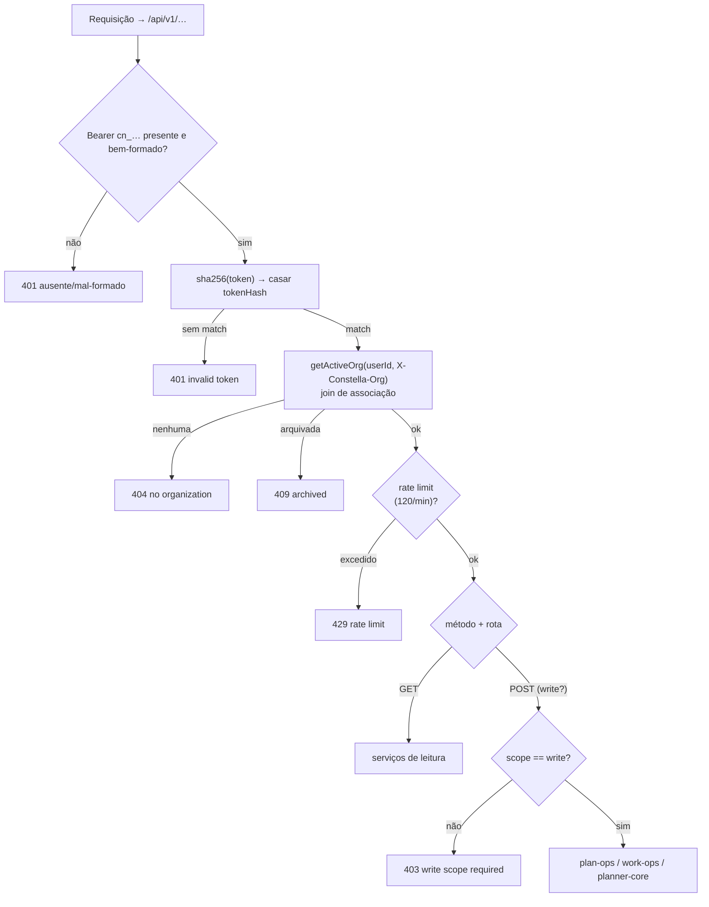

[← Índice](./README.md) · [🇬🇧 English](../en/PUBLIC_API.md) · [✦ Constella](../../README.pt-BR.md)

# 🛰️ API Pública — pilotando a nave a partir da órbita


Uma superfície REST pequena e honesta (`/api/v1`) que permite a sistemas externos — scripts, jobs de CI, um celular ou um servidor MCP — ler o estado do projeto e guiar a constelação sem uma sessão de navegador. Uma única credencial bearer (um **Personal Access Token**), um único dispatcher, um único envelope de erro.

---

## Quando usar ✦

Use a API Pública quando quiser dirigir o Constella **de fora** da UI web:

- Um **pipeline de CI** que aprova um plano ou liga a execução 24/7 após um build verde.
- Um **script de celular / shell** que consulta a revisão matinal e as contagens.
- Um **host MCP** (Claude Desktop, Cursor, …) — o servidor MCP incluído (veja [MCP.md](./MCP.md)) é um wrapper fino, de saída, exatamente sobre estas rotas v1.
- Um **painel de status** que lista goals, issues, tasks ou specs.
- Perguntar à **Base de Conhecimento** de forma programática.

Se, em vez disso, você quiser que um host de IA externo *consuma* o Constella como ferramentas, você não chama estas rotas à mão — você aponta o servidor MCP para elas. As duas coisas são a mesma superfície vista de duas distâncias.

---

## Como funciona 🌌

A API inteira é **uma única rota catch-all dinâmica**: `src/app/api/v1/[[...path]]/route.ts`. Ela exporta apenas `GET` e `POST`; ambos afunilam para uma única função `dispatch()`, de modo que **autenticação, escopo, rate-limit e o envelope de resposta vivem em exatamente um lugar**.

As mutações **não** reinventam lógica. Elas reutilizam os mesmos cores sem-sessão que o controle remoto via Telegram usa:

- `approvePlanFor`, `setAuto247For`, `requestPlanChangesFor`, `reviewSummaryFor` → `src/server/plan-ops.ts`
- `cancelGoalFor`, `archiveGoalFor` → `src/server/work-ops.ts`
- `startNewWorkFor` → `src/server/planner-core.ts`
- `kbAnswer` → `src/server/kb.ts`
- Leituras estruturadas (`apiStatus`, `apiGoals`, `apiIssues`, `apiTasks`, `apiSpecs`) → `src/server/api/service.ts`

Não há **sessão nem cookie** nas rotas v1. A única credencial é o PAT. A rota também define `runtime = "nodejs"` e `dynamic = "force-dynamic"` (ela acessa o banco a cada requisição).

### Envelope de resposta

Toda resposta é JSON com um formato uniforme:

| Campo   | Tipo      | Significado                              |
| ------- | --------- | ---------------------------------------- |
| `ok`    | `boolean` | `true` em sucesso, `false` em erro       |
| `data`  | qualquer  | presente quando `ok: true`               |
| `error` | `string`  | presente quando `ok: false`              |

```jsonc
// sucesso
{ "ok": true, "data": { /* … */ } }
// erro
{ "ok": false, "error": "this token has read scope; a write-scope token is required" }
```

---

## Autenticação 🔑 — Personal Access Tokens (`cn_…`)

Um PAT é gerado na UI web (`createPAT` em `src/server/actions/profile-actions.ts`) e armazenado **com hash**, nunca em texto puro.

```ts
// profile-actions.ts (geração)
const raw = "cn_" + randomBytes(24).toString("base64url");
const tokenHash = createHash("sha256").update(raw).digest("hex");
// armazenado: { tokenHash, prefix: raw.slice(0,7), scope, name, userId }
```

Propriedades principais:

- **Formato** — `cn_` seguido de uma string base64 URL-safe (24 bytes aleatórios). A rota aceita `cn_[A-Za-z0-9_-]{8,}`.
- **Exibido uma vez** — o valor bruto `cn_…` é retornado por `createPAT` e exibido uma única vez. Apenas seu **hash SHA-256** (`tokenHash`) e um `prefix` de exibição de 7 caracteres (ex.: `cn_a1b2`) são persistidos na tabela `personalAccessToken`. Se você o perder, gere um novo.
- **Nunca registrado em log** — `authenticatePAT` apenas calcula o hash do token recebido e compara o hash; o token em texto puro nunca chega a uma linha de log.
- **Escopo** — `read` (padrão) ou `write`. Leituras são abertas a qualquer token válido; mutações exigem `write`.
- **Carimbo de uso** — toda chamada autenticada atualiza, em best-effort, o `lastUsedAt` (uma falha de escrita nunca bloqueia a autenticação).

### O handshake (`authenticatePAT`)

`src/server/api/pat-auth.ts` roda a cada requisição:

1. Faz parse de `Authorization: Bearer cn_…`. Mal-formado → **401** `missing or malformed bearer token`.
2. Calcula o SHA-256 do token e o busca por `tokenHash`. Sem correspondência → **401** `invalid token`.
3. Resolve a org do dono do token via `getActiveOrg(userId, X-Constella-Org)`. Isto é um **join de associação** — um valor de `X-Constella-Org` ao qual o usuário não pertence é *ignorado* (cai de volta na primeira org dele), então um token nunca pode ser apontado para um tenant alheio. Sem org → **404**.
4. Org arquivada → **409** `organization is archived`.
5. Resolve o workspace da org via `getWorkspace`. Nenhum → **404**.

Em caso de sucesso, a requisição carrega `{ userId, tokenId, scope, org, workspace }`.

### `X-Constella-Org`

Header opcional. Se um usuário pertence a múltiplas organizações, defina `X-Constella-Org: <orgId>` para escolher sobre qual delas o token atua. Omitido (ou inválido) → a **primeira** org do usuário. A escolha é sempre validada através do join de associação.

---

## Limite de taxa 🪐

Uma **janela deslizante de 60 segundos**, em best-effort, indexada por `tokenId`, vive em memória no único processo de servidor Next:

```ts
const RL_MAX = 120; // requisições por token por 60s
```

Ultrapassá-lo retorna **429** `rate limit exceeded (120 req/min)`. Como o contador é em memória, um reinício do servidor o zera — aceitável para o design de operador único. Não há limite por IP nem header `Retry-After`.

---

## Fluxo de autorização 🌠



---

## Endpoints 📡

A Base URL é o host do seu Constella, ex.: `http://localhost:3000/api/v1`. Todas as rotas exigem o header `Authorization`; rotas de escrita exigem adicionalmente um token de escopo `write`.

### GET (escopo de leitura basta)

| Método | Caminho             | Retorna                                                           |
| ------ | ------------------- | ---------------------------------------------------------------- |
| GET    | `/api/v1` ou `/me`  | `{ user, org{id,name}, workspace{id,name,slug}, scope }`         |
| GET    | `/api/v1/status`    | contagens: goals, issues (`byCol`), tasks (`byCol`), resumo do plano |
| GET    | `/api/v1/review`    | `{ text }` — o resumo de revisão estilo mobile (`reviewSummaryFor`) |
| GET    | `/api/v1/goals`     | `[{ id, title, status, progress }]`                              |
| GET    | `/api/v1/issues`    | `[{ id, key, title, col, prio, points, moscow, approved }]`      |
| GET    | `/api/v1/tasks`     | `[{ id, key, title, col, prio }]`                                |
| GET    | `/api/v1/specs`     | `[{ id, key, title, status, approved }]`                         |
| GET    | `/api/v1/kb?q=…`    | `{ text, sources }` — resposta da Base de Conhecimento (`kbAnswer`) |

### POST (escopo de escrita, exceto `kb`)

| Método | Caminho                       | Corpo                      | Efeito                                              |
| ------ | ----------------------------- | -------------------------- | --------------------------------------------------- |
| POST   | `/api/v1/plan/approve`        | —                          | Aprova o plano, enfileira tasks (`approvePlanFor`)  |
| POST   | `/api/v1/plan/reject`         | `{ reason? }`              | Devolve o plano com notas (`requestPlanChangesFor`) |
| POST   | `/api/v1/execution`           | `{ on?: boolean }`         | Liga/desliga execução autônoma 24/7 (`setAuto247For`) — padrão `on:true` |
| POST   | `/api/v1/work`                | `{ brief, title? }`        | Inicia uma nova unidade de trabalho (`startNewWorkFor`) |
| POST   | `/api/v1/goals/{id}/cancel`   | —                          | Cancela um goal (`cancelGoalFor`)                   |
| POST   | `/api/v1/goals/{id}/archive`  | —                          | Arquiva um goal (`archiveGoalFor`)                  |
| POST   | `/api/v1/kb`                  | `{ q }`                    | Resposta da Base de Conhecimento — **quase-leitura, não exige escopo write** |

> `POST /api/v1/kb` é a exceção deliberada: não muta nada, então não exige um token `write`. Todo outro POST exige.

---

## Exemplos 🌠

Exporte seu token uma vez:

```bash
export CN_TOKEN="cn_xxxxxxxxxxxxxxxxxxxxxxxx"
export CN_BASE="http://localhost:3000/api/v1"
```

### Quem sou eu

```bash
curl -s "$CN_BASE/me" -H "Authorization: Bearer $CN_TOKEN"
# { "ok": true, "data": { "user": "…", "org": { "id": "…", "name": "Acme" },
#   "workspace": { "id": "…", "name": "web", "slug": "web" }, "scope": "write" } }
```

### Status do projeto e revisão matinal

```bash
curl -s "$CN_BASE/status" -H "Authorization: Bearer $CN_TOKEN"
curl -s "$CN_BASE/review" -H "Authorization: Bearer $CN_TOKEN"
```

### Listar boards

```bash
curl -s "$CN_BASE/goals"  -H "Authorization: Bearer $CN_TOKEN"
curl -s "$CN_BASE/issues" -H "Authorization: Bearer $CN_TOKEN"
curl -s "$CN_BASE/tasks"  -H "Authorization: Bearer $CN_TOKEN"
curl -s "$CN_BASE/specs"  -H "Authorization: Bearer $CN_TOKEN"
```

### Perguntar à Base de Conhecimento

```bash
# Forma GET (query string)
curl -s "$CN_BASE/kb?q=como%20tratamos%20auth" -H "Authorization: Bearer $CN_TOKEN"

# Forma POST (corpo JSON) — também não exige escopo write
curl -s -X POST "$CN_BASE/kb" \
  -H "Authorization: Bearer $CN_TOKEN" -H "Content-Type: application/json" \
  -d '{"q":"como tratamos auth"}'
```

### Aprovar / rejeitar um plano (escopo write)

```bash
curl -s -X POST "$CN_BASE/plan/approve" -H "Authorization: Bearer $CN_TOKEN"

curl -s -X POST "$CN_BASE/plan/reject" \
  -H "Authorization: Bearer $CN_TOKEN" -H "Content-Type: application/json" \
  -d '{"reason":"dividir a issue de auth em duas"}'
```

### Alternar execução 24/7 (escopo write)

```bash
curl -s -X POST "$CN_BASE/execution" \
  -H "Authorization: Bearer $CN_TOKEN" -H "Content-Type: application/json" \
  -d '{"on":true}'
# { "ok": true, "data": { "auto247": true } }
```

### Lançar novo trabalho (escopo write) 🚀

```bash
curl -s -X POST "$CN_BASE/work" \
  -H "Authorization: Bearer $CN_TOKEN" -H "Content-Type: application/json" \
  -d '{"title":"Reset de senha","brief":"Adicionar um fluxo de esqueci-a-senha com tokens por e-mail"}'
```

### Cancelar / arquivar um goal (escopo write) 🕳️

```bash
curl -s -X POST "$CN_BASE/goals/$GOAL_ID/cancel"  -H "Authorization: Bearer $CN_TOKEN"
curl -s -X POST "$CN_BASE/goals/$GOAL_ID/archive" -H "Authorization: Bearer $CN_TOKEN"
```

### Apontar um token para uma org específica

```bash
curl -s "$CN_BASE/status" \
  -H "Authorization: Bearer $CN_TOKEN" \
  -H "X-Constella-Org: $ORG_ID"
```

---

## Estados possíveis 🛰️

| HTTP | `error`                                                   | Causa                                                      |
| ---- | -------------------------------------------------------- | ---------------------------------------------------------- |
| 200  | —                                                        | sucesso (`ok: true`)                                       |
| 400  | `missing ?q=` / `missing body.q`                         | consulta de KB sem pergunta                                |
| 400  | `could not start work` (ou mensagem do core)            | `POST /work` com `brief` vazio                             |
| 401  | `missing or malformed bearer token`                      | sem `Authorization`, ou não é `Bearer cn_…`               |
| 401  | `invalid token`                                          | hash do token não está em `personalAccessToken`           |
| 403  | `this token has read scope; a write-scope token is required` | rota de mutação com um token `read`                    |
| 404  | `no organization for this token's user`                  | dono do token não tem org                                 |
| 404  | `no workspace for the organization`                      | org não tem workspace                                     |
| 404  | `unknown GET /…` / `unknown POST /…` / `goal not found`  | rota inválida ou goal inexistente                        |
| 409  | `organization is archived`                               | a org por trás do token está arquivada                    |
| 429  | `rate limit exceeded (120 req/min)`                      | mais de 120 requisições/token em 60s                      |
| 500  | (mensagem de erro)                                       | exceção inesperada (capturada na borda `GET`/`POST`)      |

---

## Integrações relacionadas 🌌

- **[MCP.md](./MCP.md)** — o servidor MCP de saída (`scripts/mcp-server.mjs`) é um wrapper stdio sobre exatamente estas rotas; um host de IA externo dirige o Constella através dele usando o mesmo PAT `cn_…`.
- **[TELEGRAM.md](./TELEGRAM.md)** — o controle remoto via Telegram compartilha os mesmíssimos cores sem-sessão (`plan-ops.ts`, `work-ops.ts`, `planner-core.ts`).
- **[CHAT_COMMANDS.md](./CHAT_COMMANDS.md)** — os comandos com barra mapeiam para as mesmas ações que você alcança via HTTP aqui.
- **[WORKFLOW.md](./WORKFLOW.md)** / **[GOALS_SPECS_ISSUES.md](./GOALS_SPECS_ISSUES.md)** — o ciclo de vida Goal → Spec → Issue → Plan sobre o qual `status`, `plan/approve` e `work` operam.

---

## Segurança 🕳️

- **Hash em repouso** — apenas o `tokenHash` SHA-256 e um `prefix` de exibição de 7 caracteres são armazenados; o `cn_…` bruto é exibido uma vez e nunca persistido ou registrado.
- **Isolamento de tenant** — `getActiveOrg` faz join através de `member`, então um token só pode atuar em orgs às quais seu dono pertence; um `X-Constella-Org` forjado é silenciosamente ignorado.
- **Portão de escopo** — toda mutação chama `needWrite()` e retorna **403** para tokens `read`. O único POST que pula isso é `/kb` (uma leitura pura).
- **Revogação** — `revokePAT` (UI de perfil) apaga a linha; a próxima requisição com aquele token recebe **401 invalid token**.
- **Sem vazamento de sessão** — as rotas v1 nunca leem cookies ou sessões; uma sessão de navegador roubada não pode ser reproduzida aqui, e um PAT roubado não alcança a UI web autenticada.
- **Transporte** — não há TLS embutido. Sob os modos `start`/`auth`, o servidor escuta em loopback (`127.0.0.1`); para `vps`/`portable` (bind `0.0.0.0`), coloque-o atrás de um proxy reverso TLS / tailnet e trate o PAT como uma senha. Veja [SECURITY.md](./SECURITY.md), [VPS_MODE.md](./VPS_MODE.md).

---

## Solução de problemas 🛠️

| Sintoma                                   | Causa provável / correção                                                          |
| ----------------------------------------- | ---------------------------------------------------------------------------------- |
| `401 missing or malformed bearer token`   | O header deve ser exatamente `Authorization: Bearer cn_…`; verifique espaço/aspas extras. |
| `401 invalid token`                       | Token revogado ou digitado errado. Gere um novo em **Profile → Personal Access Tokens**; é exibido uma vez. |
| `403 … write-scope token is required`     | Você usou um token `read` numa mutação. Crie um token de escopo `write`.           |
| `404 no organization` / `no workspace`    | O usuário do token ainda não tem org/workspace — conclua o [ONBOARDING.md](./ONBOARDING.md). |
| `409 organization is archived`            | Desarquive a org, ou use um token cuja org esteja ativa.                           |
| `429 rate limit exceeded`                 | Você cruzou 120 req/min para aquele token; reduza o ritmo (janela deslizante de 60s). |
| Dados da org errada retornados            | Passe `X-Constella-Org: <orgId>`; um valor inválido cai de volta na primeira org.  |
| `400 missing ?q=` / `missing body.q`      | A KB precisa de uma pergunta não vazia — `?q=…` no GET, `{"q":"…"}` no POST.       |
| Conexão recusada de outra máquina         | Nos modos `start`/`auth` o servidor é apenas loopback; use `vps`/`portable` ou um proxy. |

---

## Links relacionados

- [MCP.md](./MCP.md) — servidor MCP de saída sobre estas rotas
- [TELEGRAM.md](./TELEGRAM.md) — controle remoto via Telegram (cores compartilhados)
- [CHAT_COMMANDS.md](./CHAT_COMMANDS.md) — comandos com barra
- [WORKFLOW.md](./WORKFLOW.md) — o ciclo de vida do trabalho
- [GOALS_SPECS_ISSUES.md](./GOALS_SPECS_ISSUES.md) — goals, specs, issues
- [SECURITY.md](./SECURITY.md) — vault, segredos, autenticação
- [VPS_MODE.md](./VPS_MODE.md) · [PORTABLE_MODE.md](./PORTABLE_MODE.md) — binds remoto / portátil
- [CONFIGURATION.md](./CONFIGURATION.md) — variáveis de ambiente e portas
