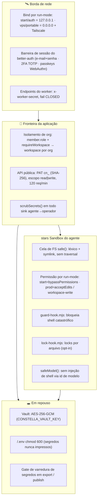

[← Índice](./README.md) · [🇬🇧 English](../en/SECURITY.md) · [✦ Constella](../../README.pt-BR.md)

# Segurança 🕳️

> Os escudos ao redor da nave central. Agentes autônomos executam CLIs *reais* num workspace *real*, então cada camada aqui é estrutural — uma cela de sistema de arquivos mantém cada constelação em sua própria órbita, um cofre criptografa segredos em repouso, scrubbers removem credenciais antes que escapem da gravidade, e a autenticação reforçada guarda a porta da frente.

A Constella executa agentes autônomos que conduzem `claude` / `codex` (e outros) CLIs como subprocessos, com acesso de edição e (no modo `start`) shell completo a um diretório de projeto real. Nada é sandbox de mentira — a segurança vem de controles concretos e em camadas. Esta página documenta o que o código realmente aplica, arquivo por arquivo.

---

## ✦ Quando usar esta página

- Você vai implantar a Constella onde mais de um humano (ou a internet aberta) pode alcançá-la — leia **Auth**, **Worker secret**, **guarda SSRF**.
- Você quer entender o **raio de explosão do agente**: o que um agente pode e não pode fazer ao host (cela de FS, command guard, sandbox por run-mode).
- Você está auditando como **segredos** são armazenados, criptografados e impedidos de vazar (Vault, scrub, gates de varredura de segredos).
- Você está revisando o modelo de ameaças antes de publicar (modos `vps` / `portable`).

---

## 🌌 Como funciona — defesa em profundidade

A Constella empilha controles independentes para que nenhuma falha isolada seja catastrófica. O modelo que um agente executa já é instruído (cláusula de prompt-injection) a nunca revelar segredos nem rodar comandos destrutivos; cada controle abaixo é *belt-and-suspenders* aplicado na fronteira, jamais confiando apenas no modelo.

---

## 🪐 Fluxo principal

1. **Boot** — o launcher (`bin/constella.mjs`) gera e persiste três segredos reais em `<HOME>/.env` (modo `0600`): `BETTER_AUTH_SECRET`, `CONSTELLA_VAULT_KEY`, `CONSTELLA_WORKER_SECRET`. Eles nunca são impressos.
2. **Barreira de auth** — o modo `start` autentica automaticamente um operador local (apenas loopback); `auth` / `vps` / `portable` exigem uma credencial real (`assertAuthSecret()` falha fechado sem uma chave de assinatura).
3. **Requisição → workspace** — `requireWorkspace()` resolve a org ativa por um join em `member`; todo acesso ao sistema de arquivos passa por `safe()`, que indexa pelo `organization.id` estável e recusa traversal.
4. **Execução do agente** — o runner spawna o CLI dentro do `cwd` do workspace da org. O run-mode escolhe o nível de permissão; hooks PreToolUse (`guard-hook.mjs`, `lock-hook.mjs` opcional) ficam na frente de todo Bash/Write/Edit.
5. **Resposta → operador** — qualquer texto que um agente possa ecoar passa por `scrubSecrets()` antes de chegar ao Telegram, à Team Room, a DMs, notificações ou à API pública.
6. **Export / publish** — uma árvore limpa é montada e um gate de varredura de segredos bloqueia a operação a *qualquer* achado.

---

## 🌠 Conceitos-chave

| Conceito | Onde | Garantia em uma linha |
| --- | --- | --- |
| **Cela de FS** | `src/lib/fs-workspace.ts` `safe()` | Nenhum caminho escapa do workspace da org — lexicalmente *e* via symlinks. |
| **Vault** | `src/lib/vault.ts` | Chaves de API / PATs são criptografados em repouso com AES-256-GCM; nunca chegam ao cliente. |
| **Scrub de segredos** | `src/lib/scrub.ts` `scrubSecrets()` | Remove segredos de env conhecidos + formatos de credencial de todo sink agente→operador. |
| **Command guard** | `bin/guard-hook.mjs` | Bloqueia shell catastrófico (`rm -rf /`, force-push, `mkfs`, fork-bomb…). |
| **Locks de arquivo** | `src/server/file-locks.ts` + `bin/lock-hook.mjs` | Agentes paralelos não se sobrescrevem no mesmo arquivo. |
| **Sandbox por run-mode** | `src/server/adapters/cli.ts` | `start` = shell completo; prod = só edições (`acceptEdits` / `workspace-write`). |
| **Auth** | `src/lib/auth.ts` | better-auth e-mail+senha, 2FA TOTP, passkeys WebAuthn, sessões de 30 dias. |
| **Papéis de org** | `src/db/schema.ts` `member` | `owner` \| `admin` \| `member`. |
| **Worker secret** | `bin/worker.mjs` + endpoints | Endpoints privilegiados de cron/sync/poll exigem `x-worker-secret`. |
| **Guarda SSRF** | `bin/worker.mjs` | O worker secret só trafega para um host loopback. |

---

## 🛰️ A cela do sistema de arquivos

Cada organização possui um diretório isolado: `<constellaHome>/organizations/<orgId>/workspace/`. O acesso é canalizado por `safe(root, rel)` em `src/lib/fs-workspace.ts`, que aplica **duas** verificações independentes:

1. **Léxica** — `join(root, rel)` é normalizado; se o resultado não for `root` e não começar com `root + sep`, ele lança `Path escapes workspace`. Como `join` re-enraíza entradas absolutas, com letra de drive e UNC sob `root`, essas colapsam de forma inofensiva.
2. **Symlink** — mesmo um caminho lexicamente limpo é re-verificado contra o caminho *real* do ancestral existente mais próximo (`realAncestor` + `realpathSync.native`). Um agente vítima de prompt-injection que plante um symlink dentro do workspace não consegue tunelar para fora, à raiz de outra org ou ao disco mais amplo.

O próprio id da org é validado por `assertOrgId()` (`/^[A-Za-z0-9_-]{6,64}$/`) antes de tocar num caminho — `.`, `/`, `\`, `..` são rejeitados na porta. A chave do workspace é o `organization.id` **estável**, nunca o slug renomeável, então renomes nunca re-alojam nem vazam dados.

> 🌌 *Cada constelação orbita dentro de seu próprio poço gravitacional; `safe()` é o horizonte de eventos que nada atravessa.*

---

## 🔒 Vault — segredos em repouso (AES-256-GCM)

`src/lib/vault.ts` criptografa cada segredo armazenado (chaves de API de providers, o PAT do GitHub, o token do bot do Telegram, allowlists) com **AES-256-GCM**:

- A chave vem de `CONSTELLA_VAULT_KEY` — um valor de 32 bytes, decodificado de base64; `key()` lança erro se estiver ausente ou não tiver exatamente 32 bytes.
- `putSecret()` gera um IV aleatório fresco de 12 bytes por escrita, anexa a auth tag GCM ao ciphertext e armazena em base64 na tabela `vault` (`ciphertext`, `iv`). É **valor único por `(workspaceId, ref)`**: a linha antiga é deletada antes do insert, então a leitura de primeira-linha de `getSecret()` nunca serve um token obsoleto.
- `getSecret()` separa a tag de 16 bytes, a define e descriptografa — um ciphertext adulterado falha na verificação da tag GCM.
- `delSecret()` sustenta o caminho de revogar-token. `maskSecret()` é a única coisa que a UI vê (`abc••••••wxyz`); **o texto-claro nunca chega ao cliente e nunca pousa numa linha de `provider`.**

| Coluna | Significado |
| --- | --- |
| `workspaceId` | Workspace dono (deletado em cascade com a org). |
| `providerId` | Link opcional para uma linha de `provider`. |
| `ref` | Nome lógico, ex.: `openai_api_key`, `github_pat`, `telegram_bot_token`. |
| `ciphertext` | Base64 de `enc‖tag`. |
| `iv` | Base64 do nonce GCM de 12 bytes. |

---

## 🧹 Scrub de segredos

`src/lib/scrub.ts` é a última linha antes de qualquer texto de agente chegar a um sink voltado a humanos (Telegram, Team Room, DMs, notificações, API pública, logs). `scrubSecrets(text, extra)`:

- Redige os três segredos de env `CONSTELLA_VAULT_KEY`, `BETTER_AUTH_SECRET`, `CONSTELLA_WORKER_SECRET` (mais quaisquer valores `extra` fornecidos pelo chamador ≥ 8 chars) por substituição literal → `[redacted]`.
- Redige **formatos de credencial** inline de alta confiança via uma regex combinada: OpenAI/Anthropic `sk-…`, GitHub `gh[posru]_…` e `github_pat_…`, AWS `AKIA…`, Google `AIza…`, Slack `xox[baprs]-…`, JWTs, chaves privadas PEM, o PAT da Constella `cn_…` e tokens de bot do Telegram.
- **Nunca lança erro.** `redactForLog()` é o mesmo scrub para linhas de log que interpolam saída de ferramenta.

Os mesmos formatos alimentam os gates de varredura de segredos de git/export/publish, então um padrão de credencial é tratado de forma idêntica quer fosse *ecoado* quer *commitado*.

---

## 🛡️ Command guard

`bin/guard-hook.mjs` é um hook **PreToolUse** do Claude Code injetado (quando `cmdGuard` está ligado — **opt-in, desligado por padrão**) por `src/server/adapters/cli.ts`. Antes de qualquer execução de `Bash` ele compara o comando contra uma deny-list estreita e, num acerto, escreve um motivo no stderr e sai com `2` (o Claude Code devolve o stderr ao modelo como bloqueio):

| Padrão bloqueado | Motivo |
| --- | --- |
| `rm -rf /` · `~` · `$HOME` · `/*` · `..` | force-delete recursivo de um caminho raiz / home / cwd |
| `git push … --force` / `-f` / `--force-with-lease` | force-push para um remoto git |
| `git reset --hard … origin/` | hard reset sobre uma ref remota |
| `:(){ :|:& };:` | fork bomb |
| `mkfs[.fs]` | formatação de sistema de arquivos |
| `dd … of=/dev/…` | escrita bruta num device |
| `> /dev/sd…|nvme…|disk…|mapper…` | redirecionamento sobre um device de disco bruto |
| `chmod -R 000` | chmod 000 recursivo |
| `shutdown` / `reboot` / `halt` / `poweroff` | comando de energia / desligamento |
| `curl\|wget … \| sh/bash/zsh` | encanar um script baixado direto num shell |

É **intencionalmente estreito** (apenas formatos inequívocos, de baixo falso-positivo) e **falha aberto** em tudo o mais, então uma execução legítima nunca trava de vez. Negações são anexadas a `.claude/guard-denials.jsonl` (um `.jsonl`, então o RAG — que indexa só `.md` — nunca o recupera). Alterne via `settings.agents.cmdGuard` por workspace ou env `CONSTELLA_AGENT_CMD_GUARD` (**padrão desligado — opt-in**, `=1` ativa). É opt-in porque compartilha o isolamento de config-dir limpo do lock hook, que realoca o `CLAUDE_CONFIG_DIR` e pode derrubar o login do CLI do agente; quando ligado, o `agentClaudeDir()` espelha as credenciais **e** o estado de conta do operador para o agente continuar logado.

---

## 🔐 Locks de arquivo (segurança de agentes paralelos)

`bin/lock-hook.mjs` (PreToolUse em `Write|Edit|MultiEdit|NotebookEdit`) é injetado apenas quando `CONSTELLA_AGENT_LOCK_HOOK=1` (ou `settings.agents.fileLocks` por workspace). Antes de uma edição ele faz POST em `/api/locks/acquire` (loopback, `x-worker-secret`). O lado servidor (`src/server/file-locks.ts`):

- `acquireLock()` é uma linha por `(workspaceId, path)`. A **mesma** task ou agente re-adquire (heartbeat); qualquer outro recebe um `423` com `heldBy`, e o hook diz ao modelo para editar um arquivo diferente.
- `normalizeLockPath()` pula dirs base/config (`.git/`, `.claude/`, `archives/`) e rejeita qualquer coisa fora do workspace.
- `releaseLocksForTask()` libera locks ao concluir a task; `reclaimStaleLocks(ttlMs = 5min)` recupera locks de uma execução que travou pelo TTL de heartbeat (segurança contra crash).

Ambos os hooks **falham abertos** em qualquer condição inesperada (sem contexto, falha de rede, ferramenta não-edição) — um problema de hook nunca deve travar de vez uma execução.

> 🪐 *Dois agentes na mesma órbita não podem colidir no mesmo arquivo — o lock é a preferência de passagem.*

---

## stars Sandbox do agente por run-mode

`src/server/adapters/cli.ts` decide quanto poder o CLI de um agente ganha, **guiado por `CONSTELLA_RUN_MODE`** (sobreponível com `CONSTELLA_AGENT_FULL_ACCESS=1|0`):

| Run mode | Bind | `AGENT_FULL_ACCESS` | claude `--permission-mode` | sandbox `-s` do codex | Rede/exec |
| --- | --- | --- | --- | --- | --- |
| `start` (local) | `127.0.0.1` | **ligado** (padrão) | `bypassPermissions` | `danger-full-access` | completo: instala deps + roda testes |
| `auth` | `127.0.0.1` | desligado | `acceptEdits` | `workspace-write` | só edições, sem rede |
| `vps` | `0.0.0.0` | desligado | `acceptEdits` | `workspace-write` | só edições — *além* do host privado no Tailscale ser a fronteira dura |
| `portable` | `0.0.0.0` | desligado | `acceptEdits` | `workspace-write` | só edições |

Defesa em profundidade: modos de prod já rodam num host privado atrás do Tailscale (o host só-tailnet é a fronteira real); o CLI fica restrito por cima. Mais duas proteções no spawn do agente:

- **Agentes vanilla** — agentes rodam independentes dos hooks/plugins pessoais do `~/.claude` do operador via um overlay `--settings {disableAllHooks:true}` (ou um `CLAUDE_CONFIG_DIR` limpo carregando apenas os hooks de lock/guard da Constella). A auth permanece intacta (as credenciais do operador são copiadas).
- **Sem injeção de shell via id de modelo** — `safeModel()` / `safeModelSlash()` validam a string de modelo (que se origina do frontmatter de `Agent.md`, gravável pelo agente) contra um charset estrito antes de chegar ao argv num spawn `shell: true`, então `sonnet"; rm -rf ~` não pode ser re-interpretado pelo shell. Chamadas de git/`gh` usam `shell: false` para que args de branch/mensagem/path sejam passados literalmente.

---

## 🚀 Auth, 2FA, passkeys e papéis

`src/lib/auth.ts` configura o **better-auth** sobre o adapter do drizzle:

- **E-mail + senha** — sempre habilitado (`autoSignIn: true`, sem verificação de e-mail). Obrigatório para `auth` / `vps` / `portable`.
- **Modo `start`** autentica automaticamente o operador local (uma senha aleatória por instalação guardada em `~/.constella/.env` como `CONSTELLA_OPERATOR_PW`, nunca exibida — sem padrão previsível), então a tela de login é pulada — local, apenas loopback. O `auth` mantém o **mesmo** operador e pede para você definir uma senha nele na primeira vez.
- **2FA TOTP** — o plugin `twoFactor()` sustenta TOTP real; segredos vivem na tabela `two_factor` (segredo TOTP + códigos de backup).
- **Passkeys WebAuthn** — rotas customizadas `/api/passkey/*` sobre `@simplewebauthn`; credenciais na tabela `passkey` (chave pública COSE base64url, counter, transports). `src/lib/passkey.ts` mantém o relying-party id = hostname puro (`rpID()`), origem esperada = base URL completa, e guarda desafios em cookies httpOnly de vida curta (`maxAge: 300`) entre os round-trips de options/verify.
- **Sessões** — `expiresIn` de 30 dias. Cookies são marcados `Secure` sempre que a app é servida sobre HTTPS (`useSecureCookies` derivado da base URL) — então uma instalação `auth`/`portable` atrás de um proxy HTTPS ou Tailscale fica protegida, enquanto o http local do `start` permanece relaxado.
- **Assinatura fail-closed** — `assertAuthSecret()` (chamado uma vez no boot) **lança erro** se `BETTER_AUTH_SECRET` estiver ausente; ele é exigido em toda instalação (o launcher persiste um por raiz de runtime), pois sem ele as sessões seriam forjáveis.
- **Papéis de org** — a tabela `member` carrega `role: owner | admin | member` (padrão `owner`). Após o login, `requireWorkspace()` resolve a org ativa por um join em `member`, então uma sessão nunca aponta para a org de outro tenant.

Providers sociais (`github`, `google`) só são registrados quando suas env vars `*_CLIENT_ID` / `*_CLIENT_SECRET` estão presentes; o escopo OAuth `repo` do GitHub permite que um login sirva também como token de commit/push (armazenado na linha `account`).

---

## 🛰️ Worker secret e guarda SSRF

O worker (`bin/worker.mjs`) detém o privilegiado `CONSTELLA_WORKER_SECRET` e o anexa como header `x-worker-secret` em suas chamadas. Duas propriedades de segurança:

1. **Endpoints privilegiados falham FECHADOS.** `/api/cron/tick`, `/api/sync/file`, `/api/locks/acquire`, `/api/telegram/poll` todos rejeitam (`401`) a menos que `x-worker-secret` bata com o segredo configurado. Sem um segredo configurado, `/api/cron/tick` se recusa a rodar — caso contrário qualquer um poderia disparar execução real de agentes (que gasta tokens) em todos os workspaces.
2. **Guarda SSRF / exfiltração de segredo.** Quem controla a env (unit do systemd, env do Docker, shell) poderia apontar `CONSTELLA_BASE_URL` para um host atacante e colher o segredo. Então o worker calcula `baseHost` e se recusa a enviar o segredo a qualquer host não-loopback (`localhost`, `127.0.0.1`, `::1`) a menos que `CONSTELLA_ALLOW_REMOTE_WORKER_BASE_URL=1` esteja explicitamente definido. Uma base `http://` remota (com o override ligado) imprime um aviso de texto-claro. O launcher sempre define a base do worker como `http://127.0.0.1:<port>` — loopback mesmo em `vps` / `portable` — então o padrão é seguro.

---

## 🔭 Os segredos de boot

`bin/constella.mjs` persiste três segredos sob a raiz de runtime, gerando cada um uma vez e reusando-o entre reinícios (para que sessões e o vault criptografado sobrevivam a um restart):

| Segredo | Gerador | Usado para |
| --- | --- | --- |
| `BETTER_AUTH_SECRET` | `randomBytes(32).base64url` | Assina sessões do better-auth (forjáveis sem ele). |
| `CONSTELLA_VAULT_KEY` | `randomBytes(32).base64` | Chave AES-256-GCM do vault. |
| `CONSTELLA_WORKER_SECRET` | `randomBytes(24).base64url` | Autoriza os endpoints privilegiados do worker. |

São escritos em `<HOME>/.env` com `mode: 0600` (depois `chmodSync(0o600)` best-effort no Windows) e **nunca impressos** — os logs de boot só dizem `Secrets ready (stored in <ENV_FILE>, never printed).`

---

## ✦ Superfície da API pública

A API pública (`/api/v1/*`) autentica com um **Personal Access Token** `cn_<token>` — apenas seu **hash SHA-256** é armazenado em `personal_access_token` (texto-claro mostrado uma vez na criação). Tokens carregam um `scope` (`read` | `write`), têm rate-limit de **120 req/min/token**, e um header opcional `X-Constella-Org` seleciona a org. Veja [PUBLIC_API.md](./PUBLIC_API.md) e [MCP.md](./MCP.md).

---

## 🪐 Estados possíveis

| Estado | Gatilho | Efeito |
| --- | --- | --- |
| **Boot recusado** | modo de rede, sem `BETTER_AUTH_SECRET` | `assertAuthSecret()` lança — o servidor não inicia. |
| **Worker recusado** | base não-loopback, sem override | Worker sai com 1 (guarda SSRF). |
| **401 unauthorized** | `x-worker-secret` ausente/errado | Endpoint de cron/sync/lock/telegram rejeita. |
| **Path escape bloqueado** | traversal ou escape via symlink | `safe()` lança `Path escapes workspace`. |
| **Comando bloqueado** | shell catastrófico | guard-hook sai com 2, o modelo lê o motivo. |
| **423 file locked** | outro agente detém o arquivo | lock-hook diz ao modelo para editar outro lugar. |
| **Export/publish bloqueado** | achado de varredura de segredos | export/publish aborta antes do push. |
| **Chave do vault inválida** | chave ausente / tamanho errado | `key()` lança; segredos não podem ser lidos/escritos. |

---

## 🛰️ Integrações relacionadas

- [VPS_MODE.md](./VPS_MODE.md) · [PORTABLE_MODE.md](./PORTABLE_MODE.md) — os métodos de instalação expostos à rede e suas barreiras.
- [ARCHITECTURE.md](./ARCHITECTURE.md) — o isolamento de org, o motor de sync e o processo worker.
- [AGENTS.md](./AGENTS.md) · [AI_ARCHITECTURE.md](./AI_ARCHITECTURE.md) — como os agentes executam (a sandbox mora aqui).
- [PUBLIC_API.md](./PUBLIC_API.md) · [MCP.md](./MCP.md) — PATs, escopos e rate limits.
- [PREPARE_DEPLOY.md](./PREPARE_DEPLOY.md) · [DEPLOY.md](./DEPLOY.md) · [PUBLISHING.md](./PUBLISHING.md) — builds de árvore limpa e os gates de varredura de segredos.

---

## 🕳️ Solução de problemas

| Sintoma | Causa provável | Correção |
| --- | --- | --- |
| Servidor não inicia (segredo de auth) | `BETTER_AUTH_SECRET` não definido | Deixe o launcher gerá-lo, ou defina-o em `<HOME>/.env`. |
| Worker sai com "Refusing to send the worker secret…" | `CONSTELLA_BASE_URL` é não-loopback | Use `127.0.0.1`, ou defina `CONSTELLA_ALLOW_REMOTE_WORKER_BASE_URL=1` (e prefira `https://`). |
| Agente não consegue rodar `npm install` / testes | modo de prod (cela `acceptEdits`) | Esperado; defina `CONSTELLA_AGENT_FULL_ACCESS=1` só se aceitar o risco. |
| Um comando legítimo é bloqueado | acerto na deny-list do guard-hook | Rode você mesmo, ou desative via `settings.agents.cmdGuard` / `CONSTELLA_AGENT_CMD_GUARD=0`. |
| Agentes falam com a voz do operador | hooks do `~/.claude` do operador vazaram | Garanta que o overlay vanilla `disableAllHooks` se aplica (padrão); confira a cópia de credenciais. |
| Erro "Path escapes workspace" | symlink ou traversal num caminho de workspace | Intencional — a cela de FS o bloqueou. |
| Endpoint de cron retorna 401 | `x-worker-secret` ausente/obsoleto | Confirme que o worker herda `CONSTELLA_WORKER_SECRET` da mesma env de processo. |
| Botão de passkey falha | `BETTER_AUTH_URL` divergente (RP id) | Defina `BETTER_AUTH_URL` para a origem exata pela qual você navega. |

---

## ✦ Links relacionados

- [START_MODE.md](./START_MODE.md)
- [VPS_MODE.md](./VPS_MODE.md)
- [PORTABLE_MODE.md](./PORTABLE_MODE.md)
- [ARCHITECTURE.md](./ARCHITECTURE.md)
- [AI_ARCHITECTURE.md](./AI_ARCHITECTURE.md)
- [AGENTS.md](./AGENTS.md)
- [PUBLIC_API.md](./PUBLIC_API.md)
- [MCP.md](./MCP.md)
- [PREPARE_DEPLOY.md](./PREPARE_DEPLOY.md)
- [PUBLISHING.md](./PUBLISHING.md)
- [CONFIGURATION.md](./CONFIGURATION.md)
- [TROUBLESHOOTING.md](./TROUBLESHOOTING.md)
