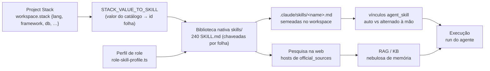

[← Índice](./README.md) · [🇬🇧 English](../en/SKILLS.md) · [✦ Constella](../../README.pt-BR.md)

# Skills ✦ — os manuais da constelação 🌌


Uma biblioteca de manuais `SKILL.md` baseada em pesquisa que acompanha o Constella e é semeada em cada workspace. As skills são a luz estelar procedural pela qual cada agente se orienta — as certas se vinculam automaticamente aos agentes certos com base na **stack** do projeto e no **papel** (role) do agente, e o time pode cultivar novas a partir do que aprendeu.

---

## 1. Quando usar 🛰️

- Você quer saber **o que um agente já sabe** antes de ele construir (prática de engenharia, o framework escolhido, a postura de segurança).
- Você está ajustando **quais skills chegam a qual agente** — habilitar/desabilitar por agente, ou fixar skills assinatura para que sobrevivam ao orçamento de prompt.
- Você mudou a **Project Stack** e quer cada agente revinculado às skills que a nova stack realmente precisa.
- O Vannevar (Knowledge) **destilou novas skills** a partir dos aprendizados do time e você precisa revisá-las e aprová-las.
- Você está criando uma **skill personalizada** para este workspace, ou gerando uma a partir de um prompt.

Veja [AGENTS.md](./AGENTS.md) para o elenco, [KB_RAG.md](./KB_RAG.md) para como o conhecimento é indexado, e [PROJECT_STACKS.md](./PROJECT_STACKS.md) para de onde vêm as escolhas de stack.

---

## 2. Como funciona 🌠

Há **duas camadas** de skills, e é importante não confundi-las:

| Camada | Onde fica | Fonte da verdade | Indexada no DB? |
|---|---|---|---|
| **Biblioteca nativa** | `skills/` na **raiz do pacote** (embarcada no pacote npm, fora da jaula do workspace da org) | os arquivos `SKILL.md` | Não — é um catálogo somente-leitura de onde o seeder lê |
| **Skills do workspace** | `.claude/skills/<name>.md` dentro do workspace de cada org | o arquivo `.md` no disco (write-through) | Sim — `src/server/sync.ts` espelha o arquivo para a tabela `skill` |

A biblioteca nativa é o **catálogo**; as skills do workspace são as **cópias executáveis** que um agente de fato carrega. No onboarding a biblioteca inteira é semeada no workspace, e então cada agente é vinculado automaticamente ao subconjunto que sua stack + role precisam.

### Onde a biblioteca é encontrada

`skillsLibraryRoot()` (em `src/server/skills-library.ts`) sonda, nesta ordem:

1. `process.env.CONSTELLA_PKG_ROOT/skills` (definido pelo launcher do CLI em uma execução instalada/compilada)
2. `launchDir()/skills` (a raiz do repo numa árvore de dev)
3. `process.cwd()/skills`

O primeiro diretório que realmente existir vence. Se nenhum existir, o loader degrada para um **índice vazio** — cada helper vira um no-op seguro em vez de quebrar.

### Chaveamento pela pasta-folha (e o `INDEX.json` desatualizado) 🕳️

`loadLibraryIndex()` percorre o `skills/` (profundidade ≤ 8) procurando todo arquivo literalmente chamado `SKILL.md`. Cada skill é chaveada pelo **nome da pasta-folha** — `skills/stacks/frontend/react/SKILL.md` → `react` — e **não** pelo `name` do frontmatter (algumas skills carregam um `name` de frontmatter com namespace, como `testing/testing-strategy-pyramid`, que não bateria com os ids estáveis usados pelo mapa de stack e pela lista universal). O nome da pasta é o id estável.

O `skills/INDEX.json` mantido à mão **é sabidamente desatualizado em relação aos arquivos e é ignorado em runtime** — o loader percorre os arquivos reais. A primeira ocorrência vence em caso de nomes-folha duplicados (ex.: `redis` existe sob `stacks/database` e `stacks/queue`).

Frontmatter lido por skill (leitor YAML mínimo de linha única): `name`, `description`, `domain`, `category`, e a lista multilinha `official_sources`. As URLs de `official_sources` viram os **hosts permitidos para pesquisa na web** (`stackDocHosts()`).

---

## 3. Fluxo principal: Stack → Skills → Pesquisa → RAG → Execução 🚀



1. A **Project Stack** (`workspace.stack`, um `Record<string,string>`) lista linguagem, runtime, framework, banco, ORM, estilização, testes etc. escolhidos.
2. Cada valor de stack mapeia, via `STACK_VALUE_TO_SKILL`, para um id folha da biblioteca (`Vue → vue`, `Django → django`, `Tailwind CSS → tailwind`). Ausente ou `None` → pulado.
3. A biblioteca inteira é **semeada** como arquivos `.claude/skills/<name>.md`; apenas o subconjunto de stack + role é **vinculado automaticamente** por agente.
4. As `official_sources` das skills correspondentes definem quais hosts de docs oficiais a etapa de **pesquisa na web** pode buscar.
5. Docs pesquisados e padrões fluem para o **RAG / a KB** (a nebulosa de memória — veja [KB_RAG.md](./KB_RAG.md), [MEMORY_RAG.md](./MEMORY_RAG.md)).
6. Na **execução**, as skills core fixadas do agente + a cauda longa + os hits de RAG são montados em seu prompt.

---

## 4. Conceitos-chave 🪐

### Skills universais vs de stack vs de role

| Tipo | Definido por | Alcança |
|---|---|---|
| **Universal** | `UNIVERSAL_SKILL_NAMES` (lista fixa em `skills-library.ts`) | Todo agente, independente da stack — clean-code, git-workflow, owasp-top-10, testing-strategy-pyramid, ui-ux-principles, accessibility-wcag, os rituais de processo, `research-official-docs`, `readme-generation`, … |
| **Stack** | `STACK_VALUE_TO_SKILL[stackValue]`, restrito pelos `stackPrefixes` do role | Os agentes cujo role é dono daquela pasta de stack (o Frontend de um projeto Vue ganha `vue`, não `react`+`svelte`) |
| **Role** | `roleProfile(role).allPrefixes` | Toda skill sob as pastas do role (Frontend → todo `design/`; Backend → `engineering/backend/`; Security → `engineering/security/`) |

O conjunto de auto-link de um agente é calculado por `skillNamesForRole(stack, role)`:
- começa com as universais que existem no disco;
- adiciona toda skill cujo `relPath` começa com um dos `allPrefixes` do role;
- adiciona skills restritas por stack cujo `relPath` começa com uma entrada de `stackPrefixes` **e** foram de fato selecionadas pela stack.

Isso substituiu o antigo "vincular todas as ~180 a todo mundo" para que as **skills certas cheguem ao agente certo**.

### Skills core (fixadas)

`coreSkillNamesForRole(stack, role)` retorna as skills assinatura do role (`roleProfile().core`) mais as escolhas de stack sob as pastas de stack do role. O montador de contexto (`agentSkills()` em `src/server/context-manager.ts`) ordena as skills habilitadas do agente — `core = 0`, stack = `1`, resto = `2` — fixa até **10 core** numa seção de alta prioridade do prompt (nunca cortada sob orçamento) e limita a cauda longa em **30**.

### Native vs provisional

A tabela `skill` (`src/db/schema.ts`):

| Coluna | Significado |
|---|---|
| `native` | `true` = semeada da biblioteca (só não-native pode ser deletada) |
| `provisional` | `true` = rascunhada por IA / proposta pelo Vannevar, **não vinculada** a nenhum agente até ser aprovada |
| `indexed` | `pending` \| `indexed` — estado de sync/index |
| `proposedRole` | para uma proposta do Vannevar: o role do time que ela mira (a aprovação a vincula lá) |

### `agentSkill.auto` — auto vs alternado à mão

O join `agent_skill` carrega um booleano, `auto`:

- `auto = true` → **gerenciado pelo sistema**: criado pelo auto-link de stack/role e **reconciliado** no boot / mudança de stack. O reconciliador pode adicioná-lo ou removê-lo.
- `auto = false` → **alternado à mão pelo operador** na UI. O reconciliador **nunca o toca** — nem poda nem readiciona.

É isso que permite fixar uma skill não-padrão em um agente (ex.: dar `react` ao agente de Backend) confiando que não será apagada quando a stack reconciliar.

### Reconciliação

`reconcileStackRoleSkills(wsId)` (em `src/server/seed-library-skills.ts`) roda no boot e em mudança de stack. Para cada agente calcula o conjunto desejado via `skillNamesForRole`, e então:
- **poda** vínculos `auto` para skills da **biblioteca** que ficam fora do perfil do role (vínculos manuais e as skills procedurais ficam intactos);
- **adiciona** as skills faltantes do role com `auto = true`.

É idempotente e usa **nenhum LLM**.

---

## 5. Semeadura & formatos de arquivo

No onboarding (`completeOnboarding` em `src/server/onboarding.ts`):

1. Seis skills **procedurais** são semeadas primeiro e vencem em conflito de nome: `open-pr`, `run-suite`, `secret-scan`, `telegram-notify` (provisional), `moscow-prioritise`, `gguf-validate` (provisional). As não-provisional são habilitadas para todo agente.
2. A **biblioteca nativa inteira** é semeada com `seedLibrarySkills({ names: allLibrarySkillNames(), linkNames: [] })` — cada skill da biblioteca vira uma linha `skill` + um arquivo `.claude/skills/<name>.md`, mas **nenhuma** é vinculada aqui.
3. `reconcileStackRoleSkills(wsId)` então vincula cada agente ao seu subconjunto de stack + role.

`seedLibrarySkills()` escreve cada `.md` na forma exata que `indexSkillFile` deriva, de modo que a re-indexação posterior do watcher seja um no-op:

```markdown
# Skill — react

**Trigger:** When working with react in this project.

<descrição do frontmatter>

## Procedure
<corpo do SKILL.md com o frontmatter removido>
```

A habilitação de cada agente é espelhada para `.claude/agents/<handle>/skills.md` por `rebuildAgentSkillsMd()` — um índice gerado listando cada skill habilitada e seu arquivo, mais o ritual do agente. O motor de sync lê os nomes entre crases desse arquivo para guiar a habilitação (disco = verdade).

---

## 6. Propostas de skills do Vannevar (P3 — aprendizado → skills) 🌌

`proposeSkillsFromLearnings(orgId)` (em `src/server/kb.ts`), disparado da página de Skills via `suggestSkillsFromLearnings()`:

1. Encontra o agente Vannevar (handle `vannevar`, ou um role casando `/knowledge/i`); aborta se estiver acima de seu teto diário em USD.
2. Lê até **50** entradas ativas de KB de tipos **reutilizáveis** (`doc`, `research`, `ui-pattern`, `stack`, `integration`, `fix`, `decision`, `architecture`, `business-rule`), mantém as com confiança ≥ 60, e exige **pelo menos 4** entradas fortes.
3. Pede ao agente (modelo de RAG local preferido, senão o CLI do agente) que proponha **0–3** skills genuinamente reutilizáveis como um array JSON, deduplicadas contra os nomes de skills existentes.
4. Cada proposta aceita vira uma skill **provisional** (`native = false`, `provisional = true`) com um `proposedRole`, escrita em `.claude/skills/<name>.md`, **não vinculada** a nenhum agente.
5. Os operadores são notificados para revisar e aprovar em `/skills`.

`approveProvisional(id)` vira `provisional → false`, define `indexed = indexed`, e a vincula aos agentes de seu `proposedRole` (ou a **todos** os agentes se não houver role) com `auto = false` — para que seja de fato usada, não aprovada-mas-órfã.

Outros caminhos de criação:
- `createSkill()` — skill autoral do operador, escrita no disco e habilitada para um agente (`auto = false`).
- `generateSkill(prompt)` — rascunha uma skill **provisional** a partir de um prompt (nenhum agente habilitado até aprovar).
- `saveSkillInstructions()` — edita a Procedure de uma skill (reescreve o `.md`).
- `toggleAgentSkill()` / `setAllAgentSkills()` — habilitação por agente (sempre `auto = false`).
- `deleteSkill()` — só skills **não-native**; remove o `.md` (deindex derruba a linha).

---

## 7. Tabelas 🛰️

### `skill`
| Coluna | Tipo | Notas |
|---|---|---|
| `id` | text PK | |
| `workspaceId` | text | FK → workspace |
| `name` | text | id folha / kebab-case |
| `summary` | text | descrição de uma linha |
| `instructions` | text | o corpo da Procedure |
| `trigger` | text | quando usá-la |
| `native` | bool | semeada da biblioteca (não deletável) |
| `provisional` | bool | rascunhada por IA, pendente de aprovação |
| `indexed` | `pending`\|`indexed` | estado de sync |
| `proposedRole` | text? | role-alvo da proposta do Vannevar |

### `agent_skill` (join, PK `agentId+skillId`)
| Coluna | Tipo | Notas |
|---|---|---|
| `agentId` | text | FK → agent |
| `skillId` | text | FK → skill |
| `auto` | bool | `true` = gerenciado pelo sistema (reconciliado); `false` = alternado à mão (nunca tocado) |

### Taxonomia da biblioteca (`skills/` nativa)
| Grupo | Contagem aprox. | O que contém |
|---|---|---|
| `process/` | 15 | Discovery, framing, arquitetura-primeiro, requirements→specs, specs→issues, MoSCoW/RICE, security-by-design, testing-before-done, ADRs, review |
| `engineering/` | 32 | `security/` `architecture/` `performance/` `testing/` `frontend/` `backend/` `practices/` |
| `design/` | 9 | UI/UX, design systems, CSS, motion, color & typography, responsive layout |
| `languages/` | 15 | Técnicas por linguagem (TypeScript … Dart) |
| `stacks/` | ~98 | Uma por opção do catálogo entre runtime/frontend/meta/backend/database/orm/styling/container/infra/queue/auth |
| `references/` | 10 | Referências externas de UI/IA destiladas |
| `meta/` | 3 | Como criar skills de agente |

> As contagens são aproximadas e vivem em `skills/README.md`; o loader percorre **240** arquivos `SKILL.md` no momento da escrita (o catálogo cresce). Só skills nomeadas por folha e presentes no disco são utilizáveis.

---

## 8. Referência de helpers

| Função (`src/server/skills-library.ts`) | Retorna |
|---|---|
| `loadLibraryIndex()` | `Map<name, LibrarySkill>` em cache, do fs-walk |
| `librarySkillByName(name)` / `readLibrarySkillMd(name)` | uma entrada / seu `SKILL.md` cru |
| `stripFrontmatter(md)` | o corpo com o bloco `---` inicial removido |
| `librarySkillNamesForStack(stack)` | universais + ids casados com a stack, no disco |
| `allLibrarySkillNames()` | todo nome folha (semeado para a biblioteca inteira aparecer) |
| `skillNamesForRole(stack, role)` | o conjunto de auto-link de um agente |
| `coreSkillNamesForRole(stack, role)` | o conjunto assinatura fixado |
| `stackDocHosts(stack)` | hostnames de docs oficiais para a allowlist de pesquisa |

---

## 9. Passo a passo

### Revincular agentes após mudança de stack
1. Mude a Project Stack (veja [PROJECT_STACKS.md](./PROJECT_STACKS.md)).
2. `reconcileStackRoleSkills(wsId)` roda (boot / mudança de stack) — os auto-links atualizam, os alternados à mão ficam intactos.
3. Verifique em Agent Studio → Skills.

### Aprovar uma skill proposta pelo Vannevar
1. Abra `/skills` após a notificação "proposed N new skills".
2. Revise a Procedure da skill provisional.
3. Aprove → `approveProvisional` a vincula ao seu `proposedRole` (ou a todos) com `auto = false`.

### Adicionar uma skill personalizada a um agente
1. Crie-a (`createSkill`) ou gere um rascunho (`generateSkill`).
2. Se gerada, aprove-a primeiro (ela é provisional).
3. Ative-a para o agente (`toggleAgentSkill`) — ela é `auto = false`, então o reconcile a deixa em paz.

---

## 10. Exemplos

Inspecione a biblioteca pelo chat (`src/server/commands.ts`):

```text
/skills
→ 📚 Skills library — 240 skill(s). Sample: clean-code, git-workflow, … . Enable/disable per agent in Agent Studio → Skills.
```

Um arquivo de skill semeado no workspace (`.claude/skills/tailwind.md`):

```markdown
# Skill — tailwind

**Trigger:** When working with tailwind in this project.

Utility-first CSS framework; consult for design tokens, responsive variants, and component styling.

## Procedure
…corpo do SKILL.md…
```

Um cabeçalho de frontmatter na biblioteca nativa (`skills/stacks/frontend/react/SKILL.md`):

```yaml
---
name: react
description: Component-based JavaScript library for building web and native UIs; …
domain: stack
category: frontend
tags: [react, components, hooks, jsx, ui, spa]
official_sources:
  - https://react.dev/
  - https://github.com/facebook/react
verified: 2026-06-16
---
```

---

## 11. Estados possíveis 🌠

| Objeto | Estados |
|---|---|
| `skill.indexed` | `pending` → `indexed` |
| `skill.native` | `true` (biblioteca) / `false` (custom ou proposta) |
| `skill.provisional` | `true` (aguardando aprovação) / `false` (ativa) |
| `agent_skill.auto` | `true` (gerenciado) / `false` (manual) |
| Índice da biblioteca | populado / vazio (dir ausente → no-op) |

---

## 12. Integrações relacionadas 🪐

- **Pesquisa na web** — as `official_sources` das skills correspondentes → `stackDocHosts()` → a allowlist de WebSearch/WebFetch (veja [AI_ARCHITECTURE.md](./AI_ARCHITECTURE.md), [MODELS.md](./MODELS.md)).
- **RAG / KB** — `.claude/skills/*.md` são re-indexados pelo motor de sync e embarcados no RAG (veja [KB_RAG.md](./KB_RAG.md), [MEMORY_RAG.md](./MEMORY_RAG.md)).
- **Vannevar / agente de KB** — propõe skills a partir de aprendizados (veja [KB_AGENT.md](./KB_AGENT.md)).
- **Onboarding** — semeia + reconcilia a biblioteca (veja [ONBOARDING.md](./ONBOARDING.md)).
- **Plugins** — skills são conhecimento, não capacidades; plugins são integrações (veja [PLUGINS.md](./PLUGINS.md)).

---

## 13. Segurança 🕳️

- A biblioteca nativa vive **fora** da jaula do workspace da org (na raiz do pacote) e é **somente-leitura** — agentes nunca escrevem nela.
- Arquivos de skill do workspace ficam sob `.claude/skills/` **dentro** da jaula de FS (checagens de caminho de `safe()`; veja [SECURITY.md](./SECURITY.md)).
- Mutações de skill são escopadas ao workspace com guardas de IDOR (`agentInWorkspace`, `skillInWorkspace`) para que uma org não possa alternar skills nos agentes de outra org.
- Propostas do Vannevar são restritas por orçamento (teto diário em USD) e chegam **provisional** — nada alcança o prompt de um agente até um operador aprovar.
- Só skills **não-native** podem ser deletadas; o catálogo da biblioteca não pode ser mutado pelo app.

---

## 14. Solução de problemas

| Sintoma | Causa provável | Correção |
|---|---|---|
| `/skills` reporta 0 skills | dir da biblioteca não encontrado em runtime | garanta que `CONSTELLA_PKG_ROOT/skills` (instalado) ou `skills/` na raiz do repo (dev) exista |
| Uma skill de stack não fez auto-link | valor do catálogo ausente em `STACK_VALUE_TO_SKILL`, ou sem `SKILL.md` para aquele id folha | o mapa filtra para skills no disco — adicione o `SKILL.md` ou o mapeamento |
| Uma skill fixada some sempre | era um vínculo `auto` (gerenciado) fora do perfil do role | alterne-a à mão (`auto = false`) para o reconcile deixá-la em paz |
| Editei um `.claude/skills/*.md` e a UI não atualizou | debounce do watcher / sync não rodou | o motor de sync re-indexa na mudança do arquivo; disco é verdade |
| Vannevar não propôs nada | < 4 entradas de KB reutilizáveis fortes, ou acima do teto diário | acumule mais aprendizados validados; verifique o teto de custo do agente |
| `name` do frontmatter ≠ pasta | por design — o nome da pasta-folha é o id, não o frontmatter | renomeie a **pasta** para mudar o id |

---

## 15. Links relacionados

- [AGENTS.md](./AGENTS.md) — o elenco e os roles que guiam os perfis de role
- [PROJECT_STACKS.md](./PROJECT_STACKS.md) — de onde vem `workspace.stack`
- [KB_AGENT.md](./KB_AGENT.md) — Vannevar e aprendizado → skills
- [KB_RAG.md](./KB_RAG.md) · [MEMORY_RAG.md](./MEMORY_RAG.md) — a nebulosa de memória
- [AI_ARCHITECTURE.md](./AI_ARCHITECTURE.md) — montagem de prompt, pesquisa na web
- [ONBOARDING.md](./ONBOARDING.md) — semeadura da biblioteca
- [PLUGINS.md](./PLUGINS.md) — integrações (distintas de skills)
- [CHAT_COMMANDS.md](./CHAT_COMMANDS.md) — `/skills` e companhia
- [SECURITY.md](./SECURITY.md) — a jaula de FS
