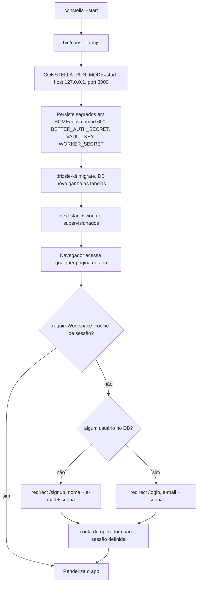
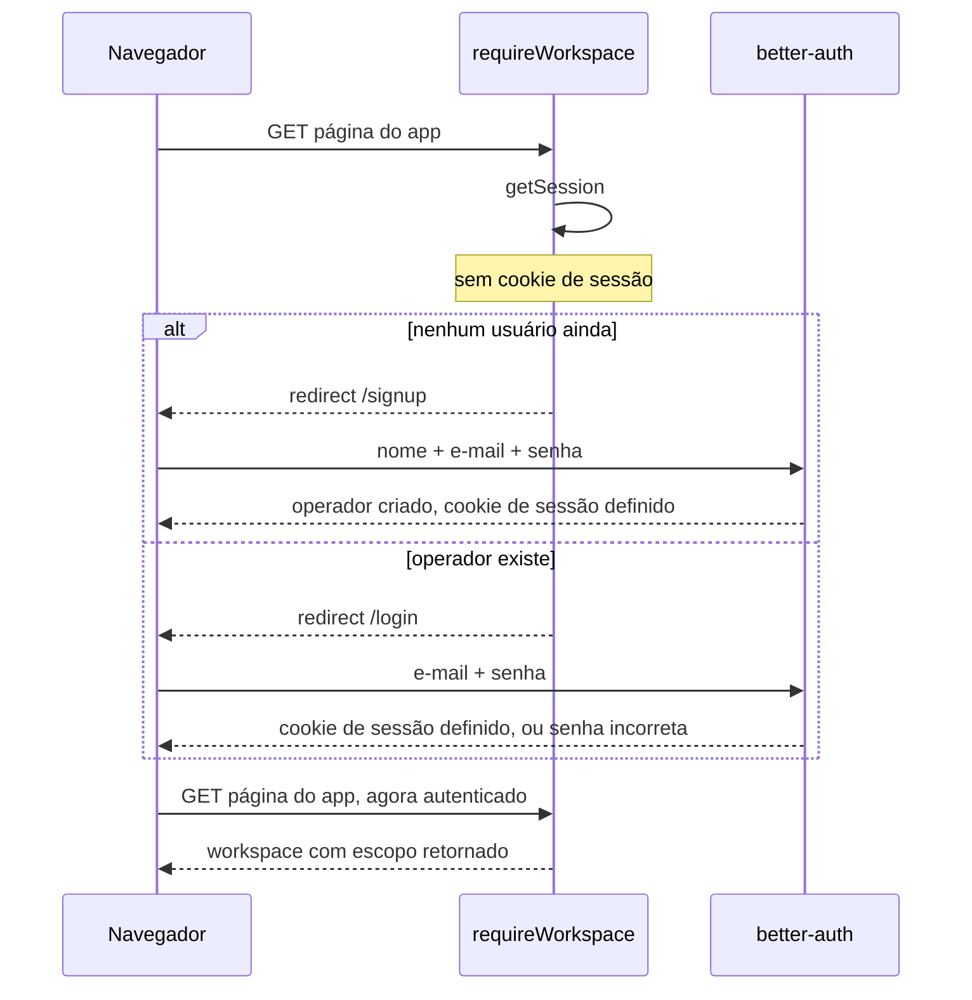

[← Índice](./README.md) · [🇬🇧 English](../en/START_MODE.md) · [✦ Constella](../../README.pt-BR.md)

# Start — rodando o Constella localmente ✦

> A ignição padrão para uma nave de piloto único na sua própria máquina: `constella --start` sobe o Constella em `127.0.0.1`, e a constelação de agentes roda com permissões locais totais. A autenticação está sempre ligada — a primeira execução mostra uma tela de cadastro, as execuções seguintes mostram login.

`constella --start` é a **instalação local** do Constella: o servidor faz bind na interface de loopback e só é acessível pela máquina onde roda. É a flag de lançamento certa para um único operador no próprio notebook / estação — exposição zero de rede, autonomia total dos agentes. **Não** é um modo de autenticação: assim como toda outra flag de lançamento, ela exige que você entre (e-mail + senha).

---

## 🛰️ Quando usar

| Use `--start` quando… | Prefira outro método de instalação quando… |
| --- | --- |
| Você roda o Constella **no seu próprio notebook / estação** | Você o expõe em rede → [VPS](./VPS_MODE.md) |
| Você quer um plano de controle **apenas loopback** | Você precisa de acesso remoto por uma tailnet privada → [VPS](./VPS_MODE.md) |
| Você quer agentes que **instalam dependências + rodam testes** (shell completo) | Você inicializa de um pen-drive entre máquinas → [PORTABLE](./PORTABLE_MODE.md) |
| Você está desenvolvendo, demonstrando ou rodando uma agent-company pessoal | — |

`--start` é **local por design**. Ele faz bind na interface de loopback, então a superfície nunca está na rede. A autenticação é a mesma de toda outra flag de lançamento — não há auto-login e não há atalho sem senha.

---

## 🌌 Como funciona

`start` é uma das flags de lançamento resolvidas por `bin/constella.mjs`. Uma flag de lançamento é **obrigatória** — um `constella` sem flag não inicia mais. O launcher seleciona a flag e a exporta como `CONSTELLA_RUN_MODE`, que o servidor lê de volta através de `getRunMode()`:

```ts
// src/lib/run-mode.ts
export type RunMode = "start" | "vps" | "portable";

export function getRunMode(): RunMode {
  const m = process.env.CONSTELLA_RUN_MODE as RunMode | undefined;
  return m && m in RUN_MODES ? m : "start";
}
```

Dois comportamentos derivam de `--start`:

1. **Bind de loopback.** O servidor web faz bind em `127.0.0.1`, então nada é alcançável fora da máquina. Apenas `vps` / `portable` fazem bind em `0.0.0.0`.
2. **Agentes com acesso total.** O adaptador da CLI roda os agentes com `--permission-mode bypassPermissions` (instalar dependências, rodar testes, shell completo) porque `start` significa que você está na sua própria máquina.

A autenticação é **idêntica em toda flag de lançamento**: na primeira vez em que o banco de dados não tem usuário, você recebe uma tela real de **cadastro** (nome + e-mail + senha) que cria a conta de operador única; depois você recebe uma tela de **login**. Não há auto-login, não há `/api/dev-login`, não há credencial padrão previsível.

A flag escolhida também é **persistida na organização** no momento do onboarding (`organization.runMode`), de modo que o registro da org lembra como foi lançado pela primeira vez.

---

## 🚀 Fluxo principal



### Fluxo de autenticação (cadastro depois login) 🌠



---

## 🪐 Conceitos-chave

### O operador único

Existe **uma** conta de operador, compartilhada por toda flag de lançamento — ela nunca é duplicada. A primeira execução com um banco vazio mostra uma tela de **cadastro** (nome + e-mail + senha) que a cria; toda execução posterior mostra **login**. Uma senha incorreta retorna "incorrect email or password". **Não** existe credencial padrão previsível, **não** existe `ensureLocalOperator`, e **não** existe auto sign-in via `/api/dev-login`.

O operador é resolvido da mesma forma sob `start`, `vps` e `portable`: é a única linha `user`. Alternar entre flags de lançamento mantém a **mesma** conta.

### Agentes com acesso total (`bypassPermissions`)

`src/server/adapters/cli.ts` decide quanto poder de shell os agentes recebem:

```ts
const RUN_MODE = process.env.CONSTELLA_RUN_MODE ?? "start";
const AGENT_FULL_ACCESS = process.env.CONSTELLA_AGENT_FULL_ACCESS != null
  ? process.env.CONSTELLA_AGENT_FULL_ACCESS !== "0"
  : RUN_MODE === "start";

function claudePermArgs(): string[] {
  return AGENT_FULL_ACCESS
    ? ["--permission-mode", "bypassPermissions"]   // start → total: instala + testa
    : ["--permission-mode", "acceptEdits"];        // instalações de rede → presos: só edições
}
```

Assim, sob `--start` as CLIs `claude` / `codex` rodam com `bypassPermissions` — podem instalar dependências e rodar testes no workspace — porque você está na sua própria máquina. As instalações de rede (`vps` / `portable`) assumem `acceptEdits` por padrão (só-edições, presos). Sobrescreva nos dois sentidos com `CONSTELLA_AGENT_FULL_ACCESS=1|0`. Os agentes ainda rodam sempre **vanilla** (um overlay temporário de settings define `disableAllHooks: true`), de modo que os hooks/plugins pessoais do `~/.claude` do operador nunca vazem para as execuções dos agentes. Esse padrão de acesso total é um detalhe de **contexto de execução** por ser local — é independente da autenticação, que é sempre exigida. Veja [AGENTS](./AGENTS.md) e [AI_ARCHITECTURE](./AI_ARCHITECTURE.md).

### O segredo de auth

`next start` roda sob `NODE_ENV=production`, onde o better-auth **lança erro com o segredo padrão**. Então o Constella sempre precisa de um `BETTER_AUTH_SECRET` real — o launcher gera e persiste um em `<HOME>/.env` (`chmod 600`) em toda flag de lançamento, `start` incluído. Os cookies de sessão continuam não-`Secure` sob `--start` porque o transporte local é `http` puro.

---

## Tabelas 📊

### `--start` vs as outras flags de lançamento

| Propriedade | **start** | vps | portable |
| --- | --- | --- | --- |
| Autenticação | e-mail + senha | e-mail + senha | e-mail + senha |
| Primeira execução (sem usuário) | tela de cadastro | tela de cadastro | tela de cadastro |
| Execuções seguintes | tela de login | tela de login | tela de login |
| Host de bind | `127.0.0.1` | `0.0.0.0` | `0.0.0.0` |
| Operador | a conta única compartilhada | a conta única compartilhada | a conta única compartilhada |
| Permissão dos agentes | `bypassPermissions` | `acceptEdits` | `acceptEdits` |
| `BETTER_AUTH_SECRET` | persistido (sempre exigido) | persistido (sempre exigido) | persistido (sempre exigido) |
| Cookies Secure | não (http local) | sim | se atrás de https |
| Uso típico | máquina própria / dev | servidor via Tailscale | USB entre máquinas |

### Comandos de lançamento → instalação local

| Comando | Resultado |
| --- | --- |
| `constella --start` | Instalação local (bind de loopback) |
| `constella --bind local` | Instalação local (compatibilidade legada de `--bind`) |
| `CONSTELLA_RUN_MODE=start` | Força o comportamento local no processo do servidor |

> Um `constella` sem flag **não inicia mais** — uma flag de lançamento é obrigatória.

### Variáveis de ambiente que moldam uma instalação local

| Variável | Padrão sob `--start` | Efeito |
| --- | --- | --- |
| `CONSTELLA_RUN_MODE` | `start` | A flag de execução que o servidor lê |
| `CONSTELLA_HOME` | `~/.constella` | Raiz de runtime (DB, segredos, orgs) |
| `--host` / host | `127.0.0.1` | Bind de loopback |
| `--port` / `PORT` | `3000` | Porta web |
| `CONSTELLA_AGENT_FULL_ACCESS` | `1` (implícito pelo start) | `0` reaprisiona os agentes em só-edições |
| `CONSTELLA_WEB_RESEARCH` | ligado | `0` desativa WebSearch/WebFetch dos agentes |
| `BETTER_AUTH_SECRET` | gerado → `<HOME>/.env` | Chave de assinatura de sessão (sempre exigida) |

### Arquivos-chave

| Arquivo | Papel |
| --- | --- |
| `src/lib/run-mode.ts` | Tipo `RunMode`, `RUN_MODES`, `getRunMode()`, `requiresLogin()` |
| `bin/constella.mjs` | Launcher: escolhe a flag, define host/porta, persiste segredos, sobe web + worker |
| `src/lib/workspace.ts` | `requireWorkspace()` — redireciona para `/signup` ou `/login` |
| `src/lib/auth.ts` | Config do better-auth; trava de boot `assertAuthSecret()` |
| `src/server/adapters/cli.ts` | `claudePermArgs()` → `bypassPermissions` sob `--start` |
| `src/lib/run-context.ts` | `detectRunContext()` para o caminho de Update |

---

## Passo a passo 🧭

### Suba uma nave nova localmente

1. **Lance** com `--start`:
   ```bash
   npm install -g constellai
   constella --start
   # ou, pontualmente: npx constellai --start
   ```
2. O launcher imprime a raiz de runtime e `Mode : start · 127.0.0.1:3000`, persiste os segredos em `<HOME>/.env`, aplica as migrations e sobe `next start` + o worker.
3. **Abra** `http://127.0.0.1:3000`.
4. `requireWorkspace()` não encontra sessão. Se o banco de dados ainda não tem usuário, você cai na tela de **cadastro**; crie o operador único com nome + e-mail + senha.
5. Nas execuções seguintes o mesmo caminho cai na tela de **login** — entre com esse e-mail + senha.
6. Se nenhuma org existir ainda, você segue para o [ONBOARDING](./ONBOARDING.md); caso contrário, você está no app.

### Reaprisionar os agentes (cautela extra)

```bash
CONSTELLA_AGENT_FULL_ACCESS=0 constella --start
```
Os agentes agora rodam `acceptEdits` (só-edições, sem shell arbitrário), enquanto você mantém a conveniência local de loopback.

---

## Exemplos 🌟

**Lançamento local padrão:**
```bash
$ constella --start
Constella runtime root : /home/you/.constella
Mode                   : start  ·  127.0.0.1:3000
• Secrets ready (stored in /home/you/.constella/.env, never printed).
• Starting: next start -H 127.0.0.1 -p 3000  (…)  +  worker
```

**Porta personalizada, ainda local:**
```bash
$ constella --start --port 4000
# → http://127.0.0.1:4000, cadastro na primeira execução depois login, agentes com acesso total
```

**Fixar outra raiz de runtime:**
```bash
$ CONSTELLA_HOME=/data/constella constella --start
# DB em /data/constella/constella.db; segredos em /data/constella/.env
```

---

## Estados possíveis 🛰️

| Situação | Comportamento |
| --- | --- |
| Sem cookie de sessão, sem usuário no DB | Redireciona `/signup` → cria o operador → app |
| Sem cookie de sessão, operador existe | Redireciona `/login` |
| Login bem-sucedido | Cookie definido, cai em `/` (ou `/onboarding` se não houver org) |
| Senha incorreta | "incorrect email or password" |
| `CONSTELLA_FORCE_ONBOARDING=1` | Após a sessão, redireciona `/onboarding` (one-shot, limpo por `completeOnboarding`) |
| Org ausente / workspace ausente | Redireciona `/onboarding` |
| Execução de agente, `--start` | `claude --permission-mode bypassPermissions` (shell completo) |
| Execução de agente, `CONSTELLA_AGENT_FULL_ACCESS=0` | `claude --permission-mode acceptEdits` (preso) |

---

## Integrações relacionadas 🪐

- O **Onboarding** persiste a flag ativa em `organization.runMode` (`src/server/onboarding.ts`). Veja [ONBOARDING](./ONBOARDING.md).
- O **Worker** (`bin/worker.mjs`) conecta de volta via `127.0.0.1` independentemente do host de bind; sob `--start` esse também é o bind do web. Veja [ARCHITECTURE](./ARCHITECTURE.md).
- O **Vault** ainda precisa de `CONSTELLA_VAULT_KEY` mesmo localmente (as chaves de provedor são criptografadas). Veja [SECURITY](./SECURITY.md).
- O caminho de **Update** é sensível ao contexto via `detectRunContext()`. Veja [UPDATE](./UPDATE.md).

---

## Segurança 🕳️

Uma instalação local troca o endurecimento de rede por conveniência local — segura justamente por ser local:

- **Somente loopback.** O host faz bind em `127.0.0.1`; nada é alcançável fora da máquina.
- **Autenticação sempre ligada.** Uma barreira real de cadastro-depois-login guarda cada sessão — não há auto-login e não há credencial previsível. O operador único é quem completa o cadastro na primeira execução.
- **Segredo de auth real persistido.** Um `BETTER_AUTH_SECRET` real é gerado em `<HOME>/.env` (`chmod 600`) para que as sessões não sejam forjáveis; os cookies são não-`Secure` apenas porque o transporte local é `http` puro.
- **Agentes com acesso total são apenas locais.** `bypassPermissions` deixa os agentes rodarem shell, mas o workspace ainda é uma jaula de FS (`safe()` com checagens léxicas + de symlink), e os hooks de guarda/lock continuam valendo. Defina `CONSTELLA_AGENT_FULL_ACCESS=0` para reaprisionar.
- **Não faça port-forward de uma instalação local.** Se precisar de acesso remoto, use [VPS](./VPS_MODE.md) (Tailscale, nativo) — nunca exponha a instalação de loopback a uma rede.

---

## Solução de problemas 🧰

| Sintoma | Causa provável | Correção |
| --- | --- | --- |
| A tela de cadastro nunca aparece | Já existe um usuário no DB | Esperado — você recebe `/login` quando o operador existe; entre em vez de cadastrar |
| "incorrect email or password" | Senha errada para o operador | Re-insira a senha do operador definida no cadastro |
| Agentes não instalam deps / não rodam testes | `CONSTELLA_AGENT_FULL_ACCESS=0` definido | Remova o override, ou relance com `--start` |
| Alcançável de outra máquina | Você sobrescreveu `--host` para `0.0.0.0` | Remova `--host`; o `--start` faz bind em `127.0.0.1` |
| Erro de segredo do better-auth no boot | Forçou uma instalação sem segredo | O launcher persiste o `BETTER_AUTH_SECRET` — deixe rodar, ou defina-o |
| Um `constella` sem flag não faz nada | Uma flag de lançamento agora é obrigatória | Relance com `--start` (ou `--vps` / `--portable`) |

---

## Links relacionados 🌌

- [INSTALLATION](./INSTALLATION.md) · [ONBOARDING](./ONBOARDING.md) · [CONFIGURATION](./CONFIGURATION.md)
- [VPS](./VPS_MODE.md) · [PORTABLE](./PORTABLE_MODE.md)
- [ARCHITECTURE](./ARCHITECTURE.md) · [AI_ARCHITECTURE](./AI_ARCHITECTURE.md) · [AGENTS](./AGENTS.md)
- [SECURITY](./SECURITY.md) · [UPDATE](./UPDATE.md) · [TROUBLESHOOTING](./TROUBLESHOOTING.md) · [FAQ](./FAQ.md)
</content>
