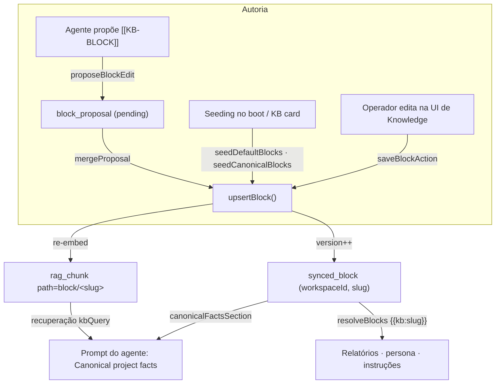
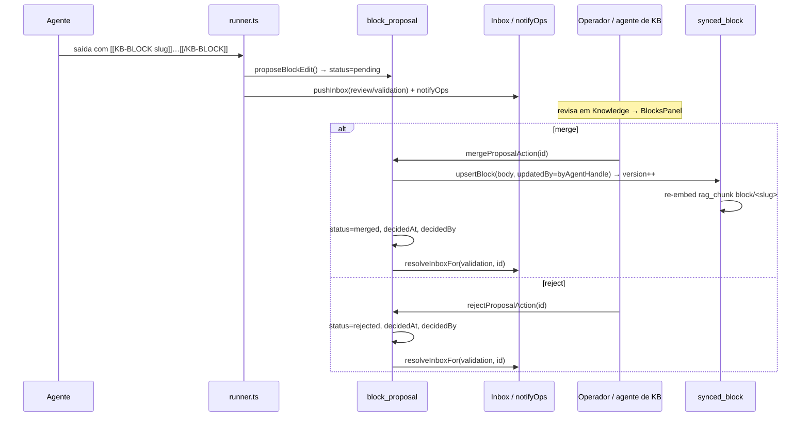

[← Índice](./README.md) · [🇬🇧 English](../en/SYNCED_BLOCKS.md) · [✦ Constella](../../README.pt-BR.md)

# 🌌 Synced Blocks — a nebulosa de memória canônica


Os synced blocks (blocos sincronizados) são a **fonte única de verdade** para o conhecimento durável do projeto: uma unidade nomeada (`slug` + `body` em Markdown) editada em exatamente um lugar e exibida por referência em todos os outros — prompts dos agentes, a home de boas-vindas e transcluída em relatórios. Edite um bloco uma vez e toda superfície reflete a versão mais recente, sem o desalinhamento de copiar e colar. Eles são distintos do conhecimento auto-capturado em `kb_entry`: um synced block é **curado, canônico e versionado**; os agentes só podem *propor* edições nele.

Fonte de verdade no código: `src/server/blocks.ts`, schema `src/db/schema.ts` (`synced_block`, `block_proposal`).

---

## 1. Quando usar 🪐

Use synced blocks para fatos que:

- são **duráveis** e **reutilizados** em muitas execuções e superfícies (a stack oficial, regras de negócio, padrões de segurança, a arquitetura que todo agente deve tratar como canônica);
- precisam permanecer **consistentes** em todos os lugares onde aparecem (sem desalinhamento entre o arquivo de persona, um relatório e uma resposta no chat);
- se beneficiam de **revisão do operador / agente de KB** antes de mudar a verdade compartilhada.

**Não** os use para aprendizados transitórios, específicos de uma execução. Esses fluem para a KB auto-capturada via o token `[[REMEMBER type=<t>: <fact>]]` (sem aprovação) — veja [KB_RAG.md](./KB_RAG.md) e [MEMORY_RAG.md](./MEMORY_RAG.md).

| Tipo de conhecimento | Mecanismo | Aprovação | Versionado | Doc |
|---|---|---|---|---|
| Fato canônico e curado | Synced block (`synced_block`) | Operador / agente de KB faz merge das propostas | Sim (`version`) | este doc |
| Aprendizado auto-capturado | `kb_entry` via `[[REMEMBER …]]` | Nenhuma (ingerido diretamente) | Não (ciclo de status) | [KB_RAG.md](./KB_RAG.md) |

---

## 2. Como funciona 🛰️

Um synced block vive na tabela `synced_block`, chaveado por `(workspaceId, slug)`. Seu `body` é Markdown canônico. Duas coisas acontecem sempre que um bloco é gravado via `upsertBlock`:

1. A linha é **upsertada** — na criação `version = 1`; na atualização o `version` é incrementado (`cur.version + 1`), e `updatedBy` e `updatedAt` são atualizados.
2. O corpo é **re-embeddado** em `rag_chunk` no caminho `block/<slug>` (`embedBlock`), para que os agentes também *recuperem* o bloco atual via RAG, não apenas o recebam injetado. Os chunks antigos desse caminho são apagados primeiro, então os embeddings nunca ficam obsoletos.

O bloco então chega aos agentes por **três** superfícies distintas:

- **Injetado** — `canonicalFactsSection(wsId)` monta uma seção compacta "Canonical project facts" (até os 20 blocos atualizados mais recentemente, cada um com título + kind + os primeiros 800 caracteres, limitada a 5000 caracteres no total) que o gestor de contexto injeta no topo de todo prompt de agente.
- **Transcluído** — `resolveBlocks(orgId, text)` substitui marcadores `{{kb:slug}}` em qualquer texto (arquivos de persona, instruções, corpos de relatório) pelo `body` atual do bloco. Um slug ausente renderiza um marcador BEM visível `[[missing block: <slug>]]` em vez de sumir silenciosamente.
- **Recuperado** — os chunks de RAG em `block/<slug>` são retornados pela recuperação normal do `kbQuery`, então um bloco pode aparecer mesmo quando não está na janela sempre-injetada.

### Regras de slug

Os slugs são normalizados (`normSlug`): em minúsculas, sem espaços nas pontas, caracteres fora de `[a-z0-9-]` colapsados em `-`, traços inicial/final removidos, truncado em 60 caracteres, e validado contra `/^[a-z0-9][a-z0-9-]{0,60}$/`. Um slug inválido faz o upsert falhar (`{ ok: false }`).

### Limites de campo (impostos em `upsertBlock`)

| Campo | Limite |
|---|---|
| `title` | cortado em 200 caracteres |
| `body` | cortado em 20000 caracteres |
| `kind` | cortado em 40 caracteres (padrão `note`) |
| `updatedBy` | cortado em 60 caracteres (padrão `operator`) |

---

## 3. Fluxo principal 🌠



---

## 4. Conceitos-chave ✦

| Conceito | O que é |
|---|---|
| **Block** | `typeof syncedBlock.$inferSelect` — uma unidade canônica de conhecimento `(slug, kind, title, body, version, updatedBy)`. |
| **Proposal** | `typeof blockProposal.$inferSelect` — uma edição *sugerida* por um agente, aguardando merge/rejeição. |
| **Marcador `{{kb:slug}}`** | Um token de transclusão resolvido em tempo de leitura para o corpo atual do bloco. |
| **`[[KB-BLOCK slug]]…[[/KB-BLOCK]]`** | O token que um agente emite na saída da execução para *propor* uma edição de bloco. |
| **Seção de fatos canônicos** | O resumo limitado de blocos injetado em todo prompt de agente como a fonte de verdade autoritativa. |
| **Re-embedding** | Cada gravação atualiza o `rag_chunk` em `block/<slug>` para manter a recuperação por RAG atual. |
| **Versionamento** | `version` começa em 1, incrementa a cada atualização; a UI mostra `v<n>` e `updatedBy`. |

---

## 5. Tabelas 🗄️

### `synced_block` (PK `(workspaceId, slug)`)

| Coluna | Tipo | Notas |
|---|---|---|
| `workspace_id` | text | FK → `workspace.id`, `onDelete: cascade` |
| `slug` | text | handle estável, ex.: `official-stack` |
| `kind` | text | padrão `note`; veja os kinds abaixo |
| `title` | text | padrão `""` |
| `body` | text | Markdown canônico — a fonte única de verdade |
| `version` | integer | padrão `1`, incrementado a cada atualização |
| `updated_by` | text | handle do agente ou `operator` (ou `system` para os semeados) |
| `created_at` | timestamp | `unixepoch()` |
| `updated_at` | timestamp | `unixepoch()`; os blocos são listados/resumidos em `desc(updatedAt)` |

**Valores de `kind`** (do comentário no schema): `mission`, `objective`, `stack`, `architecture`, `business-rule`, `ui-pattern`, `security`, `commands`, `deploy-checklist`, `review-checklist`, `glossary`, `policy`, `note`. `kind` é texto livre (cortado em 40 caracteres), então são convenções, não um enum de banco.

### `block_proposal` (PK `id`, índice `block_prop_ws_idx` em `(workspaceId, status)`)

| Coluna | Tipo | Notas |
|---|---|---|
| `id` | text | `randomUUID()` |
| `workspace_id` | text | FK → `workspace.id`, `onDelete: cascade` |
| `slug` | text | slug do bloco alvo (normalizado) |
| `kind` | text | padrão `note` |
| `title` | text | padrão `""` |
| `body` | text | corpo Markdown proposto |
| `by_agent_handle` | text | quem propôs |
| `status` | text enum | `pending` \| `merged` \| `rejected` (padrão `pending`) |
| `created_at` | timestamp | `unixepoch()` |
| `decided_at` | timestamp | definido no merge/rejeição |
| `decided_by` | text | padrão `""`; `operator` a partir da action |

---

## 6. O conjunto canônico de blocos 🚀

`seedCanonicalBlocks(orgId)` (ligado ao KB card e ao botão "Create central blocks" da Welcome Home via `seedDefaultBlocksAction`) garante que o conjunto curado completo exista. `mission`, `objective` e `official-stack` são preenchidos a partir dos próprios campos do workspace; o restante é criado como **placeholders iniciais editáveis** para que apareçam e sejam preenchidos. É **idempotente** — nunca sobrescreve um bloco existente e retorna quantos foram recém-criados.

| slug | kind | origem do corpo |
|---|---|---|
| `mission` | `mission` | `workspace.mission` |
| `objective` | `objective` | `workspace.objective` |
| `official-stack` | `stack` | renderizado de `workspace.stack` (`- **key:** value`, ignora `None`) |
| `current-architecture` | `architecture` | placeholder inicial |
| `business-rules` | `business-rule` | placeholder inicial |
| `ui-patterns` | `ui-pattern` | placeholder inicial |
| `security-patterns` | `security` | placeholder inicial |
| `deploy-checklist` | `deploy-checklist` | placeholder inicial |
| `code-review-checklist` | `review-checklist` | placeholder inicial |
| `glossary` | `glossary` | placeholder inicial |
| `technical-decisions` | `note` | placeholder inicial |

Um `seedDefaultBlocks(orgId)` mais leve semeia apenas `mission` / `objective` / `official-stack` e só se ausentes **e** não vazios. Ele roda no boot para cada workspace via `seedDefaultBlocksForExistingWorkspaces()` (chamado de `src/server/boot.ts`).

---

## 7. Propostas dos agentes: propor → revisar → merge ✦

Os agentes nunca gravam blocos diretamente. A instrução do runner diz a eles:

> Se você descobrir um FATO canônico DURÁVEL que pertence ao conhecimento compartilhado … você PODE propor uma edição de synced-block emitindo em linhas próprias: `[[KB-BLOCK <kebab-slug>]]` depois o novo corpo Markdown depois `[[/KB-BLOCK]]` — o operador / agente de Knowledge revisa e faz o merge. Use com moderação, apenas para fatos reutilizáveis (ex.: `official-stack`, `security-patterns`).

Após uma execução bem-sucedida, `src/server/runner.ts` varre a saída por blocos `[[KB-BLOCK slug]]…[[/KB-BLOCK]]`, chama `proposeBlockEdit` para cada um (enfileirando um `block_proposal` com `status = pending`), registra os slugs tocados (→ chips na room), e **remove os tokens** do texto visível. Cada proposta também:

- empurra um item de **Inbox** (`kind: review`, `refType: validation`, `refId = proposalId`) com título `Block edit proposed — <slug>`;
- dispara uma notificação ao operador via `notifyOps`.

O operador (ou o agente de Knowledge, Vannevar) então faz **merge** ou **rejeita** no `BlocksPanel` do módulo de Knowledge.



No **merge**, `mergeProposal(wsId, id, by)` só prossegue se a proposta ainda estiver `pending`; ele então roda `upsertBlock` com `updatedBy` definido como o handle do agente proponente (preservando a autoria), marca a proposta como `merged` e resolve o item de Inbox. Na **rejeição**, `rejectProposal` a marca como `rejected` e resolve o item de Inbox sem tocar no bloco.

---

## 8. Passo a passo 🛠️

**Semear o conjunto canônico**

1. Abra o módulo **Knowledge** (ou o KB card da Welcome Home / dashboard).
2. Clique em **Create central blocks** → `seedDefaultBlocksAction` → `seedCanonicalBlocks`.
3. `mission` / `objective` / `official-stack` vêm pré-preenchidos do workspace; o restante aparece como placeholders iniciais para editar.

**Editar um bloco como operador**

1. No `BlocksPanel`, clique em **Edit** em um bloco (ou em **New**).
2. Defina `slug`, `title`, `kind`, `body` (Markdown).
3. Salve → `saveBlockAction` → `upsertBlock(…, updatedBy: "operator")` → `version++` + re-embed.

**Transcluir um bloco em um relatório ou persona**

1. Escreva `{{kb:official-stack}}` em qualquer lugar do texto.
2. Em tempo de leitura, `resolveBlocks` o troca pelo corpo atual do bloco (relatórios resolvem em `src/app/(app)/reports/[id]/page.tsx`; prompts resolvem ao final da montagem de contexto).

**Deixar um agente propor uma mudança**

1. O agente emite `[[KB-BLOCK security-patterns]] …novo corpo… [[/KB-BLOCK]]` na saída da execução.
2. A proposta cai na lista de pendentes do módulo de Knowledge + na Inbox.
3. Você faz **Merge** (aplica + incrementa a versão) ou **Reject**.

---

## 9. Exemplos 📡

**Marcador de transclusão** (em um relatório ou em `.claude/agents/<handle>/Agent.md`):

```markdown
## Stack you must use
{{kb:official-stack}}

## Rules you must never break
{{kb:business-rules}}
```

Um slug ausente permanece bem visível:

```markdown
{{kb:does-not-exist}}   →   [[missing block: does-not-exist]]
```

**Token de proposta do agente** (emitido pelo agente, removido do chat após a captura):

```text
[[KB-BLOCK official-stack]]
- **language:** TypeScript
- **framework:** Next.js 16
- **db:** SQLite via drizzle-orm
[[/KB-BLOCK]]
```

**Resumo injetado** (o que `canonicalFactsSection` produz, abreviado):

```text
### Official stack (stack)
- **framework:** Next.js 16
- **db:** SQLite

### Business rules (business-rule)
...primeiros 800 caracteres...
```

---

## 10. Estados possíveis 🕳️

**Block** — não tem coluna de status; seu ciclo de vida é o contador `version`. Um bloco existe, é editado (versão incrementa), ou é deletado (`deleteBlock` remove a linha **e** suas entradas em `rag_chunk` no caminho `block/<slug>`).

**Proposal** (`block_proposal.status`):

| Estado | Significado | Definido por |
|---|---|---|
| `pending` | aguardando decisão do operador/agente de KB; aparece em `listProposals` + Inbox | `proposeBlockEdit` (padrão) |
| `merged` | aplicado ao bloco (versão incrementada), Inbox resolvida | `mergeProposal` |
| `rejected` | descartado, bloco intocado, Inbox resolvida | `rejectProposal` |

`listProposals(wsId)` retorna apenas as propostas `pending`, mais recentes primeiro.

---

## 11. Integrações relacionadas 🔗

- **RAG** ([KB_RAG.md](./KB_RAG.md), [MEMORY_RAG.md](./MEMORY_RAG.md)) — cada gravação re-embedda o bloco em `rag_chunk` (`embed` + `chunksOf`) no caminho `block/<slug>`, então blocos participam da recuperação normal. Um fallback por palavra-chave se aplica se o servidor de embeddings estiver fora.
- **Gestor de contexto** ([AI_ARCHITECTURE.md](./AI_ARCHITECTURE.md)) — `canonicalFactsSection` é injetado como a seção de prioridade máxima "Canonical project facts"; `resolveBlocks` roda por último sobre o prompt montado.
- **Inbox** ([INBOX.md](./INBOX.md)) — propostas levantam e resolvem itens de revisão `validation`.
- **Agentes / agente de Knowledge** ([AGENTS.md](./AGENTS.md), [KB_AGENT.md](./KB_AGENT.md)) — agentes propõem; Vannevar / o operador faz o merge.
- **Relatórios & specs** ([GOALS_SPECS_ISSUES.md](./GOALS_SPECS_ISSUES.md)) — corpos de relatório transcluem `{{kb:slug}}` em tempo de leitura.
- **Tokens de conhecimento** ([CHAT_COMMANDS.md](./CHAT_COMMANDS.md)) — `[[KB-BLOCK …]]` convive com `[[REMEMBER …]]` / `[[CONSULT …]]` no vocabulário de tokens dos agentes.

---

## 12. Segurança 🛡️

- **Sem gravações diretas de agentes.** Agentes só podem *propor*; o corpo canônico muda apenas via `mergeProposal` / `saveBlockAction` (operador ou agente de KB). Isso mantém a fonte de verdade compartilhada sob controle humano/curador.
- **Isolamento de workspace.** Toda consulta é escopada por `workspaceId`; a PK é `(workspaceId, slug)` e as FKs cascateiam na exclusão do workspace.
- **Entrada limitada.** `title`/`body`/`kind`/`updatedBy` têm tamanho limitado; slugs são normalizados e validados por regex antes de qualquer gravação.
- **Higiene de segredos.** Blocos são conhecimento curado, mas trate os corpos como qualquer superfície compartilhada — não cole segredos; a plataforma faz scrub de segredos na ingestão de KB, no Telegram e nos logs (`scrubSecrets`, veja [SECURITY.md](./SECURITY.md)).
- **Resiliência.** Todas as funções de bloco envolvem o trabalho de banco em `try/catch` e degradam graciosamente (`listBlocks` → `[]`, `resolveBlocks` → texto original), então uma falha transitória nunca quebra a montagem do prompt.

---

## 13. Solução de problemas 🔧

| Sintoma | Causa provável | Correção |
|---|---|---|
| `[[missing block: <slug>]]` em um relatório/prompt | o bloco referenciado não existe (ou erro de digitação no slug) | crie o bloco, ou corrija o marcador `{{kb:slug}}`; slugs são kebab minúsculo |
| Gravação do bloco falha em silêncio (`{ ok: false }`) | slug inválido (falha o `SLUG_RE`) ou vazio após normalização | use `[a-z0-9-]`, comece com alfanumérico, ≤ 60 caracteres |
| A proposta do agente nunca aparece | o agente não a envolveu corretamente, ou o corpo estava vazio | os tokens devem ser exatamente `[[KB-BLOCK <slug>]]` … `[[/KB-BLOCK]]` com corpo não vazio |
| O botão de merge não faz nada | a proposta não está mais `pending` (já decidida) | recarregue; `mergeProposal` ignora propostas não pendentes |
| O bloco editado não aparece nas respostas do agente | recuperação de RAG fria / servidor de embeddings fora | o bloco ainda é injetado via `canonicalFactsSection`; verifique o servidor de embeddings (veja [MODELS.md](./MODELS.md)) |
| Nenhum bloco após o onboarding | `mission`/`objective`/`stack` do workspace estavam vazios (nada a semear) | clique em **Create central blocks** para semear o conjunto completo com placeholders |

---

## 14. Links relacionados ✦

- [KB_RAG.md](./KB_RAG.md) — a base de conhecimento, ingestão e `kbQuery`
- [MEMORY_RAG.md](./MEMORY_RAG.md) — embeddings, a nebulosa de memória
- [KB_AGENT.md](./KB_AGENT.md) — Vannevar, o agente de Knowledge
- [AI_ARCHITECTURE.md](./AI_ARCHITECTURE.md) — como o contexto é montado para os agentes
- [AGENTS.md](./AGENTS.md) — o elenco de agentes e como eles executam
- [INBOX.md](./INBOX.md) — itens de revisão e resolução
- [GOALS_SPECS_ISSUES.md](./GOALS_SPECS_ISSUES.md) — specs, relatórios, alvos de transclusão
- [CHAT_COMMANDS.md](./CHAT_COMMANDS.md) — vocabulário de tokens dos agentes
- [SECURITY.md](./SECURITY.md) — isolamento, scrubbing, vault
