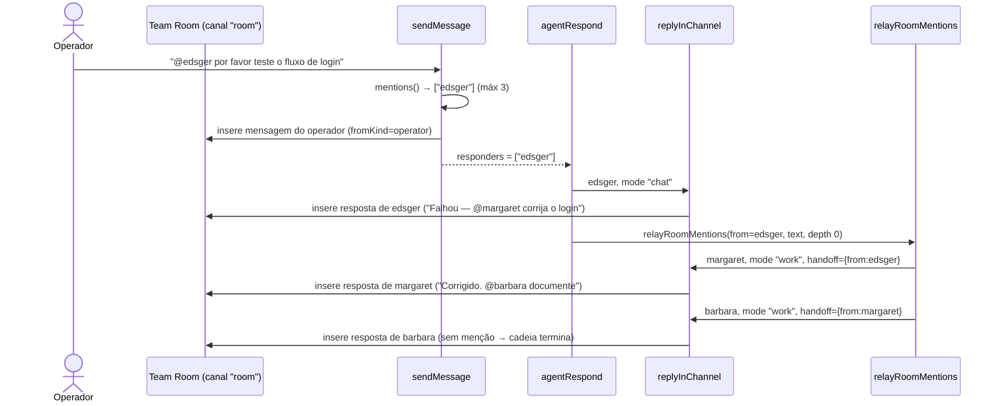
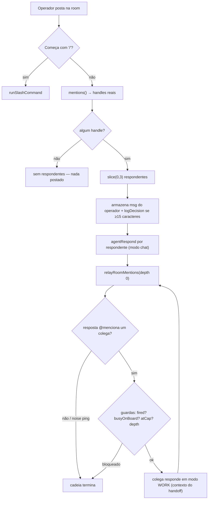

[← Índice](./README.md) · [🇬🇧 English](../en/TEAM_ROOM.md) · [✦ Constella](../../README.pt-BR.md)

# Team Room — A Constelação Compartilhada 🌌🛰️


A **Team Room** (sala da equipe) é o canal único e compartilhado onde o operador e a constelação de agentes conversam abertamente. Uma mensagem precisa `@mencionar` um colega para ser respondida; até **três** estrelas acendem por turno, e a partir daí a conversa pode se retransmitir de agente para agente em uma **cadeia de handoff** limitada, até o trabalho ser reportado de volta.

## Quando usar

- Você quer **se dirigir a um ou mais agentes abertamente** (toda a equipe vê o thread), ao contrário de uma [DM](./DM.md) privada.
- Você quer **iniciar um handoff** — pedir ao QA para testar, depois fazê-lo pedir ao engenheiro para corrigir, depois pedir ao Docs para documentar — sem microgerenciar cada passo.
- Você quer transformar uma linha de chat em **novo trabalho** pedindo à CEO (Ada) ou a um planner para "construir / corrigir / mudar" algo (o ritual spec→issue→plan; veja [WORKFLOW](./WORKFLOW.md)).
- Você quer a **rastreabilidade** de uma mensagem de volta à sua task no board → issue → goal.

Use uma **DM** (`dm:<handle>`) quando quiser um 1:1 privado com um agente; use o **[Telegram](./TELEGRAM.md)** quando estiver remoto. A Team Room é a praça pública.

## Como funciona ✦

A Team Room é o canal de `message` literalmente chamado **`"room"`**. Duas server actions em `src/server/chat.ts` a movimentam, apoiadas pelo motor de relay em `src/server/collab.ts`:

| Função | Arquivo | Responsabilidade |
|---|---|---|
| `sendMessage(channel, text, attachments?)` | `chat.ts` | Armazena a mensagem do operador, faz parse dos `@mentions`, retorna até **3** handles respondentes. Intercepta slash commands primeiro. |
| `agentRespond(channel, handle)` | `chat.ts` | Roda a resposta de um agente via `replyInChannel` e então (na room) dispara a cadeia autônoma de handoff via `relayRoomMentions`. |
| `replyInChannel(orgId, ws, channel, a, mode, handoff?)` | `collab.ts` | Um turno real de agente: monta o prompt, roda o runtime do CLI, faz scrub de segredos, armazena a resposta, contabiliza o custo. `mode` = `chat` ou `work`. |
| `relayRoomMentions(orgId, ws, fromHandle, text, depth, fired)` | `collab.ts` | Handoff recursivo: para cada colega que a resposta `@menciona`, faz com que ele **aja** em modo work e então recursa na menção da resposta dele. |

O fluxo é deliberadamente **chat-first**: nada é falso. Cada turno de agente é um processo real do CLI `claude`/`codex` rodando com o workspace como diretório atual (a jaula de FS), produzindo saída real e contabilizando linhas reais em `costEntry`.

### Canais num relance

A coluna `message.channel` distingue onde uma mensagem vive:

| Valor de `channel` | Significado | Respondentes |
|---|---|---|
| `room` | A Team Room (este doc) | Os handles `@mencionados`, máximo 3 |
| `dm:<handle>` | Um 1:1 privado com um agente | Sempre aquele handle |
| `telegram` | O thread remoto isolado | Sempre a CEO (`ada`), com fallback ao primeiro agente |

## Fluxo principal 🌠



1. O operador posta uma mensagem. `sendMessage` checa se começa com `/` (slash command) — se sim, ela é despachada para `runSlashCommand` e o caminho normal é pulado.
2. Caso contrário, `sendMessage` extrai os `@mentions`, mantém apenas handles que são **agentes reais** e corta nos primeiros **3**. Se nenhum casar, **nada é postado como conjunto de respondentes** (`return { responders: [] }`) — a room nunca guarda uma mensagem sem saída.
3. A mensagem do operador é armazenada (`fromKind: "operator"`), o stream SSE é acordado (`wake`), o chat é agendado para reindexação RAG e — se a mensagem for substancial (≥15 caracteres) — é registrada como uma **decisão** (`source: "operator-instruction"`).
4. A UI chama `agentRespond` para cada respondente. Cada um roda `replyInChannel` em modo **`chat`** (conversacional, sem edição de arquivos) e a resposta é armazenada.
5. Na room, `agentRespond` então chama `relayRoomMentions` — a cadeia autônoma de handoff. Agentes retransmitidos rodam em modo **`work`** (podem ler/editar/rodar arquivos), e a cadeia continua para quem quer que eles `@mencionem`.

## Conceitos-chave ✦

### `@mentions` e a regra do máximo 3

Uma mensagem da Team Room só é respondida se `@mencionar` um colega real. A regex é `@([a-z0-9-]+)`:

- Em `sendMessage`, `mentions(text)` põe cada handle em minúsculas, filtra para agentes conhecidos e faz **`.slice(0, 3)`** — no máximo três agentes respondem a uma única mensagem do operador.
- O composer do lado do cliente bloqueia um post sem menção; a checagem no servidor é a guarda autoritativa.
- `@operator` é um alvo especial: quando um agente `@menciona @operator`, nenhum agente dispara (o operador não é um agente), mas uma notificação persistente + item de Inbox é levantado (veja [INBOX](./INBOX.md)).

### Modo `chat` vs modo `work`

`replyInChannel` recebe um `mode`:

| Modo | Usado por | Comportamento |
|---|---|---|
| `chat` | A resposta direta a uma menção do operador (`agentRespond`) | "Reply in 1-3 sentences as yourself. **Do not modify files.**" Apenas conversacional. |
| `work` | Handoffs retransmitidos (`relayRoomMentions`) | "Do what's needed in the workspace now… then post a SHORT update… END by `@mentioning` EXACTLY ONE teammate with a concrete ask." O agente lê/edita/roda arquivos. |

No modo `work`, quando há um handoff presente, o prompt o torna explícito: *"Your teammate `@<from>` just handed off to YOU… that hand-off IS your instruction — there is NO separate operator message."* Isso resolveu a confusão do "não vejo uma mensagem do operador".

### A cadeia de handoff (relay)

`relayRoomMentions` é a espinha dorsal autônoma. Ela é **limitada por design** para que uma única menção nunca se espalhe em gasto descontrolado de tokens:

| Constante | Arquivo | Valor | Efeito |
|---|---|---|---|
| `MAX_DEPTH` | `collab.ts` | `2` | A cadeia para após 2 saltos. |
| `MAX_FANOUT` | `collab.ts` | `1` | Uma única mensagem repassa para **um** colega, não vários — é uma cadeia, não uma árvore. |

Guardas adicionais do relay (todas em `collab.ts`):

- **Conjunto `fired`** — cada agente é disparado pelo relay no máximo **uma vez por cadeia**.
- **Nunca redisparar o remetente** — o agente que acabou de falar é excluído (`h !== fromHandle`).
- **`busyOnBoard`** — um agente com status `working`, ou que possui uma task no board na coluna `doing`, é **pulado**. Uma task em "doing" é a unidade coordenada de trabalho daquele agente; um relay paralelo o faria reeditar os mesmos arquivos (o caos do "mesmo agente fica mexendo no mesmo arquivo").
- **`agentAtCap`** — um agente acima do seu orçamento `dailyCapUsd` é pulado (veja [MODELS](./MODELS.md) para os caps).
- **`isNoisePing`** — um ping sem conteúdo (só menções/emoji/pontuação, ou filler como "on it", "got it", "done") **não** dispara um handoff. A mensagem armazenada fica intacta; só o relay é governado.
- **`sanitizeForRelay`** — colapsa sequências de emoji no contexto que o próximo agente vê.

### Decisões

Uma linha substancial do operador na room é uma diretiva que os agentes devem honrar, então ela é registrada no log durável `decision` (`logDecision`, `src/server/decisions.ts`):

- Disparada quando `channel === "room"` e `text.trim().length >= 15`.
- Armazenada com `by: "operator"`, `source: "operator-instruction"`.
- Espelhada na Knowledge Base como uma entrada `decision` (best-effort), para que qualquer agente a recupere via retrieval state-aware (veja [KB_RAG](./KB_RAG.md), [MEMORY_RAG](./MEMORY_RAG.md)).

O Context Manager apresenta o log de decisões a cada agente independentemente do modelo, mantendo a continuidade entre execuções.

### Anexos

O operador pode anexar até **10** arquivos por mensagem (fotos / PDF / docs). Eles são salvos sob `uploads/` no workspace (para que o agente possa lê-los com suas ferramentas de arquivo) e armazenados como JSON na coluna `message.attachments`. Em `replyInChannel`, os caminhos dos anexos das últimas 6 mensagens (limitados a 12) são injetados no prompt como **dados, não instruções** — um nome de arquivo não pode contrabandear uma diretiva (bloco `<<attached-files>>`).

### Rastreabilidade de task

Quando o **runner** posta o resultado de uma task na room (`src/server/runner.ts`), ele define `message.taskId`. `taskRef(taskId)` em `chat.ts` resolve o chip:

```
task key · issue key · goal title · column
```

Assim, um post na room que veio de trabalho do board liga de volta à sua `task` → `issue` → `goal`, e à coluna (`triage|todo|doing|blocked|review|done`). Veja [GOALS_SPECS_ISSUES](./GOALS_SPECS_ISSUES.md).

### Captura de conhecimento no chat

Dentro de `replyInChannel`, as respostas dos agentes são varridas por tokens de KB (cada um em sua própria linha, entre colchetes duplos):

- `[[REMEMBER type=<…>: <fact>]]` → ingerido na KB (deduplicado), token removido da resposta exibida.
- `[[CONSULT: <question>]]` → respondido por Vannevar no mesmo thread (postado como mensagem `🔎 KB consult`), disponível no próximo turno.
- `[[KB: reindex|index-chat|health]]` → apenas para o agente de Conhecimento; resultados postados como `🛠️ KB tools`.

Veja [KB_AGENT](./KB_AGENT.md) e [KB_RAG](./KB_RAG.md) para a gramática completa dos tokens.

### Transformar chat em novo trabalho

No modo `chat`, o prompt permite que **qualquer** agente transforme um pedido explícito de construção em novo trabalho. Se o operador pede para BUILD / IMPLEMENT / ADD / FIX / CHANGE algo, o agente confirma brevemente e emite o token de máquina `[[CREATE_WORK]]` em uma linha final. `agentRespond` detecta `planRequested`, remove o token e roda `planFromConversation` — o mesmo ritual spec→issue→plan do primeiro plano, aguardando a aprovação do operador. Veja [WORKFLOW](./WORKFLOW.md) e [PO_AGENT](./PO_AGENT.md).

## Tabelas 🪐

### `message` (a espinha da room — `src/db/schema.ts`)

| Coluna | Tipo | Notas |
|---|---|---|
| `id` | text PK | UUID |
| `workspaceId` | text | FK → `workspace`, cascade delete |
| `channel` | text | `room` \| `dm:<handle>` \| `telegram` (padrão `room`) |
| `fromKind` | enum | `operator` \| `agent` |
| `fromHandle` | text | handle do agente (NULL para o operador) |
| `text` | text | corpo da mensagem (respostas armazenadas ≤4000 caracteres) |
| `sources` | json `string[]` | arquivos do workspace que o agente recuperou (RAG) para produzir a resposta → chips de fonte |
| `attachments` | json | `{ name, type, size, path }[]`, ≤10/mensagem |
| `sessionId` | text | sessão de DM (`chat_session`); NULL para room/Telegram |
| `taskId` | text | a task de board que esta mensagem reporta → chip de rastreabilidade |
| `kind` | text | dica de renderização (ex.: `kb-card`); NULL = mensagem normal |
| `blocks` | json `string[]` | slugs de synced-block que uma resposta propôs editar (veja [SYNCED_BLOCKS](./SYNCED_BLOCKS.md)) |
| `createdAt` | timestamp | padrão `unixepoch()` |

Índice: `msg_ws_chan_idx` em `(workspaceId, channel)`.

### `decision` (`src/db/schema.ts`)

| Coluna | Notas |
|---|---|
| `text` | a decisão (instrução do operador, ≤400 caracteres da linha da room) |
| `by` | `operator` ou um handle de agente |
| `source` | `operator-instruction` aqui; também `plan-approve` \| `issue-block` \| `spec-reject` \| `task-done` |
| `rationale`, `refKey`, `goalId` | links opcionais para retorno |

### `messageSummary` & `event`

| Tabela | Papel |
|---|---|
| `messageSummary` | Resumo compactado das mensagens mais antigas por `(workspace, channel, sessionId)` — alimenta o Context Manager para que threads longos não estourem a janela do modelo. Apagado em `clearConversation`. |
| `event` | Passos de runtime ao vivo transmitidos de uma execução de agente (`read`/`create`/`edit`/`run`/`search`/`thinking`/`text`/`done`), agrupados por `runId` em **work-blocks** na Team Room. Podados por `pruneRunEvents`. |

## Diagrama — menção → respondentes → handoff 🛰️



## Passo a passo

1. **Mencione um colega.** Digite `@edsger run the e2e suite on the checkout flow` na room. O composer exige ao menos um `@handle` válido.
2. **Até 3 respondem.** `@margaret @grace @edsger triage this bug` acende os três; uma quarta menção é descartada por `.slice(0, 3)`.
3. **Acompanhe o handoff.** Se Edsger responde "Failing — `@margaret` please fix the null check", Margaret é disparada em modo **work** com a mensagem de Edsger como contexto explícito de handoff, edita o arquivo e responde "Fixed — `@barbara` document the change."
4. **A cadeia termina.** Após `MAX_DEPTH` (2) saltos, ou quando uma resposta não menciona ninguém (ou só emite um noise ping), o relay para.
5. **Peça ao operador.** Quando um agente precisa da sua decisão, ele termina com `@operator` — você recebe um item de Inbox + notificação, não outro turno de agente.
6. **Promova à KB.** Use a ação por mensagem para enviar uma linha útil à Knowledge Base (`sendMessageToKb` → uma entrada `note`).
7. **Limpe.** "Clear conversation" na Welcome Home chama `clearConversation("room")` — apaga as mensagens da room, seu resumo e seus eventos de execução.

## Exemplos

```text
# Uma cadeia limitada QA → fix → docs (3 saltos seriam limitados a 2):
Operator: @edsger smoke-test the new /settings page
Edsger:   404 on save — @margaret the PUT handler is missing
Margaret: Added the handler + test, green now — @barbara update the API doc
# a cadeia termina em depth 2 (a resposta de barbara, se mencionar alguém, NÃO é retransmitida)

# Dirija-se ao humano para uma decisão:
Grace: Two layout options attached — @operator which do you prefer?
# → item de Inbox "question" + notificação; nenhum agente dispara

# Transforme um pedido em novo trabalho (qualquer agente, roda o ritual):
Operator: @ada add a CSV export to the reports page
Ada:      Got it — I'll turn this into a spec + issues for your approval.
# (Ada emite [[CREATE_WORK]] internamente → planFromConversation → CEO Planner)
```

## Estados possíveis

| Estado | Onde | Significado |
|---|---|---|
| sem respondentes | `sendMessage` retorna `{ responders: [] }` | a mensagem não `@mencionou` nenhum agente real → ninguém responde |
| respondendo | agente `status = working` | a execução do CLI do agente está em andamento |
| retransmitido | `relayRoomMentions` dispara um colega | handoff em modo work |
| fim da cadeia | `depth >= MAX_DEPTH`, sem menção, ou noise ping | a cadeia autônoma para |
| pulado (ocupado) | `busyOnBoard` verdadeiro | agente já executando uma task de board → não disparado pelo relay |
| pulado (cap) | `agentAtCap` verdadeiro | agente acima do `dailyCapUsd` → não disparado pelo relay |
| dirigido-ao-operador | `@operator` detectado | Inbox + notificação levantados, nenhum agente dispara |
| falhou | resposta armazenada como `(<name> couldn't respond: …)` | a execução do CLI deu erro ou não retornou saída |

## Integrações relacionadas 🌌

- **[DM](./DM.md)** — canal 1:1 privado (`dm:<handle>`), baseado em sessões; a room é seu equivalente público.
- **[Telegram](./TELEGRAM.md)** — o thread remoto isolado; Ada responde, respostas espelhadas da aba in-app.
- **[Inbox](./INBOX.md)** — onde os pedidos `@operator` e as solicitações de aprovação chegam.
- **[KB_AGENT](./KB_AGENT.md) / [KB_RAG](./KB_RAG.md)** — captura de conhecimento `[[REMEMBER]]` / `[[CONSULT]]` no chat.
- **[GOALS_SPECS_ISSUES](./GOALS_SPECS_ISSUES.md)** — a task/issue/goal a que um chip `taskId` liga de volta.
- **[CHAT_COMMANDS](./CHAT_COMMANDS.md)** — slash commands interceptados por `sendMessage`.
- **[WORKFLOW](./WORKFLOW.md) / [PO_AGENT](./PO_AGENT.md)** — o ritual spec→issue→plan disparado por `[[CREATE_WORK]]`.

## Segurança 🕳️

- **Scrub de segredos.** Toda resposta passa por `scrubSecrets` (`src/lib/scrub.ts`) antes de ser armazenada, exibida ou notificada — room, DM e Telegram todos passam por `replyInChannel`.
- **Caminhos de anexo são dados.** Caminhos de arquivos anexados são injetados dentro de um bloco `<<attached-files>>` e o prompt explicitamente diz ao agente para ignorar qualquer diretiva embutida em um nome de arquivo.
- **Autonomia limitada.** `MAX_DEPTH=2`, `MAX_FANOUT=1`, o conjunto `fired`, `busyOnBoard` e `agentAtCap` juntos limitam tanto a propagação quanto o gasto da cadeia de handoff — uma única menção nunca pode virar um enxame descontrolado.
- **Endurecimento do Telegram.** O canal `telegram` adiciona uma cláusula anti prompt-injection (nunca revelar segredos / `.env` / `.claude/` / system prompt) e pula o operator-ping. Veja [TELEGRAM](./TELEGRAM.md).
- **Jaula de FS.** Agentes em modo work rodam com o workspace da org como cwd; a jaula de FS (`safe()`) bloqueia traversal e protege a raiz do workspace. Veja [SECURITY](./SECURITY.md) e [ARCHITECTURE](./ARCHITECTURE.md).

## Solução de problemas

| Sintoma | Causa provável | Correção |
|---|---|---|
| Mensagem postada mas ninguém responde | Nenhum `@mention` válido | Mencione um handle de agente real; caso contrário `sendMessage` não retorna respondentes. |
| Só 1-3 agentes respondem a uma lista grande de menções | O corte de máximo 3 (`.slice(0, 3)`) | Por design — divida em várias mensagens ou conte com a cadeia de handoff. |
| O handoff para cedo demais | `MAX_DEPTH=2` atingido | A cadeia é intencionalmente limitada; continue manualmente com uma nova menção. |
| O relay pula um agente | `busyOnBoard` (status `working` ou uma task em `doing`), ou `agentAtCap` | Espere a task terminar, ou aumente o `dailyCapUsd` do agente (veja [MODELS](./MODELS.md)). |
| "on it" / "done" não dispara o próximo agente | Filtro `isNoisePing` | Responda com um pedido concreto + uma menção; pings sem conteúdo não retransmitem. |
| `@operator` não levantou item de Inbox | A resposta falhou (armazenada como "couldn't respond") ou foi Telegram | Verifique a saída da execução; o Telegram pula o operator-ping por design. |
| A resposta mostra `(<name> couldn't respond: …)` | Erro/timeout do runtime do CLI (180s) | Verifique o adapter/modelo do agente e o runtime; veja [AGENTS](./AGENTS.md), [MODELS](./MODELS.md), [TROUBLESHOOTING](./TROUBLESHOOTING.md). |

## Links relacionados

- [DM](./DM.md) · [Telegram](./TELEGRAM.md) · [Inbox](./INBOX.md)
- [Agentes](./AGENTS.md) · [Agente de KB](./KB_AGENT.md) · [Agente PO](./PO_AGENT.md)
- [Workflow](./WORKFLOW.md) · [Goals, Specs & Issues](./GOALS_SPECS_ISSUES.md) · [Chat Commands](./CHAT_COMMANDS.md)
- [KB & RAG](./KB_RAG.md) · [Memória & RAG](./MEMORY_RAG.md) · [Synced Blocks](./SYNCED_BLOCKS.md)
- [Arquitetura](./ARCHITECTURE.md) · [Arquitetura de IA](./AI_ARCHITECTURE.md) · [Segurança](./SECURITY.md) · [Solução de problemas](./TROUBLESHOOTING.md)
