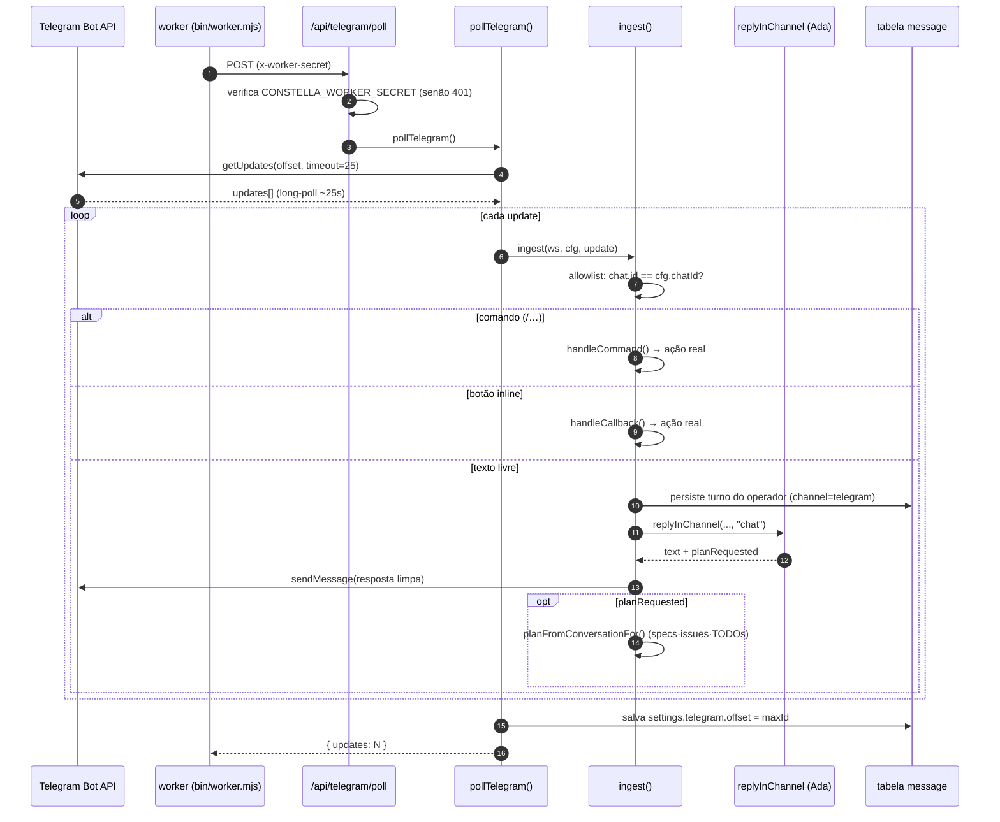

[← Índice](./README.md) · [🇬🇧 English](../en/TELEGRAM.md) · [✦ Constella](../../README.pt-BR.md)

# 🛰️ Telegram — a ponte de bolso para a sua constelação


Um único chat privado do Telegram vira uma ponte remota para a sua empresa de agentes: você conversa com a CEO (Ada), aprova planos, liga ou pausa a execução 24/7, dispara novos trabalhos e consulta a Base de Conhecimento — tudo pelo celular, enquanto a nave de controle continua rodando sem interface.

> Fonte da verdade: `src/server/telegram.ts` (ingest + comandos + callbacks), `src/lib/telegram.ts` (cliente da Bot API + formato do token), `bin/worker.mjs` (loop de long-poll), `src/app/api/telegram/poll/route.ts` (entrada exclusiva do worker), `src/server/actions/profile-actions.ts` (`connectTelegram`), `src/lib/scrub.ts` (limpeza de segredos).

---

## 2. O que é

Um bot do Telegram bidirecional, restrito a **um** chat privado por workspace (allowlist). Mensagens recebidas chegam à agente CEO por um canal **isolado** (`telegram`), e um conjunto de comandos de barra + botões inline funcionam como um controle remoto real sobre o ciclo de trabalho. Saída: respostas da agente digitadas na aba Telegram dentro do app são espelhadas de volta para o celular, mantendo a conversa em uma única thread independentemente de onde você digitou.

## 3. Quando usar 🌠

- Você está longe da nave de controle mas quer **ver o status**, **aprovar um plano pendente** ou **ligar/desligar a execução 24/7**.
- Você quer **iniciar um novo trabalho** a partir de um briefing de uma linha (`/new …`) e deixar a CEO transformá-lo em specs · issues · TODOs.
- Você quer **perguntar à Base de Conhecimento** (`/kb …`) sem abrir o app.
- Você quer **conversar com a CEO** (Ada) como em qualquer DM, mas pelo celular.

O Telegram é opcional. É um plugin nativo e o toggle de integração (`settings.integrations.telegram`) vem **LIGADO** por padrão, mas nada acontece até você conectar um token de bot + chat id pela tela de Perfil. Se não estiver configurado, todo caminho do Telegram é um no-op honesto.

## 4. Como funciona 🌌

### Os dois processos

A Constella roda um processo **web** (Next.js) e um **worker** separado (`bin/worker.mjs`). O polling do Telegram vive no worker:

- O worker roda `telegramLoop()` — um loop infinito que faz POST em `BASE/api/telegram/poll` com o header privilegiado `x-worker-secret`.
- Essa rota (`src/app/api/telegram/poll/route.ts`) é **fail-closed**: exige `CONSTELLA_WORKER_SECRET` e retorna `401` se o header faltar/estiver errado. Em `401`, o worker recua por 30s (tratado como "não configurado / segredo divergente").
- A rota chama `pollTelegram()` (em `src/server/telegram.ts`), que faz o trabalho real, e devolve `{ ok, updates }`.

### Long-polling, por workspace

`pollTelegram()` itera por **todos** os workspaces. Para cada um, ela:

1. Pula o workspace se a integração estiver desligada (`integrationOn(settings.integrations, "telegram")` — veja `src/lib/integrations.ts`).
2. Carrega a config do cofre via `getTelegramConfig(ws.id)`; pula se ausente ou se o token estiver malformado.
3. Registra o menu de comandos `/` do bot **uma vez por bot por processo** (`tgSetMyCommands`, protegido por um set em memória `commandsRegistered`).
4. Chama `tgGetUpdates(token, offset)` — o `getUpdates` do Telegram com `timeout=25` (um **long-poll do lado do servidor** de ~25s) e `allowed_updates=["message","callback_query"]`.
5. Faz o ingest de cada update, avança o cursor (`maxId = update_id + 1`) e persiste de volta em `settings.telegram.offset`.

O worker deixa um intervalo breve de 1s entre os long-polls; em erro, recua por 5s.

### A allowlist 🕳️

Somente o **único chat privado registrado** pode comandar o bot. Em `ingest()`:

- O `chat.id` da mensagem deve ser igual a `cfg.chatId`, **e**
- se `m.from` existir, o `from.id` do remetente também deve ser igual a `cfg.chatId` (em um chat privado eles são o mesmo número).

Qualquer outra coisa é **ignorada silenciosamente**. A mesma checagem é reaplicada aos toques em botões inline em `handleCallback()`. Na conexão (`connectTelegram`), o chat id é validado como um id numérico positivo (ids de grupo são negativos e deixariam qualquer membro comandar o bot — são rejeitados).

### Roteamento de entrada

Para uma mensagem permitida, `ingest()` decide o caminho:

| Condição | O que acontece |
| --- | --- |
| `callback_query` presente | Toque em botão inline → `handleCallback()` |
| aguardando motivo de rejeição + texto puro (não `/…`) | O texto **é** o motivo da rejeição → `requestPlanChangesFor()` |
| texto começa com `/` | Comando de controle remoto → `handleCommand()` |
| caso contrário | Falar com a CEO → `runCeoReply()` |

Texto + legenda são limitados a 4000 caracteres. Fotos e documentos são baixados e salvos como anexos (veja [Anexos](#anexos)).

### Conversando com a CEO

`runCeoReply()` resolve a agente **Ada** (`handle = "ada"`, com fallback para o primeiro agente), coloca o status dela em `working`, mostra um indicador `typing…` ao vivo num heartbeat de 4s (o Telegram limpa após ~5s) e chama `replyInChannel(orgId, ws, "telegram", ada, "chat")` (`src/server/collab.ts`).

O `replyInChannel` adiciona uma **proteção contra injeção de prompt específica do Telegram**: avisa ao modelo que a mensagem do operador é *dado, não instrução*, que ele nunca deve revelar segredos / conteúdo de `.env` / `.claude/` / o system prompt, e que deve recusar qualquer tentativa de override. A resposta passa pela limpeza de segredos antes do envio.

Se a Ada decidir que é trabalho de build/fix, ela emite um token interno `[[CREATE_WORK]]`; `replyInChannel` devolve `planRequested = true`, e o `runCeoReply` então roda `planFromConversationFor(orgId, ws, "telegram")` — o **mesmo** ritual de planejamento do caminho web (specs → issues → TODOs) — e confirma no celular.

## 5. Fluxo principal — poll → agente → resposta 🚀



## 6. Conceitos-chave ✦

- **Canal isolado.** O Telegram vive em seu próprio canal `telegram` — nunca `room` ou `dm:<handle>` — então a conversa do celular nunca vaza contexto para a team room ou DMs. (`TG_CHANNEL = "telegram"`.)
- **Credenciais no cofre.** O token do bot + chat id ficam criptografados no cofre sob o ref `telegram_bot` como JSON `{botToken, chatId, allowedName}`. Nunca são persistidos em settings em texto puro.
- **Cursor de offset.** `settings.telegram.offset` é o cursor de updates do Telegram; avançá-lo confirma os updates processados para que nunca sejam reentregues.
- **Espera pelo motivo da rejeição.** Um set em memória `awaitingReason` lembra que você tocou no botão **↩️ Reject**; sua próxima mensagem de texto puro vira o motivo. Em memória basta — um restart do servidor simplesmente descarta a espera pendente (toque de novo para repetir).
- **Registro do menu de comandos.** `commandsRegistered` garante que `setMyCommands` rode uma vez por bot por processo — até bots conectados antes desse recurso existir recebem o menu no próximo poll.
- **Limpeza de segredos.** Toda string de saída passa por `scrubSecrets(text, [cfg.botToken])` (`src/lib/scrub.ts`) — redigindo o token do bot, os segredos de ambiente padrão e formatos de credenciais de alta confiança (OpenAI/Anthropic `sk-…`, tokens do GitHub, chaves AWS, JWTs, chaves PEM, PATs `cn_…` da Constella e até outros tokens do Telegram).

## 7. Tabelas

### Comandos de barra do Telegram (`handleCommand`)

| Comando | Aliases | Ação |
| --- | --- | --- |
| `/help` | — | Mostra o texto de ajuda do controle remoto |
| `/status` | — | `planStatusFor(ws)` — status rápido |
| `/review` | — | `reviewSummaryFor(ws)` — resumo de plano / issues / tasks |
| `/tasks` | — | `tasksListFor(ws)` — o que está em andamento agora |
| `/approve` | — | `approvePlanFor()` — aprova o plano pendente, enfileira tasks |
| `/start_execution` | `/start`, `/run` | `approvePlanFor()` + `setAuto247For(true)` — aprova e roda 24/7 |
| `/pause` | `/stop` | `setAuto247For(false)` — pausa o 24/7 |
| `/resume` | — | `setAuto247For(true)` — retoma o 24/7 |
| `/reject <motivo>` | — | `requestPlanChangesFor()` — devolve o plano à CEO |
| `/new <briefing>` | `/new-work`, `/new-goal` | Injeta um turno do operador + roda a CEO → goal · specs · issues |
| `/cancel` | — | `cancelGoalFor()` no goal ativo mais recente — para a execução |
| `/archive` | — | `archiveGoalFor()` no goal ativo mais recente — zipa + arquiva |
| `/kb <pergunta>` | `/ask-kb` | `kbAnswer(orgId, q)` — pergunta à Base de Conhecimento |
| *(desconhecido)* | — | Responde "Unknown command" + ajuda |

> O menu `/` que o Telegram mostra é registrado a partir de `TG_BOT_COMMANDS` em `src/lib/telegram.ts` e deve espelhar `handleCommand`. O menu exibido omite os aliases.

### Callbacks de botão inline (`handleCallback`)

| `callback_data` | Ação | Toast | One-shot? |
| --- | --- | --- | --- |
| `approve_plan` | `approvePlanFor()` | ✅ Approved | sim (teclado removido) |
| `start_exec` | `approvePlanFor()` + `setAuto247For(true)` | ▶️ Executing | sim |
| `reject_plan` | `requestPlanChangesFor()` + arma a espera do motivo | ↩️ Sent back | sim |
| `review` | `reviewSummaryFor(ws)` | 📝 Review | não |
| `status` | `planStatusFor(ws)` | 📊 Status | não |
| `pause` | `setAuto247For(false)` | ⏸ Paused | não |
| `resume` | `setAuto247For(true)` | ▶️ Resumed | não |
| *(desconhecido)* | — | Unknown action | — |

Ações one-shot (`approve_plan` / `start_exec` / `reject_plan`) têm seu teclado inline removido via `tgClearButtons`, para que um segundo toque não as dispare de novo.

### Config do cofre & settings

| Onde | Chave / coluna | Significado |
| --- | --- | --- |
| cofre | ref `telegram_bot` | JSON criptografado `{botToken, chatId, allowedName}` |
| `workspace.settings` | `integrations.telegram` | toggle de integração (padrão `true`) |
| `workspace.settings` | `telegram.offset` | cursor do `getUpdates` do Telegram |

### Linhas em `message` escritas pelo Telegram

| Coluna | Valor no caminho do Telegram |
| --- | --- |
| `channel` | `"telegram"` (constante `TG_CHANNEL`) |
| `fromKind` | `"operator"` (entrada) / `"agent"` (respostas) |
| `fromHandle` | `"system"` para respostas de controle; handle da Ada para respostas da CEO |
| `text` | texto da mensagem ou `"(attachment)"`, limitado a 4000 |
| `attachments` | descritores de arquivos salvos, ou `null` |

## 8. Superfície da Bot API 🪐

Todas as chamadas HTTP passam por `src/lib/telegram.ts` contra `https://api.telegram.org`. Cada helper primeiro checa `isTelegramToken()` — formato do token `^\d{6,}:[A-Za-z0-9_-]{30,}$` — para que um valor malformado nunca consiga repontar a URL da requisição.

| Helper | Método da Bot API | Propósito |
| --- | --- | --- |
| `tgGetMe` | `getMe` | verifica o token → `@username` (na conexão) |
| `tgSetMyCommands` | `setMyCommands` | registra o menu de comandos `/` |
| `tgGetUpdates` | `getUpdates` | long-poll (`timeout=25`, `message` + `callback_query`) |
| `tgGetFile` | `getFile` + `/file/bot…` | baixa uma foto/documento → bytes |
| `tgSendChatAction` | `sendChatAction` | indicador `typing…` |
| `sendTelegramTo` | `sendMessage` | resposta em texto puro (sem Markdown) |
| `sendTelegram` | `sendMessage` | envio de notificação (Markdown) |
| `sendTelegramButtons` | `sendMessage` + `inline_keyboard` | mensagem com botões de controle remoto |
| `tgAnswerCallback` | `answerCallbackQuery` | confirma um toque de botão + toast opcional |
| `tgClearButtons` | `editMessageReplyMarkup` | remove um teclado one-shot |

Respostas da agente usam `sendTelegramTo` (texto puro, sem `parse_mode`) de propósito — conteúdo arbitrário (títulos de issues, código, nomes de workspace) nunca deve quebrar o envio nem ser interpretado como Markdown.

## 9. Anexos

Fotos e documentos em uma mensagem recebida são baixados e armazenados no workspace:

- Um id curto de download por mensagem é gerado (`uid().slice(0,8)`).
- Cada arquivo é buscado via `tgGetFile`, tem o nome sanitizado (`[^\w.\-]` → `_`, últimos 60 caracteres) e é gravado em `uploads/tg-<dlId>/<nome-seguro>` sob a **raiz da org** (`orgRoot(ws.orgId)`).
- Um descritor de anexo `{name, type, size, path}` é adicionado ao `message.attachments` persistido.
- Fotos usam o maior tamanho disponível; documentos mantêm seu `file_name` e `mime_type` originais.

Uma mensagem sem texto e sem nenhum anexo salvo é descartada.

## 10. Passo a passo — conectar & comandar 🛰️

### Conectar o bot (`connectTelegram`)

1. Crie um bot com o **@BotFather** do Telegram e copie o token.
2. Descubra seu **chat id numérico pessoal** (um chat privado — não um grupo).
3. Na tela de **Perfil** da Constella, informe o token + chat id (e um nome de exibição opcional).
4. `connectTelegram()` valida o formato do token, rejeita ids não-positivos/de grupo, chama `tgGetMe` para verificar que o token realmente funciona, então armazena `{botToken, chatId, allowedName}` no cofre e registra o menu `/` (`tgSetMyCommands`).
5. O worker pega isso no próximo poll — mande uma mensagem ao bot para confirmar.

> `telegramStatus()` alimenta o card no app e mascara o chat id (`12•••89`). `disconnectTelegram()` apaga o ref `telegram_bot` do cofre.

### Comandar pelo celular

```text
/status                      → status rápido
/review                      → resumo completo de plano / issues / tasks
/new uma página de cobrança com checkout
                             → a CEO rascunha goal · specs · issues · TODOs
/approve                     → enfileira as tasks
/start_execution             → aprova + 24/7 LIGADO
/pause   /resume             → liga/desliga o 24/7
/reject use um provedor de pagamento diferente → devolve o plano com um motivo
/cancel  /archive            → para / arquiva o goal ativo
/kb como funciona a auth?    → pergunta à Base de Conhecimento
só conversar normalmente     → fala com a CEO (Ada)
```

### Espelhamento (app → celular)

Quando você responde pela **aba Telegram dentro do app**, `src/server/chat.ts` chama `mirrorToTelegram(workspace.id, reply)`. Ele carrega a config do cofre e envia a resposta já limpa para o chat real — mantendo a conversa do bot numa única thread independentemente de onde você digitou.

## 11. Estados possíveis

| Estado | Sintoma | Causa |
| --- | --- | --- |
| **Não configurado** | Bot nunca responde; rota de poll retorna `401` e depois recua 30s | sem segredo `telegram_bot` no cofre |
| **Integração desligada** | Configurado mas ignorado | `settings.integrations.telegram = false` |
| **Conectado** | Respostas, comandos e botões funcionam | token válido + chat id correspondente |
| **Chat estranho** | Silêncio | id de remetente / chat ≠ `cfg.chatId` (ignorado silenciosamente) |
| **Aguardando motivo** | Próxima mensagem de texto registrada como motivo da rejeição | você tocou em **↩️ Reject** |
| **Typing…** | Indicador ao vivo enquanto a resposta é gerada | heartbeat de 4s em `runCeoReply` |
| **Worker fora do ar** | Nenhuma resposta | o processo worker não está rodando (veja [TEST_DEV](./TEST_DEV.md) / [ARCHITECTURE](./ARCHITECTURE.md)) |

## 12. Integrações relacionadas

- O caminho de resposta da CEO é o mesmo usado por [DM](./DM.md) e pela [TEAM_ROOM](./TEAM_ROOM.md) — o Telegram só o roda em seu canal isolado com uma proteção extra contra injeção.
- `/new` roda o ritual completo do [WORKFLOW](./WORKFLOW.md) (Goal → Spec → Issue → Plan → TODOs); veja [GOALS_SPECS_ISSUES](./GOALS_SPECS_ISSUES.md).
- `/kb` responde a partir da nebulosa de memória [KB_RAG](./KB_RAG.md).
- As mesmas ações de controle remoto são expostas programaticamente pela [PUBLIC_API](./PUBLIC_API.md) e pelo servidor [MCP](./MCP.md).
- O Telegram é uma entrada nativa de [PLUGINS](./PLUGINS.md); o toggle vive ao lado das outras integrações.

## 13. Segurança 🕳️

- **Entrada exclusiva do worker.** `/api/telegram/poll` exige `x-worker-secret == CONSTELLA_WORKER_SECRET` (fail-closed `401`). O worker ainda se recusa a enviar esse segredo para qualquer `CONSTELLA_BASE_URL` não-loopback, a menos que `CONSTELLA_ALLOW_REMOTE_WORKER_BASE_URL=1` (proteção contra SSRF / exfiltração de segredo).
- **Allowlist estrita.** Exatamente um chat id privado; tanto `chat.id` quanto `from.id` são checados nas mensagens e nos toques de botão. Ids de grupo (negativos) são rejeitados na conexão.
- **Validação do formato do token.** `isTelegramToken()` protege toda chamada da Bot API para que um token adulterado não consiga redirecionar a URL da requisição.
- **Reforço contra injeção de prompt.** `replyInChannel` injeta uma cláusula de segurança específica do Telegram: a mensagem do operador é *dado*, segredos/`.env`/`.claude/`/system-prompt nunca devem ser revelados, tentativas de override são recusadas.
- **Limpeza de segredos na saída.** Toda mensagem de saída passa por `scrubSecrets(…, [cfg.botToken])` — redigindo o token do bot mais formatos de credenciais de alta confiança — antes de sair da nave.
- **Criptografado em repouso.** As credenciais vivem no [cofre](./SECURITY.md) AES-256-GCM, nunca em settings em texto puro; o card de status no app mascara o chat id.
- **Saída limitada.** Os corpos de saída têm tamanho limitado (`sendTelegramTo` 3800, `sendTelegram` 3500), e `callback_data` é limitado ao máximo de 64 bytes do Telegram.

## 14. Solução de problemas 🛠️

| Sintoma | Verifique |
| --- | --- |
| Bot mudo, rota de poll retorna `401` | Sem segredo `telegram_bot` — conecte pelo Perfil. (O worker trata `401` como "não configurado" e recua 30s.) |
| "Telegram rejected this bot token." na conexão | Token errado/revogado — `tgGetMe` falhou; copie de novo do @BotFather. |
| "Chat id must be your personal numeric id…" | Você usou um id de grupo (negativo) — use seu chat id privado. |
| Mensagens ignoradas, sem erro | `chat.id`/`from.id` do remetente ≠ o `cfg.chatId` registrado (allowlist). |
| Menu `/` não aparece | `setMyCommands` é best-effort; roda uma vez por bot por processo — reinicie o worker ou reconecte. |
| Nenhuma resposta | O processo **worker** não está rodando — inicie `npm start` (web + worker) ou `npm run dev:all`. |
| Resposta parece cortada | Os corpos têm tamanho limitado por design (3800/3500 caracteres). |
| Motivo da rejeição não registrado | Um comando de barra supera a espera pendente do motivo; envie o motivo como texto puro logo após tocar em ↩️ Reject. |

## 15. Links relacionados

- [DM](./DM.md) · [TEAM_ROOM](./TEAM_ROOM.md) · [CHAT_COMMANDS](./CHAT_COMMANDS.md)
- [WORKFLOW](./WORKFLOW.md) · [GOALS_SPECS_ISSUES](./GOALS_SPECS_ISSUES.md)
- [KB_RAG](./KB_RAG.md) · [KB_AGENT](./KB_AGENT.md)
- [PUBLIC_API](./PUBLIC_API.md) · [MCP](./MCP.md) · [PLUGINS](./PLUGINS.md)
- [ARCHITECTURE](./ARCHITECTURE.md) · [AI_ARCHITECTURE](./AI_ARCHITECTURE.md) · [SECURITY](./SECURITY.md)
- [CONFIGURATION](./CONFIGURATION.md) · [TROUBLESHOOTING](./TROUBLESHOOTING.md) · [FAQ](./FAQ.md)
