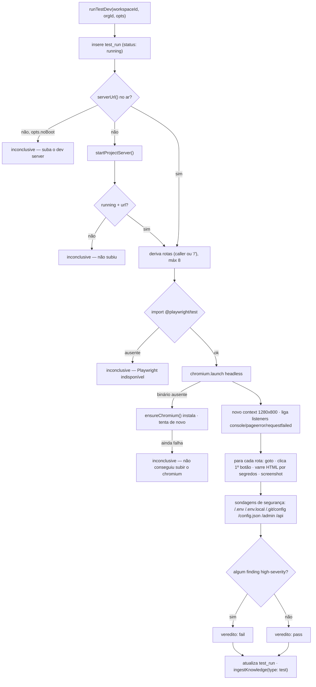
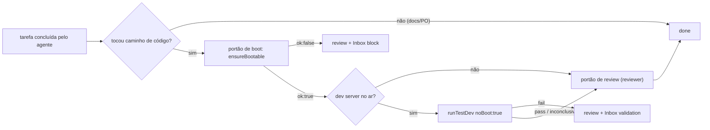

[← Índice](./README.md) · [🇬🇧 English](../en/TEST_DEV.md) · [✦ Constella](../../README.pt-BR.md)

# Test Dev 🛰️ — pilotando o produto antes do lançamento


O Test Dev sobe o **produto que os agentes estão construindo** (não a nave Constella em si), o dirige com um navegador headless e relata o que viu: erros de console, crashes de página, requisições que falharam, segredos vazados e um punhado de sondagens de segurança. Ele é ao mesmo tempo um **console do operador** (a tela `/test-dev`) e um **portão autônomo** que o loop de trabalho atravessa antes de uma tarefa ser marcada como `done`.

> Mapa estelar: o produto é uma pequena sonda em órbita. O Test Dev é a passagem de telemetria — pilotamos, observamos os instrumentos e só liberamos para a próxima etapa se nada crítico acender. Um boot que nunca alcança a órbita é `inconclusive`, nunca um falso `fail`.

---

## Quando usar 🌌

- **Operador, sob demanda** — abra o módulo **Test Dev** (rota `/test-dev`) ou digite `/test-dev` na Team Room / em uma DM para rodar a validação contra o app em execução.
- **Autonomamente, como portão** — quando um agente termina uma tarefa de *código*, o loop de trabalho sobe o projeto (portão de boot) e, se houver servidor no ar, roda o Test Dev como um segundo portão antes da tarefa poder pousar em `done`.
- **Como parte da preparação de deploy** — `runDeployPipeline` chama `ensureBootable` em sua etapa `validateBuild`, reutilizando a mesma maquinaria do dev server (veja [PREPARE_DEPLOY.md](./PREPARE_DEPLOY.md)).

Use sempre que quiser um sinal *real* de que o app ainda inicia e renderiza — não um teste unitário, e sim um navegador de verdade batendo em rotas de verdade.

---

## Como funciona 🪐

Dois módulos do servidor cooperam:

| Módulo | Arquivo | Responsabilidade |
| --- | --- | --- |
| **Gerenciador do dev server** | `src/server/devserver.ts` | Detectar um projeto executável, instalar dependências uma vez, escolher uma porta livre, subir + supervisionar o dev server do próprio projeto, observar seu console. |
| **Harness de teste** | `src/server/test-harness.ts` | Dirigir o servidor em execução com Chromium headless (Playwright), coletar findings, rodar sondagens de segurança, capturar screenshot, calcular o veredito, persistir a execução, capturar para a KB. |

O dev server do projeto é um **processo filho de vida longa**, um por workspace, rastreado em memória num mapa `SERVERS` (`Map<workspaceId, DevServer>`). Ele *não* é o processo web/worker da Constella — é o app em construção. No reconcile de boot da Constella, `stopAllProjectServers()` mata todo servidor rastreado para que um restart não deixe nenhum órfão.

---

## Fluxo principal 🌠



### Lista de passos (o que `runTestDev` realmente faz)

1. **Abrir a execução** — insere uma linha `test_run` com `status: "running"`, `by` = `operator` (padrão) ou `agent`.
2. **Garantir um dev server** —
   - Se já houver uma URL no ar, usa.
   - Se não houver e `opts.noBoot` estiver setado (caminho do portão autônomo), retorna `inconclusive` imediatamente — o portão nunca auto-instala/sobe um projeto no meio de uma tarefa.
   - Caso contrário, chama `startProjectServer()`; se não subir, retorna `inconclusive`.
   - Se o servidor iniciou mas `serverStatus().status !== "running"` ainda, retorna `inconclusive` ("ainda subindo — tente de novo em instantes").
3. **Derivar rotas** — `opts.routes` fornecidas pelo chamador, senão `["/"]`, limitadas a **8** rotas.
4. **Subir o navegador** — `import("@playwright/test")` dinâmico. Se o import falhar → `inconclusive`. Se `chromium.launch()` lançar porque o binário do navegador não está instalado → `ensureChromium()` roda `npx playwright install chromium` (uma vez por processo, limite de 300s) e tenta de novo; se ainda falhar → `inconclusive`.
5. **Dirigir cada rota** — abre um context em **1280×800**, liga os listeners e, para cada rota: `page.goto(...)` (`domcontentloaded`, timeout 20s), registra um finding `high` em HTTP ≥ 500, espera 800ms, clica no primeiro `button` visível e habilitado para exercitar um fluxo, varre o HTML servido por segredos, captura screenshot em `.testdev/`.
6. **Sondagens de segurança** — `fetch` em cada caminho sensível (`redirect: "manual"`, timeout 4s); um `200` com conteúdo (qualquer caminho exceto `/api`) ou um match de segredo é um finding de segurança `high`.
7. **Veredito** — qualquer finding de severidade `high` ⇒ `fail`; caso contrário `pass`. Warnings / findings low nunca reprovam uma execução.
8. **Persistir + capturar** — atualiza a linha `test_run` (`status`, `summary`, `findings`, `finishedAt`) e `ingestKnowledge(type: "test")` para que o veredito vire KB durável.

---

## Conceitos-chave ✦

### Detecção de stack (`detectProject`)

`detectProject(orgId)` varre a raiz do workspace **e** subdiretórios comuns (`packages`, `apps`, `app`, `web`, `client`, `frontend`, `backend`, `server`, `api`). Ele roda duas passagens:

- **Passagem 1 — Node sempre vence.** `detectNode(dir)` procura `package.json` com um script `dev`, `start` ou `serve` (nessa prioridade). O gerenciador de pacotes é inferido pelo lockfile: `pnpm-lock.yaml` → `pnpm`, `yarn.lock` → `yarn`, senão `npm`. A instalação só é sinalizada quando `node_modules` está ausente.
- **Passagem 2 — outros ecossistemas**, em ordem: Django (`manage.py`), FastAPI (`main.py` contendo `FastAPI(`) → `uvicorn`, `main.py` simples → `python main.py`, Go (`go.mod`) → `go run .`, Rust (`Cargo.toml`) → `cargo run`, estático (`server.js`) → `node server.js`.

| `ProjectKind` | Gatilho | Label | Etapa de install |
| --- | --- | --- | --- |
| `node` | `package.json` + dev/start/serve | `npm/pnpm/yarn <script>` | `<pm> install` se `node_modules` ausente |
| `python` (django) | `manage.py` | `django runserver` | `pip install -r requirements.txt` (uma vez, marker) |
| `python` (fastapi) | `main.py` com `FastAPI(` | `uvicorn` | idem |
| `python` (script) | `main.py` | `python main.py` | idem |
| `go` | `go.mod` | `go run` | — |
| `rust` | `Cargo.toml` | `cargo run` | — |
| `static` | `server.js` | `node server.js` | — |

### Faixa de portas 🛰️

`freePort(start = 4173, end = 4999)` percorre a faixa e retorna a primeira porta que faz bind em `127.0.0.1`. A faixa deliberadamente **evita a própria `:3000` da Constella**. A porta escolhida é exportada para o filho como `PORT`, e qualquer sentinela literal `$PORT` em `runArgs` é substituída antes do spawn. Env passado ao filho: `PORT`, `BROWSER=none`, `NODE_ENV=development`.

### Pré-checagem de toolchain

Para kinds não-Node e não-estáticos (`python`/`go`/`rust`), `toolAvailable(cmd)` roda `<cmd> --version` (cache de 60s) antes de subir. Um toolchain ausente falha **rápido e com clareza** em vez de uma espera morta de 30s. No portão de boot isso é tratado como "não dá para validar, não punir" — veja Estados possíveis.

### Detecção de "ready" + deadlines de boot

`push()` observa o stdout/stderr do filho; a primeira linha que casa com `/(ready|listening|localhost:|started server|compiled)/i` vira `status: "starting" → "running"`. Em paralelo, `waitReachable(url, deadline)` faz polling na porta. Os deadlines escalam por kind:

| Kind | Deadline de boot |
| --- | --- |
| `go`, `rust` (compilação) | 120 000 ms |
| `python` | 60 000 ms |
| `node` / `static` | 30 000 ms |

### Findings — tipos & severidades 🕳️

Um `Finding` é `{ severity, kind, route, message }`.

| `kind` | Origem | `severity` típica |
| --- | --- | --- |
| `console` | `page.on("console")` — `error` → high, `warning` → low | high / low |
| `pageerror` | `page.on("pageerror")` — exceção JS não capturada | high |
| `request` | `page.on("requestfailed")` (não-`ERR_ABORTED`), HTTP ≥ 500 no `goto`, ou navegação que falhou | med / high |
| `security` | match do regex de segredo no HTML servido, ou caminho sensível retornando `200` com conteúdo | high |
| `boot` | dev server / chromium não conseguiu iniciar | low |
| `fidelity` | **diff visual vs o design aprovado** — a rota rodando é pixel-diffada (no navegador, 1280×800) contra um baseline renderizado da tela promovida. Drift pequeno → `med`; estruturalmente errado (>50% diferente) → `high` | med / high |

**Fidelidade visual (quando um design static foi promovido).** Se o projeto tem um [design promovido](DESIGN.md) servido de `public/`, o harness captura um **baseline** único de cada tela aprovada e faz pixel-diff do app rodando contra ele. Enforça "o app rodando bate com o design": drift de dado real é nota, uma tela que não bate (>50%) **falha o gate**. A checagem é best-effort — nunca trava um projeto sem design promovido e nunca quebra um run.

O detector de segredos `SECRET_RE` casa chaves `sk-…`, IDs AWS `AKIA…`, cabeçalhos de chave privada PEM e literais `password: "…"` / `password='…'`. Ele é aplicado tanto ao HTML servido quanto aos corpos de resposta das sondagens.

### Sondagens de segurança

`SECURITY_PATHS = ["/.env", "/.env.local", "/.git/config", "/config.json", "/admin", "/api"]`. Cada um é buscado **apenas contra o dev server local do projeto** — nunca um host externo. Um `200` que retorna conteúdo (todo caminho exceto `/api`, que pode legitimamente ser um `200` roteável) é marcado como finding de segurança high-severity, assim como qualquer corpo de resposta que case com `SECRET_RE`.

### Lógica do veredito

```text
high = findings onde severity === "high"
status = high.length ? "fail" : "pass"
```

Somente findings **hard (high-severity)** bloqueiam. Warnings e notas de baixa severidade são registrados mas não reprovam a execução. Se o app não conseguir subir, o Playwright estiver ausente, ou o chromium não subir, o veredito é **`inconclusive`** — uma escolha de design deliberada para que o harness nunca produza um falso `fail` e nunca bloqueie uma tarefa por engano.

---

## A tabela `test_run` 🗄️

Definida em `src/db/schema.ts` (`sqliteTable("test_run", …)`):

| Coluna | Tipo | Notas |
| --- | --- | --- |
| `id` | text PK | UUID da execução |
| `workspaceId` | text → `workspace.id` | cascade delete; indexada (`test_run_ws_idx`) |
| `goalId` | text, nullable | link opcional ao goal sob teste |
| `issueId` | text, nullable | link opcional à issue sob teste |
| `status` | enum `running` \| `pass` \| `fail` \| `inconclusive` | padrão `running` |
| `summary` | text | padrão `""`; fatia persistida de ≤ 600 chars |
| `findings` | text (JSON) | `Finding[]` serializado; fatia persistida de ≤ 20 000 chars |
| `by` | enum `operator` \| `agent` | quem disparou a execução |
| `startedAt` | integer timestamp | padrão agora |
| `finishedAt` | integer timestamp, nullable | setado em `finish()` |

A página `/test-dev` (`src/app/(app)/test-dev/page.tsx`) lista as **20 execuções mais recentes** do workspace mais o `serverStatus(workspace.id)` ao vivo.

---

## Estados possíveis 🌌

### Status do dev server (`DevServerStatus.status`)

| Estado | Significado |
| --- | --- |
| `none` | nenhum servidor rastreado para este workspace |
| `starting` | spawnado, ainda não alcançável / nenhuma linha de "ready" vista |
| `running` | alcançável / imprimiu uma linha de "ready" |
| `stopped` | saiu de forma limpa ou foi parado pelo operador |
| `error` | spawn falhou, exit ≠ 0, toolchain ausente, ou nenhuma porta livre |

### Veredito de teste (`TestVerdict`)

| Veredito | Quando |
| --- | --- |
| `pass` | nenhum finding high-severity |
| `fail` | ≥ 1 finding high-severity |
| `inconclusive` | não subiu / nenhum projeto executável / Playwright ou chromium indisponível / servidor ainda inalcançável / `noBoot` e nada no ar |

---

## Passo a passo 🚀

### Rodar como operador

1. Abra o módulo **Test Dev**, ou digite `/test-dev` na Team Room ou em uma DM.
2. Se nenhum dev server estiver no ar, suba a partir do módulo (isso chama `startDevServerAction` → `startProjectServer`, instalando dependências na primeira vez).
3. Rode a validação. O Edsger posta o resultado de volta no thread:
   `Test Dev — **pass** … Navigated N route(s).`
4. Inspecione os findings + screenshots (salvos em `<org-root>/.testdev/<runId>-<route>.png`).

### Rodar para uma issue específica

`runTestDevAction({ issueId })` resolve rotas com `routesForIssue(workspaceId, issueId)`, que minera o título/key da issue por substrings parecidas com `/path` (até 4) e sempre inclui `/`.

---

## Exemplos 🛰️

**Comando slash do operador (`/test-dev`)** — tratado em `src/server/commands.ts`:

```text
operator: /test-dev
edsger:   🧪 Running the Test Dev validation gate…
edsger:   Test Dev — pass. Passed — 2 note(s), no blocking issues. Navigated 1 route(s).
```

**Portão autônomo (runner)** — após uma tarefa de código, em `src/server/runner.ts`:

```ts
// portão de boot — o projeto AINDA precisa subir
const boot = await ensureBootable(ws.id, ws.orgId);
if (!boot.ok) {
  next = "review";
  await pushInbox(ws.id, { kind: "block", refType: "task", refId: t.id, /* … */
    title: `${t.key} broke the dev server`, detail: `${t.title}\n\n${boot.detail}` });
}

// portão Test Dev — só se um servidor já estiver no ar (noBoot: true)
if (next === "done" && serverUrl(ws.id)) {
  const gate = await runTestDev(ws.id, ws.orgId, { goalId: t.goalId, issueId: t.issueId ?? undefined,
    by: "agent", noBoot: true, routes: /* routesForIssue */ });
  if (gate.status === "fail") {
    next = "review";
    await pushInbox(ws.id, { kind: "validation", refType: "validation", refId: gate.id, /* … */
      title: `${t.key} failed Test Dev`, detail: gate.summary });
  }
}
```

---

## Gating do Edsger + o modelo de dois portões 🪐

O loop de trabalho autônomo aplica **dois** portões antes de uma tarefa de código poder ser marcada como `done`:

1. **Portão de boot (`ensureBootable`)** — aplica-se quando `next === "done"` e a tarefa tocou ao menos um caminho de *código* (`isCodePath`: qualquer coisa que não esteja sob `.claude/`, `DOCS/`, `PO/`, `Reports/`, `specs/`, `issues/`, `mock/`, e que não seja um `*.md` de topo). Se o projeto não sobe mais, a tarefa volta para `review`, um `block` é enfileirado no Inbox (`"<key> broke the dev server"`) e o operador é notificado. Um *toolchain ausente* retorna `ok: true` (pula, "não dá para validar"), nunca um bloqueio falso.
2. **Portão Test Dev (`runTestDev`, `noBoot: true`)** — aplica-se quando `next === "done"` **e um dev server já está no ar** (`serverUrl(ws.id)`). Por causa de `noBoot`, esse portão nunca instala/sobe um projeto no meio da tarefa — ele só valida o que já está no ar. Um veredito `fail` manda a tarefa de volta para `review` com um item `validation` no Inbox (`"<key> failed Test Dev"`).

O **Edsger** é o agente de QA/teste (handle `edsger`, reporta a `linus`). Quando o Test Dev roda como portão autônomo (`by: "agent"`), a captura na KB é atribuída ao `edsger`; quando rodado via `/test-dev`, o Edsger é a persona que posta o veredito na conversa. Ambos os portões são projetados para **degradar para `inconclusive`/pular** em vez de segurar uma tarefa por engano.



---

## Screenshots & artefatos 🌠

- Screenshots são gravados em `<org-root>/.testdev/<runId>-<route>.png` (rota convertida em slug `[a-z0-9_]`, `root` para `/`). O diretório é criado em best-effort com `mkdirSync(..., { recursive: true })`.
- A captura na KB (`ingestKnowledge`) escreve uma entrada do tipo `test` intitulada `Test Dev — <status>` com o summary, ligada ao goal/issue, atribuída ao `edsger` (execuções de agente) ou `operator`.
- O diretório `.testdev/` é um artefato de controle da Constella — ele é removido da árvore de fonte limpa pela preparação de deploy (`buildCleanTree`) e não faz parte do produto que é enviado.

---

## Integrações relacionadas 🛰️

- **Loop de trabalho / runner** — `src/server/runner.ts` conecta ambos os portões (veja [WORKFLOW.md](./WORKFLOW.md), [AGENTS.md](./AGENTS.md)).
- **Inbox** — portões reprovados enfileiram itens `block` / `validation` (veja [INBOX.md](./INBOX.md)).
- **KB / RAG** — todo veredito é ingerido como conhecimento `test` durável (veja [KB_RAG.md](./KB_RAG.md), [KB_AGENT.md](./KB_AGENT.md)).
- **Prepare Deploy** — reutiliza `ensureBootable` + `detectProject` na etapa `validateBuild` (veja [PREPARE_DEPLOY.md](./PREPARE_DEPLOY.md)).
- **Comandos de chat** — `/test-dev` e `/review` (veja [CHAT_COMMANDS.md](./CHAT_COMMANDS.md)).
- **Stacks de projeto** — a detecção de stack espelha os ecossistemas do starter executável (veja [PROJECT_STACKS.md](./PROJECT_STACKS.md)).

---

## Segurança 🕳️

- **Sondagens são apenas locais.** As sondagens de segurança e a checagem de frameability do iframe (`previewFrameableAction`) só miram `127.0.0.1` / `localhost`. O harness nunca aponta um navegador ou `fetch` para um host externo.
- **Varredura de segredos** roda no HTML servido e nos corpos de resposta das sondagens via `SECRET_RE`; um match é um finding de segurança high-severity (e, se aparecer na saída do produto, algo que os agentes precisam corrigir antes do deploy).
- **Sondagem de caminhos sensíveis** confirma que `/.env`, `/.git/config`, `/admin` etc. não são servidos sem autenticação pelo app sob teste.
- **Sem falso fail.** A incapacidade de subir ou de instalar o Chromium gera `inconclusive`, nunca `fail` — o portão não pode ser transformado numa negação de progresso por um toolchain instável.
- O dev server do projeto roda com `NODE_ENV=development`, `BROWSER=none`, dentro do workspace da org; no restart da Constella, `stopAllProjectServers()` o recolhe.

Veja [SECURITY.md](./SECURITY.md) para o modelo de confiança geral.

---

## Solução de problemas 🌌

| Sintoma | Causa | Correção |
| --- | --- | --- |
| `inconclusive — No runnable project` | nenhum script dev/start/serve no `package.json` e nenhum entrypoint Python/Go/Rust/`server.js` | adicione um script `dev`/`start` ou um ponto de entrada reconhecido no workspace |
| `inconclusive — Playwright not available` | `@playwright/test` não instalado | instale o Playwright no diretório de instalação |
| `Couldn't install/launch chromium` | binário do navegador ausente, install estourou o timeout (300s) | rode `npx playwright install chromium` no diretório de instalação e tente de novo |
| `inconclusive — Dev server is still starting` | porta ainda inalcançável dentro do deadline | espere e rode de novo; para a primeira compilação go/rust isso pode levar até 120s |
| `error — Toolchain not found: '<cmd>'` | python/go/cargo fora do `PATH` | instale o toolchain, ou escolha uma stack Node (o portão de boot o pula como "não dá para validar") |
| `error — No free port available` | nada livre em `4173–4999` | libere uma porta na faixa ou pare dev servers obsoletos |
| Portão de boot segurou a tarefa (`"<key> broke the dev server"`) | a mudança deixou o projeto sem conseguir subir | corrija o erro de build/import; a tarefa fica em `review` com o log de boot no Inbox |
| Iframe de preview mostra erro do navegador | app envia `X-Frame-Options` / CSP `frame-ancestors` restritivo | esperado — `previewFrameableAction` detecta; abra o app numa nova aba |

---

## Links relacionados ✦

- [WORKFLOW.md](./WORKFLOW.md) — o ciclo de vida do trabalho e onde os portões se encaixam
- [AGENTS.md](./AGENTS.md) — Edsger (QA) e o roster
- [PREPARE_DEPLOY.md](./PREPARE_DEPLOY.md) — reuso de `ensureBootable` na preparação de deploy
- [DEPLOY.md](./DEPLOY.md) — lançando o produto
- [INBOX.md](./INBOX.md) — onde portões reprovados pousam
- [KB_RAG.md](./KB_RAG.md) · [KB_AGENT.md](./KB_AGENT.md) — conhecimento de teste durável
- [CHAT_COMMANDS.md](./CHAT_COMMANDS.md) — `/test-dev`, `/review`
- [PROJECT_STACKS.md](./PROJECT_STACKS.md) — stacks que o dev server consegue subir
- [SECURITY.md](./SECURITY.md) · [TROUBLESHOOTING.md](./TROUBLESHOOTING.md)
