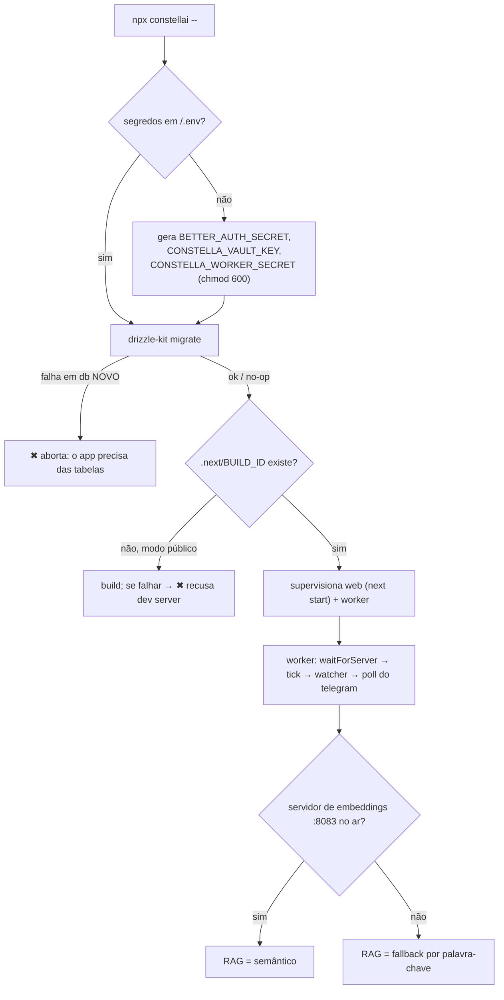
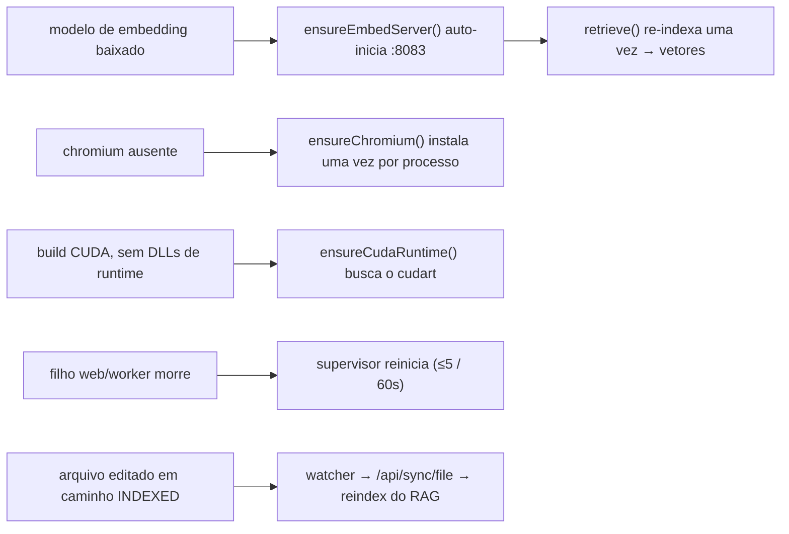

[← Índice](./README.md) · [🇬🇧 English](../en/TROUBLESHOOTING.md) · [✦ Constella](../../README.pt-BR.md)

# Solução de problemas 🛰️ — quando a constelação sai de órbita

Correções reais, baseadas no código, para o que de fato quebra: uma porta ocupada, um servidor de embeddings adormecido, um navegador ausente, uma CLI sem login, um worker travado. Cada sintoma abaixo é rastreado até um comportamento concreto no código — nada de folclore.

> A nave central roda dois motores (web + worker) e uma frota de serviços satélites (servidor de embeddings, llama.cpp, poll do Telegram, o dev server do projeto). Quando um sai de órbita, o Constella foi projetado para **degradar, não cair**. Esta página diz qual estrela apagou e como reacendê-la.

---

## 1. Quando usar 🌌

Recorra a esta página quando:

- Um destino de instalação não inicia (`npx constellai --start`, `--vps`, `--portable`).
- Algo *funciona mas degrada silenciosamente* — o RAG vira só palavra-chave, o Test Dev retorna `INCONCLUSIVE`, os agentes caem para um modelo padrão.
- O loop 24/7 parece congelado: nenhum agente se move, nenhuma resposta do Telegram, nenhum tick de cron.
- Um problema de instalação/primeira execução: o build falha, `claude`/`codex` não encontrados, disco pequeno demais.

Para contexto mais profundo de qualquer subsistema, siga os [Links relacionados](#15-links-relacionados--docs-irmãos-) no rodapé — esta página é a triagem, não o manual completo.

---

## 2. Como funciona — o design fail-soft 🪐

O diagnóstico do Constella se apoia em três princípios embutidos no código:

| Princípio | Onde vive | O que significa para você |
|---|---|---|
| **Fail closed em segredos/auth** | `src/app/api/cron/tick/route.ts`, `bin/worker.mjs` | Sem `CONSTELLA_WORKER_SECRET` → o endpoint do tick retorna **401**, e o worker nem fala com um host não-loopback. Uma brecha de segurança nunca abre silenciosamente. |
| **Fail soft em capacidade** | `src/server/rag.ts`, `src/server/test-harness.ts`, `src/server/adapters/cli.ts` | Sem servidor de embeddings → busca por palavra-chave. Sem Playwright → `inconclusive`. Id de modelo inválido → padrão da CLI. Uma *capacidade* ausente degrada; não derruba o fluxo inteiro. |
| **Status honesto** | `src/server/local-models.ts`, `src/server/devserver.ts` | As sondas de "está no ar?" retornam o motivo real (`"llama-server not installed"`, `"no embedding model installed"`). A UI mostra o que o código realmente encontrou — nunca um "pronto" fabricado. |

Então a maior parte da solução de problemas é **ler o motivo honesto** que o código já expôs e corrigir a causa nomeada.

---

## 3. Fluxo principal — ordem de boot e onde pode quebrar 🌠

Cada losango é um lugar onde um sintoma real aparece. A tabela em [§7](#7-sintoma--causa--correção--a-tabela-mestre-) mapeia cada um deles a uma correção.

---

## 4. Conceitos-chave 🕳️

- **Raiz de runtime** — tudo vive sob `<HOME>` (padrão `~/.constella`, sobrescreva com `CONSTELLA_HOME` ou `--path`). O banco é `<HOME>/constella.db`; os segredos ficam em `<HOME>/.env`. Quando algo não acha os dados, este é o primeiro caminho a confirmar.
- **Processo duplo** — o servidor web (`next start`) e o worker (`bin/worker.mjs`) são separados. Uma UI congelada e um loop 24/7 travado são problemas *diferentes* com logs *diferentes*.
- **Worker só loopback** — o worker anexa o privilegiado `x-worker-secret` em toda chamada e **recusa** qualquer `CONSTELLA_BASE_URL` não-loopback, a menos que você defina `CONSTELLA_ALLOW_REMOTE_WORKER_BASE_URL=1`.
- **Sondas de capacidade** — `embedServerUp()`, `llamaServerStatus()`, `cliVersion()`, `detectCliAuth()`, `toolAvailable()` são todas sondas reais e limitadas. Nunca lançam exceção; retornam um status acionável.

---

## 5. Kit de comandos de diagnóstico 🚀

| Objetivo | Comando | Lê |
|---|---|---|
| Versão + atualização disponível | `npx constellai update --check` | registro npm (`registry.npmjs.org/constellai/latest`) |
| A CLI do Claude está autenticada? | `claude --version` e faça login no Claude Code | `cliVersion("claude")` / `detectCliAuth` |
| A CLI do Codex está autenticada? | `codex --version`, depois `codex login` | idem |
| Servidor de embeddings vivo? | `curl http://127.0.0.1:8083/health` | `embedServerUp()` |
| Servidor de chat llama vivo? | `curl http://127.0.0.1:8082/v1/models` | `llamaServerStatus()` |
| Alvo acessível do worker | confira `CONSTELLA_BASE_URL` (precisa ser loopback) | guarda SSRF do `bin/worker.mjs` |
| Reaplicar o schema manualmente | `npm run db:migrate` | `drizzle-kit migrate` |
| Espaço livre no disco de runtime | o launcher imprime no modo portable | `freeBytes()` / `checkUsbFreeSpace()` |

> O launcher nunca imprime segredos — ele registra `• Secrets ready (stored in <HOME>/.env, never printed).` Não procure por eles no console.

---

## 6. Triagem passo a passo 🌌

1. **Leia o banner de inicialização.** O `bin/constella.mjs` imprime a raiz de runtime, o modo + bind e a linha do next-start. Um `<HOME>` errado aqui explica a maioria dos relatos de "meus dados sumiram".
2. **Separe web de worker.** A *UI* está quebrada, ou o *loop* não avança? Eles têm supervisores independentes (máx. 5 reinícios / 60 s cada) e stdout independentes.
3. **Verifique a sonda honesta.** Abra a página relevante (Models, Test Dev) — o código já expôs o motivo real. Combine-o com a tabela abaixo.
4. **Corrija a causa nomeada** e deixe o autorreparo agir (o servidor de embeddings auto-inicia, o RAG re-indexa sozinho quando os embeddings aparecem, o chromium se instala uma vez).
5. **Se um filho entra em crash-loop**, o supervisor desiste após 5 reinícios em 60 s e imprime uma dica (ex.: "Likely OS-level OOM … raise `CONSTELLA_WEB_HEAP_MB`").

---

## 7. Sintoma · Causa · Correção — a tabela mestre 🛰️

### 7.1 Boot & instalação

| Sintoma | Causa | Correção |
|---|---|---|
| `npx constellai …` → `'constella' não é reconhecido` (Windows) | Um release antigo cujo bin (`constella`) não batia com o nome do pacote (`constellai`), então o npx não resolvia o comando | Atualize — os releases atuais trazem um bin **`constellai`** que bate. Ou instale global e use o comando curto: `npm i -g constellai && constella --start`. |
| `EADDRINUSE` / "porta 3000 ocupada" ao iniciar | Outro processo segura a porta escolhida (web na 3000, ou um Constella zumbi) | Passe `--port <n>` (ou `PORT=<n>`), ou pare o outro processo. O launcher lê `--port` → `PORT` → `3000`. |
| `✖ drizzle-kit not found in the install` | Instalação incompleta (árvore de deps cortada) | Reinstale o pacote. O `drizzle-kit migrate` é obrigatório — o launcher aborta sem ele. |
| `✖ Database schema migration failed on a fresh database — aborting` | As migrações não aplicaram em um `<HOME>/constella.db` novo | Inspecione o erro do drizzle acima. Um banco novo sem tabelas daria 500 em toda requisição, então o boot falha closed por design. Em um banco *existente*, uma re-execução falha é tolerada (registra `• schema migrate skipped/failed … continuing`). |
| `✖ No production build and the build failed … Refusing to start a dev server in a public/network mode` | Rodando uma árvore de fonte sem `.next/BUILD_ID`, build falhou, modo público (`CONSTELLA_PUBLIC=1`) | Instale um pacote pré-buildado, ou rode `npm run build`. Um launch via CLI nunca rebaixa silenciosamente para o `next dev` não-endurecido. Devs podem optar com `CONSTELLA_DEV=1` (só em árvore de fonte). |
| Build na primeira execução é lento e depois funciona | Árvore de fonte sem build → `next build` uma vez | Esperado, uma vez. O pacote npm publicado já traz um `.next` pré-buildado, então o usuário final nunca passa por isso. |
| `✖ next not found in the install` | `node_modules` cortado/quebrado | Reinstale o pacote. |

### 7.2 Execução dos agentes (CLIs claude / codex)

| Sintoma | Causa | Correção |
|---|---|---|
| Os agentes erram instantaneamente, o texto do resultado é um erro de spawn | `claude` (ou `codex`) **não instalado / fora do PATH** | Instale a CLI; verifique com `claude --version`. O `runProc` faz spawn do binário puro no cwd do workspace. |
| Os **detected providers** não mostram Claude Code / Codex num install **VPS (systemd)** — ou os runs de agente não conseguem dar spawn na CLI | O `constella.service` rodou com o **PATH mínimo** do systemd (`/usr/bin:/bin`), que exclui os dirs de usuário (`~/.local/bin`, `~/.npm-global/bin`, o install nativo do Claude) onde as CLIs vivem — mesmo que funcionem no seu shell | Reinstale / atualize com o `vps-install.sh` atual — ele assa um `Environment=PATH` completo no serviço (cobre **todas** as CLIs: claude, codex, aider, cursor-agent, …). Já rodando? Fix rápido: `sudo ln -sf "$(command -v claude)" /usr/local/bin/claude` então `sudo systemctl restart constella` e recarregue a página. Robusto (cobre toda CLI): solte um arquivo `[Service] Environment=PATH=…` em `/etc/systemd/system/constella.service.d/` — veja [VPS_MODE](./VPS_MODE.md). |
| O agente roda mas o resultado vem vazio / "needs login" | CLI instalada mas **sem autenticação** | Faça login no Claude Code; para o Codex rode `codex login`. O `detectCliAuth` confere `~/.claude/.credentials.json`, `~/.codex/auth.json`. O `LOGIN_HINTS` mostra a ação por CLI na UI. |
| A execução termina com `error: "timed out"` | A CLI estourou o timeout padrão de **180 s** | Tarefas pesadas: aumente o timeout daquele adaptador, ou divida o trabalho. O runner dá SIGKILL no limite e registra `timed out` honestamente. |
| O agente ignora o modelo configurado | O id de modelo falhou na validação do `safeModel` (guarda de injeção) | Use um id de modelo plausível (`opus`/`sonnet`/`haiku`, `gpt-5-codex`, ou `provider/model`). Um valor inválido é descartado e a CLI usa o próprio padrão. |
| Agentes "falam estranho" (cortado, sem artigos) | Hooks/plugins pessoais do `~/.claude` do operador vazaram para a execução headless | Já mitigado: agentes rodam com um overlay `--settings {disableAllHooks:true}`. Se você habilitou os hooks de lock/guard, a isolação usa um config dir limpo. |
| O agente não consegue instalar deps / rodar testes | O destino de instalação está **jaulado** (`--vps`/`--portable` → `acceptEdits`, codex `workspace-write`) | Endurecimento esperado. Sobrescreva com `CONSTELLA_AGENT_FULL_ACCESS=1` (ou `=0` para re-jaular um `--start` local). |
| Pesquisa web não acontece | `CONSTELLA_WEB_RESEARCH=0` ou `settings.agents.webResearch=false` por workspace | As ferramentas web estão LIGADAS por padrão (`--allowedTools WebSearch WebFetch`). Reative. |

### 7.3 Nebulosa de memória RAG / KB 🌌

| Sintoma | Causa | Correção |
|---|---|---|
| A recuperação parece rasa / só palavra-chave | **Servidor de embeddings :8083 fora** → busca semântica indisponível | O `embed()` tenta Ollama (`OLLAMA_URL`), depois llama.cpp (`CONSTELLA_EMBED_URL` :8083). Sem nenhum, o `retrieve()` cai num heurístico de palavra-chave (`mode: "heuristic"`). Baixe `nomic-embed-text`; o servidor auto-inicia no boot e quando o modelo chega. |
| Existem chunks mas sem vetores | O índice foi construído com o servidor de embeddings fora | Nenhuma ação — quando os embeddings ficam disponíveis, o `retrieve()` re-indexa **uma vez por processo** (guarda `autoReindexed`) para os chunks ganharem vetores. Force em Models → Reindex. |
| `retrieve` retorna `mode: "none"` | Nenhum chunk (índice vazio) | A primeira chamada roda `indexRag` preguiçosamente. Se continuar vazio, não há nada nos diretórios indexados (`.claude`, `DOCS`, `PO`, `Reports`, `specs`, `issues`, `mock`). |
| Prompts/skills internos vazam nas respostas | — | Não pode acontecer: `.claude/kb/` e `.claude/skills/` são excluídos do RAG pelo `inRagDirs`. |
| Erros no caminho do Ollama | Ollama não está rodando | Inicie (`ollama serve`) e baixe `nomic-embed-text`, ou apenas confie no servidor de embeddings dedicado do llama.cpp. |

### 7.4 Test Dev (o dev server do projeto + Playwright) 🚀

| Sintoma | Causa | Correção |
|---|---|---|
| Veredito `INCONCLUSIVE`, mensagem "Playwright not available" | `@playwright/test` não importável | `npx playwright install chromium` no diretório de instalação, depois tente de novo. |
| `INCONCLUSIVE`, "Couldn't install/launch chromium" | O binário do navegador falta (o npm instala a lib, não o navegador) | O Test Dev roda `npx playwright install chromium` sozinho uma vez por processo; se falhar, rode manualmente. |
| `INCONCLUSIVE`, "No runnable project / dev server didn't boot" | Sem script dev/start no `package.json`, ou sem projeto Python/Go/Rust no workspace | Adicione um ponto de entrada executável (`detectProject` varre a raiz + subdirs `apps`/`web`/`server`/…). |
| `INCONCLUSIVE`, "Toolchain not found: 'python'/'go'/'cargo'" | A toolchain do starter não-Node não está instalada | Instale a toolchain, ou escolha um stack Node. O `toolAvailable()` faz pré-checagem para falhar rápido em vez de uma espera morta de 30 s. |
| `INCONCLUSIVE`, "Dev server is still starting" | O servidor subiu mas a porta ainda não responde | Tente de novo em breve. Primeiros boots de Go/Rust ganham 120 s, Python 60 s, Node 30 s. |
| `INCONCLUSIVE` em vez de `FAIL` com o app quebrado | Por design — o Test Dev nunca retorna um **falso fail** | Só achados de severidade alta viram o veredito para `FAIL`. Um problema de boot/tooling é `inconclusive`. |

### 7.5 Worker / loop 24/7 🛰️

| Sintoma | Causa | Correção |
|---|---|---|
| Nada avança sozinho; sem logs de tick | O worker não consegue alcançar o servidor web | O worker sonda `CONSTELLA_BASE_URL` por ~90 s antes do primeiro tick. Confirme que o web está no ar e que a base URL é o loopback `http://127.0.0.1:<port>`. |
| O worker imprime `✖ Refusing to send the worker secret to a non-loopback host` e sai | `CONSTELLA_BASE_URL` aponta para um host não-loopback | A guarda SSRF é intencional. Para um worker remoto de verdade, defina `CONSTELLA_ALLOW_REMOTE_WORKER_BASE_URL=1` (prefira `https://`). |
| O cron tick retorna **401 unauthorized** | `CONSTELLA_WORKER_SECRET` ausente ou divergente | O endpoint falha closed. O launcher persiste o segredo em `<HOME>/.env`; garanta que web e worker herdem o mesmo env. |
| O tick roda mas nenhum agente se move | O loop autônomo só roda workspaces com **Run 24/7 LIGADO** | `tickAll({ execute: true, auto: true })` pula workspaces onde o operador não habilitou o loop 24/7. Ligue (ou aprove o plano primeiro). |
| O watcher nunca indexa edições de arquivo | O arquivo não está num caminho INDEXED | O worker só sincroniza `.claude/skills/*.md`, `.claude/agents/<h>/{Agent,skills}.md`, `DOCS/*.md`, `PO/*.md`, `Reports/*.md`. Outros arquivos são ignorados por design. |
| O worker fica reiniciando | Um filho caiu; o supervisor reinicia (máx. 5 / 60 s) | Após 5 quedas em 60 s ele desiste e imprime uma dica. Veja o stderr do filho; para OOM, aumente `CONSTELLA_WEB_HEAP_MB` ou limite agentes concorrentes. |

### 7.6 Telegram 🌠

| Sintoma | Causa | Correção |
|---|---|---|
| O bot não responde | Integração desligada, ou sem token no vault | O poll pula workspaces onde a integração `telegram` está desligada ou onde `getTelegramConfig` retorna vazio. Habilite a integração e defina o token do bot. |
| O poll do Telegram retorna **401** | `CONSTELLA_WORKER_SECRET` ausente/divergente | Mesma guarda fail-closed do cron tick; o worker recua 30 s e tenta de novo. Corrija o segredo compartilhado. |
| O bot ignora suas mensagens | Você não está na allowlist | Só o chat privado registrado pode conversar: tanto `chat.id` quanto `from.id` precisam ser iguais ao `chatId` configurado. Qualquer outro é descartado em silêncio. |
| Menu de comandos `/` ausente | `setMyCommands` ainda não rodou para aquele bot | Ele se registra sozinho uma vez por processo no próximo poll (guarda `commandsRegistered`). Aguarde um ciclo. |
| Sensação de lentidão / uma mensagem por poll | Long-poll: `getUpdates` espera ~25 s no servidor | Esperado. O worker adiciona um intervalo de 1 s entre long-polls. |

### 7.7 Autenticação & segredos 🕳️

| Sintoma | Causa | Correção |
|---|---|---|
| Install fresco mostra a tela **Sign in** e o login falha com `User not found` | Um **`~/.constella` velho** de um install anterior. O runtime root persiste entre installs de propósito; o `<HOME>/.env` dele ainda tem `CONSTELLA_OPERATOR_PW_SET=1` (força a tela de login) enquanto o DB tem um operator diferente / nenhum. `operator@constella.dev` é só o seed do **dev** — um install fresco de verdade não tem conta. | Use a tela **Sign up** pra criar o primeiro operator. Se travar no Sign in, você tá lendo dado velho: remova ou renomeie `~/.constella` (faça backup — tem DB, segredos, workspaces), ou aponte `CONSTELLA_HOME` pra um dir novo, e reinicie → signup. |
| better-auth lança erro com segredo padrão | Sem `BETTER_AUTH_SECRET` real | O launcher gera + persiste um em `<HOME>/.env` (`chmod 600`) para **todo** destino de instalação (a autenticação é universal). Se você limpou o `.env`, basta reiniciar — ele regenera. |
| O vault não decifra as chaves de provedor / token do Telegram | `CONSTELLA_VAULT_KEY` mudou ou sumiu | O vault é AES-256-GCM com chave `CONSTELLA_VAULT_KEY`. **Trocar a chave orfana o texto cifrado existente.** Restaure a chave original de `<HOME>/.env`, ou re-insira os segredos. |
| VPS inacessível pela tailnet | Bind em `0.0.0.0` mas Tailscale não conectado | O modo VPS faz bind em `0.0.0.0` para a tailnet e roda nativamente no host sob systemd. Verifique o serviço + Tailscale; o worker ainda fala com o servidor por loopback no host. |

### 7.8 Portable & espaço em disco 🪐

| Sintoma | Causa | Correção |
|---|---|---|
| `✖ Portable mode: no removable USB drive detected` | Nenhum drive USB montado | Insira um pen-drive, ou passe `--path <drive>` explicitamente. |
| `✖ Portable needs at least 32 GB free` e sai | Drive abaixo do mínimo rígido (`PORTABLE_MIN_GB = 32`) | Use um drive maior. Esta é uma barreira fatal. |
| `• <n> GB free on the drive — good` | No mínimo de 32 GB ou acima (`PORTABLE_RECOMMENDED_GB = 32`) | Dá boot normalmente — mais folga só ajuda se você carregar modelos locais. |
| Download de GGUF recusado: "not enough free space" | O drive não comporta `sizeBytes * 1.1` | Libere espaço ou escolha um quant menor. A checagem roda antes do download começar. |
| Modelo baixado falha ao carregar | Download truncado/corrompido | `verifyDownloadedFileSize` (tolerância de 2%) e o SHA-256 opcional pegam isso; o arquivo é apagado. Baixe de novo. |

### 7.9 Banco de dados & migrações 🌌

| Sintoma | Causa | Correção |
|---|---|---|
| O app dá 500 em toda requisição após uma mudança manual de schema | Tabelas faltando/inconsistentes | Reaplique com `npm run db:migrate` (idempotente). O launcher faz isso automaticamente no boot. |
| Perdeu a senha do operador após um "reset" | Você rodou `db:reset` / `db:nuke` (apaga `.constella` + `organizations`) | Evite os scripts nuke num install real — eles destroem dados. Prefira scripts cirúrgicos (`db:reset-state`, `db:repair-fs`). Só para demo, `db:reset-demo`. |
| `db:push` reescreveu coisas inesperadamente | `drizzle-kit push` é o caminho de dev inseguro | Use `db:migrate` (SQL gerado e versionado), não `db:push`, em qualquer coisa que você se importe. |

---

## 8. Mapa de autorreparo — o que se conserta sozinho 🌠

Se um sintoma estiver à esquerda, **espere um ciclo** antes de intervir — o sistema provavelmente se recupera sozinho.

---

## 9. Estados possíveis 🛰️

| Subsistema | Saudável | Degradado | Fora |
|---|---|---|---|
| RAG | `mode: "semantic"` | `mode: "heuristic"` (palavra-chave) | `mode: "none"` (sem chunks) |
| Test Dev | `PASS` | `INCONCLUSIVE` | `FAIL` (só achados de severidade alta) |
| Servidor de embeddings | `embedServerUp() → true` | — | motivo: "not installed" / "didn't come up" |
| Servidor de chat llama | `llamaServerStatus().up` | — | motivo: "no chat GGUF" / "not installed" |
| Worker | ticks logados a cada ~60 s | tentando de novo (servidor aquecendo) | saiu após 5 crash-loops |
| Auth da CLI | `detectCliAuth → "ready"` | `"unknown"` | `"needs_login"` / `"needs_key"` |
| Execução do agente | `ok: true` | parcial (CLI roteada por provedor, custo 0 reportado) | `error` definido (timeout / sem JSON / código de saída) |

---

## 10. Exemplos 🚀

**A. O RAG virou silenciosamente só palavra-chave.** Você nota respostas menos precisas. Confira `curl http://127.0.0.1:8083/health` → sem resposta. Abra **Models**, confirme que `nomic-embed-text` está instalado, clique em **Start embeddings** (ou só reinicie — `ensureEmbedServer` roda no boot). A próxima consulta retorna `mode: "semantic"`.

**B. O Test Dev fica dizendo INCONCLUSIVE.** A primeira execução reporta "Couldn't install/launch chromium." Rode `npx playwright install chromium` no diretório de instalação, tente de novo. Agora a navegação + captura de console rodam e você obtém `PASS`/`FAIL`.

**C. Os agentes não fazem nada durante a noite.** Há logs de tick mas nenhum card de trabalho se move. O plano do goal existe mas **Run 24/7 está desligado** — `tickAll(auto:true)` o pula. Aprove o plano e habilite o Run 24/7.

**D. O worker sai na hora num VPS.** Log: `✖ Refusing to send the worker secret to a non-loopback host`. Seu `CONSTELLA_BASE_URL` aponta para um hostname público. Ajuste-o para o loopback no host, ou `CONSTELLA_ALLOW_REMOTE_WORKER_BASE_URL=1` sobre `https://` se o remoto for mesmo a intenção.

---

## 11. Integrações relacionadas 🪐

- **Models / engine local** — servidores llama.cpp de embedding (:8083) e chat (:8082), fallback Ollama. Veja [MODELS](./MODELS.md).
- **Test Dev** — boot do dev server do projeto + Playwright. Veja [TEST_DEV](./TEST_DEV.md).
- **Telegram** — controle remoto + poll. Veja [TELEGRAM](./TELEGRAM.md).
- **GitHub** — token/auth, commit/push, barreira de secret-scan. Veja [GITHUB](./GITHUB.md).
- **Public API / MCP** — auth por PAT, limites de taxa. Veja [PUBLIC_API](./PUBLIC_API.md) e [MCP](./MCP.md).

---

## 12. Notas de segurança 🕳️

- Vários "erros" são **barreiras de segurança, não bugs**: o 401 nos endpoints de cron/Telegram, a recusa só-loopback do worker, a recusa do modo build em cair para `next dev`, e a barreira de espaço do portable. Não as contorne às cegas.
- Segredos nunca aparecem nos logs — o launcher imprime `• Secrets ready` e nada mais; o `scrubSecrets` os remove antes da ingestão no KB, do Telegram e dos logs. Se você vir um segredo na saída, trate como incidente.
- O `<HOME>/.env` é escrito `chmod 600`. Se as permissões abriram, reaperte-as.
- A guarda de comandos destrutivos (`bin/guard-hook.mjs`, ligada por padrão) e o hook de file-lock são defesa em profundidade em torno do shell dos agentes. Veja [SECURITY](./SECURITY.md).

---

## 13. Quando escalar 🌠

Se nenhuma correção acima se aplica, reúna:

1. O **banner de inicialização** (raiz de runtime, modo, bind, porta).
2. O **motivo honesto da sonda** da página relevante (Models / Test Dev).
3. Se é um problema de **web** ou de **worker** (stdout separados).
4. A saída de `npx constellai update --check` (versão + última).

Depois confira o [FAQ](./FAQ.md) e as entradas de [TROUBLESHOOTING] aqui, e consulte [INSTALLATION](./INSTALLATION.md) / [CONFIGURATION](./CONFIGURATION.md) para especificidades de ambiente.

---

## 14. Referência rápida — botões de env 🛰️

| Var | Efeito | Padrão |
|---|---|---|
| `CONSTELLA_HOME` / `--path` | Raiz de runtime | `~/.constella` |
| `PORT` / `--port` | Porta web | `3000` |
| `--host` | Endereço de bind | `127.0.0.1` (`--start`), `0.0.0.0` (`--vps`/`--portable`) |
| `CONSTELLA_WORKER_SECRET` | Auth de cron/Telegram | gerado em `<HOME>/.env` |
| `CONSTELLA_BASE_URL` | Alvo worker → servidor (loopback) | `http://127.0.0.1:<port>` |
| `CONSTELLA_ALLOW_REMOTE_WORKER_BASE_URL` | Permite alvo não-loopback do worker | sem valor (off) |
| `CONSTELLA_EMBED_URL` | Servidor de embeddings | `http://127.0.0.1:8083` |
| `OLLAMA_URL` | Fallback de embed do Ollama | `http://127.0.0.1:11434` |
| `LLAMACPP_URL` | Servidor de chat | `http://127.0.0.1:8082` |
| `CONSTELLA_AGENT_FULL_ACCESS` | Acesso ao shell do agente | `1` com `--start`, senão `0` |
| `CONSTELLA_WEB_RESEARCH` | WebSearch/WebFetch do agente | ligado |
| `CONSTELLA_WEB_HEAP_MB` | Limite de heap Node do web | padrão do Node |
| `CONSTELLA_DEV` | Permite fallback `next dev` (fonte) | sem valor |

---

## 15. Links relacionados — docs irmãos 🌌

- [INSTALLATION](./INSTALLATION.md) · [CONFIGURATION](./CONFIGURATION.md) · [FAQ](./FAQ.md)
- [START_MODE](./START_MODE.md) · [VPS_MODE](./VPS_MODE.md) · [PORTABLE_MODE](./PORTABLE_MODE.md)
- [ARCHITECTURE](./ARCHITECTURE.md) · [AI_ARCHITECTURE](./AI_ARCHITECTURE.md) · [AGENTS](./AGENTS.md)
- [MODELS](./MODELS.md) · [KB_RAG](./KB_RAG.md) · [MEMORY_RAG](./MEMORY_RAG.md)
- [TEST_DEV](./TEST_DEV.md) · [TELEGRAM](./TELEGRAM.md) · [GITHUB](./GITHUB.md)
- [UPDATE](./UPDATE.md) · [SECURITY](./SECURITY.md) · [DEPLOY](./DEPLOY.md) · [PREPARE_DEPLOY](./PREPARE_DEPLOY.md)
