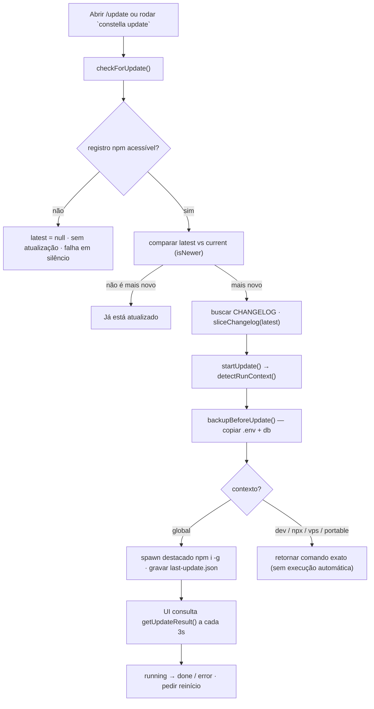
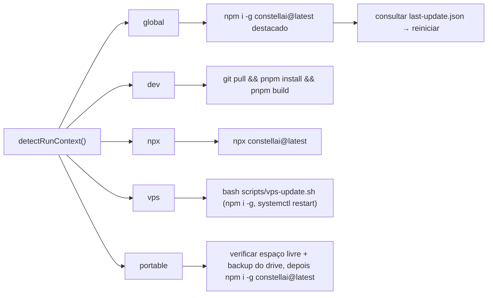

[← Índice](./README.md) · [🇬🇧 English](../en/UPDATE.md) · [✦ Constella](../../README.pt-BR.md)

# 🚀 Atualização — relançando a nave central


O Constella consulta o npm em busca de uma versão mais recente, mostra o changelog e aplica a atualização **da maneira que se encaixa em como este processo está rodando** — instalação global, npx, código-fonte (dev), VPS nativa ou um pen drive portátil. Ele sempre faz backup do seu `.env` e do banco de dados antes, e nunca inventa um "sucesso" que não conquistou.

---

## ✦ Quando usar

- Uma nova versão do Constella foi publicada e você quer baixá-la.
- Você quer ler o changelog antes de atualizar (o painel "Novidades").
- Você quer confirmar que já está na versão mais recente (`constella update --check`).
- Você precisa do **comando exato** para o seu ambiente (dev / npx / VPS / portátil), porque alguns contextos não podem ser atualizados de dentro do servidor web em execução.

---

## 🌌 Como funciona

Duas metades cooperam:

| Metade | Arquivo | Responsabilidade |
| --- | --- | --- |
| **Verificação** | `src/server/update-check.ts` | Perguntar ao registro npm o `latest`, comparar versões, buscar o changelog. Cacheado, falha em silêncio. |
| **Aplicação** | `src/server/update-run.ts` | Detectar o contexto de execução, fazer backup da config local e, então, executar automaticamente (global) ou devolver o comando exato. |
| **Contexto** | `src/lib/run-context.ts` | `detectRunContext()` → `dev \| global \| npx \| vps \| portable`. |
| **UI** | `src/components/modules/update-screen.tsx` | Versões, dica de contexto, "Atualizar agora", changelog, poll ao vivo do atualizador em segundo plano. |
| **Actions** | `src/server/actions/update-actions.ts` | Server actions que a UI chama: `getUpdateStatus`, `getUpdateContext`, `runUpdate`, `pollUpdateResult`. |
| **CLI** | `bin/constella.mjs` (subcomando `update`) | Verificação/aplicação autônoma que roda **fora** do servidor web. |

A regra central (do comentário no código em `update-run.ts`): *somente a instalação npm `global` roda automaticamente* — todo outro contexto retorna o comando preciso para você executar, porque executá-los a partir do servidor web depende do ambiente.

---

## 🛰️ Fluxo principal



---

## 🪐 Conceitos-chave

### Verificação de versão (`checkForUpdate`)

- Lê a versão **instalada** via `currentVersion()` (`src/lib/version.ts`): env `CONSTELLA_VERSION` (definida pela CLI) → `package.json` do diretório de lançamento → `"0.0.0"`.
- Busca `https://registry.npmjs.org/constellai/latest` pela `version` publicada.
- `isNewer(latest, current)` faz uma comparação semver numérica de 3 partes (sufixos de pré-lançamento removidos). `bumpType` classifica o salto como `major | minor | patch`.
- Retorna um `UpdateInfo`: `{ current, latest, updateAvailable, type, command, changelog }`. O `command` padrão é `npm install -g constellai@latest`.
- **Cache em memória de 6 horas** (`TTL = 6 * 60 * 60 * 1000`) para que o polling do cliente nunca martele o registro. `checkForUpdate(true)` força uma atualização.
- **Falha fechada/silenciosa**: qualquer caminho offline / não publicado / timeout (`AbortController` de 3 s) resulta em `latest: null`, `updateAvailable: false`. Nunca lança erro e nunca inventa "atualizado".

### Busca do changelog

- Buscado apenas quando `updateAvailable` é verdadeiro.
- Puxa `https://raw.githubusercontent.com/gabriel7silva/constella/main/CHANGELOG.md`.
- `sliceChangelog(md, version)` extrai a seção `## [x.y.z] …` até o próximo cabeçalho `##`; se o cabeçalho da versão exata não for encontrado, recai para a primeira seção do arquivo.
- Renderizado no card "Novidades na v{version}" da UI via `react-markdown` + `remark-gfm`.

### Detecção do contexto de execução (`detectRunContext`)

A ordem importa — o primeiro match vence:

| Ordem | Teste | Contexto |
| --- | --- | --- |
| 1 | `isDevMode()` (rodando do código-fonte) | `dev` |
| 2 | `getRunMode() === "vps"` | `vps` |
| 3 | `getRunMode() === "portable"` | `portable` |
| 4 | caminho de `launchDir()` contém `/_npx/` (cache do npx) | `npx` |
| 5 | (fallback) | `global` |

`isDevMode()` (`src/lib/build-mode.ts`): `CONSTELLA_PUBLIC=1` → `false`; senão `CONSTELLA_DEV=1` → `true`; senão `NODE_ENV !== "production"`. Um lançamento via CLI define `CONSTELLA_PUBLIC=1`, então execuções instaladas nunca são confundidas com dev.

### Backup antes da atualização (`backupBeforeUpdate`)

- Esforço-melhor (best-effort), roda antes de qualquer atualização em `startUpdate()`.
- Cria `<HOME>/backups/<timestamp>/` (timestamp = ISO com `:`/`.` substituídos por `-`).
- Copia, se presentes: `.env`, `constella.db`, `constella.db-wal`, `constella.db-shm`.
- Retorna o caminho do diretório de backup (exibido na UI como "Backup salvo: …"). Qualquer falha de cópia é ignorada em silêncio — o backup nunca bloqueia a atualização.
- `<HOME>` resolve via `constellaHome()`: `CONSTELLA_HOME` (resolvido contra o diretório de lançamento) ou `~/.constella`.

### Aplicação ciente de contexto (`startUpdate`)

| Contexto | `ok` | Roda automático? | Comando retornado | `needsRestart` |
| --- | --- | --- | --- | --- |
| `global` | `true` | ✅ `npm install -g constellai@latest` destacado | `npm install -g constellai@latest` | ✅ |
| `dev` | `false` | ❌ | `git pull && pnpm install && pnpm build` | — |
| `npx` | `false` | ❌ | `npx constellai@latest` | — |
| `vps` | `false` | ❌ | `bash scripts/vps-update.sh` (npm install + `systemctl restart constella`; `~/.constella` preservado) | ✅ |
| `portable` | `false` | ❌ | `npm install -g constellai@latest` (após verificação de espaço/backup) | ✅ |

> Se `updateAvailable` for falso, `startUpdate()` faz curto-circuito com `ok: true, message: "Already up to date."` — sem backup, sem comando.

### O atualizador global destacado + polling de resultado

Como uma atualização npm global não consegue terminar de forma confiável antes de o servidor web ser substituído, `startUpdate()` para `global`:

1. Grava `<HOME>/backups/last-update.json` com `{ status: "running", to, at }`.
2. Faz spawn de um one-liner `node -e` **destacado** (sem arquivo de script separado — funciona mesmo a partir de uma instalação global) que roda `npm install -g constellai@latest` e reescreve o arquivo de resultado com `status: "done" | "error"`, o `code` de saída do npm e `at`.
3. Faz `child.unref()` para que o atualizador sobreviva à requisição.
4. Retorna `{ ok: true, started: true, needsRestart: true, … }`.

A UI (`update-screen.tsx`) então consulta `pollUpdateResult()` → `getUpdateResult()` a cada **3 segundos**, lendo `last-update.json`. Status: `idle` (sem arquivo), `running`, `done`, `error`. Em `done`/`error` ela para de consultar e pede um reinício (ou mostra a dica de rollback).

---

## 🌠 Tabelas

### `UpdateInfo` (retornado por `checkForUpdate`)

| Campo | Tipo | Significado |
| --- | --- | --- |
| `current` | `string` | Versão instalada. |
| `latest` | `string \| null` | `latest` do npm, ou `null` quando o registro está inacessível. |
| `updateAvailable` | `boolean` | `latest` existe e é mais novo. |
| `type` | `"major" \| "minor" \| "patch" \| null` | Tamanho do salto de versão. |
| `command` | `string` | Comando de atualização padrão. |
| `changelog` | `string \| null` | Seção do changelog fatiada para `latest`. |

### `UpdateResult` (retornado por `startUpdate` / `runUpdate`)

| Campo | Tipo | Significado |
| --- | --- | --- |
| `ok` | `boolean` | Operação bem-sucedida (global iniciada, ou já atual). |
| `started` | `boolean?` | O atualizador global destacado foi lançado → UI deve consultar. |
| `context` | `string` | Contexto de execução detectado. |
| `command` | `string` | O comando para este contexto. |
| `message` | `string` | Status / instrução legível por humanos. |
| `backupDir` | `string?` | Onde `.env`/db foram copiados. |
| `needsRestart` | `boolean?` | Reiniciar o Constella para carregar a nova versão. |

### `last-update.json` (estado do atualizador em segundo plano)

| Campo | Tipo | Significado |
| --- | --- | --- |
| `status` | `"idle" \| "running" \| "done" \| "error"` | Estado do atualizador (`idle` = arquivo ausente). |
| `to` | `string` | Versão-alvo. |
| `code` | `number` | Código de saída do npm (na conclusão). |
| `at` | `string` | Timestamp ISO. |

---

## 🕳️ Fluxo de atualização por contexto



---

## ✦ Passo a passo

### No aplicativo

1. Abra o módulo **Atualizar** (`/update`). A página chama `getUpdateStatus()` e `getUpdateContext()`.
2. Leia as versões **Instalada → Mais recente** e a pílula de salto (`major`/`minor`/`patch`).
3. A linha de contexto informa como este processo roda (ex.: "Instalação npm global — pode atualizar no lugar.").
4. Se houver uma atualização disponível, revise **"Novidades na v…"**.
5. Clique em **Atualizar agora** → `runUpdate()` (protegido por auth via `requireWorkspace()`).
   - **global** → o atualizador em segundo plano inicia; acompanhe o poll ao vivo (`running → instalada`), depois reinicie o Constella.
   - **dev / npx / vps / portable** → copie o comando exato exibido e rode no seu terminal.
6. A linha **Backup salvo** mostra onde seu `.env`/db foram copiados.

### Pela CLI

```bash
# Apenas verificar (sem aplicar) — imprime "Constella x.y.z · latest a.b.c"
constella update --check

# Verificar + aplicar (caminho de instalação global)
constella update
```

O subcomando `update` da CLI (`bin/constella.mjs`):
- Lê a versão local do próprio `package.json` do pacote, busca `latest` no npm (timeout de 4 s).
- `--check` → imprime e sai.
- Se o registro estiver inacessível, ou `latest === current`, ele informa e sai com 0.
- Se detectar **código-fonte** (`.git` + `src/` no CWD), ele orienta a `git pull && pnpm install && pnpm build` e sai.
- Caso contrário, roda `npm install -g constellai@latest` (usa `npm.cmd` no Windows, sem shell) com stdio herdado, e então pede para reiniciar.

---

## 🛰️ Exemplos

**Já atual (à prova de offline):**
```text
Constella 0.1.0 · (npm registry unavailable)
Couldn't reach the npm registry — try again later.
```

**Atualização global pela UI** — `runUpdate()` retorna:
```json
{
  "ok": true,
  "started": true,
  "needsRestart": true,
  "context": "global",
  "command": "npm install -g constellai@latest",
  "backupDir": "/home/voce/.constella/backups/2026-06-22T10-15-03-000Z",
  "message": "Updating to 0.2.0 in the background — restart Constella when it completes."
}
```
…e o poll lê `<HOME>/backups/last-update.json`:
```json
{ "status": "done", "to": "0.2.0", "code": 0, "at": "2026-06-22T10:15:41.220Z" }
```

**VPS** — sem execução automática; você recebe:
```json
{ "ok": false, "context": "vps", "command": "bash scripts/vps-update.sh", "needsRestart": true,
  "message": "Em uma VPS, atualize pelo HOST: rode `bash scripts/vps-update.sh [version]` (npm install -g constellai@<version|latest> + `systemctl restart constella`). Os dados em ~/.constella são preservados; as migrations do drizzle rodam no próximo boot. Caminho manual equivalente: `npm install -g constellai@latest && sudo systemctl restart constella`." }
```

Rode pelo HOST da VPS, da forma que combina com o seu install:

```bash
# Instalação nativa (sem precisar de checkout do repo) — baixa o atualizador direto do GitHub:
curl -fsSL https://raw.githubusercontent.com/gabriel7silva/constella/main/scripts/vps-update.sh | bash
# fixar uma versão específica:
curl -fsSL https://raw.githubusercontent.com/gabriel7silva/constella/main/scripts/vps-update.sh | bash -s -- 0.2.30

# A partir de um checkout do repo:
bash scripts/vps-update.sh                 # → última versão no npm
bash scripts/vps-update.sh 0.2.30          # → uma versão específica

# Totalmente manual (sem script algum):
sudo npm install -g constellai@latest && sudo systemctl restart constella
```

> **Atualizar com ele rodando é tranquilo — sem parada manual.** O `npm install -g` troca o pacote em disco sem mexer no processo ativo; o `systemctl restart constella` então sobe a nova versão num piscar de ~2–3s. Seu `~/.constella` (DB, segredos, login, workspaces) é preservado, e as migrações idempotentes do drizzle rodam automaticamente no próximo boot. Faça rollback a qualquer momento fixando a versão antiga (ex.: `bash scripts/vps-update.sh 0.2.27`).

---

## 🌌 Estados possíveis

| Estado | Como aparece | Origem |
| --- | --- | --- |
| Atualizado | "Você está na versão mais recente." | `updateAvailable === false` |
| Atualização disponível | Pílula de versão + "Atualizar agora" | `updateAvailable === true` |
| Registro inacessível | `latest = —`, sem botão | `latest === null` |
| Atualizando (global) | "Atualizando…" + spinner | `started === true`, `busy` |
| Poll: running | "Atualizador: executando…" | `last-update.json.status === "running"` |
| Poll: done | "✓ instalada — reinicie o Constella para carregá-la." | `status === "done"` |
| Poll: error | "✖ falhou — veja o rollback abaixo." + dica de rollback | `status === "error"` |
| Comando manual | Comando exibido em um `<pre>`; sem execução automática | `dev / npx / vps / portable` |

---

## 🪐 Integrações relacionadas

- **[VPS_MODE](./VPS_MODE.md)** / **[OPERATIONS](./OPERATIONS.md)** — a atualização nativa da VPS via `bash scripts/vps-update.sh` (npm + `systemctl restart constella`; rollback fixando uma versão anterior).
- **[PORTABLE_MODE](./PORTABLE_MODE.md)** — pen drive, verificações de espaço livre antes de atualizar.
- **[INSTALLATION](./INSTALLATION.md)** / **[PUBLISHING](./PUBLISHING.md)** — como as versões chegam ao npm.
- **[START_MODE](./START_MODE.md)** / **[VPS_MODE](./VPS_MODE.md)** / **[PORTABLE_MODE](./PORTABLE_MODE.md)** — métodos de instalação que alimentam `detectRunContext()`.
- **[CONFIGURATION](./CONFIGURATION.md)** — variáveis de ambiente (`CONSTELLA_HOME`, `CONSTELLA_VERSION`, `CONSTELLA_PUBLIC`).

---

## 🕳️ Segurança

- **Aplicação protegida por auth.** `runUpdate()` chama `requireWorkspace()` antes de fazer qualquer coisa.
- **Backup primeiro, sempre.** `.env` + o banco SQLite (e WAL/SHM) são copiados para `<HOME>/backups/<timestamp>/` antes de qualquer caminho de atualização.
- **Sem injeção de shell na CLI.** A instalação global faz spawn de `npm`/`npm.cmd` diretamente com um array argv — sem interpolação de string em shell.
- **Verificações fail-closed.** As buscas de registro/changelog usam um timeout `AbortController` de 3–4 s e engolem erros, então uma rede hostil ou morta não pode travar nem derrubar a tela de atualização — apenas reporta "sem atualização".
- **Resultados honestos.** O atualizador destacado grava um código de saída real do npm em `last-update.json`; a UI reflete `done`/`error` com fidelidade e nunca afirma sucesso em caso de falha.

---

## 🌠 Solução de problemas

| Sintoma | Causa provável | Solução |
| --- | --- | --- |
| "registry unavailable" | Offline / npm fora do ar / firewall | Tente mais tarde; verifique a conectividade com `registry.npmjs.org`. |
| Mais recente exibido mas desatualizado | Cache de 6 h | Force uma verificação nova: `checkForUpdate(true)` (re-fetch da UI) ou `constella update --check`. |
| Contexto detectado errado | Env inconsistente | Verifique `CONSTELLA_PUBLIC`/`CONSTELLA_DEV` e `CONSTELLA_RUN_MODE` (definido como `vps` pelo serviço systemd). |
| Poll global travado em "running" | `npm` destacado ainda instalando ou bloqueado | Aguarde; se nunca resolver, rode `npm install -g constellai@latest` manualmente. |
| Poll: error | npm saiu com código não-zero (permissões?) | Reexecute com permissões elevadas; rollback: `npm i -g constellai@<atual>`, depois restaure o backup. |
| Versão ainda antiga após reiniciar | Processo antigo ainda rodando | Pare totalmente e relance o Constella para que `CONSTELLA_VERSION` seja relido. |
| Instalação dev não atualiza sozinha | Intencional | Rode `git pull && pnpm install && pnpm build` (ou `next build`). |
| Preciso reverter um release ruim | Uma nova versão se comporta mal | Global: `npm i -g constellai@<antiga>`; VPS: `bash scripts/vps-update.sh <antiga>` — dados preservados. |

---

## ✦ Links relacionados

- [INSTALLATION](./INSTALLATION.md)
- [CONFIGURATION](./CONFIGURATION.md)
- [VPS_MODE](./VPS_MODE.md)
- [PORTABLE_MODE](./PORTABLE_MODE.md)
- [START_MODE](./START_MODE.md)
- [PUBLISHING](./PUBLISHING.md)
- [ARCHITECTURE](./ARCHITECTURE.md)
- [TROUBLESHOOTING](./TROUBLESHOOTING.md)
