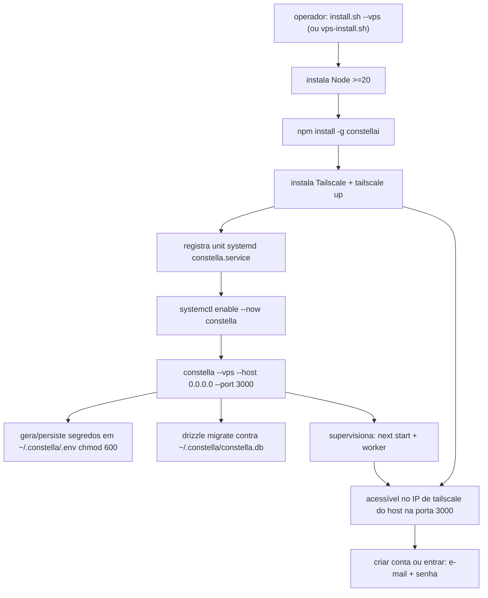
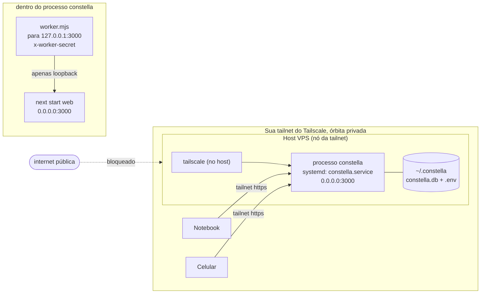

[← Índice](./README.md) · [🇬🇧 English](../en/VPS_MODE.md) · [✦ Constella](../../README.pt-BR.md)

# Instalação em VPS 🛰️


Rode a nave-mãe em um servidor remoto. A **instalação em VPS** (`constella --vps`) instala o pacote npm publicado `constellai` **nativamente no host**, vincula o servidor web a `0.0.0.0` e o expõe **apenas** pela sua tailnet do Tailscale — uma órbita privada acessível de qualquer dispositivo que você autorizar, e de nenhum outro lugar. Sem Docker: o próprio host é o nó da tailnet, e um serviço `systemd` mantém o processo vivo entre reinicializações. A autenticação é a mesma de toda instalação: e-mail + senha.

> 🧪 **Status: funcional, em testes.** A instalação em VPS funciona de ponta a ponta (instalar → tailnet → worker 24/7), mas ainda está sendo validada — trate como beta. Verifique seu setup (auth, backups, a unit `systemd`) antes de depender dela em produção, e mantenha o runbook de [Operações](OPERATIONS.md) à mão.

---

## Quando usar 🌌

Escolha a instalação em VPS quando quiser um **plano de controle 24/7** que continue planejando, construindo, revisando e enviando enquanto seu notebook está fechado — sem colocar o painel na internet aberta.

| Você quer… | A instalação em VPS entrega |
| --- | --- |
| A constelação de agentes sempre ativa | Um processo de servidor de longa duração (web + worker), supervisionado e reiniciado automaticamente pelo `systemd` |
| Acesso remoto privado | Vinculado a `0.0.0.0`, mas acessível **apenas na sua tailnet do Tailscale** |
| Autenticação | E-mail + senha a cada sessão — a mesma barreira de toda instalação |
| Uma instalação reproduzível | Um bootstrap `vps-install.sh` de um passo: Node + `constellai` + Tailscale + uma unit `systemd` |
| Execução endurecida por padrão | Serviço systemd no nível do host + CLI do agente em modo `acceptEdits` (apenas edições) |

Se você só quer uma instância local sempre ativa na sua própria máquina, use a [instalação local](./START_MODE.md). Para uma instância que você carrega num drive, veja a [instalação portátil](./PORTABLE_MODE.md).

---

## Como funciona 🪐

VPS é um **alvo de implantação** selecionado pela flag de lançamento `--vps` — uma forma de instalar e rodar o Constella, não um modo de autenticação (a auth é sempre e-mail + senha). A flag de lançamento é declarada em `src/lib/run-mode.ts`:

```ts
export type RunMode = "start" | "vps" | "portable";

export const RUN_MODES = {
  // …
  vps: { label: "VPS", requiresLogin: true,
         note: "Access over your Tailscale tailnet; runs natively on the host." },
};
```

O alvo é escolhido **no lançamento**, nunca na UI (um lançamento via CLI define `CONSTELLA_PUBLIC=1`, o que esconde o seletor no app). Ele é resolvido em `bin/constella.mjs` a partir da flag `--vps` (com o legado `--bind tailnet` mapeando para o mesmo alvo), depois exportado como `CONSTELLA_RUN_MODE=vps` e persistido na linha da organização (`organization.run_mode`) no onboarding via `getRunMode()`.

Três coisas tornam a instalação em VPS distinta:

1. **Endereço de bind `0.0.0.0`.** Em `bin/constella.mjs`, `host = --host || (vps|portable ? "0.0.0.0" : "127.0.0.1")`. O servidor escuta em todas as interfaces para que a camada do Tailscale consiga alcançá-lo.
2. **Login é obrigatório.** `requiresLogin()` retorna `true`, e `src/proxy.ts` redireciona toda requisição não autenticada para a tela de auth (apenas a instalação local faz bind em loopback). Na primeira execução sem usuário, essa tela é de cadastro; depois é de login.
3. **Contexto de execução = `vps`.** `detectRunContext()` em `src/lib/run-context.ts` retorna `"vps"` quando `getRunMode() === "vps"` — assim o fluxo de Update no app sabe usar `npm install -g constellai@latest` em vez de `git`. Veja [UPDATE](./UPDATE.md).

> 🛰️ **O Tailscale é assumido como configurado externamente.** O Constella não gerencia sua tailnet, ACLs ou auth keys. O script de bootstrap *entra* com o host numa tailnet para você (`tailscale up`), mas a tailnet em si (dispositivos, MagicDNS, ACLs) é sua para administrar em <https://login.tailscale.com>. O Constella apenas vincula `0.0.0.0`; é a tailnet que mantém esse bind privado.

---

## Fluxo principal 🌠



---

## Conceitos-chave ✦

### Nativo no host

**Não há contêiner.** O pacote npm publicado `constellai` (o `.next` compilado e pré-buildado) é instalado globalmente com `npm i -g` — **não há build de fonte**, porque o pacote npm já traz o `.next` pré-buildado. O processo `constella --vps` roda direto sob o usuário do host. O Tailscale roda no **host**, então o próprio host é o nó da tailnet; o bind `0.0.0.0` do servidor web fica acessível **apenas no IP do Tailscale do host** enquanto a porta 3000 não tiver rota pública (tailnet + firewall). Fixe uma versão a qualquer momento com `npm install -g constellai@<versão>`.

### Raiz de runtime no diretório home

`CONSTELLA_HOME` tem padrão `~/.constella` (sobrescreva com a env var). Todo o estado de runtime vive ali e é preservado entre updates, reinícios e reboots:

- `~/.constella/constella.db` — o banco SQLite (`DATABASE_URL=file:~/.constella/constella.db`).
- `~/.constella/.env` — segredos gerados (`chmod 600`), sobrevivem a reinícios porque ficam no sistema de arquivos do host.
- `~/.constella/organizations/<orgId>/workspace/` — a árvore do workspace dos agentes (a jaula de FS). Veja [ARCHITECTURE](./ARCHITECTURE.md).

### O systemd mantém vivo

A instalação gerenciada registra `constella.service`, que roda `constella --vps --host 0.0.0.0 --port 3000` com `Restart=always` e fica **enabled** para iniciar a cada boot. Gerencie com `systemctl` e leia logs com `journalctl -u constella -f`. Nenhum supervisor de processo próprio é necessário — o systemd é dono do ciclo de vida.

### Worker pelo loopback (mesmo em `0.0.0.0`)

O modelo de processo duplo (web + worker) é preservado. O launcher dispara `bin/worker.mjs` com `CONSTELLA_BASE_URL=http://127.0.0.1:<port>` — **loopback**, mesmo que o servidor web vincule `0.0.0.0`. Isso é uma **proteção deliberada contra SSRF / exfiltração de segredo**: o worker anexa o cabeçalho privilegiado `x-worker-secret` a cada chamada, então recusa qualquer base URL não-loopback:

```js
const isLoopback = ["localhost", "127.0.0.1", "::1", "[::1]"].includes(baseHost);
if (!isLoopback && !ALLOW_REMOTE) {
  console.error(`✖ Refusing to send the worker secret to a non-loopback host (${baseHost}). …`);
  process.exit(1);
}
```

Um worker genuinamente remoto precisa optar explicitamente com `CONSTELLA_ALLOW_REMOTE_WORKER_BASE_URL=1` (e é avisado se a URL for `http://` puro). Veja [ARCHITECTURE](./ARCHITECTURE.md).

### Segredos são obrigatórios

O `bin/constella.mjs` gera e persiste **três** segredos em `~/.constella/.env` no primeiro boot (e os reutiliza depois):

- `BETTER_AUTH_SECRET` — `next start` roda sob `NODE_ENV=production`, onde o better-auth **lança erro** com sua chave padrão; toda instalação precisa de uma real.
- `CONSTELLA_VAULT_KEY` — chave AES-256-GCM para o cofre de credenciais/provedores. Veja [SECURITY](./SECURITY.md).
- `CONSTELLA_WORKER_SECRET` — o worker falha **fechado** sem ele (`x-worker-secret`).

O launcher imprime apenas `• Secrets ready (stored in <HOME>/.env, never printed).` — os valores nunca são logados.

---

## Tabelas 🗃️

### Comparação dos métodos de instalação

| Propriedade | `start` (local) | `vps` | `portable` |
| --- | --- | --- | --- |
| Autenticação | e-mail + senha | e-mail + senha | e-mail + senha |
| Host de bind padrão | `127.0.0.1` | **`0.0.0.0`** | `0.0.0.0` |
| Exposição de rede | localhost | **tailnet do Tailscale** | LAN (host USB) |
| Runtime típico | local | **host nativo + systemd** | drive USB |
| Permissão do CLI do agente | `bypassPermissions` (total) | **`acceptEdits` (jaulado)** | `acceptEdits` (jaulado) |
| `detectRunContext()` | `dev`/`global`/`npx` | **`vps`** | `portable` |

### Variáveis de ambiente do VPS

| Variável | Definida por | Valor | Propósito |
| --- | --- | --- | --- |
| `CONSTELLA_RUN_MODE` | launcher / unit systemd | `vps` | Seleciona o comportamento VPS, login obrigatório |
| `CONSTELLA_PUBLIC` | launcher / unit systemd | `1` | Marca um runtime público; esconde o seletor de modo da UI |
| `CONSTELLA_HOME` | launcher (padrão) | `~/.constella` | Raiz de runtime no home do host |
| `DATABASE_URL` | launcher | `file:~/.constella/constella.db` | Caminho do SQLite sob a raiz de runtime |
| `BETTER_AUTH_SECRET` | launcher (gerado) | base64url aleatório | Chave de assinatura de sessão |
| `CONSTELLA_VAULT_KEY` | launcher (gerado) | base64 aleatório | Chave de criptografia do cofre |
| `CONSTELLA_WORKER_SECRET` | launcher (gerado) | base64url aleatório | `x-worker-secret` do worker |
| `CONSTELLA_BASE_URL` | launcher (processo worker) | `http://127.0.0.1:3000` | Apenas loopback |
| `NODE_ENV` | launcher | `production` | Boot de produção |
| `CONSTELLA_AGENT_FULL_ACCESS` | operador (opcional) | `1` / `0` | Sobrescreve exec jaulado/total do agente |
| `CONSTELLA_ALLOW_REMOTE_WORKER_BASE_URL` | operador (opcional) | `1` | Permite um worker não-loopback |
| `CONSTELLA_WEB_HEAP_MB` | operador (opcional) | inteiro | Aumenta o limite de heap V8 do web |

### Serviço systemd

| Propriedade | Valor |
| --- | --- |
| Unit | `constella.service` |
| Comando | `constella --vps --host 0.0.0.0 --port 3000` |
| Política de restart | `Restart=always` |
| Comportamento no boot | `enabled` — inicia a cada boot |
| Logs | `journalctl -u constella -f` |
| Raiz de runtime | `~/.constella` (home do host) |

---

## Diagrama de topologia 🌌



---

## Passo a passo 🚀

### 0. Teste rápido — `npx constellai --vps` (não gerenciado, em primeiro plano)

Em um host Linux, este é um **comando único de verdade** — sem clone, sem script, sem systemd. Rode o pacote publicado direto e ele instala/entra na Tailscale automaticamente para você, depois serve na sua tailnet em primeiro plano:

```bash
npx constellai --vps                              # ou: npm install -g constellai && constella --vps
```

Ele vincula `0.0.0.0`, então a privacidade depende da Tailscale (ou do seu próprio firewall), e não de uma fronteira de contêiner. Acesse no IP de tailnet **do host**: `tailscale ip -4` → `http://<esse-ip>:3000`. Esta é a forma mais rápida de subir uma VPS para experimentar; para uso 24/7, siga o caminho gerenciado (systemd) abaixo.

### 1. Instalação gerenciada — um comando, nativo + systemd (recomendado)

Em um servidor **Ubuntu** novo, este único comando instala o Node (>=20) + o CLI `constellai`, entra com o host na Tailscale e registra um serviço `systemd` que inicia no boot e reinicia em caso de falha:

```bash
curl -fsSL https://raw.githubusercontent.com/gabriel7silva/constella/main/scripts/install.sh | bash -s -- --vps
```

Ele roda `tailscale up` para entrar com o host (usando sua conta/fluxo de auth da tailnet em <https://login.tailscale.com>), instala `constellai@latest` e habilita `constella.service`. Acesse no IP de tailnet do host: `tailscale ip -4` → `http://<esse-ip>:3000`. O script direto equivalente é `bash scripts/vps-install.sh`; os passos manuais abaixo são a mesma coisa, detalhada.

### 2. Provisione uma VPS

Um **Ubuntu Server** novo (24.04 / 26.04 LTS) é o alvo assumido. Você não precisa clonar o repo para o caminho gerenciado — o instalador puxa o `constellai` do npm. Se preferir rodar o bootstrap a partir de um checkout, pegue a árvore do produto (ela carrega o `scripts/vps-install.sh`):

```bash
apt-get update && apt-get install -y git      # se o git faltar
git clone https://github.com/gabriel7silva/constella.git
cd constella
```

### 3. Rode o bootstrap

```bash
bash scripts/vps-install.sh
```

O `scripts/vps-install.sh` faz, em ordem (usa `sudo` só quando você não é `root`):

1. **Instala o Node >=20** se não estiver no `PATH`.
2. **Instala o CLI** globalmente: `npm install -g constellai`.
3. **Instala o Tailscale** no host se ausente (`curl -fsSL https://tailscale.com/install.sh | sh`) e roda `tailscale up` (**no-op se o host já está na tailnet**).
4. **Registra a unit systemd** `constella.service` rodando `constella --vps --host 0.0.0.0 --port 3000`, depois `systemctl enable --now constella` para iniciar agora e a cada boot.
5. **Imprime a URL de acesso** lida do host: `http://<ip-tailnet-do-host>:3000`.

### 4. Acesse o painel

De **qualquer dispositivo na mesma tailnet**, abra:

```
http://<ip-tailscale-deste-host>:3000
```

Encontre o IP no próprio **host**:

```bash
tailscale ip -4
```

O primeiro carregamento cai na tela de auth. Na toda primeira execução, sem conta ainda, você recebe uma tela de **cadastro** (nome + e-mail + senha) que cria o operador único; depois você **entra** com esse e-mail + senha. Em seguida, complete o [ONBOARDING](./ONBOARDING.md) se for o primeiro boot.

### 5. Gerencie o serviço (systemd)

A instalação gerenciada roda sob systemd, então use as ferramentas padrão:

```bash
systemctl status constella        # está rodando?
systemctl restart constella       # reinicia (ex.: após um update)
systemctl stop constella          # para o servidor
systemctl start constella         # inicia de novo
journalctl -u constella -f        # acompanha os logs ao vivo
```

Como a unit está **enabled**, o servidor volta automaticamente após um reboot.

### 6. Atualizar para uma nova versão

Atualize o pacote global e reinicie o serviço:

```bash
# Instalação nativa (sem precisar de checkout do repo) — baixa o atualizador direto do GitHub:
curl -fsSL https://raw.githubusercontent.com/gabriel7silva/constella/main/scripts/vps-update.sh | bash
# fixar uma versão específica:
curl -fsSL https://raw.githubusercontent.com/gabriel7silva/constella/main/scripts/vps-update.sh | bash -s -- 0.2.30

# A partir de um checkout do repo:
bash scripts/vps-update.sh                 # → última versão no npm
bash scripts/vps-update.sh 0.2.30          # → uma versão específica

# Totalmente manual (sem script algum):
sudo npm install -g constellai@latest && sudo systemctl restart constella
```

> **Atualizar com ele rodando é tranquilo — sem parada manual.** O `npm install -g` troca o pacote em disco sem mexer no processo ativo; o `systemctl restart constella` então sobe a nova versão num piscar de ~2–3s. Seu `~/.constella` (DB, segredos, login, workspaces) é preservado, e as migrações idempotentes do drizzle rodam automaticamente no próximo boot. Faça rollback a qualquer momento fixando a versão antiga (ex.: `bash scripts/vps-update.sh 0.2.27`).

`scripts/vps-update.sh [versão]` simplesmente faz `npm install -g constellai@<versão|latest>` e depois `systemctl restart constella`. Rodando o caminho não gerenciado? `npx constellai@latest --vps` sempre busca a mais nova.

### 7. Reinstalação limpa (apaga tudo, mantém o Tailscale)

Para simular uma instalação nova — remove o serviço `systemd`, o CLI global `constellai`, o runtime do Constella (`~/.constella`) e o cache do npx **mantendo o Tailscale** (a instalação do host + sua sessão na tailnet) — rode o script de limpeza e reinstale:

```bash
curl -fsSL https://raw.githubusercontent.com/gabriel7silva/constella/main/scripts/vps-clean.sh | bash
# não-interativo (pula o prompt): adicione  -s -- --yes
npx constellai --vps                  # do zero: a primeira execução mostra a tela de cadastro
```

> ⚠️ Isso **destrói** a conta de operador, orgs e workspaces da VPS (tudo em `~/.constella`). **Não** toca no Tailscale, então uma sessão SSH-pela-tailnet continua conectada.

---

## Exemplos 🪐

**Iniciar a instalação em VPS diretamente, vinculando todas as interfaces:**

```bash
constella --vps --host 0.0.0.0 --port 3000
# ou, de um checkout de fonte: node bin/constella.mjs --vps --host 0.0.0.0 --port 3000
```

**O comando exato que a unit systemd roda:**

```ini
ExecStart=constella --vps --host 0.0.0.0 --port 3000
```

**Confirmar o contexto de execução que o app enxerga:**

```bash
# CONSTELLA_RUN_MODE=vps, então detectRunContext() → "vps"
constella --vps --port 3000   # logs: Mode : vps · 0.0.0.0:3000
```

**Permitir exec de shell total aos agentes na VPS (sobrescrever a jaula — use com cuidado):**

```bash
# adicione ao Environment= da unit systemd (ou exporte antes do lançamento)
CONSTELLA_AGENT_FULL_ACCESS=1
```

---

## Estados possíveis ✦

| Estado | O que você vê | Significado |
| --- | --- | --- |
| Iniciando | `Mode : vps · 0.0.0.0:3000` nos logs | Launcher resolveu VPS, vinculando todas as interfaces |
| Segredos prontos | `• Secrets ready (stored in ~/.constella/.env, never printed).` | Três segredos gerados/reutilizados |
| Migrando | saída do drizzle migrate | Schema aplicado a `~/.constella/constella.db` |
| Web no ar | `next start` escutando em `0.0.0.0:3000` | Painel acessível na tailnet |
| Worker no ar | `Constella worker → tick … every 60000ms` | Tick 24/7 + watcher + poll do Telegram rodando |
| Worker recusado | `✖ Refusing to send the worker secret to a non-loopback host` | `CONSTELLA_BASE_URL` não é loopback e sem override |
| Crash de filho | `• [web] exited (…) — auto-restarting in 2s` | Supervisor reiniciando (máx 5 / 60s) |
| Crash-loop | `✖ [web] … crashed 5x … giving up.` | Falha repetida; o systemd vai tentar de novo conforme `Restart=always` |
| Barreira de auth | redirecionado para cadastro ou login | `requiresLogin` imposto por `src/proxy.ts` |

---

## Integrações relacionadas 🛰️

- **Worker / cron** — o worker ainda dirige o tick de 60s (`POST /api/cron/tick`), o watcher do chokidar (`/api/sync/file`) e o long-poll do Telegram, tudo pelo loopback. Veja [ARCHITECTURE](./ARCHITECTURE.md).
- **Telegram** — controle remoto da empresa pelo celular enquanto a VPS roda headless. Veja [TELEGRAM](./TELEGRAM.md).
- **API Pública / MCP** — um host de IA remoto pode dirigir a VPS pela tailnet via a API REST v1 ou o servidor MCP. Veja [PUBLIC_API](./PUBLIC_API.md) e [MCP](./MCP.md).
- **Update** — no contexto `vps`, atualize pelo host com `bash scripts/vps-update.sh` (`npm install -g constellai@latest`, depois `systemctl restart constella`, preservando o `~/.constella`). Veja [UPDATE](./UPDATE.md).
- **Execução de agentes** — modo jaulado `acceptEdits` + jaula de FS no host. Veja [AGENTS](./AGENTS.md) e [AI_ARCHITECTURE](./AI_ARCHITECTURE.md).

---

## Segurança 🕳️

| Camada | Mecanismo |
| --- | --- |
| Privacidade de rede | O app vincula `0.0.0.0`, mas só a interface Tailscale do host o alcança — mantenha a porta 3000 fora de qualquer rota pública (tailnet + firewall), nunca a internet pública |
| Autenticação | Login obrigatório a cada sessão (`requiresLogin: true`, `src/proxy.ts`); better-auth e-mail+senha, 2FA/passkeys opcionais |
| Endurecimento do serviço | Roda sob `systemd` como um usuário comum (não-root) do host, então um RCE no nível do app não age como root sobre `~/.constella` |
| Assinatura de segredo | `BETTER_AUTH_SECRET` real gerado (sem chave padrão em produção) |
| Cofre | Segredos de provedor/credenciais criptografados com `CONSTELLA_VAULT_KEY` (AES-256-GCM) |
| Isolamento do worker | O worker fala **apenas loopback**; recusa não-loopback salvo `CONSTELLA_ALLOW_REMOTE_WORKER_BASE_URL=1` |
| Permissões do `.env` | `~/.constella/.env` gravado `chmod 600` |
| Jaula do agente | O CLI roda `acceptEdits` (apenas edições, sem exec arbitrário) + jaula de FS |

> 🕳️ **O bind sozinho não é a fronteira.** Vincular `0.0.0.0` é seguro *apenas porque* o host é um nó Tailscale e não publica a porta 3000 na internet pública. Se você abrir a 3000 numa interface pública, perde a órbita privada — mantenha-a atrás da tailnet (e do seu firewall / security group), ou ponha na frente uma VPN/proxy reverso com autenticação.

> ⚠️ **Os CLIs dos agentes não são incluídos.** Os CLIs `claude` / `codex` **não** são instalados pelo bootstrap. Para agentes numa VPS, ou instale um CLI no host (`npm i -g …` e autentique via chaves de env ou o login próprio do CLI, persistido no home do usuário do host), ou configure provedores de API na nuvem no módulo [MODELS](./MODELS.md).

---

## Solução de problemas 🌠

| Sintoma | Causa provável | Correção |
| --- | --- | --- |
| Não acessa `http://<ip>:3000` | Fora da tailnet, ou IP errado | Confirme `tailscale status`; pegue o IP com `tailscale ip -4` na VPS |
| Tailscale não entra | `tailscale up` não concluído / sessão expirada | Rode `tailscale up` de novo e autentique em <https://login.tailscale.com> |
| Serviço não está rodando | unit systemd parada ou falhou | `systemctl status constella`; inicie com `systemctl start constella`, inspecione `journalctl -u constella -f` |
| Preso na tela de auth | Primeiro boot, sem conta ainda | Cadastre-se (nome + e-mail + senha), depois complete o [ONBOARDING](./ONBOARDING.md); a auth é obrigatória |
| `✖ Refusing to send the worker secret to a non-loopback host` | `CONSTELLA_BASE_URL` não é loopback | Deixe-a sem definir (padrão loopback) ou defina `CONSTELLA_ALLOW_REMOTE_WORKER_BASE_URL=1` deliberadamente |
| `better-auth` lança erro no boot | `BETTER_AUTH_SECRET` ausente | Garanta que `~/.constella` seja gravável para o launcher persistir o `.env` |
| Agentes não fazem nada | Sem CLI no host / sem provedor | Instale um CLI (`npm i -g …`) ou configure um provedor de nuvem ([MODELS](./MODELS.md)) |
| Web reinicia sem parar | OOM no nível do SO (RAM dos agentes) ou crash nativo | Limite agentes concorrentes, ou aumente `CONSTELLA_WEB_HEAP_MB` para um OOM de heap JS |
| `✖ … crashed 5x … giving up` | Crash-loop genuíno | Inspecione `journalctl -u constella -f`; corrija a causa, depois `systemctl restart constella` |
| Migração de schema falha em DB novo | Permissão do home / corrupção | Garanta que `~/.constella` seja do usuário de execução e gravável; o launcher aborta se a migração de um DB novo falhar |

---

## Links relacionados ✦

- [INSTALLATION](./INSTALLATION.md) — obter o pacote + pré-requisitos
- [START_MODE](./START_MODE.md) · [PORTABLE_MODE](./PORTABLE_MODE.md) — os outros métodos de instalação
- [CONFIGURATION](./CONFIGURATION.md) — variáveis de ambiente e ajustes
- [ARCHITECTURE](./ARCHITECTURE.md) — web + worker, jaula de FS, motor de sync
- [UPDATE](./UPDATE.md) — atualizações cientes do contexto (`npm` + `systemctl` no `vps`)
- [TELEGRAM](./TELEGRAM.md) — controle remoto da empresa headless
- [PUBLIC_API](./PUBLIC_API.md) · [MCP](./MCP.md) — dirigir o Constella remotamente
- [SECURITY](./SECURITY.md) — cofre, jaula de FS, limpeza de segredos
- [TROUBLESHOOTING](./TROUBLESHOOTING.md) · [FAQ](./FAQ.md)
