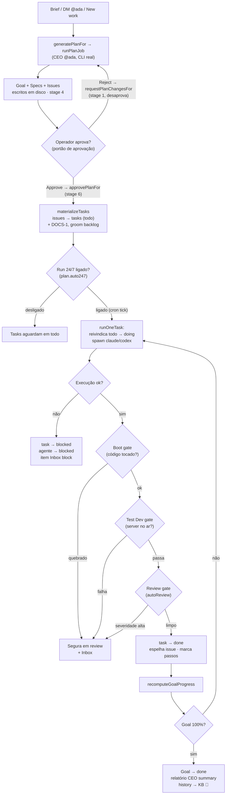

[← Índice](./README.md) · [🇬🇧 English](../en/WORKFLOW.md) · [✦ Constella](../../README.pt-BR.md)

# Workflow — do Goal ao Done 🌠


A órbita completa que uma unidade de trabalho percorre na Constella: de um brief que o CEO transforma em plano, passando pelo portão de aprovação do operador, entrando num loop de execução real com `claude`/`codex`, atravessando os portões de review e teste, até a entrega de um Goal. Nada é fingido — toda execução gasta tokens reais, contabiliza custo real e edita arquivos reais.

---

## 1. Quando usar 🪐

Leia este documento quando quiser entender:

- Como um brief digitado vira specs, issues e tasks.
- O que é o **portão de aprovação** e por que os agentes nunca tocam no código antes dele.
- Como o **Run 24/7** (`plan.auto247`) move o loop autônomo.
- O que fazem os **portões de review / teste / boot** sobre uma task concluída.
- Como o progresso sobe de itens de checklist → issue → Goal, e como um Goal se autocompleta.
- Como cancelar, arquivar, reabrir ou restaurar um Goal em pleno voo.

Para as peças ao redor, veja [GOALS_SPECS_ISSUES](./GOALS_SPECS_ISSUES.md), [AGENTS](./AGENTS.md), [PO_AGENT](./PO_AGENT.md) e [TEST_DEV](./TEST_DEV.md).

---

## 2. Como funciona 🛰️

O ciclo de vida tem **oito estágios**:

```
Goal → Spec → Issue → Plan → Execution → Review → Test → Done
```

Dois portões rígidos o dividem ao meio:

1. **O portão de aprovação.** O planejamento produz apenas rascunhos. Nenhum código roda até o operador aprovar o plano (`plan.approved = true`). O runner se recusa a despachar qualquer task caso contrário — veja `runOneTaskBody` em `src/server/runner.ts`:

   > ```ts
   > const pl = await db.query.plan.findFirst({ where: eq(plan.workspaceId, ws.id) });
   > if (!pl || !pl.approved) return false; // no plan or unapproved → never auto-run code
   > ```

2. **O portão 24/7.** Mesmo após a aprovação, o loop *autônomo* (cron `auto: true`) só roda enquanto o **Run 24/7** estiver ligado (`plan.auto247 = true`). Uma execução manual avulsa (`auto: false`) precisa apenas da aprovação.

Todo o pipeline é movido por quatro módulos de origem:

| Módulo | Papel |
| --- | --- |
| `src/server/planner-core.ts` | Núcleo de planejamento do CEO sem sessão (`generatePlanFor`, `runPlanJob`, `planFromConversationFor`, `startNewWorkFor`). |
| `src/server/plan-ops.ts` | Aprovar / desaprovar / alternar 24/7 (`approvePlanFor`, `requestPlanChangesFor`, `setAuto247For`). |
| `src/server/runner.ts` | O loop autônomo real (`tickWorkspace`, `runOneTask`, portões, progresso). |
| `src/server/work-ops.ts` | Ciclo de vida do Goal (`cancelGoalFor`, `archiveGoalFor`, estacionar/desestacionar tasks). |

---

## 3. Fluxo principal 🚀

### Estágios 1–4 · Plano (Goal → Spec → Issue → Plan)

Uma execução de planejamento é disparada por `generatePlanFor(orgId, workspace, opts)`:

1. Escolhe o agente CEO (`@ada`, pelo handle, com fallback para um papel de CEO/chief-exec).
2. Protege-se contra uma segunda execução concorrente inspecionando o stream de eventos **`planner`** ao vivo (não a flag da Ada, que pode ficar travada em `working`).
3. Coloca a Ada em `status = "working"`, emite um evento `thinking` e destaca o trabalho pesado em `runPlanJob` para que sobreviva à resposta HTTP.

Dentro de `runPlanJob`:

- **Análise do primeiro plano.** Se houver um projeto existente (repositório importado, diretório local copiado ou `mock/` anexado) e ele ainda não tiver sido analisado (`settings.source.analyzed` não definido), `analyzeExistingProject` o lê arquivo por arquivo dentro de `specs/SUPER-SPEC.md` primeiro. Roda uma vez por projeto.
- **Playbook de stack.** As skills nativas semeadas, relevantes à stack escolhida para Frontend/Backend/CyberSec/CTO, são passadas para a Ada para que ela planeje fundamentada nas tecnologias reais (veja [SKILLS](./SKILLS.md)).
- A Ada roda uma sessão real `claude`/`codex` (timeout `300_000` ms), escreve `ARCHITECTURE.md` e `RITUALS.md` (somente no primeiro plano) e retorna **um único objeto JSON**: `{"specs":[…],"issues":[…]}`.
- A Constella persiste o resultado: um **Goal** (nascido da primeira/principal spec), cada **Spec** (`SPEC-NN`, numerada continuando das specs existentes), cada **Issue** (chaves sequenciais, `col = "todo"`), e escreve os artefatos em disco sob `specs/` e `issues/` (o diretório é a fonte da verdade).
- O preparo determinístico do PO mapeia prioridade → story points + MoSCoW (`high → Must / 8`, `med → Should / 5`, `low → Could / 3`).
- O primeiro plano define `plan.stage = 4, approved = false` (o portão de aprovação). **Novo trabalho** NÃO desaprova o plano em execução.
- O plano é exposto: uma mensagem na sala, um item **approval** no Inbox, uma notificação ao operador e (se o Telegram estiver configurado) botões inline **Approve / Start execution / Review / Reject**.

> Novo trabalho nasce de uma DM para `@ada` ("build X"), do botão **New work** do Planner (`startNewWorkFor`) ou de uma conversa no chat (`planFromConversationFor`). Veja [DM](./DM.md) e [CHAT_COMMANDS](./CHAT_COMMANDS.md).

### Estágio 4 → 5 · Aprovar (o portão)

`approvePlanFor(orgId, ws)` abre o portão e materializa o trabalho:

1. `plan.approved = true, stage = 6`; cada `issue.approved = true`; cada `spec.approved = true` ativa.
2. `materializeTasks` converte cada issue numa **task** executável (`col = "todo"`). Idempotente — issues que já têm task são puladas, então um re-approve após um re-plan materializa só as novas. Uma task **`DOCS-1`** (`@barbara`) é sempre garantida por último para que o build seja sempre documentado.
3. O documento de backlog do PO `PO/backlog.md` é preparado a partir das issues aprovadas, e uma passada real de grooming do PO (`groomBacklogFor`, Donald) é disparada em best-effort para dimensionar story points + MoSCoW e sinalizar duplicatas/lacunas.
4. A Ada narra na sala; a decisão é registrada; o item de aprovação no Inbox é resolvido.

### Estágio 5 · Execução (o loop real)

O worker (`bin/worker.mjs`) faz `POST /api/cron/tick` (protegido por `x-worker-secret`) a cada ~60s. Isso chama `tickAll({ execute: true, auto: true })` → `tickWorkspace` → `runOneTask` → `runOneTaskBody` para cada workspace ativo.

`runOneTaskBody` roda **exatamente uma** task pendente por tick:

1. **Portões:** plano aprovado? (senão retorna) · `auto && !auto247`? (senão retorna) · goal ainda ativo?
2. **Recuperar órfãs:** qualquer task `doing` que não esteja genuinamente em execução (de um crash/restart) é recolocada em `todo`.
3. **Escolher uma task:** uma task `doing` em andamento (a menos que seu responsável já esteja executando em outro lugar), senão **reivindica atomicamente** a próxima `todo` (compare-and-set em `col`) para que dois ticks nunca peguem a mesma.
4. **Portão de orçamento:** se o responsável atingiu seu `dailyCapUsd`, empurra um item de orçamento no Inbox e pula.
5. **Spawn:** vira a issue ligada para `doing`, monta o pacote de contexto (`assembleAgentPrompt`) e roda a CLI real (`runAgentStream`, timeout `240_000` ms). O checklist da task é marcado **ao vivo** conforme o agente faz streaming da resposta.
6. **Contabiliza custo real** em `costEntry` (apenas se a execução produziu uso).

Um limite de concorrência (`runningWorkspaces`, padrão **1** por workspace, sobreposto por `CONSTELLA_MAX_CONCURRENT_AGENTS` ou `settings.agents.maxConcurrent`) impede que o tick do navegador e o tick do worker lancem duas CLIs ao mesmo tempo.

### Estágio 6 · Review · Estágio 7 · Test (os portões de conclusão)

Numa execução bem-sucedida, antes de uma task poder chegar em `done`, ela passa pelos portões (em ordem). Qualquer falha rígida segura a task em **`review`** com um item de Inbox — ela não passa silenciosamente:

| Portão | Origem | Condição | Em caso de falha |
| --- | --- | --- | --- |
| **Boot gate** | `ensureBootable` | a task tocou um caminho de código | segura em `review` + item Inbox `block` ("quebrou o dev server") |
| **Test Dev gate** | `runTestDev` | o dev server do projeto está no ar (`serverUrl`) | segura em `review` + item Inbox `validation` |
| **Review gate** | `reviewTaskChange` | `settings.agents.autoReview` ligado (padrão) e código tocado | segura em `review` + item Inbox `review` (achados de severidade alta) |

O portão de review usa um **revisor independente** — nunca o próprio autor da task. Prefere `@whitfield` (CyberSec), depois qualquer papel de QA/segurança. Propostas de bloco de KB (`[[KB-BLOCK …]]`), aprendizados (`[[REMEMBER …]]`) e pedidos de pesquisa (`[[RESEARCH: …]]`) emitidos pelo agente também são extraídos e processados aqui.

### Estágio 8 · Done

Se todos os portões passam, `COLUMN_NEXT` avança a task `todo → doing → done`, espelha na issue, marca cada `taskStep` como feito e recalcula o progresso do goal. Quando um Goal atinge 100%, `recomputeGoalProgress`/`goalRollups` o vira para `status = "done"`, e `fileCeoSummaryIfComplete` arquiva um único relatório **`ceo-summary`**, notifica o operador, registra a decisão e captura a entrega como `history` na KB.

Em caso de **falha**, a task vai para `blocked` (fora do conjunto executável, para que o loop nunca tente para sempre), o agente vai para `blocked`, um relatório de erro é escrito e um item `block` é empurrado para o Inbox.

---

## 4. Conceitos-chave ✦

- **O diretório é a fonte da verdade.** Specs (`specs/SPEC-NN.md`), issues (`issues/<key>.md`), o backlog (`PO/backlog.md`) e relatórios (`Reports/*.md`) vivem todos em disco; o DB os indexa. Veja [ARCHITECTURE](./ARCHITECTURE.md).
- **Issue vs Task.** Uma *issue* é a unidade planejada no quadro; uma *task* é o espelho executável que o runner realmente roda. `materializeTasks` faz a ponte (`task.issueId`); o runner espelha de volta os movimentos de coluna da task na issue.
- **Progresso guiado por checklist.** Cada task carrega linhas `taskStep` (seus TODOs). % da issue = passos feitos/total (ou fallback da coluna); % do Goal = a **média** das % de suas issues. Calculado na leitura em `goalRollups` — sem drift.
- **Repasse automático.** Quando um agente termina a resposta com um `@mention` de exatamente um colega, `relayRoomMentions` faz esse colega responder e trabalhar (uma cadeia limitada). `@operator` chama você em vez disso. Veja [TEAM_ROOM](./TEAM_ROOM.md).
- **Recuperação de crash.** `reclaimOrphans` recoloca na fila tasks `doing` deixadas travadas por um processo morto; `reclaimStaleLocks` libera locks por arquivo abandonados.

---

## 5. Tabelas 🗄️

### `plan` (uma linha por workspace — o portão)

| Coluna | Tipo | Significado |
| --- | --- | --- |
| `workspaceId` | text (PK) | o workspace a que este plano pertence |
| `approved` | bool | o portão de aprovação — código roda só quando `true` |
| `auto247` | bool | Run 24/7 — o loop de cron autônomo roda só quando `true` |
| `stage` | int (padrão 4) | marcador de pipeline: `1` = devolvido para revisão, `4` = rascunhado/aguardando aprovação, `6` = aprovado |

### `goal`

| Coluna | Significado |
| --- | --- |
| `status` | `active` \| `cancelled` \| `archived` \| `done` |
| `progress` | % de rollup em cache (recalculada pelo runner enquanto ativo; fixa após assentar) |
| `specId` | a spec principal de que o goal nasceu |
| `ownerId` | o agente CEO |
| `archivePath` | caminho do ZIP quando arquivado |
| `doneAt` / `cancelledAt` / `archivedAt` / `reopenedAt` | timestamps de ciclo de vida |

### `spec` / `issue` / `task`

| Tabela | Coluna de workflow | `status` de ciclo de vida |
| --- | --- | --- |
| `spec` | — (`approved` bool) | `active` \| `cancelled` \| `archived` |
| `issue` | `col`: `todo` \| `doing` \| `blocked` \| `review` \| `done` | `active` \| `cancelled` \| `archived` |
| `task` | `col`: `triage` \| `todo` \| `doing` \| `blocked` \| `review` \| `done` | — |

A `issue` também tem `prio` (`low`/`med`/`high`), `moscow` (`Must`/`Should`/`Could`/`Won't`) e `points`. A `task` adiciona `assigneeId`, `goalId`, `issueId`, `createdBy`.

### Mapa coluna → progresso (`src/server/progress.ts`)

| Coluna | % |
| --- | --- |
| `triage` / `todo` | 0 |
| `blocked` | 25 |
| `doing` | 50 |
| `review` | 80 |
| `done` | 100 |

---

## 6. Diagrama do ciclo de vida 🌌



---

## 7. Passo a passo 🛰️

1. **Descreva o trabalho.** Mande DM para `@ada` "build X", clique em **New work** no Planner ou rode `/new-work <brief>`.
2. **Acompanhe o stream do plano.** O canal **planner** do Planner mostra a Ada analisando, rascunhando e escrevendo arquivos.
3. **Revise os rascunhos.** Abra o CEO Planner; leia as specs/issues. Rejeite uma spec/issue individual para abrir uma DM ao autor pedindo revisão, ou rejeite o plano inteiro (`requestPlanChanges`, rebobina para o stage 1).
4. **Aprove.** Clique em **Approve** (ou envie `/approve`). As tasks materializam; o quadro enche de `todo`.
5. **Ligue o Run 24/7.** Acione **Run 24/7** (`/run-247`). O worker passa a despachar uma task por tick.
6. **Monitore.** A sala mostra a execução de cada agente; o Inbox expõe blocks/reviews/orçamentos; o progresso sobe ao vivo.
7. **Resolva travas.** Qualquer coisa segura em `review` ou `blocked` aparece no [INBOX](./INBOX.md) — corrija e recoloque na fila.
8. **Entrega.** Quando o Goal atinge 100% ele se autocompleta e um relatório de CEO summary é arquivado.

---

## 8. Exemplos 🌠

**Iniciar novo trabalho pelo chat (DM):**

```
Você → @ada: build a CSV export button on the reports page, with a unit test
@ada: Plan ready for review: 2 specs and 4 issues drafted from the brief.
      Open the CEO Planner and approve to start execution.
```

**Aprovar + executar por slash commands** (veja [CHAT_COMMANDS](./CHAT_COMMANDS.md)):

```
/approve        # approvePlan — o portão abre, tasks materializam
/run-247        # setAuto247(true) — o loop autônomo inicia
/status         # uma linha: goals ativos · issues abertas · em execução · 24/7 · estado do plano
```

**Pausar / devolver / parar um goal:**

```
/pause          # setAuto247(false) — o loop autônomo para (tasks permanecem)
/reject         # requestPlanChanges — desaprova, rebobina para o stage 1
/cancel         # cancelGoal — mata execuções em voo + estaciona tasks, preserva tudo
/archive        # archiveGoal — ZIPa os arquivos do goal + manifesto, estaciona a execução
```

---

## 9. Estados possíveis 🪐

### Estado do plano

| Estado | Condição |
| --- | --- |
| `none` | sem linha de plano |
| `draft (stage N)` | `approved = false` |
| `approved` | `approved = true` |

### Estado de execução (Planner, derivado)

| Estado | Significado |
| --- | --- |
| `waiting-approval` | plano ainda não aprovado |
| `off` | aprovado, Run 24/7 desligado |
| `running` | aprovado + 24/7 ligado + issues executáveis |
| `blocked` | aprovado mas sem issue atribuída executável |
| `all-done` | toda issue em `done` |

### Coluna de task / issue

`triage → todo → doing → review → done`, mais `blocked` (fora do conjunto executável). Uma execução autônoma bem-sucedida cai em `done`; `review` só é alcançado por uma falha de portão ou roteamento manual do operador.

### Status do goal

`active → done` (automático, em 100%); `active → cancelled` / `archived` (operador); `cancelled`/`archived → active` (reabrir/restaurar).

---

## 10. Integrações relacionadas 🛰️

- **Telegram** — o push de "plano pronto" carrega os botões **Approve / Start execution / Review / Reject**; remoto `approvePlanFor` / `setAuto247For` / `cancelGoalFor` via o chat da allowlist. Veja [TELEGRAM](./TELEGRAM.md).
- **Public API / MCP** — `POST /v1/plan/approve`, `/plan/reject`, `/execution`, `/work`, `/goals/:id/cancel`, `/goals/:id/archive` alcançam os mesmos núcleos sem sessão. Veja [PUBLIC_API](./PUBLIC_API.md) e [MCP](./MCP.md).
- **Inbox** — toda falha de portão / block / limite de orçamento / aprovação aparece aqui. Veja [INBOX](./INBOX.md).
- **KB** — tasks concluídas, aprendizados e entregas são ingeridos como conhecimento reutilizável. Veja [KB_RAG](./KB_RAG.md) e [MEMORY_RAG](./MEMORY_RAG.md).

---

## 11. Segurança 🕳️

- **O portão de aprovação é fail-closed:** sem plano ou `approved = false` → o runner nunca dá spawn numa execução de código.
- **O endpoint de cron é fail-closed:** `POST /api/cron/tick` rejeita (401) sem um `x-worker-secret` correspondente.
- **Limites de orçamento** (`agent.dailyCapUsd`) param um agente no seu gasto diário e expõem um item de orçamento no Inbox em vez de gastar demais.
- **Guarda de comandos** (`guard-hook.mjs`, ligada por padrão) bloqueia comandos de shell destrutivos; tentativas bloqueadas são expostas uma vez por task no Inbox.
- **Limpeza de segredos** (`scrubSecrets`) higieniza a saída do agente antes de cair na sala, na KB ou no Telegram. Veja [SECURITY](./SECURITY.md).

---

## 12. Solução de problemas 🔭

| Sintoma | Causa provável | Correção |
| --- | --- | --- |
| Tasks nunca rodam | plano não aprovado | `/approve` (abre o portão) |
| Aprovado mas ocioso | Run 24/7 desligado, ou sem worker | `/run-247`; garanta que o processo worker esteja no ar (veja [START_MODE](./START_MODE.md)) |
| Task travada em `review` | um portão a segurou (boot/test/review) | confira o item no [INBOX](./INBOX.md), corrija, recoloque na fila |
| Task `blocked` | a execução deu erro | leia `Reports/error-report.md` + o detalhe no Inbox |
| Agente pausado | atingiu o `dailyCapUsd` | aumente o limite no Agent Studio ou aguarde o reset diário |
| Planejamento não retorna nada | o modelo não produziu JSON parseável | tente de novo; uma notificação + evento `error` no planner explicam |
| Goal preso abaixo de 100% | uma issue está `blocked`/`review` | resolva a task segurada; a média sobe no próximo tick |
| Ada travada em `working` | um job de plano anterior morreu antes do `finally` | autorrecupera — um novo `generatePlanFor` detecta que não há execução ao vivo e reinicia |

---

## 13. Links relacionados 🌌

- [GOALS_SPECS_ISSUES](./GOALS_SPECS_ISSUES.md) — o modelo de dados por trás de cada estágio
- [PO_AGENT](./PO_AGENT.md) — grooming do backlog, story points, MoSCoW
- [AGENTS](./AGENTS.md) — a equipe que executa o trabalho
- [AI_ARCHITECTURE](./AI_ARCHITECTURE.md) — como uma execução é montada e disparada
- [TEST_DEV](./TEST_DEV.md) — o portão de Test Dev / boot
- [INBOX](./INBOX.md) — onde travas, blocks e aprovações caem
- [TEAM_ROOM](./TEAM_ROOM.md) · [DM](./DM.md) · [CHAT_COMMANDS](./CHAT_COMMANDS.md) — as superfícies de humano-no-loop
- [TELEGRAM](./TELEGRAM.md) · [PUBLIC_API](./PUBLIC_API.md) · [MCP](./MCP.md) — controle remoto
- [ARCHITECTURE](./ARCHITECTURE.md) — o control plane e o modelo de diretório-como-verdade
